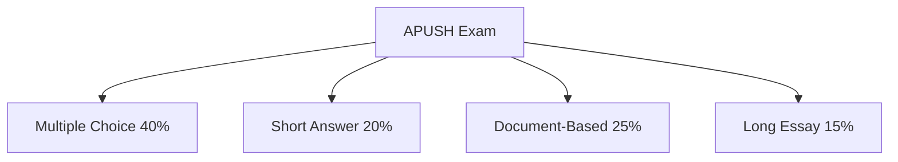

## **II. APUSH Assessment Structure**

### **Exam Breakdown**
The APUSH exam assesses historical thinking skills through various question formats.

| **Section**          | **Format**                       | **Weight** |
|----------------------|--------------------------------|------------|
| Multiple Choice     | 55 questions (Primary/Secondary sources) | 40%        |
| Short-Answer       | 3 required + 1 choice question  | 20%        |
| Document-Based     | 1 essay with primary sources    | 25%        |
| Long-Essay         | 1 essay from three choices      | 15%        |

### **Rubrics & Scoring Criteria**
Each free-response section follows standardized rubrics.

#### **Document-Based Question (DBQ) Rubric**
| **Criteria**             | **Points** |
|--------------------------|------------|
| Thesis & Argument       | 1          |
| Contextualization       | 1          |
| Use of Documents        | 2          |
| Evidence Beyond Docs    | 1          |
| Sourcing (HIPP)         | 1          |
| Complexity              | 1          |
| **Total Possible**      | **7**      |

#### **Long Essay Question (LEQ) Rubric**
| **Criteria**             | **Points** |
|--------------------------|------------|
| Thesis & Argument       | 1          |
| Contextualization       | 1          |
| Evidence                | 2          |
| Historical Reasoning    | 2          |
| Complexity              | 1          |
| **Total Possible**      | **6**      |

**Mermaid Diagram: APUSH Exam Structure**

---
