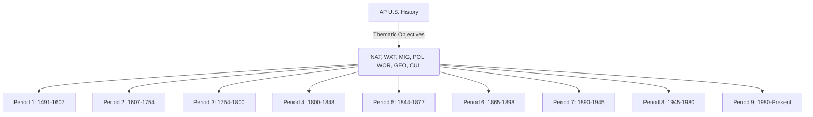

### **Introduction to AP U.S. History (APUSH) Curriculum**

The AP U.S. History curriculum is a rigorous college-level program designed to provide high school students with a deep understanding of American history from pre-Columbian times to the present. Administered by the College Board, this curriculum prepares students for the APUSH exam, which consists of multiple-choice questions, short-answer questions, document-based questions (DBQs), and long-essay questions (LEQs).

This section provides an in-depth breakdown of the **AP U.S. History curriculum**, including key themes, learning objectives, assessment rubrics, and instructional strategies to ensure that *History Unlocked* aligns with APUSH standards.

## **I. APUSH Course Organization & Themes**

### **APUSH Periodization & Key Concepts**
The College Board divides the APUSH course into **nine chronological periods** with key themes interwoven throughout.

| **Period**  | **Timeframe**        | **Key Themes**                                   |
|------------|---------------------|------------------------------------------------|
| **1**      | 1491–1607           | Pre-Columbian Societies, European Exploration |
| **2**      | 1607–1754           | Colonization, Transatlantic Trade            |
| **3**      | 1754–1800           | Revolution, Early Republic                   |
| **4**      | 1800–1848           | Expansion, Reform Movements                 |
| **5**      | 1844–1877           | Civil War & Reconstruction                   |
| **6**      | 1865–1898           | Industrialization, Urbanization              |
| **7**      | 1890–1945           | Imperialism, World Wars                      |
| **8**      | 1945–1980           | Cold War, Civil Rights Movements            |
| **9**      | 1980–Present        | Globalization, Technological Advances       |

### **Thematic Learning Objectives**
These themes guide historical analysis and serve as the foundation for the APUSH curriculum.

- **American and National Identity (NAT)**
- **Work, Exchange, and Technology (WXT)**
- **Migration and Settlement (MIG)**
- **Politics and Power (POL)**
- **America in the World (WOR)**
- **Geography and the Environment (GEO)**
- **Culture and Society (CUL)**

**Mermaid Diagram: APUSH Structure**

---