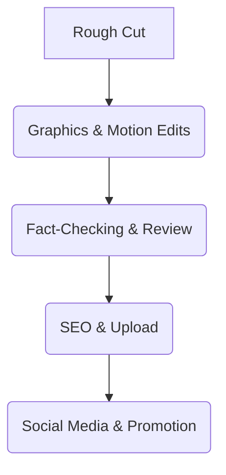

## **Post-Production Checklist & SOPs**

### **1. Rough Cut & Initial Review**
✅ Assemble footage into **first draft edit**.
✅ Review pacing and engagement level.
✅ Adjust visual transitions for smooth storytelling.

### **2. Graphics & Motion Elements**
✅ Overlay **motion graphics and animated infographics**.
✅ Add **historical citations and captions** for references.
✅ Integrate **historical reenactments, archival images, and relevant B-roll**.

### **3. Fact-Checking & Quality Assurance**
✅ Verify historical claims with **multiple scholarly sources**.
✅ Ensure compliance with **APUSH and Common Core standards**.
✅ Cross-check with **educational consultants or historians**.

### **4. Upload & SEO Optimization**
✅ Format videos for **YouTube and Learning Management Systems (LMS)**.
✅ Optimize **titles, descriptions, and metadata for SEO**.
✅ Add **closed captions and multilingual subtitles**.
✅ Upload preview clips for **social media engagement**.

### **5. Social Media Promotion & Outreach**
✅ Create **teasers and short clips** for Instagram Reels, TikTok, and Twitter.
✅ Engage educators via **LinkedIn and education forums**.
✅ Implement a **launch email campaign** targeting teachers and students.

**Mermaid Diagram: Post-Production Workflow**

## **Conclusion & Next Steps**

By following these structured workflows and adhering to AP U.S. History curriculum standards, *History Unlocked* will maintain high-quality educational content that is **engaging, accurate, and pedagogically sound**. The next steps involve refining each episode’s structure, securing feedback from educators, and iterating based on analytics and classroom performance. These SOPs will ensure that every video in the series is **classroom-ready and optimized for digital learning success.**

This is the first part of the full SOP expansion. Additional detailed breakdowns and individual checklists will follow for each major historical theme in the next responses.

**Comprehensive Business Plan: Branded U.S. High School History Video Series**

---
