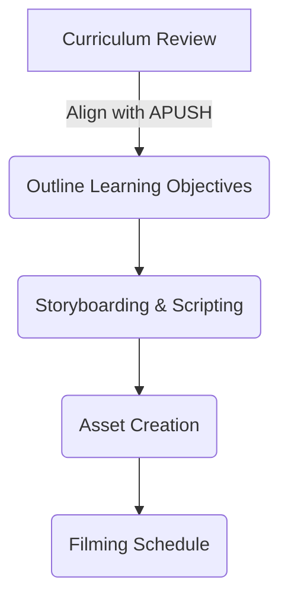

## **Pre-Production Checklist & SOPs**

The pre-production phase lays the groundwork for each video, ensuring accuracy, engagement, and alignment with historical education standards.

### **1. Curriculum Review & Episode Outline**
✅ Align episode topics with **APUSH Key Concepts** and **Common Core Standards**.
✅ Review College Board’s **Thematic Learning Objectives**:
   - American and National Identity (NAT)
   - Work, Exchange, and Technology (WXT)
   - Migration and Settlement (MIG)
   - Politics and Power (POL)
   - America in the World (WOR)
   - Geography and the Environment (GEO)
   - Culture and Society (CUL)
✅ Develop episode **learning objectives** and essential questions.
✅ Cross-check primary and secondary sources for historical accuracy.

### **2. Storyboarding & Scripting**
✅ Create a **visual storyboard** mapping out key scenes.
✅ Draft scripts using a **narrative-driven approach** (balancing storytelling with factual rigor).
✅ Ensure **historical arguments and themes** are clearly structured.
✅ Include **primary source analysis**, integrating historical documents, maps, and visuals.

### **3. Asset Creation (Graphics & Animations)**
✅ Develop **motion graphics** for key historical figures, maps, timelines.
✅ Create **visual infographics** summarizing key takeaways.
✅ Gather archival footage and royalty-free historical images.
✅ Format visuals to align with **YouTube educational best practices**.

### **4. Filming Schedule & Location Scouting**
✅ Identify filming locations (studio, green screen, historical sites).
✅ Secure necessary **filming permits** if recording on-location.
✅ Schedule equipment rental or prepare in-house production gear.
✅ Set up **lighting, sound, and camera angles** to ensure consistency.

**Mermaid Diagram: Pre-Production Workflow**

---
