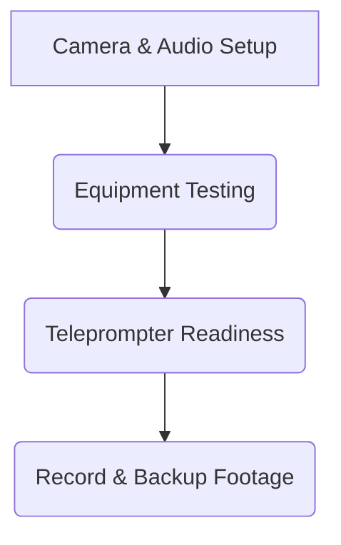

## **Production Checklist & SOPs**

### **1. Camera Setup & Lighting Test**
✅ Ensure consistent **framing, lighting, and background** for visual cohesion.
✅ Use **softbox lights or natural lighting** to reduce harsh shadows.
✅ Adjust **white balance and camera settings** for professional quality.
✅ Conduct **test shots** to ensure focus and clarity.

### **2. Audio Quality Check**
✅ Use **external microphones** (lavalier or shotgun) to capture clear audio.
✅ Test for **background noise interference** and adjust microphone placement.
✅ Record **backup audio tracks** in case of equipment failure.
✅ Monitor sound levels using professional audio software.

### **3. Teleprompter & Cue Card Readiness**
✅ Utilize a **teleprompter or cue cards** for script delivery.
✅ Train presenters to maintain **eye contact and natural delivery**.
✅ Allow for **multiple takes** to ensure clarity and engagement.

### **4. Backup Footage & Safety Measures**
✅ Record multiple takes of key segments.
✅ Use **cloud storage and external hard drives** for immediate backups.
✅ Implement an **emergency plan** for equipment failure.

**Mermaid Diagram: Production Workflow**

---
