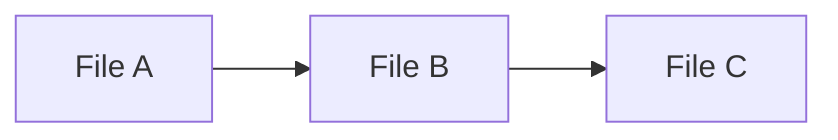

# Project Studio Part 2

## 1. Overall Flow

### User Provides the Codebase

The user either chooses the current project, uploads a .zip file of their Next.js project, or supplies a GitHub URL.

- Your Next.js app stores this code in a temporary folder on the server (or references it directly via GitHub’s API).

### Server-side Analysis

A server action or an API route scans the codebase to extract structural information.

- The app uses an AST parser (TypeScript compiler API, Babel, or a similar tool) to analyze files, track imports/exports, identify components, or discover data model definitions (e.g., Mongoose schemas, Prisma models, TypeORM entities).

### Graph Generation

The extracted data is transformed into a graph or structured data representing the code relationships.

- For codebase visualization, you might produce a dependency graph or a container diagram.

- For data modeling, you might produce an entity relationship diagram (ERD) or UML class diagram.

### Rendering the Diagrams

On the frontend, you visualize the generated graph data.

- Libraries like Mermaid, D3.js, react-flow, or vis.js can render nodes and edges in an interactive way.

- Alternatively, you can generate static SVG diagrams on the server (using something like Mermaid CLI) and serve them to the client.

### Interactive Exploration

The user can expand/collapse sections of the diagram, click on a node to see the associated code, or switch between “container-level” and “module-level” views.

## 2. Parsing and Building a Dependency Graph

Below are some strategies for extracting the structure of a Next.js project:

### File System Walk

Recursively walk the project directory (using Node’s fs module or a library like glob).

- Collect file paths, ignoring node_modules and other irrelevant folders.

### AST Parsing

Use TypeScript or Babel to parse each .ts, .tsx, .js, or .jsx file.

- Extract the import statements to build a dependency graph. For instance:

```ts
import { something } from "@/components/foo";
```

>might create an edge from currentFile.tsx → components/foo.tsx.

### Identifying Next.js-Specific Artifacts

If you want to highlight pages, layouts, server actions, etc., look for special files (page.tsx, layout.tsx, route.ts, etc.).

If you want to show environment usage or API endpoints, parse those from app/api/* routes or recognized patterns in server actions.

### Graph Data Structure

Store each file/module as a node in a directed graph.

- Edges represent import statements or references.

- Attach metadata like “this file exports a React component,” “this file is a Next.js page,” or “this file contains a server action.”

### Grouping / Containers

If you want to create container diagrams (like a “Frontend Container,” “Backend Container,” “Runtime Container” in your example images), define a custom grouping logic. For example:

- “Frontend Container” = all files in app/* or pages/*.

- “Backend Container” = all custom server code or Next.js API routes.

- “Runtime Container” = a Docker-based or Node-based environment running the code.

## 3. Extracting a Data Model

If you need a separate data model diagram (like an ERD), you’ll parse your model definitions:

### Mongoose

Scan for mongoose.model('ModelName', new Schema({...})).

- Extract fields, types, and references (ref: 'OtherModel') to form relationships.

- Build a small data structure that says, for example, User has fields { name: String, age: Number }, references Project.

### Prisma

Look for schema.prisma or prisma directory.

- Parse model definitions (e.g., model User { id Int @id name String ... }) to build an ERD.

- Identify relation fields for relationships between models.

### TypeORM / Other ORMs

Look for decorators like @Entity(), @Column(), @ManyToOne(), etc.

- Extract the class name, fields, and relationships to build a UML or ERD.

### Graph Data

Each “table” or “model” becomes a node in the diagram.

- Foreign key references or relationships become edges.

- Additional metadata (column type, constraints) can be stored as node attributes.

## 4. Visualizing the Graph

Once you have a JSON data structure describing the code graph or the data model, you can render it:

### Mermaid

Generate Mermaid syntax (like a flowchart or class diagram).

- Use a React-based Mermaid component or run Mermaid on the server to produce SVG.

Example snippet:



### React Flow / D3

For a more interactive approach, create a React component that uses a library like react-flow or d3.

- Render each file/model as a node, edges as lines, and implement zoom, pan, or click handlers to show more info.

### Interactive Features

- Click to expand: show nested modules or sub-dependencies.

- Hover: highlight inbound/outbound connections.

- Show code snippet: when a node is clicked, fetch the relevant lines of code from your server.

- Filter: let users filter out certain directories or file types to reduce noise.

## 5. Tying It All Together in Next.js

Below is a conceptual breakdown of how your Next.js app might be organized:

```plaintext
my-visualizer-app/
app/
upload/route.ts       -> Accepts codebase uploads
analyze/route.ts      -> Kicks off the server-side AST parsing
diagrams/
[projectId]/page.tsx -> Renders the diagrams for a specific project
layout.tsx
page.tsx
lib/
parse-project.ts       -> Contains logic for walking the filesystem
parse-ast.ts           -> Contains logic for building the dependency graph
parse-models.ts        -> Contains logic for extracting data models
generate-mermaid.ts    -> Optional: convert graph data to Mermaid syntax
components/
GraphViewer.tsx        -> A React component to display the codebase graph
ERDViewer.tsx          -> A React component to display the data model diagram
...

```

## Key Steps in Next.js

### Uploading/Fetching the Code

Provide a UI to either upload a .zip or paste a GitHub repo URL.

- If you fetch from GitHub, you can use the GitHub API or a library like simple-git to clone the repo.

### Server Action or Route for Analysis

Once the code is available, call a server action (Next.js 13) or an API route to run the analysis scripts.

- Return a JSON response containing the graph structure for both the code dependencies and the data model.

### Client-Side Rendering

On the /diagrams/[projectId] page, fetch the analysis JSON (or use the server component to do so).

- Render <GraphViewer data={codeGraph} /> for the code dependency diagram.

- Render <ERDViewer data={modelGraph} /> for the data model.

- Provide UI controls for zoom, pan, filter, etc.

## 6. Implementation Details & Tips

1. Performance: Parsing a large codebase can be CPU-intensive. Consider queueing or background jobs if the codebase is very large.

2. Security: Never execute untrusted code. Stick to AST parsing. If you must run code, sandbox it.

3. Scalability: For repeated or large analyses, store intermediate results (like the AST or final graph JSON) in a database so you don’t have to re-parse every time.

4. Custom Visualization: The example images show layered container diagrams or expanded UML. You can replicate these with either:

- A layered approach in D3 or react-flow.

- Generating multiple Mermaid diagrams (e.g., one for containers, one for each submodule).

5. Linking to Code: If you want each diagram node to link to the actual lines of code, store file paths and line numbers in the graph. Then provide a small code viewer that highlights the relevant lines.

## 7. Summary

To create a Next.js “codebase visualizer” that resembles the diagrams in your images:

- Gather the code via upload or GitHub clone.

- Parse the project folder with AST tools to build a dependency graph and a data model graph.

- Generate a visual representation of these graphs—either via Mermaid, D3, react-flow, or another visualization library.

- Render everything in a Next.js page, giving users interactive ways to explore, expand, and link each diagram node back to the code.

This architecture provides a robust way to analyze any Next.js (or Node.js/TypeScript) project, offering both a high-level “container” or “module” overview and a deeper, schema-level data model diagram.