# Implementation Checklist for Design System
### Initial Setup
 1. - [ ] Create a Repository: Set up a new repository for the design system.
 2. - [ ] Install Dependencies: Install necessary packages (e.g., React, Material-UI, etc.).
 3. - [ ] Set Up Folder Structure: Organize folders for components, styles, documentation, and tests.
### Identify Design Elements
 4. - [ ] Cards: Define reusable card components.
 5. - [ ] Drop Downs: Create dropdown menus with consistent styles.
 6. - [ ] Banners: Design banner components for notifications.
 7. - [ ] Buttons: Standardize button styles and variants.
 8. - [ ] Avatar: Develop avatar components for user profiles.
 9. - [ ] Badges: Implement badge components for statuses and notifications.
 10. - [ ] Form Elements: Standardize form input fields, checkboxes, and radio buttons.
### Core Components
4. - [ ] Plan and Develop Core Components
 11. - [ ] Avatar: Implement a reusable avatar component.
 12. - [ ] Badge: Develop badge components with various styles.
 13. - [ ] Banner: Create banner components for alerts and notifications.
 14. - [ ] Button: Design button components with multiple variants (e.g., primary, secondary).
 15. - [ ] Card: Implement card components for content display.
 16. - [ ] Carousel: Develop a carousel component for sliding banners.
 17. - [ ] Dropdown: Create dropdown components for selecting options.
 18. - [ ] Icon: Standardize icon components across the application.
 19. - [ ] Input: Develop input components (text, checkbox, radio).
 20. - [ ] List: Create styled list components.
 21. - [ ] Loading Indicator: Implement a loading indicator component.
 22. - [ ] Modal: Design modal components for dialogs.
 23. - [ ] Tabs: Develop tabbed navigation components.
 24. - [ ] Toast: Implement toast notification components.
 25. - [ ] Tooltip: Create tooltip components for additional information.
 26. - [ ] Select: Develop select menu components.
 27. - [ ] Textarea: Create textarea components for multi-line input.
### Documentation
6. - [ ] Develop Comprehensive Documentation
 28. - [ ] Design Language Vision: Document the design system's vision and goals.
 29. - [ ] Design Principles: Outline core design principles (simplicity, consistency, etc.).
 30. - [ ] Tone of Voice: Define the tone of voice for all written content.
 31. - [ ] Terminology: Maintain a glossary of terms used in the design system.
 32. - [ ] Writing Guidelines: Provide guidelines for writing UI text and documentation.
 33. - [ ] Brand Guidelines: Ensure components align with the brand’s visual identity.
 34. - [ ] Accessibility Guidelines: Document best practices for accessibility.
 35. - [ ] User Onboarding: Create onboarding documentation and tutorials.
 36. - [ ] Microcopy Guidelines: Define guidelines for concise and user-friendly microcopy.
### Tooling
8. - [ ] Set Up and Configure Tooling
 37. - [ ] Design Editor: Choose and configure a design editor (e.g., Figma, Sketch).
 38. - [ ] Plugins: Install necessary plugins for design tools.
 39. - [ ] Version Control: Set up Git for version control.
 40. - [ ] Unit Testing: Implement unit tests for components.
 41. - [ ] Accessibility Testing: Configure tools for accessibility testing.
 42. - [ ] Semantic Versioning: Adopt semantic versioning for releases.
 43. - [ ] PR Templates: Create pull request templates for consistent contributions.
 44. - [ ] Commit Guidelines: Establish commit message guidelines.
### Project Management
10. - [ ] Plan and Manage the Project
 45. - [ ] Roadmap: Develop a project roadmap with milestones.
 46. - [ ] Milestones: Define key milestones for the project.
 47. - [ ] Ticketing: Set up a ticketing system for tracking tasks and issues.
 48. - [ ] Communications: Establish regular communication channels (meetings, updates).
 49. - [ ] Community Meetings: Schedule community meetings for feedback and discussions.
 50. - [ ] FAQs: Compile frequently asked questions and answers.
### Analytics
12. - [ ] Implement Analytics and Monitoring
 51. - [ ] Component Analytics: Set up analytics to track component usage.
 52. - [ ] Error Logging: Implement error logging for components.
1. - [ ] Tooling Analytics: Monitor the performance of development tools.
1. - [ ] Service Metrics: Track service health and uptime metrics.
###  Mermaid Diagrams
1. - [ ] Create Visual Representations
1. - [ ] System Overview Diagram: Create a mermaid diagram for the system overview.
1. - [ ] Component Structure Diagram: Visualize the component structure.
1. - [ ] Project Workflow Diagram: Diagram the project workflow and processes.

#### Example Mermaid Diagram:

```mermaid
graph TD;
    A[Design System] --> B[Components];
    A --> C[Documentation];
    A --> D[Tooling];
    A --> E[Project Management];
    A --> F[Analytics];

    B --> G[Avatar];
    B --> H[Badge];
    B --> I[Banner];
    B --> J[Button];
    B --> K[Card];
    B --> L[Carousel];
    B --> M[Dropdown];
    B --> N[Icon];
    B --> O[Input];
    B --> P[List];
    B --> Q[Loading Indicator];
    B --> R[Modal];
    B --> S[Tabs];
    B --> T[Toast];
    B --> U[Tooltip];
    B --> V[Select];
    B --> W[Textarea];

    C --> X[Design Language];
    C --> Y[Writing Guidelines];
    C --> Z[Brand Guidelines];
    C --> AA[Accessibility Guidelines];

    D --> BB[Design Editor];
    D --> CC[Plugins];
    D --> DD[Version Control];
    D --> EE[Unit Testing];
    D --> FF[Accessibility Testing];
    D --> GG[Semantic Versioning];
    D --> HH[PR Templates];
    D --> II[Commit Guidelines];

    E --> JJ[Roadmap];
    E --> KK[Milestones];
    E --> LL[Ticketing];
    E --> MM[Communications];
    E --> NN[Community Meetings];
    E --> OO[FAQs];

    F --> PP[Component Analytics];
    F --> QQ[Error Logging];
    F --> RR[Tooling Analytics];
    F --> SS[Service Metrics];
```
