# Design System for MERN Web App
## Table of Contents
1. Identify Design Elements
2. Core Components
3. Documentation
4. Tooling
5. Project Management
6. Analytics
7. Mermaid Diagrams

## 1. Identify Design Elements
- Identify key design elements to be used across the application, ensuring consistency and reusability.

### Design Elements:
- Cards: Modular containers for displaying content.
- Drop Downs: Interactive elements for selecting options.
- Banners: Informational elements for notifications and alerts.
- Buttons: Interactive elements for triggering actions.
- Avatar: Visual representation of users.
- Badges: Indicators for status, counts, or notifications.
- Form Elements: Input fields, checkboxes, radio buttons, etc.

## 2. Core Components

Plan and define the core components to be included in the design system.

### Components:
Component | Description
----------|------------
Avatar | User profile image or icon.
Badge | Small count or status indicators.
Banner | Informational alert boxes.
Button | Clickable elements for actions.
Card | Content containers with varying layouts.
Carousel | Rotating banner or slideshow.
Dropdown | Select menu with options.
Icon | Small graphical elements.
Input | Form input elements (text, checkbox, radio).
List | Itemized lists with styling.
Loading Indicator | Visual indicator of loading state.
Modal | Popup dialogs for interactions.
Tabs | Tabbed navigation components.
Toast | Brief notification messages.
Tooltip | Hover-based informational boxes.
Select | Dropdown select menus.
Textarea | Multi-line text input fields.

## Documentation

Provide comprehensive documentation for the design system, ensuring all users understand the usage, principles, and guidelines.

### Design Language
- Vision: To create a consistent, scalable, and reusable set of UI components that enhance the user experience across all touchpoints.
- Design Principles: Simplicity, Consistency, Accessibility, Scalability.
- Tone of Voice: Professional, Clear, Concise.
### Writing Guidelines
- Terminology: Maintain consistent naming conventions across components and documentation.
- Brand Guidelines: Ensure all components align with the brand's visual identity and messaging.
- Accessibility Guidelines: Adhere to WCAG standards to make the application usable for all users.
- User Onboarding: Provide clear instructions and tutorials for new users.
- Microcopy Guidelines: Use concise, actionable, and user-friendly language.

## Tooling
Define the tools and processes for developing and maintaining the design system.

### Tools

Tool | Purpose
-----|--------
Design Editor | Tool for creating and editing design assets.
Plugins | Extensions for additional functionalities.
Version Control | Git for managing code versions and history.
Unit Testing | Ensuring component functionality through tests.
Accessibility Testing | Verifying accessibility compliance.
Semantic Versioning | Managing releases and version updates.
PR Templates | Standardized templates for pull requests.
Commit Guidelines | Consistent commit message conventions.
Project Management
Outline the processes and tools for managing the design system project effectively.

## Project Management

- Roadmap: Clear timeline and milestones for development.
- Milestones: Key progress markers.
- Ticketing: System for tracking tasks and issues.
- Communications: Regular updates and meetings.
- Community Meetings: Engage with users and stakeholders.
- FAQs: Common questions and their answers.

### Analytics

Implement analytics to measure the performance and usage of the design system.

Analytics Type | Description
---------------|------------
Component Analytics | Usage statistics and performance data.
Error Logging | Tracking and fixing errors in components.
Tooling Analytics | Performance metrics of development tools.
Service Metrics | Health and uptime of services.

### Mermaid Diagrams

Use mermaid diagrams to visually represent the structure and relationships within the design system.

Example Mermaid Diagram:

```mermaid
graph TD;
    A[Design System] --> B[Components];
    A --> C[Documentation];
    A --> D[Tooling];
    A --> E[Project Management];
    A --> F[Analytics];

    B --> G[Avatar];
    B --> H[Badge];
    B --> I[Banner];
    B --> J[Button];
    B --> K[Card];
    B --> L[Carousel];
    B --> M[Dropdown];
    B --> N[Icon];
    B --> O[Input];
    B --> P[List];
    B --> Q[Loading Indicator];
    B --> R[Modal];
    B --> S[Tabs];
    B --> T[Toast];
    B --> U[Tooltip];
    B --> V[Select];
    B --> W[Textarea];

    C --> X[Design Language];
    C --> Y[Writing Guidelines];
    C --> Z[Brand Guidelines];
    C --> AA[Accessibility Guidelines];

    D --> BB[Design Editor];
    D --> CC[Plugins];
    D --> DD[Version Control];
    D --> EE[Unit Testing];
    D --> FF[Accessibility Testing];
    D --> GG[Semantic Versioning];
    D --> HH[PR Templates];
    D --> II[Commit Guidelines];

    E --> JJ[Roadmap];
    E --> KK[Milestones];
    E --> LL[Ticketing];
    E --> MM[Communications];
    E --> NN[Community Meetings];
    E --> OO[FAQs];

    F --> PP[Component Analytics];
    F --> QQ[Error Logging];
    F --> RR[Tooling Analytics];
    F --> SS[Service Metrics];

```

