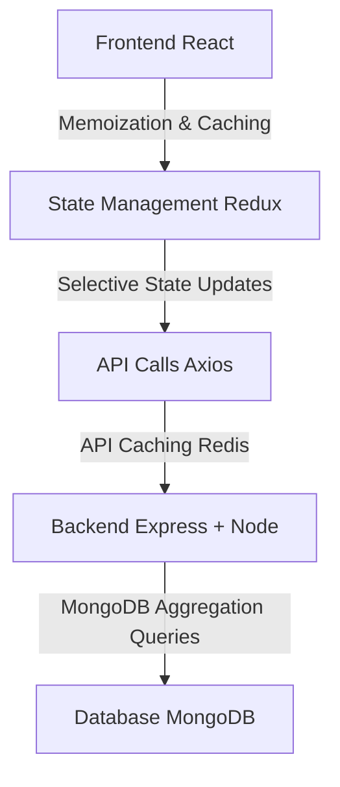

# Tech Stack Relevance and Suitability

### MERN Stack Overview:

Your current application is built on the **MERN stack**, utilizing:

-   **MongoDB** for database management
-   **Express** as a backend framework
-   **React** for frontend components
-   **Node.js** for server-side JavaScript execution

This stack remains relevant and widely used in modern web development. Its strengths include:

1.  **Full-stack JavaScript:** Ensures consistency across the stack, enabling developers to work seamlessly between frontend and backend.
2.  **Scalability:** MongoDB is known for its flexibility with NoSQL schema design, making it a great choice for retail analytics where datasets can vary.
3.  **Vast ecosystem:** Node.js and React have large ecosystems with frequent updates, ensuring access to the latest tools, libraries, and best practices.

However, there are certain **improvements and modern alternatives** to consider based on the evolution of web technologies and the specific needs of your app:

| Current Tech | Alternatives | Reason to Consider |
| --- | --- | --- |
| **MongoDB** | **PostgreSQL** | PostgreSQL offers better ACID compliance, and advanced query capabilities, which may be beneficial for complex analytics queries. |
| **Express.js** | **NestJS** | NestJS offers better TypeScript integration, and a more modular architecture out of the box, suitable for large applications. |
| **React** | **Next.js** | Next.js provides server-side rendering and static generation, improving SEO and performance for dynamic content. |
| **Redux** | **Recoil / Zustand** | Newer state management libraries like Recoil or Zustand provide simpler APIs and better performance for smaller apps or specific use cases. |

## Performance Optimization Opportunities

Several parts of your application can be optimized for performance:

### 1\. **Database Optimization**

-   **MongoDB Aggregation Queries:** The MongoDB aggregation framework can be leveraged more extensively to optimize complex queries like those used in sales reports, reducing the load on the Node.js server .
-   **Indexing:** Ensure proper indexing of frequently queried fields like `product_id`, `zip_code`, and `sales_data` to speed up data retrieval .

### 2\. **State Management Optimization (Redux)**

-   **Avoiding Overfetching:** In the `salesSegment` and `marketShare` components, Redux can sometimes trigger unnecessary re-renders or data refetches. This can be optimized by:
    -   **Memoization:** Using `useMemo` and `useCallback` to avoid re-calculating or re-fetching data unnecessarily .
    -   **Selective State Updates:** Move towards more granular, component-level state management to reduce the number of global state changes that trigger re-renders.

### 3\. **API Caching & Throttling**

-   **Caching Responses:** For APIs that return static data (e.g., product catalogs or competitive pricing), you could implement server-side caching (Redis) or HTTP caching to reduce load on the server .
-   **Rate Limiting:** To protect your API and optimize performance, implementing rate limiting middleware (such as `express-rate-limit`) can help prevent server overload during high-traffic periods.

## Code Misconfigurations and Issues

### 1\. **Component Overloading**

-   The `MarketShare` component, along with its associated Nivo Pie Charts, is heavily overloaded with responsibilities, including fetching data, formatting it, and rendering complex visualizations. This violates the **Single Responsibility Principle** (SRP), making the component harder to test and maintain. Refactoring the component into smaller, more focused subcomponents would improve maintainability .

### 2\. **Asynchronous Operations**

-   **Unoptimized API Calls:** In multiple places (e.g., `useGetSalesQuery` in `reports/index.jsx`), there are redundant API calls being made when switching between views. Implementing a centralized cache or intelligent re-fetching based on component lifecycle (i.e., only fetch when data is stale) would reduce network load and improve responsiveness .

### 3\. **Concurrency Handling**

-   When dealing with asynchronous data fetching, using promises with chained `.then()` calls (instead of `async/await` syntax) increases the risk of mishandling errors or race conditions, particularly in areas with nested promises .

## Diagram of Suggested Optimizations

Here’s a high-level diagram suggesting some optimizations for better performance:

## Recommendations for Modernizing the Stack

If you were to modernize or rewrite the app, here are some additional **JavaScript-based stacks** to consider:

1.  **JAMstack (JavaScript, APIs, Markup)**:
    
    -   **Frontend:** Move to **Next.js** for better performance with static generation.
    -   **Backend:** Use **Netlify Functions** or **AWS Lambda** for serverless functions, reducing server management overhead.
    -   **Database:** Consider **FaunaDB** or **Supabase** for a more seamless integration with serverless and real-time data requirements.
2.  **TypeScript Integration**:
    
    -   Moving the entire project to **TypeScript** would improve type safety, especially in complex logic like competitive product analysis or sales data aggregation. NestJS pairs exceptionally well with TypeScript .
3.  **Serverless Stack (SST)**:
    
    -   **SST** is designed for full-stack serverless apps, allowing you to build using frameworks like React while deploying your backend as serverless functions.

## Conclusion

While the current **MERN stack** remains relevant and capable, evolving web standards and tools present opportunities for optimization and modernization. By adopting better state management, database indexing, and API caching strategies, you can significantly enhance performance and maintainability. Transitioning to **Next.js**, introducing **serverless functions**, and using newer state management libraries would allow for greater scalability and performance in future iterations of the app.
