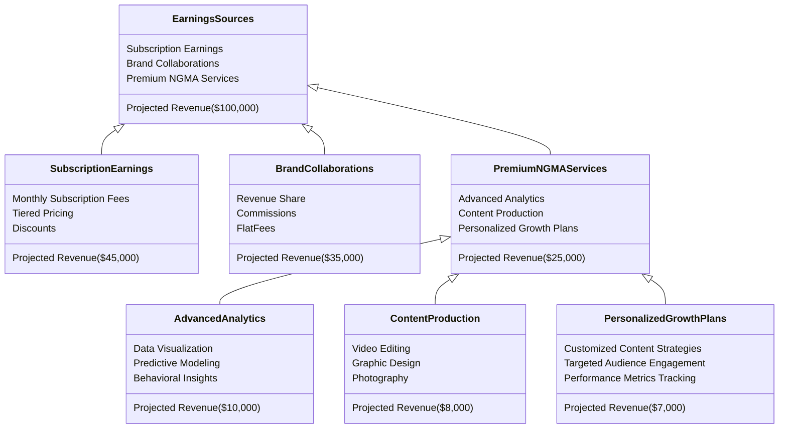

# NextGen Management Agency (NGMA): Comprehensive Vision
#### Tagline: Empowering Creators, Redefining Success.
====================================================

## Purpose and Mission
-------------------

NextGen Management Agency aims to disrupt the conventional talent management space by providing emerging creators, particularly those in niche and underserved markets, with tools, resources, and personalized strategies to achieve sustainable growth.

##### Mission: Elevate small creators to star status through innovation, fairness, and tailored support.

### Features

#### Comprehensive Dashboards

* Role-based dashboards tailored for creators, fans, and administrators.
* Real-time analytics including engagement metrics, revenue tracking, and content performance.

#### Content Management

* Intuitive tools for scheduling posts, managing media, and bundling content.
* Integration with Cloudinary for seamless media optimization and delivery.

#### Fan Engagement

* Advanced tools for managing interactions and custom requests.
* Analytics to identify trends and improve audience retention.

#### Secure Authentication

* Powered by Auth0, ensuring secure and scalable user management.

#### Scalable Infrastructure

* Built with Next.js 15 for scalability, SEO optimization, and superior performance.

### Tech Stack

#### Core Technologies

* Frontend: React 19 with Next.js 15.
* Backend: MongoDB Atlas with Prisma ORM.
* Styling: Tailwind CSS for responsive, utility-first design.
* Authentication: Auth0 for secure login and role-based access.

#### Additional Tools

* Analytics: Chart.js for visualizing creator metrics.
* State Management: Redux Toolkit for efficient data flow.
* Testing: Jest and Cypress for robust unit and end-to-end testing

## Web App Structure
----------------

### Landing Page

- ***Dynamic Hero Section:*** Eye-catching graphics showcasing creators' success stories and NGMA's tools.
- ***Interactive Service Previews:*** Hover animations revealing details about ScoutHub , CreateFlow , and
EngageMax .
- ***Call to Action:*** Clear sign-up and recruitment links.

### Talent Dashboard

- ***My Profile:*** Live analytics for social media growth, revenue, and fan engagement.
- ***Content Scheduler:*** Intuitive interface for planning posts, streams, and more.
- ***Metrics Dashboard:*** Integration with tools like Chart.js for engagement and revenue visualization.

### Admin Panel

- ***Creator Management:*** Role-based tools to monitor and assist talents.
- ***Content Oversight:*** Analytics and performance tracking across the network.

## Marketing Strategies
-------------------

### Social Media Campaigns

- ***Instagram:*** Behind-the-scenes content showcasing NGMA's support and tools.
- ***Reddit:*** AMAs with top creators, leveraging niche audiences for maximum exposure.
- ***Twitter:*** Poll-based content to drive fan interaction.

### Creator Success Stories

- ***Case Studies:*** Use Carnivalli and Yevanyberry777 to showcase NGMA s impact on growth and engagement.

### Localized Outreach

- ***Leverage:*** The El Paso-Las Cruces borderplex to establish a strong foothold and grow organically through
community engagement.

### Referral Incentives

- ***Encourage Referrals:*** Creators can refer peers in exchange for bonuses or tiered earnings.

## Technical Infrastructure
-----------------------

#### Technical Stack

| Category | Technology |
| --- | --- |
| Framework | Next.js (latest features optimized for server and client-side rendering) |
| Hosting | Vercel for seamless deployment and scalability |
| Authentication | Auth0 for secure login and user role management |
| Design | Tailwind CSS and Shadcn UI for responsive, modern interfaces |
| State Management | Redux Toolkit for optimized data flow |
| Media Management | Cloudinary for efficient file handling |

## Growth Forecast
--------------

### Creator Onboarding Potential

```mermaid
gantt
    title NGMA Growth Plan: Establish NGMA As The Go-To Platform
    dateFormat  MM
    section Year 1
    Onboard 50 creators: 2025, 1y 
    section Year 2
    Scale to 200 creators : 2026, 1y
    section Year 5 
    Manage 1,000 creators : 2027, 3y
        
```

##### Milestones
***2026:*** *Revenue per creator ~$1,000/month*
***2027:*** *Increase revenue per creator by 20%*
***2030:*** *40% revenue share per partnership*

## Revenue Model
-------------

### Value Breakdown:

***NGMA*** combines cutting-edge technology, strategic insight, and personalized support to revolutionize talent management. This vision positions it as the industry standard for empowering creators while driving sustainable growth.
1.  **EarningsSources Total**: $100,000 (distributed across all streams).

2.  **Allocation Rationale**:
    -   **SubscriptionEarnings**: Largest share ($40,000), as recurring revenue models are generally steady and scalable.
    -   **BrandCollaborations**: Second largest ($35,000), representing revenue from external partnerships.
    -   **PremiumNGMAServices**: Capped lower at $25,000, as advanced, personalized services tend to generate slightly less consistent revenue.

3.  **Distribution**:
    -   **SubscriptionEarnings**: Weighted toward Monthly Fees ($20,000), with less for Discounts ($5,000).
    -   **BrandCollaborations**: Balanced between RevenueShare, Commissions, and FlatFees ($15,000, $10,000, $10,000).
    -   **PremiumNGMAServices**: Proportional division among its components.

