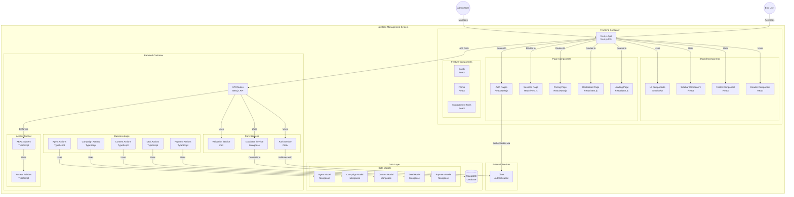

```mermaid
graph TB
    User((End User))
    Admin((Admin User))

    subgraph "NextGen Management System"
        subgraph "Frontend Container"
            NextApp["Next.js App<br>Next.js 13+"]
            
            subgraph "Page Components"
                LandingPage["Landing Page<br>React/Next.js"]
                DashboardPage["Dashboard Page<br>React/Next.js"]
                PricingPage["Pricing Page<br>React/Next.js"]
                ServicesPage["Services Page<br>React/Next.js"]
                AuthPages["Auth Pages<br>React/Next.js"]
            end

            subgraph "Shared Components"
                Header["Header Component<br>React"]
                Footer["Footer Component<br>React"]
                SideBar["Sidebar Component<br>React"]
                UIComponents["UI Components<br>Shadcn/UI"]
            end

            subgraph "Feature Components"
                Cards["Cards<br>React"]
                Forms["Forms<br>React"]
                Tools["Management Tools<br>React"]
            end
        end

        subgraph "Backend Container"
            APIRoutes["API Routes<br>Next.js API"]
            
            subgraph "Core Services"
                AuthService["Auth Service<br>Clerk"]
                DBService["Database Service<br>Mongoose"]
                ValidationService["Validation Service<br>Zod"]
            end

            subgraph "Business Logic"
                AgentActions["Agent Actions<br>TypeScript"]
                CampaignActions["Campaign Actions<br>TypeScript"]
                ContentActions["Content Actions<br>TypeScript"]
                DealActions["Deal Actions<br>TypeScript"]
                PaymentActions["Payment Actions<br>TypeScript"]
            end

            subgraph "Access Control"
                ABAC["ABAC System<br>TypeScript"]
                Policies["Access Policies<br>TypeScript"]
            end
        end

        subgraph "Data Layer"
            MongoDB[("MongoDB<br>Database")]
            
            subgraph "Data Models"
                AgentModel["Agent Model<br>Mongoose"]
                CampaignModel["Campaign Model<br>Mongoose"]
                ContentModel["Content Model<br>Mongoose"]
                DealModel["Deal Model<br>Mongoose"]
                PaymentModel["Payment Model<br>Mongoose"]
            end
        end

        subgraph "External Services"
            ClerkAuth["Clerk<br>Authentication"]
        end
    end

    %% Connections
    User -->|Accesses| NextApp
    Admin -->|Manages| NextApp
    
    NextApp -->|Uses| Header
    NextApp -->|Uses| Footer
    NextApp -->|Uses| SideBar
    NextApp -->|Uses| UIComponents
    
    NextApp -->|Routes to| LandingPage
    NextApp -->|Routes to| DashboardPage
    NextApp -->|Routes to| PricingPage
    NextApp -->|Routes to| ServicesPage
    NextApp -->|Routes to| AuthPages
    
    AuthPages -->|Authenticates via| ClerkAuth
    NextApp -->|API Calls| APIRoutes
    
    APIRoutes -->|Uses| AuthService
    APIRoutes -->|Uses| DBService
    APIRoutes -->|Uses| ValidationService
    
    DBService -->|Connects to| MongoDB
    
    AgentActions -->|Uses| AgentModel
    CampaignActions -->|Uses| CampaignModel
    ContentActions -->|Uses| ContentModel
    DealActions -->|Uses| DealModel
    PaymentActions -->|Uses| PaymentModel
    
    APIRoutes -->|Enforces| ABAC
    ABAC -->|Uses| Policies
    
    AuthService -->|Validates with| ClerkAuth
```