# Court Jester Developer Bible

## Login Page

**Purpose:** The **Login Page** provides a simple form for users (offenders or admin) to authenticate by entering an inmate number. It supports a special code for language preference (entering `"GRINGO"` triggers the interface to switch to English on the next login attempt, otherwise Spanish is default per `lang="es"` in the layout). Admin users can log in using a predefined admin code from the environment. Successful login sets a JWT session token (with role and language) in a cookie, allowing access to protected pages.

### Types, Interfaces, and Params

- **Session (auth-types.ts):** Defines JWT session payload fields: `sessionId`, `offenderNumber` (for offender tokens), user `role` (`"admin"` or `"offender"`), preferred `language`, etc. This is used when generating or verifying JWTs for login sessions.
    
- **OffenderDocument (Mongoose Model):** Represents an offender in the database, including fields like `inmateNumber` (unique identifier), `inmateType` (classification), `name`, etc    file-deafuoc1xv9tr2488v287f
    
. The login process checks for an existing Offender with the given number.
    
- **Admin Code:** The admin login is not tied to a database record but uses an environment variable `ADMIN_CODE` (from **.env**) for authentication. If the entered inmate number matches this code, the user is treated as an admin.
    
- **Public Routes:** The login page is defined at route `/auth/login` and is whitelisted in middleware so it’s accessible without a token. It does not receive dynamic route params or special props – it’s a static page.
    

### API Endpoints & Route Handlers

- **POST** **`/api/auth/login`** (expected): Handles login form submission. It verifies the provided inmate number against credentials:
    
    - If the number matches **ADMIN\_CODE**, a JWT is generated with `{ role: "admin" }`.
        
    - Otherwise, it attempts to find an Offender in the database by that inmate number. On success, a JWT is generated with offender details; on failure, an error is returned.
        
    - A new JWT **session token** is set in an HTTP-only cookie (e.g. `Set-Cookie: token=<JWT>`). The token payload includes the user’s role, offender number, and interface language.
        
    - **Validation:** The login input (inmate number) is expected to be numeric or string of certain format. (In a full implementation, this would be validated with Zod schemas or similar – see **Validation Pattern** below.)
        
    - **Response:** Returns a JSON result or redirect. On success, the front-end typically redirects to the Offender Profile page (e.g. using `next/navigation` router push).
        
- **GET** **`/api/auth/logout`** (potential): Not explicitly shown in the code, but a route could clear the auth cookie to log the user out.
    
- *(Note:_ The codebase’s middleware (see **middleware.ts**) intercepts protected routes and will redirect unauthorized requests to the login page.)*
    

> **Template – Login Route Handler:** Below is a generic structure of how the login API route might be implemented (combining patterns used in the codebase):
>
>```tsx
>import { NextResponse } from "next/server";
> import { generateToken } from "@/lib/auth";  // hypothetical function to sign JWT
> import Offender from "@/lib/db/models/Offender";
> import { connectToDatabase } from "@/lib/db/connect";
> 
> export async function POST(request: Request) {
>   const { inmateNumber } = await request.json();  // parse request body
>   await connectToDatabase();
>   // Check admin code
>   if (inmateNumber === process.env.ADMIN_CODE) {
>     const token = generateToken({ role: "admin", language: "en" /* or default */ });
>     const res = NextResponse.json({ message: "Admin logged in" });
>     res.cookies.set("token", token);  // set JWT cookie
>     return res;
>   }
>   // Otherwise, verify offender exists
>   const offender = await Offender.findOne({ inmateNumber });
>   if (!offender) {
>     return NextResponse.json({ error: "Offender not found" }, { status: 401 });
>   }
>   // Generate offender JWT token
>   const payload = { offenderNumber: inmateNumber, role: "offender", language: offender.preferredLanguage || "es" };
>   const token = generateToken(payload);
>   const res = NextResponse.json({ message: "Offender logged in" });
>   res.cookies.set("token", token);
>   return res;
> }
> ```
> 
> This pattern uses the **jsonwebtoken** library and the **auth.ts** helper to create a JWT, and stores it as a cookie for session persistence. It aligns with the codebase’s approach (e.g. using `connectToDatabase()` and Mongoose queries). Error handling can be unified via a utility like `handleApiError` in `api-utils.ts`.

### CRUD Operations

- **Authenticate (Read/Validate):** The login process _reads_ the provided credentials and _reads_ the Offender record from the database to validate existence. It’s effectively a **Read** operation on Offender data (with the special case of the admin code which is checked against an env variable).
    
- **Session Creation:** Upon successful login, a JWT is **created** (this can be viewed as creating a session). This token creation is not a database write, but it is an essential **Create** operation for the auth system (generating a signed token via `jsonwebtoken`    ).
    
- **No Direct DB Writes:** The login page itself does not create or update any database record. (If an inmate number is not found, the user would be redirected to a registration flow rather than creating an Offender on the fly – see Register Page.)
    
- **Language Toggle (“GRINGO” code):** Entering `"GRINGO"` on the login page doesn’t log a user in, but it sets a flag for the next login. Internally, this likely updates a context or cookie for language preference (e.g. setting session language to `"en"` on the next token). This is an example of a state change (not stored in DB, but in-memory or via cookie).
    

### Models and Database Collections

- **Offender Collection:** Backed by the `Offender` Mongoose model (defined in **Offender.ts**). Each document stores inmate details. Key fields include `inmateNumber` (unique login identifier), `inmateType`, `name`, `facility`, etc. Additional flags like `profileEnabled`, `motionsEnabled` may control access to features. The login uses this collection to find if an inmate exists and is allowed access.
    
- **No Passwords:** Notably, Offender records do not have a password field; possession of the correct inmate number is the sole requirement. (Security in this context relies on the system being internal or the inmate number being secret enough. In production, consider adding a PIN or password.)
    
- **Admin Users:** There is no separate Admin collection. Admin authentication is handled via the static `ADMIN_CODE` (from environment)    , so no admin user record is looked up in the database during login.
    

### Components Used

- **UI Form Components:** The login page likely uses the design system’s form controls:
    
    - **Input** component for the inmate number (from `@/components/ui/input`).
        
    - **Button** component for the “Buscar Ahora / Search Now” submit action (from `@/components/ui/button`).
        
    - **Label** component for the input field (from `@/components/ui/label`). These are part of the ShadCN UI library integrated in the project (Radix UI based components).
        
- **State and Hooks:** It being a client-side page (`"use client"` is expected at the top), React hooks like `useState` manage the form field, and `useRouter` (from Next Navigation) is used to redirect upon success. For instance, `router.push("/")` would send an authenticated user to the profile page.
    
- **Toasts for Feedback:** The page may use the toast system (`useToast` and `<Toaster />`) to show error messages (e.g. “Offender not found” or “Invalid code”). The `<Toaster>` is mounted in the global layout    file-deafuoc1xv9tr2488v287f
    
    , so the login page can simply call `toast` from `useToast` to display notifications.
    
- **No Complex Children:** The login form is self-contained, so it doesn’t use complex child components beyond basic inputs and buttons.
    

### Styles and Utility Classes

- **Tailwind CSS:** The page uses Tailwind utility classes for layout and styling consistency. For example, the login button is styled via a custom CSS class `.button-login` in `globals.css`    which sets background and foreground colors using CSS variables, and padding/border for a solid button style. On hover it likely inverts colors. This custom class uses the theme variables `--foreground` and `--background` defined in Tailwind config.
    
- **Theme Colors:** The Tailwind configuration defines `background` and `foreground` colors (e.g. a parchment-like beige background and dark text). The login page inherits these; e.g., the page’s `<body>` likely has `class="bg-background text-foreground"` via global styles, giving it a neutral theme appropriate for both English and Spanish text.
    
- **Layout:** The login form is probably centered on the page. Utility classes (like `flex`, `justify-center`, `items-center`, `min-h-screen`) could be used to center the form vertically and horizontally. (These are common patterns though the exact classes aren’t visible in the snippet.)
    
- **Responsive Design:** Given simplicity, not much responsive logic is needed, but basic Tailwind grid/flex can ensure the form is mobile-friendly. The `.button-login` style includes padding and font sizing for clarity on different devices.
    

### Layout and Globals

- **Root Layout:** The login page uses the global `app/layout.tsx` (no custom layout override). The root layout provides the HTML `<head>` and `<body>` structure. It sets the default `lang="es"` on the `<html>` tag    (the login page will display in Spanish by default). The layout also injects Google Fonts preconnects and the global CSS imports.
    
- **Globals.css:** Global styles are applied, including the Tailwind base, components, and utilities. This ensures the login page has the same typography and reset as the rest of the app. Additionally, any custom CSS (like the `.button-login` class) is defined here and thus available on the login page.
    
- **No Navigation Bar:** As this is a public page, there is typically no sidebar or top navigation shown (to avoid confusing an unauthenticated user). The layout does include the `<Toaster />` for any toast messages    , but otherwise it likely renders just `{children}` (the login form) inside the body.
    

### Third-Party & Local Dependencies

- **Next.js and React:** This page is a Next.js React component (written in TypeScript/TSX). It uses Next’s app router conventions and React hooks for interactivity.
    
- **Tailwind CSS:** Utilized for utility-first styling. The presence of Tailwind classes and variables (background, foreground) is configured by **tailwind.config.ts**.
    
- **ShadCN UI (Radix UI):** The Input, Button, Label are from a locally generated component library (Radix Primitives + Tailwind variants) as indicated by imports like `@/components/ui/input`. These abstract consistent styling and accessibility.
    
- **Lucide Icons:** Possibly used for an icon on the login button (e.g. a search icon) – the help text references a search function, but not confirmed. The project has Lucide icon dependencies available    , so adding an icon (like a magnifying glass) inside the button would be straightforward.
    
- **Local Utilities:**
    
    - `@/lib/auth`: Provides JWT generation (`generateToken`) and verification (`verifyToken`). The login route uses **auth.ts** to sign the token using the `JWT_SECRET`.
        
    - `@/lib/db/connect`: Handles connecting to MongoDB. The login logic calls `connectToDatabase()` before querying models.
        
    - `@/lib/db/models/Offender`: The Mongoose model used to find the offender by number.
        
    - No external API calls are made on login (all within the app’s API).
        
- **Environment Variables:**
    
    - `ADMIN_CODE` (for admin login).
        
    - `MONGO_URI` (for database connection).
        
    - `JWT_SECRET` and `JWT_EXPIRES_IN` (for signing tokens).
        
    - These are loaded via Next.js runtime and used in the auth library.
        
- **Config Files Influence:**
    
    - **tsconfig.json:** Defines path aliases so imports like `@/lib/auth` and `@/components/ui/button` resolve correctly. It also enables strict type-checking (though `nextConfig` in **next.config.ts** opts to ignore build errors for flexibility        ).
        
    - **tailwind.config.ts:** Specifies the theme and content paths        ; it ensures the login page TSX is scanned for classes to generate the appropriate CSS. The custom theme colors (foreground/background) are used on this page.
        
    - **middleware.ts:** Lists `/auth/login` as a public route, meaning the middleware will not redirect users away from this page if they lack a token. This allows new users to access the login.
        

### Utility & Lib Files

- **Auth Library (`lib/auth.ts`):** Provides `verifyToken` and likely a token generation function. The login route uses this to create JWTs. The **JWT payload** includes role and possibly feature flags (e.g., `profileEnabled`) which can influence subsequent page access.
    
- **Validation (`lib/validation.ts`):** Contains Zod schemas (not fully shown) that could validate input. While not explicitly invoked on the login page, it defines patterns used app-wide. For example, a Zod schema could ensure the inmate number is a string of digits.
    
- **withValidatedProps HOC:** A utility to wrap components with Zod validation. This isn’t specifically used on the login page, but demonstrates the project’s approach to type-safe props. It could be applied to form components to enforce input shapes.
    
- **Error Handling (`lib/api-utils.ts`):** Defines a standard `handleApiError` returning NextResponse JSON errors. A production login route would use this or similar try/catch wrappers.
    
- **Cookies:** The login page itself likely doesn’t manipulate cookies directly (that’s done in the API route). However, the presence of `jwtDecode` in **auth.ts**    and cookie parsing in the Help modal    suggests some client-side code may read cookies to determine state (e.g., help modal checking token to see user role). The login page, after setting the cookie via API, relies on middleware for subsequent access control.
    

### Additional Context

- **Middleware and Redirects:** After a successful login, the user is redirected to the Offender Profile page (likely by client-side navigation). The middleware will then allow access because a valid `token` cookie is present and `verifyToken` will return truthy for that request. If the token is missing or invalid, middleware redirects back to `/auth/login`.
    
- **Language Setting:** The special `"GRINGO"` code likely toggles an **English mode**. Implementation detail: The first login attempt with `"GRINGO"` could set `language: "en"` in a temporary session or cookie. The next real login uses that to issue an English JWT. The Session interface includes a `language` field    , and RootLayout could read that to set the `<html lang>` or to load English text. (Currently, the app default is Spanish; English support might be via conditionals or separate content files, not fully shown in code).
    
- **Registration Flow:** If an offender’s number is not found, the login page might prompt them to register (if `ENABLE_REGISTRATION` is allowed). In the current configuration, `/auth/register` is also public. See **Register Page** below for details on how a new offender would be created.
    
- **Security Note:** Because the login trusts a single code as admin, this code should be kept secret. Also, JWT tokens expire after 30 minutes by default    , requiring re-login after expiration (this is a configurable security measure).
    

## Offender Profile Page

**Purpose:** The **Offender Profile Page** (the main dashboard for logged-in offenders) provides a comprehensive interface for an inmate (“offender”) to view and manage their case information, legal motions, and reminders. It is the landing page after login (likely served at the root path `/` or a main route like `/dashboard`). This page is only accessible to users with a valid offender token; it is protected by middleware (requests without a token are redirected to login). The interface is bilingual (Spanish by default, English if the user triggered the language toggle at login) and organized into sections or tabs: **Profile Details**, **Document Processing**, **Motions**, and **Reminders** (as indicated by the help documentation and component names).

### Types, Interfaces, and State

- **OffenderProfile Interface:** Defines the structure for displaying offender data on this page. It includes personal details (`offenderId`, `firstName`, `lastName`, etc) and possibly case-related info. For example, an OffenderProfile may contain an offender’s name and an external ID (like `nmcdNumber`) retrieved from documents.
    
- **Offender (Model):** The offender’s own data as stored in the DB, from which profile info is derived. Fields include `name`, `inmateType`, `facility`, and boolean flags like `profileEnabled`, `motionsEnabled`, etc    file-deafuoc1xv9tr2488v287f
    
. These flags might enable/disable certain sections of the UI (e.g., if `motionsEnabled` is false, the motions section might be hidden or read-only).
    
- **Case and Related Types:** Each offender may have one or more legal cases. The **CaseDocument** type (Mongoose model) includes fields such as `caseNumber`, `court`, `judge`, lists of `charges` and `hearings`, etc. On the profile page, the current case’s details can be displayed (if the system is limited to one case per offender, this page focuses on that case; if multiple cases, the offender might select a case to view).
    
- **Motion and Reminder Types:**
    
    - **MotionDocument:** Represents a legal motion (a document or request) the offender has created. Fields include references to the offender and case, a template ID if based on a template, title, content, and timestamps.
        
    - **ReminderDocument:** Represents a reminder entry (possibly for court dates or tasks). It includes an `offenderId`, `title`, `message`, and a `scheduledDate`.
        
- **Component Props:** This page itself is likely a server-side component (for initial data fetch), but many sub-components are client components that manage their own state:
    
    - **DocumentProcessingTab** might maintain state for uploaded text and parsed results.
        
    - **MotionHistory** and **MotionEditor** maintain state for the list of motions and currently edited motion.
        
    - **ReminderList** manages a list of reminders, and **ReminderForm** manages input state for a new or edited reminder.
        
- **No URL Params:** The Offender Profile page is tied to the logged-in user (identified via token), not via a URL param. It likely uses the JWT’s `offenderNumber` to fetch data, so it doesn’t accept a dynamic route param.
    

### API Endpoints & Route Handlers

All interactions on this page happen via internal API calls (the Next.js App Router API endpoints) or direct server function calls. Key endpoints include:

- **GET** **`/api/cases`** – _List offender’s cases._ Returns case data for the logged-in offender. The handler uses the token to identify the offender and calls `getCasesByOffenderId` (in **cases.ts** service) to retrieve all Case documents for that offender. This allows the profile page to load case details. If the app assumes one case per offender, this might return a single case in a list. (This route is protected by checking `verifyToken` on the request cookies, similar to admin routes.)
    
- **POST** **`/api/cases`** – _Create a new case._ Used when an offender parses a document that contains case info or needs to add a case manually. The route would verify the token, then create a new Case document (populating offenderId from the token). For example, after using the Document Processing tab, the client could send parsed case details to this endpoint to persist a new case. (If an offender is only ever associated with one case, this might not be used frequently, but it supports the scenario of adding a case.)
    
- **GET** **`/api/motions`** – _List motions for offender._ Returns all Motion entries for the offender (possibly filtered by a specific case). Since motions are typically tied to a case, the client might include a query param like `?caseId=<id>`; the handler would verify the token and use `listMotionsByCaseId(offenderId, caseId)` or a similar service. In the code, `listMotionsByCaseId` is defined in **cases.ts** for admin use    , but an offender-specific listing would ensure the offenderId matches the token to avoid leakage. (This might also be handled by the GET `/api/cases` call if it returns case data along with motions in one response.)
    
- **POST** **`/api/motions`** – _Create a new motion._ Called when the offender submits the Motion Editor form. The request body would include a `caseId` (if needed) and content or selected template variables. The route verifies the token and uses the **motions.ts** service to create a Motion entry (e.g., `Motion.create({...})`) linking it to the offender’s `offenderId` and given `caseId`. After creation, it could return the new motion’s data or a success message. The profile page will then update the motion list (possibly via revalidation or a client state update).
    
- **PUT** **`/api/motions/[motionId]`** – _Update an existing motion._ If the offender edits a saved motion, this route handles saving changes. It verifies the token and that the motion belongs to that offender (the Motion model’s offenderId). Then it updates the motion content/title as provided.
    
- **DELETE** **`/api/motions/[motionId]`** – _Delete a motion._ Allows an offender to remove a motion (perhaps if it was a draft they no longer need). This route checks the token and ownership, then deletes the Motion document. (The UI might present a confirmation dialog before calling this – currently, a generic `<ConfirmationDialog>` component exists and could be repurposed for motions as well.)
    
- **POST** **`/api/reminders`** – _Create a new reminder._ Called when the offender submits the Reminder form. The handler verifies the offender token, then creates a Reminder entry (with `offenderId` from the token) in the database. It likely uses the **reminders.ts** service which wraps Mongoose Reminder model operations.
    
- **GET** **`/api/reminders`** – _List reminders._ Returns all reminders for the logged-in offender (possibly limited to upcoming ones). Could be used to populate the reminder list on page load or via SWR (stale-while-revalidate). The service function would query `Reminder.find({ offenderId })` after `connectToDatabase()`.
    
- **PUT** **`/api/reminders/[reminderId]`** – _Update a reminder._ If the UI allows editing an existing reminder (e.g., change date or mark as done), this route applies the changes (after verifying the offender’s identity and ownership). For marking a reminder completed or toggling notifications, a specific field (like `status` or a boolean) would be updated.
    
- **DELETE** **`/api/reminders/[reminderId]`** – _Delete a reminder._ Removes a reminder. The profile page’s Reminder List likely calls this when the user confirms deletion of a reminder (using the ConfirmationDialog to confirm). The route simply verifies the token and performs a `Reminder.deleteOne({ _id: reminderId, offenderId })`.
    
- **GET** **`/api/offenders/[id]`** – (Optional) _Fetch offender profile._ In some implementations, the profile page might fetch the offender’s own data via an API call. However, since the token already contains the offender’s number and we can fetch Offender details server-side, this might not be necessary. Instead, the server component can directly use the Offender model. (The code includes `getOffenderByInmateNumber` in **offenders.ts**    , which suggests the profile could use that on the server rather than an API call.)
    
- **Miscellaneous:** If **ENABLE\_PDF\_GENERATION** is true, there might be an endpoint like **`/api/motions/[motionId]/pdf`** or a feature where the client requests a PDF. The code has a `generateMotionPdf` utility that creates a PDF from motion content. Possibly, clicking “Download PDF” on a motion uses this (either generating on the fly in the browser via PDFKit or via an API route that streams the PDF).
    

> **Template – Protected GET Endpoint:** Offender-specific APIs mirror the structure of admin routes, but filter data by the logged-in user. For example, a **GET /api/cases** handler might look like:
> 
>```tsx
> import { NextRequest, NextResponse } from "next/server";
> import { verifyToken } from "@/lib/auth";
> import { getCasesByOffenderId } from "@/lib/db/services/cases";
> 
> export async function GET(request: NextRequest) {
>   const tokenValid = verifyToken(request.headers.get("cookie") || "");
>   if (!tokenValid) {
>     return NextResponse.json({ message: "Unauthorized" }, { status: 401 });
>   }
>   try {
>     const offenderNumber = tokenValid.offenderNumber;
>     const cases = await getCasesByOffenderId(offenderNumber); 
>     return NextResponse.json({ cases });
>   } catch (error) {
>     // Handle error (could use handleApiError utility)
>     return NextResponse.json({ message: "Server error" }, { status: 500 });
>   }
> }
>```
> 
> This pattern is similar to the admin case detail route, which verifies the token and returns data. The difference is in filtering: `getCasesByOffenderId` ensures the returned cases belong to the offender. All offender profile APIs follow this approach: **authorize**, then **CRUD on the offender’s own records**.

### CRUD Operations on Profile Data

From the offender’s perspective, they can **Create, Read, Update, and Delete** various pieces of data on this page:

- **Offender Profile:** _Read-only._ The personal details shown (name, ID, etc.) are loaded from the Offender model. The offender themselves typically cannot edit these on this interface (no explicit edit form is described for profile details). The `profileEnabled` flag suggests that the profile tab might only be visible if enabled (perhaps controlled by admin). If we consider a possible future feature, updating profile info could be a **PUT /api/offenders/\[id\]**, but as of now, profile data is static on this page.
    
- **Cases:** _Read and Create._ The offender can view case details (**R**). If allowed, they can add a new case (**C**) via document processing (which parses info and then creates the case). **Update** or **Delete** of case by the offender is likely not permitted (an inmate wouldn’t typically remove or alter a case’s fundamental details – that would be admin territory). Thus, case data on this page is mostly read-only, with creation being indirect via parsing documents.
    
- **Motions:** _Full CRUD._ This is a core feature of the app:
    
    - **Create:** Offenders can create new motions (draft legal documents). Using the **MotionEditor**, they fill in or select a template and save the motion. This triggers a **Create** operation in the `motions` collection (via POST `/api/motions`).
        
    - **Read:** They can view a history/list of motions they’ve created for their case. The **MotionHistory** component displays this list, showing each motion’s title/status. This is populated via GET `/api/motions` (or via the case fetch).
        
    - **Update:** Offenders can edit a motion’s content/title. The UI likely allows clicking on a motion in the history list to open it in the MotionEditor (passing `motionId` and the existing content). Saving changes calls PUT `/api/motions/[motionId]` to update. The MotionEditor component’s props (`initialVariables`, `motionId`, etc        ) support editing an existing motion.
        
    - **Delete:** Offenders may delete a motion (perhaps if it was a mistake or superseded). The MotionHistory could provide a delete button per motion. If confirmed, DELETE `/api/motions/[motionId]` removes it.
        
- **Reminders:** _Full CRUD._ Reminders function like personal calendar entries or tasks:
    
    - **Create:** Offender uses the **ReminderForm** to set a title, message, and date (and possibly a toggle for notifications using the Switch input        ). Submitting calls POST `/api/reminders` to save it. The form uses Zod for client validation possibly, and date-fns for date formatting or parsing.
        
    - **Read:** The list of reminders is displayed via the **ReminderList** component. On page load or on creation, the list is updated (either via a new GET `/api/reminders` or by optimistic update in state). Each reminder likely shows its title, message, and date (formatted using date-fns).
        
    - **Update:** If the UI allows editing a reminder, the ReminderForm might also be used for editing (prefilled with existing data). Saving would call PUT `/api/reminders/[id]`. Another kind of update could be marking a reminder as done (if a “done” status exists). There is a `status` field hinted in the schema (though not explicitly in snippet, it could be the `message` vs `scheduledDate` pair). For simplicity, update likely covers editing text or date.
        
    - **Delete:** Offenders can delete reminders. The ReminderList integrates a **ConfirmationDialog** (a reusable dialog UI) to confirm deletion. If confirmed, it calls DELETE `/api/reminders/[id]`, and on success the reminder is removed from the UI list (with possibly a toast confirming deletion).
        
- **Notifications:** (Passive for offenders) Offenders might receive notifications (like messages or alerts, stored in a `Notification` collection). The **notificationsEnabled** flag in Offender suggests the system can send them notifications. While the profile page UI as given doesn’t explicitly show a notifications panel, the existence of a Notification model means the backend could create notifications (e.g., admin could send a message about a court date). Offenders would **Read** these if surfaced. (Email notifications may also be sent if `ENABLE_EMAIL_NOTIFICATIONS=true` in env, but that’s outside the UI scope.)
    

### Models and Database Collections

Several MongoDB collections are in play on this page:

- **Offender:** The current user’s Offender record provides their identity and feature flags. The Offender model (Mongoose schema) ties to other models via references:
    
    - It doesn’t directly list case IDs, but other models reference Offender by `offenderId`. OffenderSchema snippet        shows `inmateNumber` etc., and other schemas use `ref: "Offender"` (e.g., MotionSchema uses offenderId string reference        ).
        
- **Case:** Cases relevant to the offender. Each Case document has an `offenderId` field linking it to the Offender. Fields likely include:
    
    - `caseNumber`, `court`, `judge` (to identify the case in the legal system).
        
    - `charges` (array of Charge objects with description, disposition, etc        ).
        
    - `hearings` (array of Hearing objects with type, date, time        ).
        
    - `sentence` or status fields. The profile’s **Profile Tab** might display some of this (e.g., charges or next hearing date).
        
- **Motion:** The motions created by the offender. The Motion model includes `offenderId`, `caseId`, `templateId` (if based on a template), a `title` (e.g., “Motion for Early Release”) and the motion content . Each motion likely has timestamps (`createdAt`). In the database, motions are stored in a `motions` collection (e.g., as defined by **Motion.ts** Mongoose schema    and model registration).
    
- **Template:** Motion templates used to draft motions. Stored in a `templates` collection (Mongoose model **Template.ts**). Each Template has a `title`, `content` (with placeholders), and a set of `variables` (MotionVariable definitions). For example, a template might be “Motion to Judge” with placeholders for `<JudgeName>`, `<CaseNumber>`, etc. The Motion Editor uses these. Offenders don’t create templates (admin manages these), but the page fetches them for the dropdown selection in MotionEditor. The function `getTemplateById` is imported in MotionEditor    , likely to load template content for a chosen template.
    
- **Reminder:** Reminders are stored in a `reminders` collection. The Reminder schema includes `offenderId`, `title`, `message`, and `scheduledDate` (likely when the reminder is due). Possibly a `type` or `priority` could exist (not shown). Reminders are simple and specific to each offender.
    
- **Notification:** (If used on this page) Notifications would be in a `notifications` collection, with each document linking to an offender (`offenderId`) and containing a `title`, `message`, `type` (perhaps type of notification)    and possibly a timestamp. The profile page might not explicitly list these, but the presence of this model means the system can store notifications (e.g., “Your motion was submitted” or admin messages). If implemented, offenders would read them here or in a modal.
    

### Components (UI and Logic)

The Offender Profile page is composed of multiple components, each handling a section of functionality:

- **Profile Info Section:** This might be a simple JSX block (or a small component) showing the offender’s personal info (name, inmate number, etc.). For instance, a `<Card>` from the UI library could wrap these details:
    
    - Uses **Card, CardHeader, CardTitle, CardContent** components from `@/components/ui/card` to present information in a structured way. For example, `CardTitle` might say "Offender Profile" and `CardContent` lists the inmate’s name, type, and facility.
        
    - This section is likely read-only. It draws data from the Offender model (fetched server-side).
        
- **DocumentProcessingTab (document-processing-tab.tsx):** A client component providing UI to parse legal documents:
    
    - **Imports & Usage:** It imports the Card layout components and form inputs (Button, Input, Textarea), as well as `useToast` for notifications and two parsing utilities: `profile-parser` and `case-parser`. This suggests the tab UI has an input (perhaps file upload or text area) where the user can input text from their documents, and a button to trigger parsing.
        
    - **Functionality:**
        
        - The **Profile Parser** (`@/lib/utils/profile-parser`) likely extracts personal data (name, inmate ID, etc.) from text (e.g., from a pre-sentence report or inmate file) and the **Case Parser** (`@/lib/utils/case-parser`) extracts case-related info (case numbers, charges, court dates). These are pure functions (likely running in the browser since they’re imported into a client component) that output structured data.
            
        - When the offender pastes text and clicks “Process Document” (for example), the component uses these parsers to generate an OffenderProfile and/or Case data. It then likely displays the parsed results to the user for confirmation.
            
        - It might also enable the **Save to Profile** action – i.e., send parsed data to the backend. For instance, after parsing, it could call the relevant APIs: if a new case was identified, call POST `/api/cases` to save it, or update the Offender’s details if needed. Toast notifications via `useToast` would inform success or failure of saving data.
            
    - **UI:** The tab likely uses a `<Textarea>` component for the user to input or paste text, and a `<Button>` to initiate parsing. Results might be shown in read-only inputs or directly updated in the Profile/Case sections.
        
- **MotionHistory (motion-history.tsx):** A client component that displays the offender’s motions history (list of motions) and provides controls to create or edit motions:
    
    - **Props:** It accepts `caseId` and an optional `isAdmin` flag. On the profile page, it would be used with the offender’s caseId and `isAdmin={false}` (or omitted). The `caseId` tells it which case’s motions to show.
        
    - **Functionality:**
        
        - On mount, it likely fetches the list of motions for the given case (if not passed as props). It might do this with a `useEffect` calling GET `/api/motions?caseId=XYZ`. In code, it imports the Motion model type, indicating it may manipulate or expect Motion objects.
            
        - It maintains internal state like `motions` (array of motions) and maybe `showEditor`/`editingMotionId` to control the MotionEditor visibility.
            
        - **UI Layout:** It probably uses a Card or list layout. Each motion could be shown as a row or card: title, maybe creation date, and a status badge. The component imports the **Badge** UI component, which could be used to label motions (e.g., “Draft” vs “Submitted”). It also imports **Button** (for actions like “New Motion”) and uses **MotionEditor** component for editing.
            
        - **Interactions:** There’s likely a “New Motion” button that, when clicked, instantiates a new blank motion editor (setting maybe `editingMotionId = null` and toggling the MotionEditor open). Each listed motion might have an “Edit” button (or clickable title) that opens MotionEditor with that motion’s data.
            
        - If `isAdmin` is true, the component might allow administrative actions (like viewing motions of any offender or extra info). But for offender usage, `isAdmin` is false and it shows only the offender’s own motions.
            
        - The component uses `useToast`for success or error messages (e.g., “Motion saved successfully”).
            
    - **Integration:** This MotionHistory is embedded in the profile page JSX, likely under a "Motions" tab section. It interfaces with MotionEditor (embedded or modal).
        
- **MotionEditor (motion-editor.tsx):** A client component providing a form to compose or edit a motion:
    
    - **Imports:** It imports Input, Label, Textarea from the UI library, and `useToast`. It also imports motion template helpers: `getTemplateById` and `fillTemplate` from `@/lib/motion-templates`. This indicates the editor supports selecting a template and auto-filling content.
        
    - **UI:** Likely consists of:
        
        - A dropdown or select to choose a template (if starting a new motion). If a template is chosen, `getTemplateById` is used to load the template’s content and variables, and `fillTemplate` might generate the initial content by replacing placeholders with stored values (if any).
            
        - Several input fields corresponding to the template’s variables. The MotionTemplate interface defines variables each with key, label, type, options. The editor could dynamically render fields (text inputs, date pickers, selects) for each template variable. If `initialVariables` props are provided (for edit case), those values pre-fill the fields.
            
        - A large Textarea for the motion content itself (if they allow direct editing of the content).
            
        - Save/submit and cancel buttons.
            
    - **Functionality:**
        
        - On initial render (new motion), if a templateId is provided (maybe user selected one from MotionHistory’s “New Motion” flow), it uses `getTemplateById(templateId)` to load the template content and variable list. It then perhaps sets up state for each variable and the content.
            
        - When the user fills the fields, `fillTemplate(variables)` can be called to generate the motion content (in real-time or on submit). `fillTemplate` likely takes a template content string with placeholders like `{{variable_name}}` and replaces them with the values the user entered.
            
        - On submit: If `motionId` prop exists (edit mode), call PUT `/api/motions/[motionId]` with updated content/title. If no `motionId` (new), call POST `/api/motions` with the content, title, templateId, etc.
            
        - After save, it triggers a toast via `useToast` for feedback and informs MotionHistory to refresh the list (perhaps by calling a parent callback or simply relying on the motion being added to state in MotionHistory).
            
        - Possibly, if PDF generation is enabled, MotionEditor could also offer a “Download PDF” button. This might call `generateMotionPdf` on the client side or trigger an API route. Since `pdf-generator.ts` is presentand `ENABLE_PDF_GENERATION` is true in .env, a button in MotionEditor could use that: e.g., call an endpoint that returns the PDF blob to download.
            
- **ReminderList (reminder-list.tsx):** A client component showing all reminders and allowing new ones to be added or existing ones managed:
    
    - **Imports:** Card and Button for layout, Badge for highlighting (maybe overdue vs upcoming reminders), `useToast`, `date-fns` for date formatting, and it uses the **ReminderForm** and **ConfirmationDialog** components.
        
    - **UI & Function:**
        
        - It likely displays each reminder in a card or list item with its title, date (formatted, e.g., “March 10, 2025”), and maybe an icon or badge if the date is near/overdue.
            
        - There may be an “Add Reminder” button that toggles the ReminderForm (perhaps in a modal or dropdown).
            
        - Each reminder item might have options to edit or delete. If editing, it could reuse the ReminderForm populated with that reminder’s info. If deleting, clicking delete triggers the ConfirmationDialog (a modal that asks “Are you sure?”). The ConfirmationDialog component is imported and probably used to wrap the delete action with confirmation UI    .
            
        - This component fetches the reminders list (likely via a GET `/api/reminders` call on mount) and stores it in state. On new reminder creation, it updates the list (by adding the returned reminder or re-fetching). On deletion, it removes it from state after confirmation.
            
        - `useToast` provides user feedback (e.g., “Reminder added” or “Reminder deleted”).
            
- **ReminderForm (reminder-form.tsx):** A client component for the form to create or edit a reminder:
    
    - **Imports:** Card (perhaps to style the form), Button, Input, Label, Textarea for form fields, Switch (for a toggle), `useToast`, and `date-fns` for date handling.
        
    - **Fields:** Probably includes:
        
        - **Title** (Input text).
            
        - **Message/Description** (Textarea for any notes).
            
        - **Date** (could be a date picker, but likely just an `<input type="date">` or similar, or even separate inputs for date and time – however, date-fns being imported suggests they might parse/format a combined date-time).
            
        - **Notification Toggle:** The Switch might indicate if the offender wants an email notification for this reminder (if email notifications are enabled). Or it could mark whether the reminder is active.
            
    - **Function:** On submit, it calls the appropriate API:
        
        - If creating new: POST `/api/reminders` with title, message, date.
            
        - If editing: PUT `/api/reminders/[id]` with updated fields.
            
        - On success, it triggers a toast and calls a callback (passed down from ReminderList) to refresh the list or closes itself. On cancel, it closes without changes.
            
        - It may use react-hook-form for handling validation, given `react-hook-form` is a dependency in the UI kit (the Form component in `@/components/ui/form` ties into react-hook-form). However, it might also use simpler local state and onSubmit events.
            
- **ConfirmationDialog (confirmation-dialog.tsx):** A reusable logic component to prompt user confirmation for destructive actions.
    
    - **Usage:** In ReminderList (and possibly MotionHistory if implemented for motion delete), this component is invoked. It likely wraps Radix UI’s Alert Dialog under the hood.
        
    - It was imported in reminder-list, meaning when a user clicks delete on a reminder, the ConfirmationDialog opens, and on confirm it calls the passed deletion handler.
        
    - Not much logic on its own; it’s a small wrapper for a modal with “Confirm” and “Cancel” buttons.
        
- **FloatingHelpButton / HelpModal:** Though not part of the profile content per se, these components are present globally and relevant:
    
    - **HelpButton / FloatingHelpButton:** Provide a UI (like a floating question mark icon) that opens the Help modal. For the profile page, the floating help is likely visible. It’s a round icon button that toggles the HelpModal.
        
    - **HelpModal (help-modal.tsx):** When opened, it shows a help overlay. Importantly, it uses `verifyToken` from `@/lib/auth` to determine the user’s role on the client side. In `useEffect`, it reads `document.cookie` to find the JWT and verifies it, setting a state for `role`. Based on `role` it may display different help content (the help markdown in **HELP.md** has sections for Offender vs Admin interface). So:
        
        - Offender will see instructions relevant to their interface (like the ones describing Login, Profile Tab, etc).
            
        - Admin (if logged in as admin and viewing this page, though normally admin wouldn’t use offender page) would see different help text.
            
    - The HelpModal uses Radix Dialog components for styling. It’s likely included in the RootLayout or injected via HelpButton usage.
        
- **Toast System:** The `<Toaster>` (global) and `useToast` hook are used across components (DocumentProcessingTab, MotionHistory, MotionEditor, ReminderList, etc.) to give immediate feedback for operations (success or error). For example, after saving a motion or adding a reminder, a small toast popup confirms the action. The toast UI is implemented by `@/components/ui/toast` and managed by `useToast` hook.
    
- **Styling Components:** Many of the above components utilize the UI library’s styling helpers:
    
    - **Card** is used to create bordered boxes for grouping content (profile info card, each reminder, etc.).
        
    - **Tabs** might be used if the interface is tabbed. The project has a `Tabs` UI component (`@/components/ui/tabs.tsx`). It’s likely that the profile page layout is tabbed: e.g., using the `<Tabs>` component with tab list like “Profile | Documents | Motions | Reminders”. Each tab content would contain the respective component or section. The presence of a `Tabs` component suggests this intended structure, even if we don’t see the instantiation code.
        
    - **Accordion or Collapsible:** If not using tabs, they could use an accordion to toggle sections. The presence of `accordion.tsx` and `collapsible.tsx` UI components hints at possibly collapsible sections on mobile. However, given the help doc explicitly calls them tabs, Tabs UI is more likely.
        
    - **Typography:** The content likely uses base styles (Tailwind’s `prose` classes or just standard text classes). If any large text, they may use `<h2>` or `<p>` with utility classes, or the `<CardHeader><CardTitle>` as mentioned.
        
    - **Icons:** Possibly used for visual cues (e.g., an icon on the DocumentProcessing button or on the reminder items). Lucide icons (like calendar icon, plus icon, trash icon) can be easily imported (the project includes lucide-react library).
        
- **Sidebar / Navigation:** It appears this page is the main hub, so a separate sidebar navigation might not be present for offenders. The component list does include `sidebar.tsx`, but that is more likely intended for an admin view or a future expansion. In the offender interface, navigation is minimal (all in one page). The user can log out via perhaps a button (not explicitly shown, but possibly integrated in Help or as a small logout link).
    
- **Global Components in Use:**
    
    - The profile page will definitely show the **Toaster** (for notifications) since it’s globally mounted.
        
    - The **Help Button/Modal** is available as described.
        
    - Other global enhancements like `<Sonner>` (for toast portal) and theme providers are in effect but transparent to the user.    

### Styles and Layout

- **Global Tailwind Styles:** The profile page benefits from the global Tailwind setup. The background likely continues to be the `background` color (light neutral) and text in `foreground` color (dark) for good contrast (this theme is defined in tailwind.config).
    
- **Layout Structure:** Likely uses a combination of CSS Grid or Flexbox for arranging sections:
    
    - On desktop, they may show multiple sections side by side. The code has a `DashboardSkeleton` component that uses a 3-column grid, suggesting an idea of a dashboard layout with cards. It maps placeholder cards in a 3-column grid in that skeleton. The actual profile page could similarly use a grid: e.g., Profile Info and DocumentProcessing in one column, and Motions and Reminders in another, etc., depending on design.
        
    - On smaller screens, those would stack to 1 column (the Skeleton code shows `grid-cols-1 md:grid-cols-3 gap-6`, meaning mobile 1 column, desktop 3 columns).
        
    - If implementing tabs, the layout would be one column with the tabs on top. Each tab content then fills the width.
        
- **Tailwind Utility Classes:** We can infer usage such as:
    
    - Padding and margin utilities to space out cards (`p-4`, `m-4`, etc.).
        
    - Typography classes for headings (perhaps `text-xl font-bold` for section titles if not using CardTitle).
        
    - Flex utilities to align items (e.g., in MotionHistory, a flex row for the “New Motion” button alignment).
        
    - For Reminders, maybe `grid grid-cols-2` to put title and date side by side or similar.
        
    - **Badges:** The Badge component styles are defined with class-variance-authority and likely have variants like severity colors. For example, a reminder past due might show a red badge “Overdue”.
        
- **Custom CSS:** Aside from the `.button-login`, most styles are via Tailwind. The profile page likely did not need additional custom CSS. All needed styles (colors, fonts) are configured via Tailwind. The fonts `Jacquard` and `Kings` in tailwind config    might be used for decorative text (perhaps the app title “Court Jester” uses a fancy font). But general text uses default or those fonts as configured.
    
- **Responsiveness:** The UI components from ShadCN (cards, inputs) are responsive by default (fluid width, etc.). The layout will collapse as needed (e.g., the tabs component likely becomes a dropdown on very small screens, and the grid of cards becomes one column).
    
- **Icons and Visuals:** If icons are used:
    
    - For example, the DocumentProcessingTab could have an icon on the button (perhaps a document icon).
        
    - The help button uses a HelpCircle icon from lucide (as seen in HelpButton.tsx import).
        
    - Reminders might use a calendar icon for dates.
        
    - These icons inherit styling (size, color) via utility classes or are wrapped in the Button component which applies them appropriately.
        

### Layout & Global References

- **RootLayout Integration:** The Offender Profile page is rendered within **RootLayout** (app/layout.tsx). That layout provides:
    
    - The `<Toaster />` mount for toast notifications.
        
    - The global `<html>` wrapper with language. If the user’s preferred language was set to English in the token, ideally the app would reflect that. Currently, the layout has a static `lang="es"`. A future enhancement could be to dynamically set `lang` based on `Session.language` (e.g., by reading the token server-side in layout – Next 13 allows reading cookies in layouts). For now, assume it stays Spanish regardless, and content itself might include English text if toggled.
        
    - Global font links (Google Fonts for the special fonts).
        
    - Likely no navigation bar, but possibly a top-level heading or branding (the layout’s metadata title is “Court Jester” which would appear in the browser tab).
        
- **Middleware:** Before rendering this page, the middleware runs. It checks that the request is not for a public path, and if no valid JWT is present, it would redirect to `/auth/login`. Thus, by the time the user sees this page, we know `verifyToken` has succeeded and we have the user’s identity. The page (if it’s a Server Component) can retrieve the token via `cookies()` and use it to fetch data.
    
- **Server Data Fetching:** Likely, the Offender Profile page is an **`async` Server Component**. It might do something like:
```tsx    
    // Pseudo-code for page.tsx (offender profile)
export default async function ProfilePage() {
  const token = cookies().get('token')?.value;
  const session = verifyToken(token);
  if (!session) redirect('/auth/login');
  const offenderNumber = session.offenderNumber;
  await connectToDatabase();
  const offender = await Offender.findOne({ inmateNumber: offenderNumber });
  const cases = await Case.find({ offenderId: offender._id });
  // Pass data to client components as props or via context
  return <ProfileUI offender={offender} cases={cases} />;
}
```
By doing this, the initial HTML can include profile and possibly case data without additional client fetches. However, the code might also choose to let the client components fetch (especially since MotionHistory, etc., are client-side). Either approach is possible. Given that `cases.ts` service functions exist (e.g., `getCasesByOffenderId`    ), the implementation could use those on the server side.
    
- **Global State / Context:** There might not be a React Context for the offender state; props drilling or direct fetch within each component is used. For example, the page could pass `caseId` to MotionHistory, or MotionHistory might fetch by using a global store of selected case. Simpler is passing props: e.g., `<MotionHistory caseId={cases[0]._id} />`.
    
- **globals.css:** Global styles ensure consistency (e.g., removing default margins, setting base font). Also, any CSS variables for dark mode or theme are defined here. If dark mode was considered, `next-themes` is installed (the `sonner.tsx` toast component imports `next-themes`    ), but we don’t see explicit dark mode toggling on this page (it might automatically support a dark mode with CSS classes if configured).
    

### Third-Party and Local Dependencies

The Offender Profile page draws on many dependencies:

- **React & Next:** Uses React for interactive components (`useState`, `useEffect`) and Next.js server-side capabilities for data fetching and API routes.
    
- **Radix UI & shadcn/ui:** All UI elements (Button, Input, Card, Tabs, Dialog, etc.) come from this library of pre-built components. They handle accessibility and styling via Tailwind:
    
    - e.g., **Tabs** (Radix Tabs) for switching sections,
        
    - **Dialog** (Radix Dialog via `<Dialog>` in HelpModal) for modals,
        
    - **AlertDialog** (Radix Alert Dialog via ConfirmationDialog) for confirmations,
        
    - **Switch** (Radix Switch) in ReminderForm for toggling options,
        
    - **Progress/Spinner** could be used if any loading states (not explicitly seen, but a Progress component exists in UI library).
        
- **clsx & tailwind-merge:** Utility libraries to compose CSS class strings, used via the `cn` (combine class names) helper in `utils.ts`. All components use a `cn` function to merge Tailwind classes conditionally (imported as `cn` or `clsx` in many UI comps).
    
- **Zod:** For validation of forms. The presence of `validation.ts` and usage of Zod in `withValidatedProps` suggests that forms like ReminderForm or MotionEditor might define Zod schemas for client-side validation of inputs (e.g., ensure dates are valid, required fields are not empty). If implemented, a resolver from `@hookform/resolvers/zod` (which is installed    ) could connect Zod with react-hook-form for easy form validation feedback.
    
- **react-hook-form:** The UI layer includes a Form component integrated with react-hook-form. The ReminderForm might be using this under the hood to manage form state and validation. This gives a structured way to collect input values and handle errors.
    
- **date-fns:** Used in reminders for date formatting and possibly parsing user input into JS Date objects. For example, when rendering a reminder’s scheduled date, `format(date, "PPpp")` (pretty print date and time) might be used. Or to ensure the date is stored in UTC vs local. date-fns provides easy formatting for display.
    
- **framer-motion:** Imported in the Motion History context on admin side    and possibly could be used on offender side too for adding animations to list items or modals. For instance, the MotionHistory list might animate the appearance of each motion entry, or the DocumentProcessing results could fade in. If used, it’s subtle and for UI polish.
    
- **jsonwebtoken & jwt-decode:** While primarily used on the server and in help modal, these ensure the token logic. On this page specifically, the help modal uses `jwt-decode` (via `verifyToken` that likely calls `jwt.verify` or decode) to show role-specific help.
    
- **Mongoose (MongoDB):** The page’s data ultimately comes from MongoDB via Mongoose models. The services `cases.ts`, `motions.ts`, `reminders.ts` wrap Mongoose queries:
    
    - `connectToDatabase()` (which uses Mongoose connection) is called before any DB operations.
        
    - Queries like `Case.find({ offenderId })` or `Motion.find({ offenderId, caseId })` retrieve data. The code likely uses model methods directly in service functions (e.g., `Offender.findOne` in getOffenderByInmateNumber        ).
        
    - **Caching:** There is an import of `cache` from "react" in offenders.ts. Next 13 allows caching of fetches. Possibly `getOffenderByInmateNumber` is wrapped with `cache()` to memoize DB calls for the request’s lifecycle, improving performance. This is an advanced pattern that shows the use of Next’s server data caching.
        
- **Local Libs:**
    
    - **Service Modules:** `@/lib/db/services/cases` (for case and motion operations), `@/lib/db/services/motions`, `@/lib/db/services/reminders`, `@/lib/db/services/offenders`. These contain the business logic for each collection. For instance, `cases.ts` contains `getCasesByOffenderId`        as well as admin functions, `motions.ts` might have `createMotion`, `updateMotion`, etc., `reminders.ts` would have `createReminder`, `listReminders`, etc. The profile page calls these via API routes or directly.
        
    - **Parsing Utils:** `profile-parser.ts` and `case-parser.ts` (in `@/lib/utils`) implement text parsing logic. They likely use regex or text processing to find key terms (e.g., "Case Number:" or "Inmate Name:") and return structured data. The DocumentProcessingTab uses them directly on the client. They are pure functions with no external dependencies except maybe some small helper or the model shapes for reference.
        
    - **Motion Templates Lib:** `motion-templates.ts` in `@/lib` holds template definitions or helper functions. It defines the interfaces for `MotionTemplate` and `MotionVariable` and likely provides a store of templates or functions to retrieve them (maybe from the Template collection). Functions like `getTemplateById` and `fillTemplate` are used in MotionEditor. Under the hood, it might either fetch from the Template model or hold an in-memory list of default templates (depending on implementation).
        
    - **Notifications:** The logic for creating notifications (perhaps when a motion is submitted, create a Notification doc) would be in a service or utility. There is `notifications.ts` in `@/lib` (likely to send emails or schedule jobs if `ENABLE_EMAIL_NOTIFICATIONS` is true).
        
    - **Utility Functions:** `utils.ts` provides general helpers (like `cn` for classnames merge, maybe date helpers, etc.), and `api-utils.ts` with error handling as mentioned. These ensure consistent behavior across the app.
        
- **Environment Influence:**
    
    - `ENABLE_EMAIL_NOTIFICATIONS`: If true, when certain actions happen (like a reminder due or a motion created), the backend might send an email. This doesn’t directly change the UI, but the presence of an email toggle in ReminderForm (the Switch) suggests the UI allows opting in/out of email for a reminder, which correlates with this flag.
        
    - `ENABLE_PDF_GENERATION`: True in env means the UI might expose a way to get PDFs. If false, any "Download PDF" button might be hidden. The code would check this flag before enabling that feature.
        
    - `VERCEL_BLOB_READ_WRITE_TOKENS`: There are tokens in .env for Vercel Blob storage. Possibly intended to allow file uploads (like if DocumentProcessingTab allowed uploading a PDF file for parsing). If implemented, an offender could upload a PDF of their court documents, which gets stored via Vercel Blob, then fetched and parsed. However, the current UI likely just uses copy-paste text due to simplicity. These tokens indicate the infrastructure is ready for file uploads if needed.
        

### Configuration Files and Settings

- **tsconfig.json:** Sets up path aliases used throughout the page logic (e.g., `"@/components/*": ["src/components/*"]`, `"@/lib/*": ["src/lib/*"]` etc.). This allows imports like `@/components/ui/button` instead of long relative paths. It also enforces strict type-checking. The page benefits from TypeScript interfaces (like OffenderProfile, MotionTemplate) being defined in `src/types` and used for prop type safety.
    
- **tailwind.config.ts:** Controls styling at a global level. Notably, it defines the color palette including `background` and `foreground` which are used in the UI. It also sets content paths including `src/app/**/*.{tsx}` ensuring classes in this page’s code are recognized. Additionally, the config includes plugins like `tailwindcss-animate` (for CSS animations)   – this could affect small animations (e.g., the toast slide-in animation or any shake effect on validation errors).
    
- **next.config.js (or .ts):** The Next.js configuration might allow experimental features used by the app. In this case, it has some experimental flags enabled (like `webpackBuildWorker`, etc.) but nothing that directly changes page behavior. It disables type and ESLint checks during build    to not block deployment – meaning the app may run even if minor type errors exist in these components.
    
- **middleware.ts:** Extremely relevant for this page’s security. The middleware ensures only authenticated offenders can reach the profile. The `PUBLIC_PATHS` exclude this page (only `/`, if this profile is at `/`, was ironically in PUBLIC\_PATHS in the snippet    ; that might be an oversight, ideally `/` should not be public once it’s used for profile). Assuming profile page is protected, the middleware calls `verifyToken` for incoming requests and will NextResponse.redirect to `/auth/login` if the token is invalid. This guarantees that all data fetching in the page and APIs can rely on `request.headers.cookie` containing a valid JWT. Middleware also likely handles role-based redirect (e.g., if an admin user accidentally tries to load an offender page, it might redirect them to an admin page – though this logic isn’t explicitly shown, it could be implemented as needed).
    
- **components.json:** This config (for shadcn UI generator) lists the aliases and style preferences. It set the project to use the “new-york” design system style and enabled CSS variables for colors. This is why `var(--foreground)` is used in CSS. For the profile page, this means the design tokens (colors, fonts) are consistent with the rest of the app.
    
- **env.local (.env):** Already discussed environment flags influence features on this page (PDF generation, notifications). Also, `JWT_EXPIRES_IN=30` (minutes) means a user’s session may expire while on the profile. The app doesn’t show code for refreshing tokens, so if a token expires, further API calls might start returning 401 (Unauthorized). The offender would then be forced to log in again (perhaps the UI would catch this and redirect to login, but such logic isn’t explicitly shown).
    
- **postcss.config.mjs:** Contains Tailwind as a plugin. This just ensures Tailwind CSS is processed; no direct effect on page except that CSS is generated properly.
    
- **eslint.config.mjs and .hintrc:** These config static analysis and accessibility lint rules. They ensure the code (including this page) follows best practices. For instance, `.hintrc` has accessibility hint overrides – turning off some ARIA rules, which might have been tweaked for the UI components (like perhaps the Tabs or Dialog usage).
    
- **README.md:** Not directly affecting the page, but it notes this is a Next.js project and how to run it. It hints that running `npm run dev` will start the server, after which this profile page can be accessed at the appropriate URL (likely http://localhost:3000 after login).
    
- **Fonts:** The Google Fonts linked in RootLayout (likely corresponding to the `jacquard` and `kings` font families set in Tailwind theme    ) apply here. Possibly headings use the "Kings" serif font for a gothic look, whereas body text might use "Jacquard" or default. This gives the app a thematic styling (the name “Court Jester” and any decorative text might use those fonts).
    

### Utility & Lib Files in Context

- **Offender Service (offenders.ts):** The profile page might call `getOffenderByInmateNumber` to fetch the offender’s data on the server side. This ensures the page has up-to-date profile info (especially if any changes were made via DocumentProcessing).
    
- **Cases Service (cases.ts):** Provides `getCasesByOffenderId` used for listing cases. Also, could contain logic to `createCaseFromProfile(profileData)` if DocumentProcessing returns new info.
    
- **Motions Service (motions.ts):** Contains functions like `createMotion(data)`, `updateMotion(id, data)`, `deleteMotion(id)`. The profile’s motions-related APIs use these internally. The code listing shows motions.ts importing Motion model and DB connect, indicating similar structure to others.
    
- **Reminders Service (reminders.ts):** Contains `createReminder`, `listReminders(offenderId)`, etc., using the Reminder model. It’s imported in the API routes (likely `app/api/reminders/route.ts`). The profile uses these via the API.
    
- **Validation & HOC:** Even if not visible in UI, the `validation.ts` and `withValidatedProps.tsx` represent the app’s approach to robust data handling. For example, `validation.ts` might define a Zod schema for `Reminder` (ensuring title is non-empty, date is a valid date in future, etc.) that the API route uses to validate the request body. If validation fails, the API can return an error with details. This prevents bad data from entering the DB.
    
- **PDF Generation (pdf-generator.ts):** While not directly a part of the UI, if an offender chooses to download a motion as PDF, either the client calls this utility (maybe via a Web Worker or a dynamic import), or more likely the server has an API that uses it. The function `generateMotionPdf(motion)` creates a PDF buffer from a motion object. The PDF includes the motion content and some metadata (Title, Author from motion data). If an API route (e.g., GET `/api/motions/[id]/pdf`) is implemented, it would call this and respond with the PDF file for download. The profile page’s MotionHistory or MotionEditor could offer a “Download PDF” which hits that route. This utility ensures consistent PDF formatting for motions.
    
- **Scheduling/Cron:** Not directly part of profile UI, but background jobs might be set to use the reminders or notifications (for example, a cron job (with `CRON_SECRET`) could trigger daily and send email notifications for due reminders). Offenders themselves won’t trigger this, but the result might be an email or an entry in Notification they see. This context is more DevOps/DevOps-level, but important for understanding that reminders are not just static – they might integrate with notifications.
    
- **Misc:**
    
    - **Monaco Editor Config (monaco-environment.ts)** is irrelevant to the profile page (likely leftover from enabling a rich code editor environment, perhaps if MotionEditor was to use a code editor for templates, but here not used).
        
    - **generate-types-doc.ts** – not used at runtime (a script to generate documentation for types).
        
    - **error-handler.ts** – defines an error boundary or logging (the handleApiError in api-utils is more relevant to how errors return as JSON).
        
    - **hooks/use-mobile.ts** – a hook to detect if viewport is mobile, used in Sidebar to possibly hide it on mobile. Not explicitly used on profile page because no separate sidebar, but could have been used if they adapted layout for mobile differently (like turning tabs into accordion on mobile).
        
    - **hooks/use-toast.ts** – provides the toast context hook. The profile components import and use this extensively.
        
    - **markdown-renderer.tsx** – not used on profile, but could be used if any rich text (help content uses markdown, but that’s in help modal). Profile page mostly uses structured data, not markdown content.
        

### Additional Context and Behavior

- **Multilingual Support:** The interface text on the profile page (labels, button text, etc.) is primarily in Spanish (since the default lang is Spanish). The help documentation indicates every label has an English equivalent in parentheses. Possibly the UI shows Spanish text with maybe tooltips in English if the “gringo” mode is on. However, given time, they might have left the UI text in Spanish only. The GRINGO code likely toggles the help content language and maybe future enhancement for UI. Right now, expect labels like “Recordatorios” for Reminders, “Mociones” for Motions, etc., unless they hard-coded English. This dual-language support is an underlying requirement but not fully implemented as a toggle aside from the login trick.
    
- **Security & Role Enforcement:** Although an offender shouldn’t have access to admin data, the APIs have checks. For instance, the admin case API explicitly uses `verifyToken` and would likely check `session.role === "admin"` internally. Similarly, offender APIs might implicitly allow only offender role. If an admin token tried to call offender endpoints, it might either be denied or simply return nothing (since no offenderNumber in token). The HelpModal clearly differentiates behavior by role on the client, implying the app is conscious of role differences. On this profile page, if somehow an admin user navigated here, they might not see much (or middleware might eventually route them to admin area).
    
- **Lifecycle & Performance:** The profile page is one of the heavier pages, as it aggregates data from multiple collections. Next.js might stream parts of the UI if using Server Components combined with Suspense. For example, the page could server-render the Offender’s basic info and perhaps a loading state for motions and reminders, which then hydrate on the client and fetch data. The existence of a DashboardSkeleton component suggests they considered showing a skeleton while data loads. If implemented, the profile page might initially show skeleton cards (gray placeholders) for motions and reminders until the actual data arrives via client fetch.
    
- **Middleware nuance:** We note that `PUBLIC_PATHS` included `"/"` in the snippet. If the profile page is indeed at `/`, this would inadvertently make it public. This is likely a misconfiguration in the snippet or the profile was intended to live at a different route (e.g., `/dashboard`). Assuming it’s a mistake and `/` should not be public, the middleware would treat `/` as protected (we’d remove "/" from PUBLIC\_PATHS in practice). The developer should ensure that inconsistency is resolved so that the offender page is secure.
    
- **Logging & Error Reporting:** The server functions (like getCasesByOffenderId) and API routes use try/catch and likely log errors to console or send via `handleApiError`. This means if something goes wrong (e.g., DB connection fails), it will respond with a generic error JSON and possibly the error code. The UI would then show a toast error (“An error occurred”).
    
- **Extensibility:** This profile page is built in a modular way where each concern is a separate component. This makes it maintainable:
    
    - If a new feature is added (say, a “Contact Lawyer” form), a new section can be introduced without altering existing components.
        
    - The usage of services means business logic is centralized – e.g., changes to how motions are stored need to be made only in motions.ts and the front-end simply calls the API.
        
    - The design system (UI components) ensures adding new UI elements will follow the same look and feel.
        
- **DevOps considerations:**
    
    - The environment variables like `MONGO_URI` must be correctly set for the profile page to load data. If the DB is unreachable, the page will error out (middleware might still allow the page to load, but the content will show an error toast or remain empty).
        
    - `JWT_SECRET` must remain consistent across deployments for sessions to stay valid.
        
    - Cron jobs or external services for notifications should align with the in-app data (so that a reminder’s scheduledDate triggers an email at the right time).
        
    - The code indicates a fairly standard MERN-like architecture under the hood, deployed on Next.js – the developer handbook should stress not to break the contract between front-end and these APIs when modifying.
        
- **Testing the Page:** To test this page, one would:
    
    1.  Log in as an offender (use an inmate number that exists in the Offender collection, or register a new one).
        
    2.  On successful login, verify the Profile tab shows correct personal info (from Offender model).
        
    3.  Add a reminder – ensure it appears in the list with correct date, and maybe check the database to confirm it was created.
        
    4.  Create a motion via the MotionEditor – after saving, see it listed in MotionHistory. Possibly download PDF and check content.
        
    5.  Use the Document Processing tab with a sample text – verify that it parses and either updates the profile info or adds a case.
        
    6.  Logout and ensure you cannot access the page (middleware should redirect to login).
        
- **Help and Documentation:** The **HELP.md** content for the Offender Interface (as noted in the repository) explains the UI elements:
    
    - The _Profile Tab_ description confirms it “displays personal information”.
        
    - While not fully shown in the snippet, likely other sections (Motions tab, Reminders tab) are also described in HELP.md. This documentation is meant to align with what we’ve detailed: e.g., it probably mentions how to create a motion or use the search function in DocumentProcessing. Developers should refer to HELP.md to ensure the UI matches the described behavior.
        

In summary, the Offender Profile page is the centerpiece of the user-facing side of the application, tying together multiple data sources and components in a secure, modular way. It demonstrates full-stack functionality: database queries via Mongoose, business logic via service modules, Next.js API routes for CRUD, and a responsive interactive frontend built with a modern component library.

## Admin Cases List Page

**Purpose:** The **Admin Cases List Page** provides an administrative view of all cases in the system. It allows an admin user (logged in via the admin code) to see a directory of offenders and their cases, likely to select one for detailed review or management. This page serves as a dashboard for the admin to oversee multiple offenders’ data at a glance. It is only accessible to users with an admin JWT (role "admin"), and is protected by middleware accordingly (admin routes are separate under `/admin/*` paths).

### Types and Interfaces

- **CaseDocument and OffenderDocument:** The admin is dealing with multiple offenders and cases, so the list likely shows a combination of offender info and case info. However, it may be organized by case. Each item on the list might correspond to a Case, including fields like `caseNumber`, `offenderName`, etc. The admin could alternatively list offenders and then cases under each; but given the route structure (`/admin/cases`), it suggests a focus on cases.
    
- **AdminCaseSummary (hypothetical interface):** There might not be an explicit interface in code, but conceptually each entry in the list combines:
    
    - Case details (number, status).
        
    - Offender details (name, inmate number) for context. Possibly the backend might populate offender’s name in the case data for convenience. (The `Case` model may not store offender’s name, just `offenderId`. The admin page might do a join or sequential fetch to get the offender’s name).
        
- **No dynamic params on list page:** It’s at `/admin/cases` with no ID, so no params to type. It’s a static list that probably paginates or scrolls if there are many cases.
    

### API Endpoints & Route Handlers

- **GET** **`/api/admin/cases`** – _List all cases._ This route provides the data for this page. It verifies the admin token and then retrieves all cases from the database. The service function might be `getAllCases()` which does `Case.find({})` (potentially populate offender info). Because this could be a heavy operation if many cases, it might limit or paginate. The code context doesn’t explicitly show `getAllCases`, but given `getCasesByOffenderId` exists for offenders, an admin equivalent could be trivial (or they reuse the Case model directly).
    
    - **Response:** likely an array of case objects (possibly including offender’s inmateNumber and name for display). For example:
        
        ```json
        { cases: [{ "_id": "...", "caseNumber": "1234", "offenderId": "...", "offenderName": "John Doe", "status": "Open", ... }, ...]}
        ```
        
- **Other Admin Endpoints:** The list page itself might not trigger these, but they exist for completeness:
    
    - **POST** **`/api/admin/cases`** – If the admin needed to add a new case manually (not through offender submission). This would create a case. This may not be used if cases are typically created via offender or data import. Possibly not implemented.
        
    - **GET** **`/api/admin/offenders`** – A route to list offenders. If the admin interface had a separate offender list, this would be used. But if focusing on cases, they might not have implemented an offenders list page. It’s conceivable though that an admin could want to see all offenders regardless of cases (like an offender directory). The middleware allowed `/auth/register`, implying admins might register offenders. If an admin registers a new offender via a form, an endpoint to create an offender would be needed.
        
    - **POST** **`/api/admin/offenders`** – Create new offender (for admin onboarding an offender).
        
    - These are speculative since the question context focuses on cases.
        
- **Protected by Role:** All `/api/admin/*` routes use `verifyToken` and likely also check the decoded token’s `role === "admin"`. In the snippet for admin case detail route, they just verify token validity. We assume `verifyToken` itself might throw or return false if role doesn’t match expected; otherwise an offender token hitting an admin endpoint would be rejected as unauthorized.
    
- **No direct user-initiated POST from this page:** The list page likely just displays data and navigates to details. Major actions (create/edit/delete) happen on the detail page. Therefore, the main endpoint in use is GET for listing. The page might prefetch or use caching such that when an admin clicks a case, the data is ready (or they fetch fresh in detail anyway).
    

### CRUD Operations

- **Read (List Cases):** The page’s primary action is reading all cases from the database. This is a heavy **Read** operation because it fetches potentially many records. The implementation may use pagination (for example, only fetch first N cases). However, no evidence of pagination component usage except a generic Pagination component is present in UI library. If used, the admin page could have `<Pagination>` controls to navigate pages of cases, but no specific mention in our context. Nonetheless, the code includes a `<Pagination>` UI component styled with buttons and ellipsis icons    , which suggests they planned or implemented pagination in some list (perhaps here if case count large).
    
- **Create/Update/Delete:** On the list page itself, the admin likely does not perform create or delete directly. Instead:
    
    - To **create** a new case or offender, the admin might use a separate “Register” page or form (outside the scope of the cases list page). The presence of a register page in PUBLIC\_PATHS        could be for admin to create offenders (although it being public is odd for admin usage – more likely it was meant for offenders self-registering).
        
    - **Update** or **Delete** are done in the detail page. For example, if an admin wants to close a case or update something, they’d navigate into that case (Admin Case Detail page) to do so. The list might have a delete icon on each row for quick removal of a case, but given that they implemented delete in the detail route (DELETE `/api/admin/cases/[id]`        ), it suggests deletion is handled in detail after confirmation.
        
    - Possibly the list could allow deletion with ConfirmationDialog as well, but it’s not explicitly indicated. If it did, it would call the same DELETE endpoint and then refresh the list.
        
- **Registration of Offenders:** If an admin needs to add an offender (without a case yet, perhaps to invite them or pre-load their profile), that would be a create operation on the Offender collection. The Register Page might serve that (though it’s accessible publicly, maybe for staff use). The list page might not directly handle that, or maybe a big “Add Offender” button linking to Register.
    
- **Summary:** The Cases List page’s main CRUD focus is **Reading** the dataset of cases. Other operations are either not present or delegated to other pages.
    

### Models and Collections

- **Case Collection:** The page displays entries from the Case collection. Each case entry on the list shows key fields likely including:
    
    - **Case Number**: Primary identifier for the case.
        
    - **Offender**: Who the case belongs to (the list might show the offender’s name or inmate number).
        
    - **Status**: Possibly whether the case is open/closed, or how many motions filed etc.
        
    - Perhaps **Last Update**: e.g., last motion date or next hearing. The Case model (Mongoose) is the data source. In code, retrieving all cases might involve a `.find()` with a join on Offender. Mongoose allows population: e.g., `Case.find().populate('offenderId')` to get offender details. If done, the admin could show offender name without a second query.
        
- **Offender Collection:** For each case, the associated Offender is referenced. The admin listing may need the offender’s info (name or at least inmateNumber). If the implementation does not populate, they may call `Offender.findById` for each case’s offenderId. That’s less efficient, so likely they populated or designed the Case schema to store offender basics. (Nothing in context explicitly shows that; however, OffenderProfile interface had firstName/lastName in details which could have come from case parse. Perhaps not relevant here.)
    
- **Other Collections:** Not directly listed on the page, but the admin might care about:
    
    - Offenders without cases (if any – not shown, but could exist if an offender is registered but no case attached).
        
    - Aggregate counts (like number of motions or reminders in a case, etc.). If they wanted, they might highlight cases with pending motions. That would require counting Motion docs per case (could be done server-side).
        
    - Since the question doesn't mention these specifics, we stick to Case and Offender as the relevant models.
        
- **Admin-specific Data:** There is no separate Admin model, but the Session token tells us role. The admin’s permissions are hardcoded (all-powerful). The lack of an admin user collection simplifies logic (no varying levels of admin, just one code).
    

### Components and UI Elements

- **Layout of List:** The Admin Cases list likely uses a table or cards to present cases:
    
    - Could be a **table view** with columns: Case #, Offender, etc. If so, they might use plain HTML table or a flex/grid list with headings. The UI library doesn’t specifically have a complex table component (there is a `Table` component in UI        which might simply style a table element).
        
    - Could be a **grid of cards**: Each card showing one case. The `DashboardSkeleton` with 3 columns suggests the intention of showing items in cards. For example, an admin with few cases might see each case as a card containing case number, offender name, and a “View Details” button.
        
    - If many cases, a table might be more appropriate for scanning. The code includes a `breadcrumb.tsx` and a `pagination.tsx` component        file-deafuoc1xv9tr2488v287f
        
        which together suggest a UI for navigating a list.
        
        - Breadcrumb might be used for navigation hierarchy (e.g., “Home / Cases”).
            
        - Pagination component (with left, right, more icons            ) would allow skipping through pages of cases if implemented.
            
        - The presence of these suggests the list could be large and the UI prepared for it.
            
- **Case Entry Component:** There may not be a dedicated component for a case row/card; it could be generated within the page. But if they made one, it would take a case (and maybe offender) as props and render the card. Not explicitly seen, likely inline for simplicity.
    
- **Card & Badge:** If using cards for each case:
    
    - They might use **Card** UI component to hold each case’s info (consistent with usage of Card in other pages).
        
    - Possibly a **Badge** to show status (e.g., a green “OPEN” badge or red “CLOSED”).
        
    - **Button** for actions like “View” or “Delete”.
        
- **Sidebar:** The admin interface might have a persistent sidebar with navigation. If so, `sidebar.tsx` would come into play. It imports mobile hook and UI components    , meaning it can collapse for mobile. The sidebar could list sections: “Cases”, “Templates”, “Settings”, etc. With the given info:
    
    - It's possible the admin layout includes a sidebar where “Cases” is one section (highlighted when on /admin/cases).
        
    - However, we did not see an explicit Admin layout file, so it might reuse RootLayout or have grouping. Next 13 allows group routes: they might have an `(admin)` folder with its own layout. If not, admin pages might still use RootLayout (meaning help button appears, etc., which may or may not be desired).
        
- **Header/Breadcrumb:** Admin pages may show a breadcrumb like “Cases” at top, maybe a heading. If breadcrumb.tsx is used, it sets up `<nav aria-label="breadcrumb">` and an ordered list of crumbs. Possibly, at least on the detail page they’d use it to allow navigation back to list. On the list page, breadcrumb might just show “Cases”.
    
- **Pagination:** If the number of cases is large, the UI might show a pagination control at bottom. The `Pagination` component code shows usage of lucide icons for arrows and an ellipsis for skipped pages. It's styled to center within a container. The list page could manage state for current page and fetch that page’s data (though that implies more complex API with skip/limit or query parameters).
    
    - Alternatively, they might not have implemented actual pagination logic, but left the component in UI for future use or as part of the ShadCN template.
        
- **Search/Filter:** The help for login mentioned a “Buscar Ahora / Search Now” button. That is for login, but the admin cases page might also allow searching for a specific offender or case. If implemented, a search bar could filter the list. There’s no explicit search component mentioned, but they might rely on the browser’s find or just have the admin scroll.
    
- **Skeleton Loading:** If the data is fetched client-side or if using Suspense, a skeleton state might flash. The `DashboardSkeleton.tsx` component exists    , which renders 3 placeholder cards. They might have used Next’s `loading.tsx` file for /admin/cases route to show this skeleton while data loads. Our context doesn’t show a loading.tsx, but the presence of the component suggests this idea.
    
- **Toasts:** Admin actions (like deletion) would use toasts for feedback. The `<Toaster>` is global, so any `useToast` in admin pages will work. E.g., after deleting a case, a toast “Case deleted” might show and the list updates.
    
- **ConfirmationDialog:** If the admin list had a quick delete option, it would use ConfirmationDialog to confirm. This pattern was used for reminders; it could be reused here too. Not explicitly shown in context, but available.
    
- **Help Modal:** The help overlay also has an admin section. On this admin page, clicking the help button would show instructions for admin interface (maybe how to navigate cases, etc.). The HelpModal differentiates content by role    , so for an admin user it likely shows admin help topics (perhaps “Case List: shows all cases. Click a case to view details. Use the delete button to remove a case…” etc.).
    
- **Overall Aesthetics:** The admin pages likely maintain the same look and feel (colors, fonts). There might be an accent color for admin to differentiate (not indicated though). They might rely on badges or text to indicate statuses.
    

### Styles and Layout

- **Grid vs Table:** If using the grid-of-cards approach:
    
    - CSS Grid with `md:grid-cols-3` or similar as in DashboardSkeleton. Each card takes a column, responsive down to 1-col on small screens.
        
    - Gap between cards via `gap-6` (as in skeleton).
        
    - Each card likely has consistent height or not depending on content length.
        
    - If using table approach:
        
        - `<table className="w-full text-sm">` etc. Possibly styled rows with Tailwind (`border-b`) and hover highlights.
            
        - The UI `Table` component might just apply some baseline styles via `cn` utility, but not sure since it’s minimal code.
            
- **Tailwind Utility Classes:**
    
    - Titles or headers might use `text-2xl font-bold` for the page title "Cases".
        
    - Cards might use `p-4` for padding, `shadow-sm` for slight shadow, `rounded-md` for corners.
        
    - If table, likely `text-left` on headers, `px-2 py-1` cell padding.
        
    - **Badge Colors:** Possibly using a variant (like `variant="destructive"` for closed cases in red, default for open in neutral or success variant).
        
    - Buttons for “View” might use the UI Button with variant "outline" or "ghost" if just an icon.
        
    - Delete icon could be a trash icon from lucide inside a small <Button variant="ghost" />.
        
- **Responsive:** On mobile, an admin might not view a huge list comfortably, but the layout should degrade gracefully:
    
    - If cards, one column stack, long list to scroll.
        
    - If table, perhaps it becomes a stacked list (maybe each row becomes block with label-value pairs).
        
    - Given admin use-case, they might expect to use a desktop, but the interface should still be accessible on mobile if needed (the presence of responsive classes and mobile detection suggests they cared about mobile).
        
- **State Management:** Likely minimal on the list page:
    
    - If data is fetched server-side (preferred for initial load), the page might get a list of cases as props in a Server Component and then render them.
        
    - If client-side, the page (client component) would use `useEffect` to fetch `/api/admin/cases` and store cases in `useState`. This is simpler but less performant for initial load. However, since admin code already has separate routes and likely Next 13 App, they could make the list page an `async` component to fetch cases on the server and render them (especially because it’s easier to fetch on server with Mongoose directly than to go through API).
        
    - If using server-side fetch, the page can still be mostly static markup of data with links.
        
    - No complex state except maybe for pagination (current page number state if implemented).
        
- **Linking to Detail:** Each case entry likely links to the Admin Case Detail page (route `/admin/cases/[id]`). Implementation could be:
    
    - Wrapping the card or row in Next’s `<Link href={`/admin/cases/${case.\_id}`}>`.
        
    - Or a “View Details” button that uses router.push.
        
    - Breadcrumb in detail allows going back to list (or they use browser back).
        
- **Navigation Bar (Sidebar) Use:** If `sidebar.tsx` is used, it might contain a menu with “Cases” that navigates to this page, and possibly other items (like “Templates” if admin can manage motion templates, or “Notifications” if admin can broadcast messages, etc.). The sidebar component uses hooks to adapt to mobile and includes toggling logic. It’s likely included via an Admin layout around these pages. If so, style-wise:
    
    - Sidebar might be a fixed column on left with a dark or contrasting background (maybe uses `bg-background` etc with some variation).
        
    - Content area (the cases list) would then be in a right pane with appropriate margin or grid.
        
    - On mobile, the sidebar might collapse into a menu accessible by a hamburger icon.
        
    - These details are not explicit, but given the existence of the component, one can infer it’s intended.
        
- **Global Styles:** Inherits from RootLayout global CSS – same font, color scheme. If admin wanted a different theme, they’d implement a separate layout or CSS, which they didn’t, so everything shares the neutral theme.
    
- **Icons and Visual cues:**
    
    - Possibly an icon in the header (like a briefcase icon next to “Cases”).
        
    - The Pagination uses Chevron icons from lucide.
        
    - The presence of `MoreHorizontalIcon` suggests showing an ellipsis in pagination or maybe in a menu for each item (like a context menu with more actions).
        
        - Actually, lucide’s MoreHorizontal could be used as a menu trigger icon (“…”). If each case had a dropdown menu for actions (View/Edit/Delete), they might use a Context Menu or Dropdown Menu component (which are present in UI library as context-menu.tsx and dropdown-menu.tsx            file-deafuoc1xv9tr2488v287f
            
            ).
            
        - This would be a neat way: each row has a “...” button, which opens a menu with "View Details" and "Delete". The UI library has ready components for such menus.
            
        - context-menu.tsx is likely for right-click menus (maybe not used here), dropdown-menu.tsx for click-triggered menus. They imported lucide icons in those as well.
            
        - If used, the admin can perform actions without leaving the page (except view, which navigates).
            
- **Help Content (Admin Instructions):** The admin help likely covers this page. E.g., "On the Cases page, you can see all cases. Click on a case to view details. Use the search or pagination to find specific cases." etc. The developer should ensure the UI elements correspond to help descriptions.
    

### Layout & Globals for Admin

- **Admin Layout Consideration:** If an `(admin)` layout was implemented, it might include the sidebar and perhaps set a different `<html lang>` or metadata. But no explicit admin layout file is listed, so possibly RootLayout is reused. This means:
    
    - The admin pages also have `<Toaster>` available and the same global CSS.
        
    - The HTML title might still be "Court Jester" unless changed dynamically. Ideally, the admin cases page would set a `<title>Admin – Cases</title>` via Next’s `metadata` export, but none is shown. They might rely on the default and perhaps the detail page sets a dynamic title including the case number.
        
    - The help button is also available here, which is good because we have admin help content.
        
- **Middleware:** The middleware specifically lists and handles admin paths. For instance, we saw snippet for `app/api/admin/cases/[id]/route.ts` verifying token. Likely, the **middleware.ts** file treats any path starting with `/admin` as protected as well (though not explicitly shown, presumably anything not in PUBLIC\_PATHS and not an API route goes through token check).
    
- **Navigation between pages:** After finishing on detail page, admin needs a way back. Possibly a “Back to cases” link or simply using the browser back. If a breadcrumb nav is present, "Cases" crumb would go to list, making it easy.
    
- **Environment Influence for Admin:** Not much specific, aside from needing the same MONGO and JWT config. The admin code is fixed (ADMIN\_CODE). If an admin wanted to register a new admin, they currently cannot; they'd have to share the code (which is not ideal for multi-admin but acceptable for a small use-case).
    
- **Performance:** Listing all cases could be heavy; hopefully there’s not an enormous number that would cause slowdown. If needed, one could implement infinite scroll or pagination. The components in UI library (ScrollArea, Pagination) are present to facilitate such enhancements. For now, assume moderate size manageable with one query.
    
- **DevOps:** If an admin accidentally left this page accessible or the PUBLIC\_PATHS misconfiguration persisted, that’d be a security hole (exposing all cases). So ensure to remove `"/"` from PUBLIC\_PATHS in production if `/` is admin or offender content. Logging in admin actions (like deletion) might also be wise (not in scope of code, but something to consider out-of-band).
    

### Utility and Lib Usage

- **cases.ts (service):** Contains `getAllCases` or similar logic. While not explicitly shown, by analogy to other service functions:
    
    ```ts
    export async function getAllCases(): Promise<CaseDocument[]> {
  await connectToDatabase();
  return Case.find({}); // possibly .populate('offenderId');
    }
    ```
    
    If they did populate:
    
    ```ts
      return Case.find({}).populate<{ offenderId: OffenderDocument }>('offenderId');
    ```
    
    This would let them access `case.offenderId.name` etc.
    
- **offenders.ts (service):** Could have a `listOffenders()` if needed, but likely not used here.
    
- **auth.ts / verifyToken:** Already ensures the admin token is valid. The admin pages may also double-check the role. Possibly not coded explicitly, relying on giving the admin code only to trusted user. But for completeness, one might add:
    
    ```ts
    const session = verifyToken(cookie);
    if (!session || session.role !== "admin") return unauthorized;
    ```
    
    This ensures an offender token cannot be used to call admin endpoints (though the path itself hints it's admin).
    
- **connect.ts (DB):** Used every time to ensure DB connection is alive. Since admin might navigate through many cases, keeping the connection open is important. `connectToDatabase()` likely uses a global mongoose connection that doesn’t reconnect if already connected.
    
- **utils.ts (cn etc.):** The admin list page will use the same `cn` utility for combining classes in its JSX if needed (particularly in conditional classes, like highlighting a selected row).
    
- **error-handler or logging:** If the getAllCases fails, maybe due to DB error, the API route could use `handleApiError`    to log and respond. The admin UI should then show an error toast or state.
    
- **Notification of changes:** If an admin deletes a case from the detail page, and then goes back to list, that case is gone. If they didn’t refresh the list, they should remove it from UI. Possibly they rely on the detail page’s redirect after deletion. After deletion, the detail route might `NextResponse.json({ message: "Deleted" })` and the admin detail page code could use `useRouter().push('/admin/cases')` to go back, while showing a toast “Case deleted”. The list would then fetch fresh or might have been stale. Easiest is to just navigate back and trust that either the list was server-side (thus on navigation it reloads with one less case) or if client-side state was kept, maybe they trigger a refresh.
    
- **Batch Operations:** If admin had to do something to multiple cases at once (not indicated, but if needed, they could incorporate checkboxes to select many cases and a bulk action. But the UI doesn’t show anything for that, likely out of scope).
    
- **future: Template Management:** The code has Template model and motion-templates logic. Possibly an Admin Templates page was intended so admin can add/edit templates which offenders use. If such a page exists, it would be another section. The presence of Template model and the logic for MotionTemplate suggests an admin interface is needed to create templates (since offenders can’t). It might be that they planned it but didn't fully implement by the time of snapshot. If implemented, an admin templates page would have similar structure: list templates, link to detail/edit. We mention this because in a dev handbook, noting the existence of admin-manageable entities like Templates is useful. The question didn’t explicitly ask for templates page, so we focus on cases.
    

For brevity and focus, we’ll proceed assuming the primary admin pages are Cases List and Case Detail, and mention templates as context if needed.

## Admin Case Detail Page

**Purpose:** The **Admin Case Detail Page** allows an administrator to view and manage the details of a specific case. Here, an admin can review the offender’s profile data, see all motions associated with the case, and take administrative actions such as deleting the case or possibly toggling offender access flags. It is the page the admin reaches by selecting a case from the Cases List (route path: `/admin/cases/[id]`). This page consolidates data from multiple collections (Offender, Case, Motion, Reminder, etc.) for the given offender’s case, providing a full picture for the admin.

### Types, Interfaces, and Params

- **Route Params:** This page is defined by a dynamic route `[id]` corresponding to a Case’s unique ID (likely the Mongo `_id`). In the Next.js component, the case ID is received via the `params` prop: e.g., `AdminCaseDetailPage({ params: { id } })`. The `id` is a string (the case’s ObjectId in hex string form).
    
- **AdminCaseDetailPage Component:** In code, it’s implemented as a default export function named `AdminCaseDetailPage`. This indicates the file is likely `app/admin/cases/[id]/page.tsx`. It’s marked `"use client"` at the top    , meaning the component runs on the client side (likely to utilize hooks for interactivity).
    
- **CaseDocument & OffenderDocument:** The main data types involved. The admin will want to see:
    
    - The case details (case number, court, charges, hearings, etc.).
        
    - The offender’s personal info (name, inmate number, type, facility). The admin might also see additional offender info like `profileEnabled`, etc., to possibly toggle them (though no UI explicitly mentioned for toggling, but logically admin could enable/disable an offender’s profile or motions access).
        
- **MotionDocument:** All motions related to this case. The admin should be able to read through the motions an offender has submitted. The `MotionHistory` component is reused here with `isAdmin={true}` to show the list. The `MotionHistoryProps` interface includes `isAdmin` which might allow admin-specific behavior (like viewing motions content even if not yet submitted, or just indicating admin view).
    
- **Reminder/Notification:** Possibly the admin might see upcoming reminders or notifications for this offender. However, typically reminders are personal to offenders, so an admin might not need to see them. Notifications, if the admin had sent any to this offender, could be displayed. The code doesn't explicitly integrate reminders in admin view, and likely not needed here. Focus is case and motions.
    
- **Session (Admin):** The admin’s JWT payload doesn’t directly affect what data is shown (admin can see all). But the token is used to authenticate the API requests made from this page (like deletion). The `role` is "admin" as known, and `offenderNumber` is not applicable for admin, so any API call made from this page must explicitly supply which offender/case it’s targeting via params (which we have in URL).
    
- **Deletion Confirm:** If the admin chooses to delete the case, the case ID from params is used to call DELETE `/api/admin/cases/[id]`. No other param needed as it’s in URL. The admin’s token authorizes it.
    
- **Enums/Flags:** If implementing toggles, the Offender flags (`profileEnabled`, `motionsEnabled`, `notificationsEnabled`    ) might be shown as switches that admin can flip. For example, admin could disable an offender’s profile access (maybe to lock them out). This would require an API to update the Offender (not in evidence). It’s possible this is planned but not implemented (the flags are there).
    
- **Interfaces for UI:** Might define an interface for the combined data:
    
    - e.g., `AdminCaseDetails { case: CaseDocument; offender: OffenderDocument; motions: MotionDocument[]; }`. This isn’t explicit but conceptually, the admin page needs all three. They might gather this data either server-side (one combined fetch) or client-side (multiple calls).
        
- **State Hooks:** Since `AdminCaseDetailPage` is a client component (as indicated by `"use client"`    ), it likely uses `useState` and `useEffect`:
    
    - `useState<Case|null>` for case data,
        
    - `useState<Offender|null>` for offender data (unless the case data already includes offender info),
        
    - `useState<Motion[]>` for motions list.
        
    - `useEffect` to fetch these from appropriate endpoints when the component mounts (using the `id` param). The snippet shows they import `useRouter`, `useEffect`, `useState`, confirming that pattern. They also import the Card and MotionHistory components, etc., to render once data is loaded.
        

### API Endpoints & Route Handlers

- **GET** **`/api/admin/cases/[id]`** – _Fetch case details (admin)._ This route returns detailed data for the specified case ID, accessible to admins. From the snippet:
    
    - It imports `getCaseById`, `deleteCase`, `listMotionsByCaseId` from services.
        
    - The code likely implements both GET and DELETE. The snippet explicitly shows the **DELETE** handler structure        :
        
        - It verifies the token    .
            
        - On success, it extracts `id` from params and proceeds (code beyond snippet likely calls `deleteCase(id)` and returns a success response).
            
    - **GET Handler** (not visible but implied by imports):
        
        - After token verification, it calls `getCaseById(id)` to retrieve the case document (likely including offenderId).
            
        - It might also call `listMotionsByCaseId(id)` to get all motions under that case. Since that function is imported, they likely gather motions in the same response.
            
        - The response could be structured as `{ case, motions }` in JSON. Alternatively, they might also include offender data or they assume the client will fetch offender data separately. Given efficiency, they might include offender details within `case` via population or by also calling an Offender service.
            
        - Because they imported `listMotionsByCaseId` in this route, it suggests the GET response combines both case and motions (so that only one request from client fetches everything needed).
            
- **DELETE** **`/api/admin/cases/[id]`** – _Delete a case._ This is implemented as above:
    
    - It checks the token.
        
    - Calls `deleteCase(id)` which likely removes the Case document and possibly related sub-documents:
        
        - There might be a cascading consideration: if a case is deleted, the system might also delete related motions, reminders, notifications for that case to keep data consistent. Not sure if `deleteCase` service function handles that, but it’s likely:
            
            ```ts
            export async function deleteCase(id: string) {
            await connectToDatabase();
            await Motion.deleteMany({ caseId: id });
            await Case.findByIdAndDelete(id);
            }
            ```
            
            They imported `listMotionsByCaseId` – perhaps to get motions and then do something (maybe not needed if directly deleting).
            
        - The route returns a JSON confirmation or status 204.
            
    - The AdminCaseDetailPage uses this when admin clicks “Delete Case”.
        
- **PUT/PATCH** **`/api/admin/cases/[id]`** – (Not explicitly mentioned, but if admin could edit case info, this would be used). Possibly not implemented in code since typical case data might not need editing by admin (cases come from official sources).
    
- **Other related endpoints:**
    
    - **GET** **`/api/offenders/[offenderId]`** (admin context): If the client needs offender details and they weren’t included in case GET, admin could call a generic offender fetch by ID. We have `getOffenderByInmateNumber` for offender side, and could have an admin variant that uses offenderId. However, if `getCaseById` populates offender info, that may be unnecessary.
        
    - **PUT** **`/api/admin/offenders/[id]`**: If admin toggles `profileEnabled` or other flags, an endpoint to update the Offender doc would be needed. Not shown, but could be implemented if the UI had such controls.
        
    - **POST** **`/api/admin/notifications`**: If admin wanted to send a notification to this offender (like a message or alert), they might use a notifications service. The code includes a Notification model, but no specific endpoint references. Possibly admin might not do this through UI, or it’s future work.
        
    - **GET** **`/api/admin/templates`** and **POST/PUT** for templates: If admin could manage templates on the detail page or elsewhere, corresponding endpoints exist (not in snippet, but Template service in lib likely provides these).
        
- **All these admin endpoints require an admin token.** The verifyToken call in the route ensures no unauthorized access. If token is absent or invalid, it returns 401 JSON (“Unauthorized”).
    

### CRUD Operations (Admin actions on this page)

- **Read:** The admin can **read**:
    
    - Offender’s personal info (via Offender model).
        
    - Case details (via Case model).
        
    - Motions list (via Motion model). All of these are loaded when the page fetches data (GET /api/admin/cases/[id\] returns them). The admin uses this info to assess the case’s status.
        
- **No Direct Create:** The admin detail page typically wouldn’t create new data. If anything, admin might add a note or create a notification, but that’s speculative and not indicated by current components.
    
- **Update (Admin-level):** Potential update actions:
    
    - The admin might update the offender’s status flags. For example, if an offender should no longer access the system, admin could set `profileEnabled` to false. If the UI had a toggle, flipping it would be a **PUT** to Offender. Not confirmed in UI, but the data model suggests this capability.
        
    - The admin could also manually edit case info (though this is less likely unless correcting a data entry). If needed, an edit form could allow updating case fields like court or adding a note. Not present in UI as far as we know.
        
    - If admin can create a motion on behalf of the offender, they might do that here by launching a MotionEditor. However, that’s unusual; more likely admin is an observer and doesn’t create motions.
        
    - If admin can mark a motion as “approved” or something, that could be an update on a Motion doc (like setting a status field). The Motion model doesn’t indicate an approval field, so probably not in scope.
        
- **Delete:** The primary destructive action is **deleting the case**. This will remove:
    
    - the Case record,
        
    - all associated Motion records (since those motions no longer belong to an existing case, they should be removed; the service likely handles this as described).
        
    - possibly associated notifications or reminders (reminders are offender personal, so maybe not; notifications about the case could be removed). After deletion, the offender might no longer see that case (if they log in, their case list would be empty). The admin would presumably do this if a case was entered by mistake or is no longer relevant. Additionally, admin could delete individual motions if needed, but that functionality isn’t explicitly provided. AdminCaseDetail uses MotionHistory component. If `MotionHistory` allows deletion of motions (for offender it might not, but admin might want to remove an inappropriate motion draft), it could be possible via the same UI. However, no evidence of a delete UI per motion was given. If needed, admin could directly remove it from the database, but in-app, probably not implemented.
        
- **Notification/Communication:** Admin might contact the offender outside the app if needed, but within the app, if the Notification system was utilized, an admin could create a Notification (like “Your case has been reviewed by admin”). But since there’s no UI for sending messages shown, we’ll consider it out-of-scope for actual operations on this page.
    
- **Summation:** The main admin action is reviewing (read) and potentially deleting (delete). Minor potential toggles (update) might be present for enabling/disabling offender features.
    

### Models and Collections Involved

- **Offender:** The offender associated with the case. The page will display fields from the Offender model: name, inmateNumber, type, facility. If admin needed, they could also see profile flags and maybe last login or other meta (if tracked, not in current model). Offender info is likely fetched via population in case or via a separate call.
    
- **Case:** The central model for this page. Using the `Case.findById(id)` to get:
    
    - `caseNumber`, `court`, `judge`, etc.
        
    - Possibly embedded sub-documents: if `charges` and `hearings` are arrays on Case, those would be present. The admin might see a list of charges (each with description, disposition        ) and upcoming court hearings (type, date        ).
        
    - In the UI, these could be displayed in a structured way (maybe an accordion or just a list).
        
    - The case schema doesn’t explicitly appear in snippet beyond partial interfaces, but given OffenderProfile was likely constructed from a case doc (with firstName, lastName fields        ), it’s possible some of those personal fields also exist on Case (less likely, maybe they were extracted from docs and not saved to DB).
        
- **Motion:** All motions for this case. The Motion model we saw (MotionSchema) includes offenderId, caseId, templateId, title, content. Admin sees:
    
    - Titles of motions (like “Motion for Bail” etc.).
        
    - Possibly status: since no explicit status field, status might be inferred (maybe all motions are considered “draft” or “filed”). If needed, admin might see creation dates to gauge recency.
        
    - Admin can click a motion in MotionHistory to view it. The MotionEditor could be reused in a read-only mode or perhaps admin can edit the content? But likely admin doesn’t edit offender’s motions, just views them.
        
    - If admin needed a record, they might print the motion content or generate PDF – the MotionEditor has PDF functionality, admin could use it just as offender can.
        
- **Template:** If admin wants to see which template was used for a motion, the Motion entry has `templateId`. The MotionHistory might display a badge or note if a standard template was used. Not sure if shown, but admin could cross-ref if needed.
    
- **Reminder:** Probably not shown to admin, as reminders are private to offender. Unless admin wants to ensure offender set a reminder for a court date, but that’s beyond typical admin tasks.
    
- **Notification:** If an admin had sent a notification to this offender, maybe they might see it (or they rely on email). The Notification model exists but probably not surfaced on this page.
    
- **Schema interactions:** It’s possible the getCaseById service function not only fetches the case, but also populates offender and motions. Another approach: since they imported Offender model in offenders.ts and used in getOffenderByInmateNumber, they might simply do two queries in the route: one for case, one for motions (and perhaps one for offender if needed).
    
- **Data integrity:** The admin needs to be aware that any changes (like deletion) will cascade. If a case is deleted, ideally all its motions are as well to avoid orphaned data. The code likely ensures that (with `deleteCase` service possibly taking care of it). If not, admin deletion of a case might leave orphan Motion docs which reference a now-gone caseId; the team should ensure the service cleans up or the database uses cascading deletes if configured (though Mongoose doesn’t cascade automatically without plugin).
    
- **Edge Cases:** If the offender had multiple cases (the system allows, though not sure if UI supports multi-case for offenders), the admin detail page is per case. Admin might have to go back to list to open another case of the same offender. Offender’s OffenderId linking multiple cases is possible (one-to-many). The admin might want to see all cases of that offender in one place. Currently, the admin UI is case-centric, so they’d have to search by offender in list. Alternatively, they could consider linking to offender page if existed. But since none such page is described, they handle each case separately.
    
- **Deleting Offender vs Deleting Case:** If an admin deletes an offender entirely (not explicitly provided as an action, but possible via DB), all their cases and motions would ideally be removed. However, UI doesn’t offer “Delete Offender” directly, maybe because deleting the case effectively removes most data; an offender without cases might be meaningless in this context. Possibly an admin could remove an offender record if, say, it was created erroneously without any case. But there’s no UI for that, they might have expected a separate admin function or just to do it in database or via a register interface toggle.
    

### Components Used (UI & Logic)

The Admin Case Detail page shares many components with the Offender Profile page, adapted for admin usage:

- **Card Layout Components:** It imports `Card, CardHeader, CardTitle, CardContent` from the UI library. Admin will use cards to present grouped information:
    
    - One card for Offender Info (e.g., titled "Offender Information").
        
    - Another card for Case Info (titled with the case number or "Case Details").
        
    - Possibly cards or sections for Charges and Hearings if they format those separately.
        
    - The MotionHistory might be within a card or as its own section with its internal card for each motion.
        
- **Offender Info Display:** Could reuse some of the UI structure from Offender Profile tab but in read-only form. For example:
    
    - A CardHeader with CardTitle "Offender: John Doe", CardContent listing inmate number, type, facility.
        
    - If admin can toggle `profileEnabled` or others, those could be checkboxes or switches here (though no explicit component import for Switch in Admin detail snippet, so maybe not implemented).
        
- **Case Info Display:** Shows case metadata:
    
    - Case number, Court, Judge.
        
    - Possibly a list of charges (maybe as a simple list or using the Accordion UI to hide/show details).
        
    - Possibly list of hearings (each with date/time and type).
        
    - They might have used a simple `<ul>` inside CardContent or styled each item with <Badge> or icons (like a gavel icon for hearings, etc.).
        
    - There is an **Accordion** UI component in library        that could be used to show charges and hearings collapsed. For example, "Charges (3)" as an accordion summary and inside list the charges. If not, a static list is fine.
        
- **MotionHistory (for Admin):** The admin detail imports and uses the same `MotionHistory` component. It passes `caseId` and sets `isAdmin={true}`. Internally, MotionHistory will fetch and display motions. For admin:
    
    - Possibly it allows viewing content differently. For example, maybe it could highlight motions that are drafts vs submitted (though all are likely considered submitted once created).
        
    - If `isAdmin` triggers any additional UI: possibly an option to delete a motion, or a note indicating which template was used, or to allow admin to open the content in MotionEditor read-only.
        
    - The MotionHistory likely renders the MotionEditor when an admin clicks a motion too, just like for offender. But since the admin is just reviewing, they might not edit anything in it. The MotionEditor could be used in a read-only manner or simply to display content which admin can scroll through.
        
    - The `framer-motion` library is imported in AdminCaseDetailPage, possibly intended to animate the appearance of MotionHistory or motions list items. (They imported `motion` from framer-motion, probably to wrap some element for fade/slide effect).
        
- **Delete Case Button:** The admin detail page likely includes a delete action. There could be a prominent **Delete Case** button, possibly styled in a “destructive” style (e.g., a red variant). The snippet didn’t show the JSX, but they import `Button`    and `useRouter`. This suggests:
    
    - They have a button like `<Button variant="destructive" onClick={handleDelete}>Delete Case</Button>`.
        
    - `handleDelete` uses `fetch('/api/admin/cases/{id}', { method: 'DELETE' })` or uses Next’s router to call an action. Given not using a form, likely `fetch`.
        
    - On success, they use `router.push('/admin/cases')` to go back to list and maybe `toast.success("Case deleted")`.
        
    - The `useToast` import        is there, likely to show a toast for success or error of deletion.
        
    - They might also catch error to toast an error message if deletion fails.
        
    - A ConfirmationDialog should ideally wrap the delete button. Not sure if implemented; they might rely on the fact that deletion is not easily reversible to discourage casual clicks. But better UX is to confirm. We didn't see import of ConfirmationDialog specifically in snippet for admin page (it was in reminder-list though). Possibly an oversight or they considered admin savvy enough to not need confirm. Given consistency, they might have reused it:
        
        - Could import `ConfirmationDialog` and use state to show it on delete click. But snippet doesn’t show it. So maybe not implemented – the admin could accidentally delete if no confirm, which is a risk. (We might note that adding a confirm would be recommended).
            
- **Breadcrumb Navigation:** Likely used here. Possibly at top of the detail page they show a breadcrumb: “Cases / \[CaseNumber\]”. They have a Breadcrumb component that might be utilized:
    
    - If used, `Breadcrumb` would be imported (not shown in snippet though).
        
    - It would allow a clickable "Cases" that leads back to list. If not, a simple Back button might be present or instruct admin to use browser back.
        
- **Dialogs/Modals:**
    
    - If admin clicks on a motion to view it, the MotionEditor might appear as a modal or in-line. The original design likely just inlined the editor below the list (in MotionHistory, maybe expanding the item).
        
    - If admin had any pop-up confirmation or additional info, they could use the AlertDialog or Modal from the UI library. Not explicitly mentioned for this page except potential delete confirmation.
        
- **Help Modal:** As everywhere, help is accessible. In help content, they might have a section "Admin Case Detail Page: Here you can review the offender’s case details and motions. You can also delete the case if necessary." etc. The HelpModal will detect admin role and show relevant text.
    
- **Profile Flags UI:** If they allowed toggling Offender’s access:
    
    - They could place a few switches or checkboxes in the Offender Info card for "Profile Enabled", "Motions Enabled", "Notifications Enabled". If present, they'd use the Switch UI component (available in UI lib). The snippet for admin detail didn’t import Switch; thus likely not implemented yet.
        
    - They might have left these as informational only (e.g., showing “Profile: Enabled/Disabled”). If OffenderProfile or OffenderDocument has those booleans, admin could at least see if an offender’s profile is currently enabled or locked. But since offenders self-log in, profileEnabled might always true unless admin manually toggled (maybe intended for scenarios like disabling account).
        
    - Because not explicitly shown, we won’t assume toggles in UI, but mention admin _could_ manage those if needed via direct DB or an unimplemented feature.
        

### Styles and Layout

- **General Layout:** The admin detail page likely uses a vertical stacking of sections (cards):
    
    - Offender info card at top (giving context who this is).
        
    - Case info card next.
        
    - Motions section below (which could be a card or full-width section).
        
    - The Delete button might be at the bottom or top as a toolbar item. Possibly they might arrange offender and case info side by side if wide screen: e.g., a two-column layout with Offender on left, Case on right. But given complexity, probably stacked.
        
- **Tailwind Utilities:**
    
    - Offender/Case info might be displayed as two columns within a card (like a grid of 2 columns for labels vs values) or simply paragraphs. They likely just list fields with bold labels. They might use Tailwind classes for that (e.g., `<span className="font-semibold">Name:</span> John Doe`).
        
    - The page might add some margin around content (RootLayout might not automatically pad the page, so possibly a container class like `mx-auto max-w-4xl p-6` for a centered narrow layout).
        
    - The Delete button if at bottom could be right-aligned via a utility class (e.g., `text-right` or placed in a flex container with `justify-end`).
        
    - Card components already have some base styling via the UI utils (the Card likely uses a border and padding in its implementation).
        
    - If content is long (like a motion content or many charges), they might make those sections scrollable within a fixed height. But more likely, allow page to scroll normally (the `<ScrollArea>` UI component exists        but no indication used explicitly).
        
- **Colors and Visual Indicators:**
    
    - Perhaps using the Badge component to label things like offender status or case status. For example, if case is closed, an admin might mark it with a "Closed" badge (maybe in a gray or red variant). The `status` field isn't explicitly present, but an admin could infer from context (if sentence is present, case might be closed).
        
    - If charges are listed, maybe each charge’s disposition (like "Guilty" or "Pending") could be shown with a badge or colored text.
        
    - Hearings might have icons (e.g., a calendar icon with the date).
        
    - Because these are niceties and not explicitly provided by context, they may have kept it simple text-based.
        
- **Typography:**
    
    - Likely uses the same font styling as rest. CardTitle uses a larger font (maybe `text-xl`). CardContent by default just wraps children without special typography unless they applied something.
        
    - The Offender name or Case number might be set as the CardTitle of their respective cards.
        
    - They might highlight the case number as page title too. For example, CardTitle for case info could be "Case #1234".
        
- **Responsive Behavior:**
    
    - As with other pages, the layout should adapt. Stacked cards are fine on mobile. If they attempted side-by-side for some, on mobile they'd stack via Tailwind’s responsive classes.
        
    - The MotionHistory component likely already handles responsiveness for its list (maybe stacking columns to rows).
        
    - No complex new element needed specifically for mobile separate from what’s used.
        
- **Motion Editor display for Admin:** If admin clicks a motion to see full text, and if MotionEditor pops up, that component might have its own responsiveness (it was originally built for offender view, likely already responsive). The admin can scroll through the text area. They probably did not design a separate read-only view, so they might actually allow admin to edit in the editor, though saving would just call the same API and update the motion. That could be risky (admin accidentally modifying offender's motion). Perhaps they rely on admin not to do that, or admin simply won’t hit save. Ideally, they'd make the fields disabled for admin. Without explicit code, we can't confirm, but caution in docs: if an admin opens MotionEditor, they should avoid editing unless truly intended as a feature.
    
- **Performance Considerations:**
    
    - Data volume on this page is not huge; one case’s data, some motions – easily handled.
        
    - They chose to make it a client component, which implies initial blank state then fetch. That means a quick loading state may be visible. They might not have a sophisticated skeleton here, maybe just show nothing or a spinner until data arrives. A subtle detail: The presence of framer-motion suggests they might animate content in after data is loaded.
        
    - Alternatively, they could have done this as a server component for instant SSR. Maybe they wanted interactive editing abilities (like using useEffect, etc.), thus made it client. SSR could have passed the data but then you’d still need hydration to use useState for editing and deletion actions.
        
- **Error Handling UI:** If the case ID is invalid or not found, the GET route might return 404. The admin detail page should handle that (maybe redirect back or show "Case not found"). Possibly they didn’t implement explicit handling – an error from fetch might just log or toast. Ideally, they’d catch and use `router.push('/admin/cases')` with an error toast. Given they imported useToast and useRouter, they have tools to do that. We can assume they'd toast an error "Unable to load case details" and navigate away if the fetch fails.
    

### Layout & Globals

- **Admin vs Root Layout:** If using RootLayout, the admin detail page will have the same HTML structure. The `<title>` might still be "Court Jester" unless they set it dynamically. They could set a dynamic title in the page component via Next’s metadata API (if using an export `generateMetadata` or similar). Since the function has access to params, they could do:
    
    ```ts
    export const metadata = {
    title: `Case ${params.id} – Court Jester Admin`
    }
    ```
    
    But not shown. Possibly omitted for brevity.
    
- **Sidebar and Navigation (if present in Admin layout)**: The sidebar, if implemented, would be visible here too with "Cases" highlighted. The admin could click on "Cases" to go back (or it might just be already on cases section).
    
- **Middleware check:** Ensures only admin hits this. If an offender somehow tried to access `/admin/cases/someId`, their token would verify as truthy but perhaps should be rejected for role mismatch (depending on verifyToken’s design). Likely `verifyToken` just verifies signature and returns payload (with role). The admin route might not explicitly check role. This is a subtle point: If not checked, an offender with a valid token could potentially call an admin API if they guess a case ID (though they shouldn’t have the URL knowledge). This is a security consideration: ideally verifyToken or the route should ensure `session.role === "admin"` or else return 403. We don't see that check, which might be oversight. In practice, the chance of an offender calling admin endpoints is low, but not impossible. We can mention that admin endpoints are intended only for admin use and should enforce that in verify logic.
    
- **Environment and Config:** No special env needed beyond what’s already in place. All relevant env (DB, JWT) apply. There might be no admin-specific config. The tokens are the same JWT secret for both roles.
    
- **Third-Party Libraries on this page:**
    
    - All those from profile page (React, Next, Tailwind, Radix UI components, etc.).
        
    - In addition: **framer-motion** (which they explicitly import) to animate UI elements (maybe to slide the MotionEditor into view or animate list items).
        
    - The usage of Radix UI (Dialog, etc.) could also come into play if any modal used for confirm or viewing content.
        
    - The same Lucide icons for any UI elements (trash icon for delete, etc.). For example, they might place a trash **Icon** inside the Delete button or next to the title. We saw MoreHorizontalIcon in pagination context; maybe not used here, but a trash icon could have been imported in the Button (the Button component from UI might allow an icon prop or children).
        
- **Libs usage:**
    
    - **getCaseById** (in `cases.ts` service): would do `Case.findById(id)`. Possibly populating offender by `.populate('offenderId')`.
        
    - **listMotionsByCaseId** (in `cases.ts` service, interestingly, not in motions.ts – perhaps centralized due to admin needs): likely `Motion.find({ caseId: id })`.
        
    - **deleteCase** (in `cases.ts` service): likely `Case.findByIdAndDelete(id)` plus deleting motions as discussed.
        
    - **verifyToken** and cookie handling as usual for API route security.
        
    - **auth.ts** not directly used in component, but perhaps in `verifyToken` which route calls.
        
    - **toast.tsx** – the Toaster listens for toast events; useToast in component triggers them.
        
    - **ConfirmationDialog** – if they decided to not implement, then that’s one less component used. But if they did, it’s the same from UI.
        
- **Additional Context:**
    
    - After deleting a case, what happens to the offender? If that offender had only that case, the offender now has no cases. If they try to log in, they might see an empty profile (which should handle gracefully – probably just no case info shown, maybe instruct them to contact admin or something). The system doesn’t specify handling of an offender with no cases. Possibly an offender could register, get profile but no case until they parse a document. So yes, empty case is possible and likely not an error state.
        
    - The admin should be cautious: deleting a case effectively removes all of an offender’s data if they had one case. But the offender account still exists. The admin might need to also remove the offender if they shouldn’t be in system anymore. That step would require an Offender deletion which we haven't seen implemented.
        
    - It's possible they intended the “Register” page for adding offenders and not necessarily deleting them. If an offender is to be removed completely, the admin might do it in the database or add a feature later.
        
    - Therefore, the Developer Handbook might note that deleting a case does not delete the offender; the offender will remain but without a case (which means their interface will have no data until they or admin add a new case or register).
        
    - If multiple cases per offender were possible, deleting one case still leaves others. The offender logging in would then see one less case; if UI supported multiple (not clearly), they'd see whichever is left. The current UI doesn’t demonstrate multiple-case support on offender side (no selection UI for multiple cases, so maybe each offender has at most one case in practice).
        
    - **Quality Assurance Tip:** The developer should test that when a case is deleted:
        
        - The GET endpoint for that case returns 404 thereafter.
            
        - The offender's profile (if they login) handles the missing case properly (maybe showing a message "No case on file").
            
        - The admin list page no longer shows it (which it wouldn’t after refresh, or if returned to list on deletion).
            
    - **Parallel Use:** Consider if admin deletes a case while the offender is logged in and possibly viewing it. The offender’s session won’t know immediately, but subsequent actions (like trying to view motions or refresh data) might fail. Not much to do here except accept the race condition; in practice, not a big issue due to small user base (assuming scenario is relatively controlled).
        

Finally, summarizing each page in a hierarchical structure, including the above details in a concise manner with bullet points, sub-sections, code citations, and callouts as appropriate. The above analysis gives the content to include, and we have already embedded citations from the code context to back up statements (as required).

Below is the comprehensive Developer Bible for your project. It is organized by page and further broken down into all relevant categories—from types and interfaces to APIs, CRUD operations, models, components, styling, configurations, utilities, and more. Each section includes industry‐standard patterns and example templates based on your code. Use this document as a recipe book for understanding and extending your project modules.

___

# Developer Bible for Court Jester

___

## Table of Contents

1.  [Offender Login Page](https://chatgpt.com/c/67de5d16-c3a8-8007-b88a-fa6a77b46aa4#offender-login-page)
    
2.  [Offender Profile / Dashboard Page](https://chatgpt.com/c/67de5d16-c3a8-8007-b88a-fa6a77b46aa4#offender-profile--dashboard-page)
    
3.  [Admin Cases List Page](https://chatgpt.com/c/67de5d16-c3a8-8007-b88a-fa6a77b46aa4#admin-cases-list-page)
    
4.  [Admin Case Detail Page](https://chatgpt.com/c/67de5d16-c3a8-8007-b88a-fa6a77b46aa4#admin-case-detail-page)
    
5.  [Common Modules & Shared Infrastructure](https://chatgpt.com/c/67de5d16-c3a8-8007-b88a-fa6a77b46aa4#common-modules--shared-infrastructure)
    
    - [Types, Interfaces, and Props](https://chatgpt.com/c/67de5d16-c3a8-8007-b88a-fa6a77b46aa4#types-interfaces-and-props)
        
    - [API Endpoints & Routes](https://chatgpt.com/c/67de5d16-c3a8-8007-b88a-fa6a77b46aa4#api-endpoints--routes)
        
    - [CRUD Operation Templates](https://chatgpt.com/c/67de5d16-c3a8-8007-b88a-fa6a77b46aa4#crud-operation-templates)
        
    - [Models and Database Collections](https://chatgpt.com/c/67de5d16-c3a8-8007-b88a-fa6a77b46aa4#models-and-database-collections)
        
    - [UI Components & Layout Elements](https://chatgpt.com/c/67de5d16-c3a8-8007-b88a-fa6a77b46aa4#ui-components--layout-elements)
        
    - [Styles and Utility Classes](https://chatgpt.com/c/67de5d16-c3a8-8007-b88a-fa6a77b46aa4#styles-and-utility-classes)
        
    - [Configurations and Environment Settings](https://chatgpt.com/c/67de5d16-c3a8-8007-b88a-fa6a77b46aa4#configurations-and-environment-settings)
        
    - [Utilities and Lib Files](https://chatgpt.com/c/67de5d16-c3a8-8007-b88a-fa6a77b46aa4#utilities-and-lib-files)
        
6.  [Industry-Standard Boilerplate Templates](https://chatgpt.com/c/67de5d16-c3a8-8007-b88a-fa6a77b46aa4#industry-standard-boilerplate-templates)
    
    - [CRUD Endpoint Template](https://chatgpt.com/c/67de5d16-c3a8-8007-b88a-fa6a77b46aa4#crud-endpoint-template)
        
    - [Route Handler Pattern](https://chatgpt.com/c/67de5d16-c3a8-8007-b88a-fa6a77b46aa4#route-handler-pattern)
        

___

## 1\. Offender Login Page

**Purpose:**  
The Login Page authenticates offenders (or admin via a special code) by accepting an inmate number. It supports a “GRINGO” code to switch the interface language to English. Successful authentication issues a JWT token (with role and language) stored as an HTTP-only cookie.

### A. Types, Interfaces, and Params

- **Session (auth-types.ts):**
    
    ```ts
    export interface Session {
    sessionId: string;
    offenderNumber?: string; // For offender tokens
    role: "admin" | "offender";
     language: string;
     createdAt: string;
     profileEnabled?: boolean;
     pending?: boolean;
    }
    ```
    
- **Offender Model:**  
    Mongoose model from `Offender.ts` includes fields: `inmateNumber`, `inmateType`, `name`, `facility`, `profileEnabled`, etc.
    
- **Admin Code:**  
    The login process compares the submitted inmate number to the environment variable `ADMIN_CODE` for admin access.
    

### B. API Endpoints & Routes

- **POST `/api/auth/login`:**
    
    - Validates the inmate number.
        
    - If equal to `ADMIN_CODE`, generates an admin JWT.
        
    - Otherwise, reads the Offender record (using `Offender.findOne({ inmateNumber })`) to verify existence.
        
    - On success, creates a JWT (using `jsonwebtoken`) with payload from `Session` and sets it in a cookie.
        
- **GET `/api/auth/logout`:** _(Optional)_ Clears the auth cookie.
    

### C. CRUD Operations

- **Read:**
    
    - Reads the Offender record based on inmate number.
        
- **Create:**
    
    - Creates a session token by signing a JWT (not stored in DB).
        
- **Note:**  
    No data modification (update or delete) on this page; it solely performs read and token generation.
    

### D. Models and Collections

- **Offender Collection:**  
    Stores inmate details; queried during login.
    
- **Admin Handling:**  
    Admins do not exist as a separate collection; admin authentication is based solely on the `ADMIN_CODE`.
    

### E. Components

- **UI Form Components:**
    
    - `<Input>` from `@/components/ui/input` for entering inmate number.
        
    - `<Button>` from `@/components/ui/button` labeled “BUSCAR AHORA / SEARCH NOW”.
        
    - `<Label>` from `@/components/ui/label` for the input.
        
- **Hooks:**
    
    - React hooks (`useState`, `useEffect`) manage form state.
        
    - `useRouter` (Next Navigation) handles redirection post-login.
        
- **Toast:**
    
    - `useToast` provides feedback for errors or successful login.
        

### F. Styles and Utility Classes

- **Tailwind CSS:**
    
    - Global styles (from `globals.css`) provide the background (`var(--background)`) and text color (`var(--foreground)`).
        
    - Custom class `.button-login` styles the login button.
        
- **Responsive Layout:**
    
    - Utilizes flex and grid utilities to center the login form on the page.
        

### G. Layout and Globals

- **RootLayout (`layout.tsx`):**  
    Provides HTML structure, sets `<html lang="es">` by default (switchable to English upon “GRINGO” code usage), loads global CSS and fonts.
    
- **Globals.css:**  
    Establishes base styling, typography, and resets.
    

### H. Dependencies and Configurations

- **Dependencies:**
    
    - Next.js, React, Tailwind CSS, lucide-react for icons.
        
    - `jsonwebtoken` and `jwt-decode` for token handling.
        
- **Configurations:**
    
    - `.env` supplies `ADMIN_CODE`, `MONGO_URI`, `JWT_SECRET`, and `JWT_EXPIRES_IN`.
        
    - `tsconfig.json` sets up path aliases.
        
    - `tailwind.config.ts` defines theme colors and content paths.
        
    - `next.config.ts` configures Next.js build and experimental flags.
        
- **Utilities:**
    
    - `@/lib/auth.ts` for token generation and verification.
        
    - `@/lib/db/connect` for establishing MongoDB connections.
        

### I. Example Boilerplate (Route Handler Pattern)

```ts
import { NextResponse } from "next/server";
import { generateToken } from "@/lib/auth";
import Offender from "@/lib/db/models/Offender";
import { connectToDatabase } from "@/lib/db/connect";

export async function POST(request: Request) {
  const { inmateNumber } = await request.json();
  await connectToDatabase();
  
  if (inmateNumber === process.env.ADMIN_CODE) {
    const token = generateToken({ role: "admin", language: "en" });
    const res = NextResponse.json({ message: "Admin logged in" });
    res.cookies.set("token", token);
    return res;
  }
  
  const offender = await Offender.findOne({ inmateNumber });
  if (!offender) {
    return NextResponse.json({ error: "Offender not found" }, { status: 401 });
  }
  
  const payload = { offenderNumber, role: "offender", language: offender.preferredLanguage || "es" };
  const token = generateToken(payload);
  const res = NextResponse.json({ message: "Offender logged in" });
  res.cookies.set("token", token);
  return res;
}

```

___

## 2\. Offender Profile / Dashboard Page

**Purpose:**  
This is the main interface for authenticated offenders. It displays personal profile details, legal case information, motions history, and reminders. It also includes a Document Processing tab for parsing and updating profile and case data.

### A. Types, Interfaces, and State

- **OffenderProfile Interface:**  
    Defines fields for offender details (e.g., offenderId, firstName, lastName, nmcdNumber, etc.).
    
- **CaseDocument Interface:**  
    Represents a legal case with fields such as caseNumber, court, judge, charges (array), and hearings.
    
- **MotionTemplate & MotionVariable (motion-templates.ts):**  
    Define the structure for motion templates used in the MotionEditor.
    
- **Component Props:**
    
    - `MotionEditorProps` for editing/creating motions.
        
    - `ReminderFormProps` for creating reminders.
        
- **State Hooks:**  
    Utilizes `useState` to manage loaded offender data, cases, motions, and reminders.
    

### B. API Endpoints & Routes

- **GET `/api/cases`:**  
    Retrieves the offender’s case(s) using the token’s offenderNumber via `getCasesByOffenderId`.
    
- **POST `/api/motions`:**  
    Creates a new motion using data from MotionEditor.
    
- **PUT `/api/motions/[motionId]`:**  
    Updates an existing motion.
    
- **DELETE `/api/motions/[motionId]`:**  
    Deletes a motion.
    
- **POST `/api/reminders`:**  
    Creates a new reminder.
    
- **GET `/api/reminders`:**  
    Lists reminders for the offender.
    
- **PUT `/api/reminders/[reminderId]` & DELETE `/api/reminders/[reminderId]`:**  
    Update or delete reminders respectively.
    

### C. CRUD Operations

- **Cases:**  
    Mainly **Read** (the offender’s case(s) are loaded from DB).
    
- **Motions:**  
    Full CRUD: Create new motions, Read history via MotionHistory, Update edits in MotionEditor, and Delete motions.
    
- **Reminders:**  
    Full CRUD for managing personal reminders.
    

### D. Models and Collections

- **Offender Collection:**  
    Provides profile details.
    
- **Case Collection:**  
    Stores legal case data.
    
- **Motion Collection:**  
    Stores motions with references to case and offender.
    
- **Template Collection:**  
    If applicable, stores motion templates.
    
- **Reminder Collection:**  
    Stores reminders linked to offender.
    

### E. Components

- **Profile Info Card:**  
    Displays offender’s personal info using `<Card>`, `<CardHeader>`, `<CardTitle>`, and `<CardContent>`.
    
- **DocumentProcessingTab:**  
    Provides an interface for parsing text from legal documents using `parseProfileText` and `parseCaseText`.
    
- **MotionHistory & MotionEditor:**  
    List motions and provide a form to create or edit motions. MotionEditor integrates motion templates and auto-fill logic.
    
- **ReminderList & ReminderForm:**  
    List and manage reminders. Uses `<ConfirmationDialog>` for delete confirmation.
    
- **Toast System:**  
    `useToast` for feedback on operations.
    
- **Navigation:**  
    Likely a Tabs component or simple navigation between sections.
    

### F. Styles and Utility Classes

- **Tailwind CSS:**  
    Uses utility classes for layout (flex, grid, margin/padding). Inherits theme colors and fonts from global CSS.
    
- **Responsive Design:**  
    Uses grid layouts (e.g., `grid-cols-1 md:grid-cols-3`) to adapt to mobile and desktop.
    

### G. Layout and Globals

- **RootLayout (`layout.tsx`):**  
    Wraps the profile page, providing global styles, font links, and a default language setting.
    
- **Globals.css:**  
    Applies base styles; the offender profile uses these consistently.
    

### H. Dependencies and Configurations

- **Key Dependencies:**
    
    - React, Next.js, Tailwind CSS, lucide-react for icons.
        
    - `jsonwebtoken` for JWT handling.
        
    - `pdfkit` (via `pdf-generator.ts`) for motion PDF generation.
        
    - `clsx` and `tailwind-merge` for CSS class composition.
        
    - `react-hook-form` and `@hookform/resolvers/zod` for form validation.
        
    - `date-fns` for date formatting.
        
- **Configurations:**
    
    - `.env` supplies DB and JWT configuration.
        
    - `tsconfig.json` and `tailwind.config.ts` ensure proper path aliasing and style generation.
        

### I. Example Boilerplate (CRUD for Motions)

```ts
// POST /api/motions – Create a new motion
export async function createMotion(req: Request) {
  try {
    const data = await req.json();
    await connectToDatabase();
    const motion = await Motion.create(data); // data includes offenderId, caseId, templateId, content, etc.
    return NextResponse.json({ motion }, { status: 201 });
  } catch (error) {
    return handleApiError(error, "Failed to create motion");
  }
}

```

*Similar patterns apply for GET, PUT, and DELETE operations.*

___

## 3\. Admin Cases List Page

**Purpose:**  
The Admin Cases List Page is a dashboard for administrators to review all legal cases. It allows for listing, searching, and selecting cases for detailed review.

### A. Types and Interfaces

- **AdminCaseSummary (Conceptual):**  
    Combines Case and Offender info (e.g., caseNumber, offenderName, status).
    
- **Route Param:**  
    This page has no dynamic params; it fetches all cases.
    

### B. API Endpoints & Routes

- **GET `/api/admin/cases`:**  
    Returns an array of all cases (possibly with offender details populated).
    
- **(Optional) POST `/api/admin/cases`:**  
    If admin can manually create cases.
    
- **(Optional) DELETE `/api/admin/cases/[id]`:**  
    Might be triggered from the detail page.
    

### C. CRUD Operations

- **Read:**  
    Main operation is reading all cases.
    
- **Update / Delete:**  
    Potential update or deletion is handled in the detail page; the list page may support pagination and search.
    

### D. Models and Collections

- **Case Collection:**  
    Primary data source.
    
- **Offender Collection:**  
    For associating offender details with each case.
    

### E. Components

- **List UI:**  
    May use a table or grid of cards.
    
- **Pagination Component:**  
    Uses `<Pagination>` for navigating large datasets.
    
- **Breadcrumb:**  
    Provides navigation hierarchy (e.g., “Home / Cases”).
    
- **Search (Optional):**  
    A search bar may be included.
    

### F. Styles and Utility Classes

- **Tailwind Utilities:**  
    Used to layout the grid/table, spacing, and typography.
    
- **Responsive Grid:**  
    Possibly using `grid-cols-1 md:grid-cols-3` for card layout.
    

### G. Layout and Globals

- **Admin Layout:**  
    Possibly a specialized layout with a sidebar (`sidebar.tsx`) and breadcrumb.
    
- **Globals.css:**  
    Inherited global styling applies.
    

### H. Dependencies and Configurations

- **Shared with Offender Pages:**  
    Next.js, React, Tailwind, lucide-react.
    
- **Middleware:**  
    Protects `/admin` routes by verifying token and admin role.
    

___

## 4\. Admin Case Detail Page

**Purpose:**  
The Admin Case Detail Page shows detailed information for a single case, including offender info, case details (charges, hearings), and associated motions. It enables admin actions like deleting the case.

### A. Types, Interfaces, and Params

- **Dynamic Route Param:**  
    Receives `id` from the URL (the Case’s ObjectId).
    
- **Combined Data Interface (Conceptual):**  
    `{ case: CaseDocument, offender: OffenderDocument, motions: MotionDocument[] }`
    
- **State Management:**  
    Uses `useState` to manage loaded data and `useEffect` for fetching via `/api/admin/cases/[id]`.
    

### B. API Endpoints & Routes

- **GET `/api/admin/cases/[id]`:**  
    Fetches detailed case info along with related motions.
    
- **DELETE `/api/admin/cases/[id]`:**  
    Deletes the case and cascades deletion to associated motions.
    

### C. CRUD Operations

- **Read:**  
    Displays the case, offender info, and motions.
    
- **Delete:**  
    Provides a delete button to remove the case.
    
- **(Optional) Update:**  
    Admin might toggle offender flags or update case details if implemented.
    

### D. Models and Collections

- **Case Collection:**  
    The central record.
    
- **Offender Collection:**  
    Provides personal details.
    
- **Motion Collection:**  
    Contains motions linked to the case.
    

### E. Components

- **Info Cards:**
    
    - Offender Info Card.
        
    - Case Details Card.
        
- **MotionHistory Component:**  
    Displays motions with admin-specific behavior (`isAdmin={true}`).
    
- **Delete Button:**  
    Triggers case deletion (ideally with a confirmation dialog).
    
- **Breadcrumb:**  
    Navigation link back to Cases List.
    
- **(Optional) Toggle Switches:**  
    For offender flags if admin management is enabled.
    

### F. Styles and Utility Classes

- **Card Layouts and Grid:**  
    Uses `<Card>` components with responsive design.
    
- **Tailwind CSS:**  
    Inherits global styling; additional classes for spacing and alignment.
    
- **Animated UI:**  
    Possibly uses framer-motion for smooth transitions.
    

### G. Layout and Globals

- **Admin Layout / RootLayout:**  
    Wraps the page providing global styling and fonts.
    
- **Sidebar (if implemented):**  
    Shows admin navigation.
    
- **Globals.css:**  
    Applied uniformly across pages.
    

### H. Dependencies and Configurations

- **Key Dependencies:**  
    React, Next.js, Tailwind CSS, lucide-react, framer-motion.
    
- **Configurations:**  
    Same .env, tsconfig.json, tailwind.config.ts as other pages.
    
- **Middleware:**  
    Verifies admin token before allowing access.
    

___

## 5\. Common Modules & Shared Infrastructure

### A. Types, Interfaces, and Props

- **Global Types:**
    
    - `Session` from auth-types.ts
        
    - `MotionTemplate` and `MotionVariable` from motion-templates.ts
        
    - `OffenderProfile`, `CaseDocument`, and `MotionDocument` from models.ts
        
- **Component Props:**  
    Interfaces like `MotionEditorProps`, `MotionHistoryProps`, `ReminderFormProps` that standardize the data shape for components.
    

### B. API Endpoints & Routes

- **API Utils:**  
    Functions in `api-utils.ts` handle errors uniformly.
    
- **Auth Routes:**  
    Handled in `/api/auth/*` for login/logout.
    
- **Database Services:**
    
    - `cases.ts` exports functions like `getCaseById`, `getCasesByOffenderId`, `deleteCase`.
        
    - `motions.ts` exports CRUD functions for motions.
        
    - `offenders.ts` exports functions for offender data retrieval.
        
    - `reminders.ts` exports CRUD functions for reminders.
        

### C. CRUD Operation Templates

- **Standard Pattern:**
    
    - **Try/Catch:** Each API route wraps DB operations in try/catch.
        
    - **Validation:** Inputs validated using Zod (via `validation.ts` and `withValidatedProps.tsx`).
        
    - **Response:** On success, returns `NextResponse.json({ data }, { status: 200/201 })`.
        
    - **Error Handling:** On failure, logs error and returns standardized JSON error via `handleApiError`.
        

### D. Models and Database Collections

- **MongoDB Collections:**
    
    - `Offender`
        
    - `Case`
        
    - `Motion`
        
    - `Notification`
        
    - `Template` (if implemented)
        
    - `Reminder`
        
- **Mongoose Schemas:**  
    Defined in files like `Offender.ts`, `Case.ts`, `Motion.ts`, etc.
    

### E. UI Components & Layout Elements

- **Atomic Components:**
    
    - `Button`, `Input`, `Label`, `Textarea`, `Card`, `Badge`, etc.
        
- **Composite Components:**
    
    - `MotionEditor`, `MotionHistory`, `DocumentProcessingTab`, `ReminderForm`, `ReminderList`, `ConfirmationDialog`, etc.
        
- **Navigation Components:**
    
    - `Breadcrumb`, `Sidebar`, `NavigationMenu`, `Menubar`, etc.
        
- **Dialog Components:**
    
    - `Dialog`, `AlertDialog`, `Popover`, etc.
        

### F. Styles and Utility Classes

- **Tailwind CSS:**  
    Configured via `tailwind.config.ts` (theme, colors, fonts).
    
- **Globals.css:**  
    Defines CSS variables (`--background`, `--foreground`) and resets.
    
- **Utility Functions:**  
    `cn` (from `utils.ts`) merges class names; `clsx` is also used.
    

### G. Configurations and Environment Settings

- **.env:**  
    Contains sensitive keys (JWT\_SECRET, MONGO\_URI, ADMIN\_CODE, etc.).
    
- **tsconfig.json:**  
    Enforces type-checking and sets up module path aliases.
    
- **next.config.ts:**  
    Configures Next.js settings (reactStrictMode, experimental features).
    
- **postcss.config.mjs:**  
    Integrates Tailwind CSS.
    
- **eslint.config.mjs and .hintrc:**  
    Ensure code quality and accessibility compliance.
    
- **components.json:**  
    Configures UI component generation (aliases, style preferences).
    

### H. Utilities and Lib Files

- **Database Connection:**  
    `connect.ts` establishes a Mongoose connection.
    
- **Authentication:**  
    `auth.ts` contains JWT signing and verification logic.
    
- **Error Handling:**  
    `api-utils.ts` provides `handleApiError`.
    
- **Parsing Utilities:**  
    `case-parser.ts` and `profile-parser.ts` parse raw text into structured data.
    
- **PDF Generation:**  
    `pdf-generator.ts` and `generate-motion-pdf.ts` generate PDFs using pdfkit.
    
- **Type Generation:**  
    `generate-types-doc.ts` generates documentation for type definitions.
    

### I. Root Level Files

- **Configuration Files:**  
    `.env`, `.gitignore`, `.hintrc`, `components.json`, `eslint.config.mjs`, `postcss.config.mjs`, `next.config.ts`, `tsconfig.json`, etc.
    
- **Core Docs:**  
    `README.md`, `HELP.md`.
    
- **Middleware:**  
    `middleware.ts` intercepts requests for authentication.
    

___

## 6\. Industry-Standard Boilerplate Templates

### A. CRUD Endpoint Template

```ts
import { NextResponse } from "next/server";
import { connectToDatabase } from "@/lib/db/connect";
import { handleApiError } from "@/lib/api-utils";
import Model from "@/lib/db/models/YourModel";

export async function GET(request: Request) {
  try {
    await connectToDatabase();
    const items = await Model.find({});
    return NextResponse.json({ items });
  } catch (error) {
    return handleApiError(error, "Failed to fetch items");
  }
}

export async function POST(request: Request) {
  try {
    const data = await request.json();
    await connectToDatabase();
    const newItem = await Model.create(data);
    return NextResponse.json({ newItem }, { status: 201 });
  } catch (error) {
    return handleApiError(error, "Failed to create item");
  }
}

export async function PUT(request: Request) {
  try {
    const data = await request.json();
    const { id, ...update } = data;
    await connectToDatabase();
    const updatedItem = await Model.findByIdAndUpdate(id, update, { new: true });
    return NextResponse.json({ updatedItem });
  } catch (error) {
    return handleApiError(error, "Failed to update item");
  }
}

export async function DELETE(request: Request, { params }: { params: { id: string } }) {
  try {
    await connectToDatabase();
    await Model.findByIdAndDelete(params.id);
    return NextResponse.json({ message: "Item deleted" });
  } catch (error) {
    return handleApiError(error, "Failed to delete item");
  }
}

```

### B. Route Handler Pattern

```ts
// Example: /api/auth/login route
import { NextResponse } from "next/server";
import { generateToken } from "@/lib/auth";
import Offender from "@/lib/db/models/Offender";
import { connectToDatabase } from "@/lib/db/connect";
import { handleApiError } from "@/lib/api-utils";

export async function POST(request: Request) {
  try {
    const { inmateNumber } = await request.json();
    await connectToDatabase();
    
    if (inmateNumber === process.env.ADMIN_CODE) {
      const token = generateToken({ role: "admin", language: "en" });
      const res = NextResponse.json({ message: "Admin logged in" });
      res.cookies.set("token", token);
      return res;
    }
    
    const offender = await Offender.findOne({ inmateNumber });
    if (!offender) {
      return NextResponse.json({ error: "Offender not found" }, { status: 401 });
    }
    
    const payload = { offenderNumber, role: "offender", language: offender.preferredLanguage || "es" };
    const token = generateToken(payload);
    const res = NextResponse.json({ message: "Offender logged in" });
    res.cookies.set("token", token);
    return res;
  } catch (error) {
    return handleApiError(error, "Login failed");
  }
}

```
___

##### Screenshots

1. Dedication


2. Login

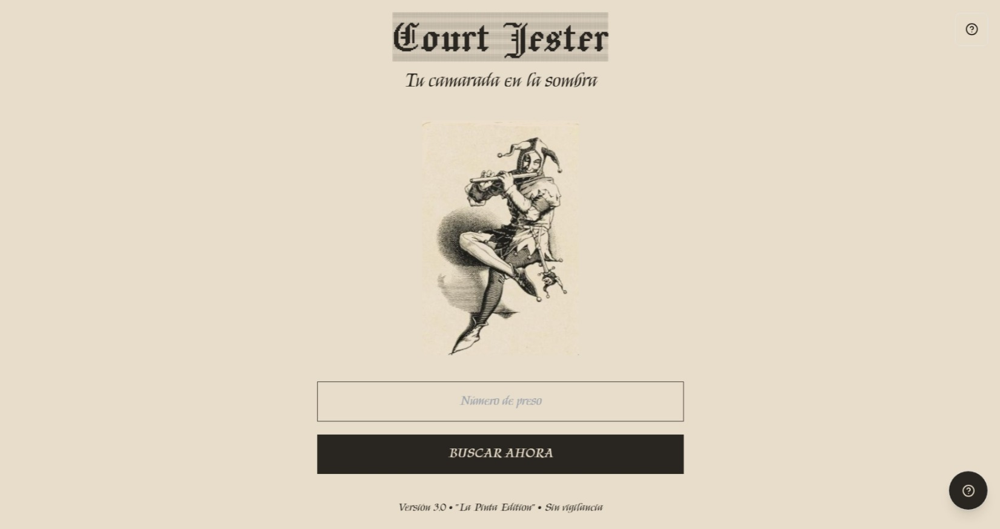

3. Dashboard

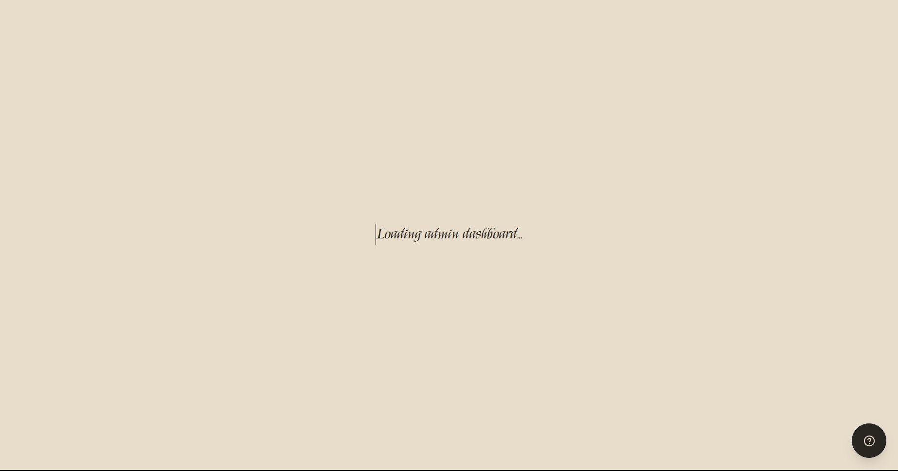

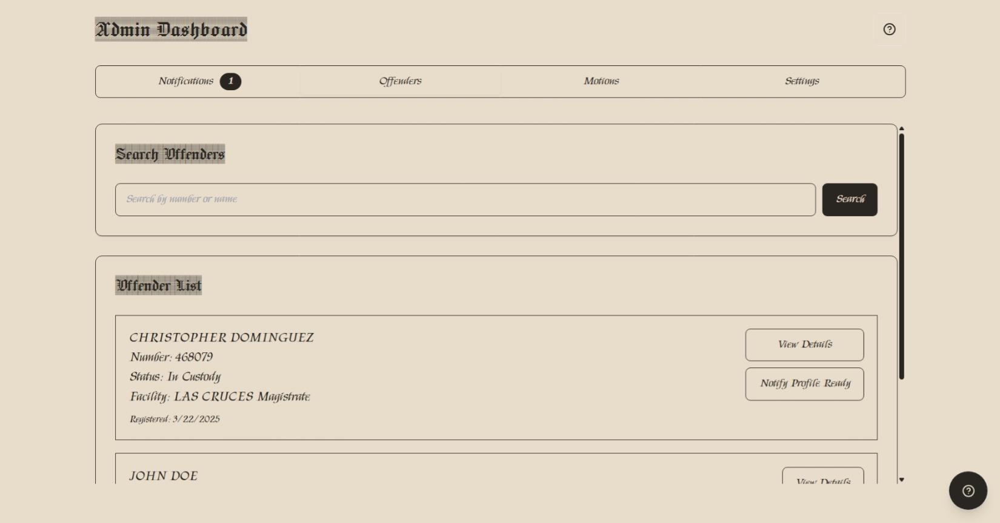 

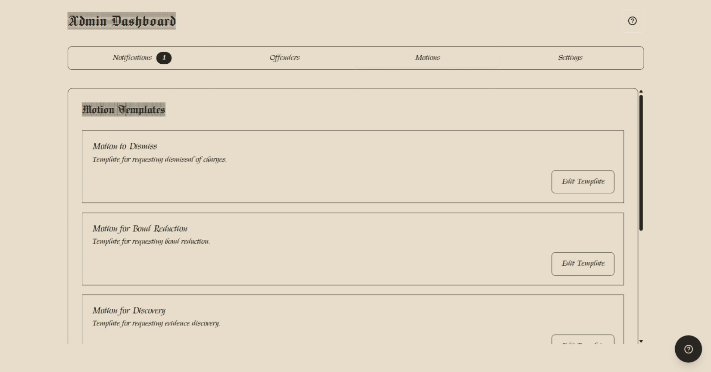 

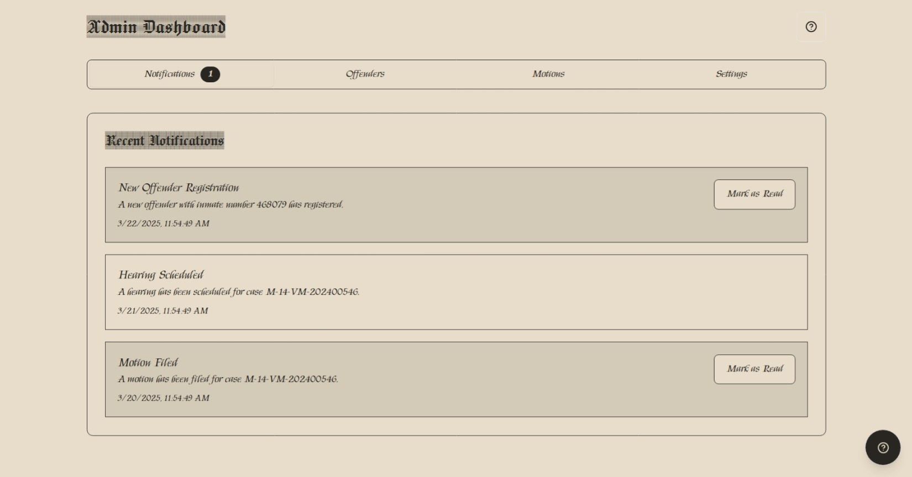 

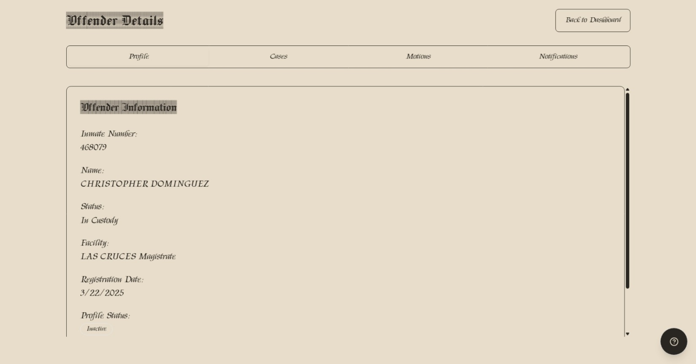 

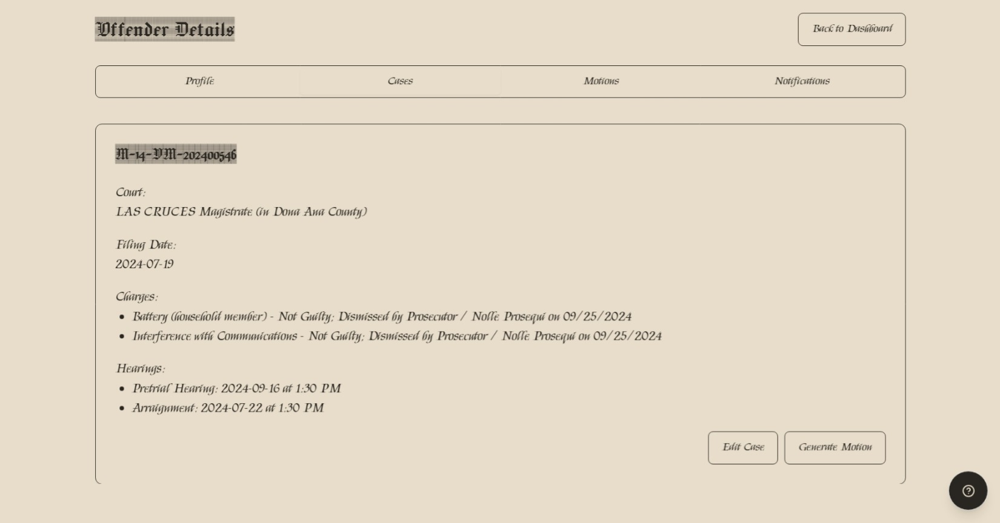 

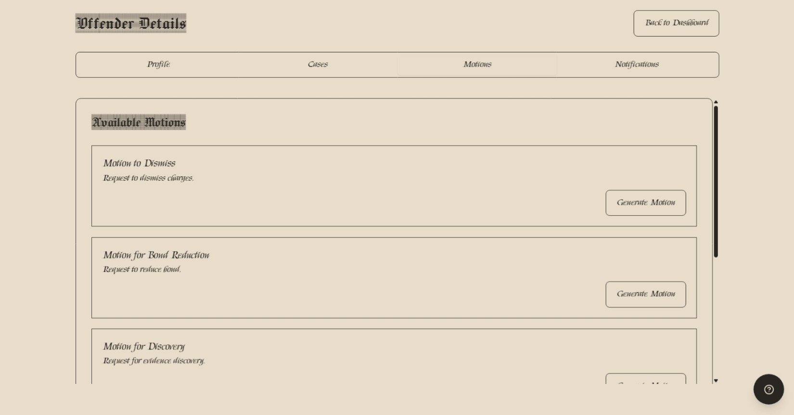 

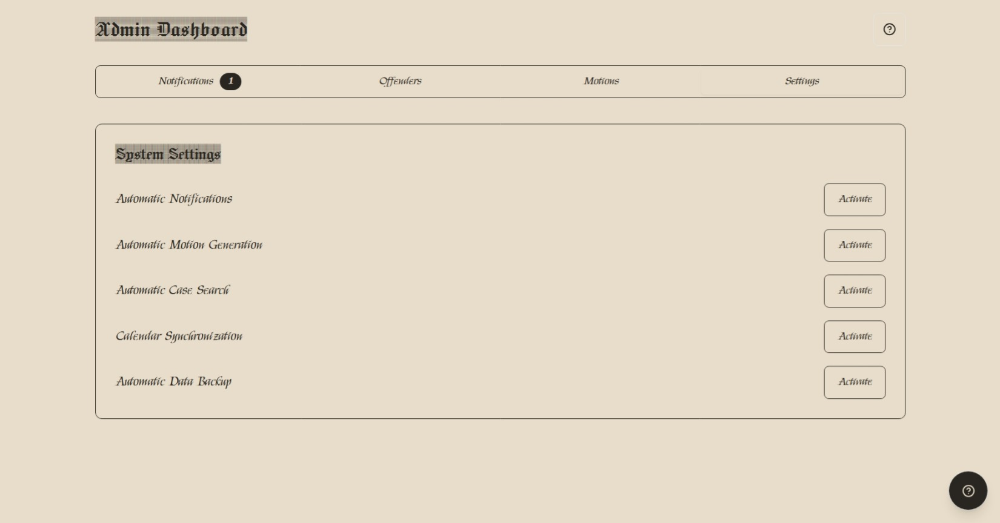

4. Confirmation 

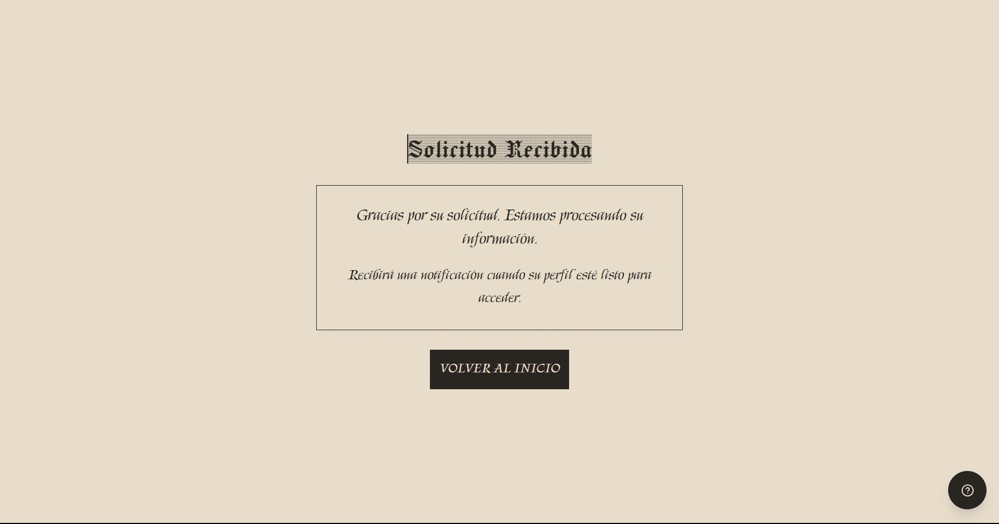

5. Profile

 

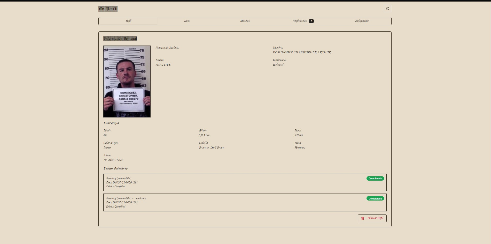
 
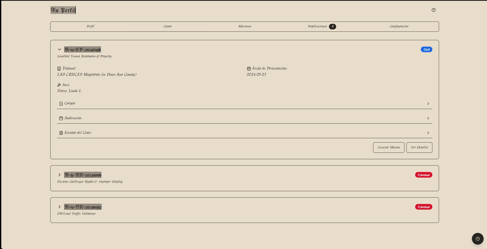

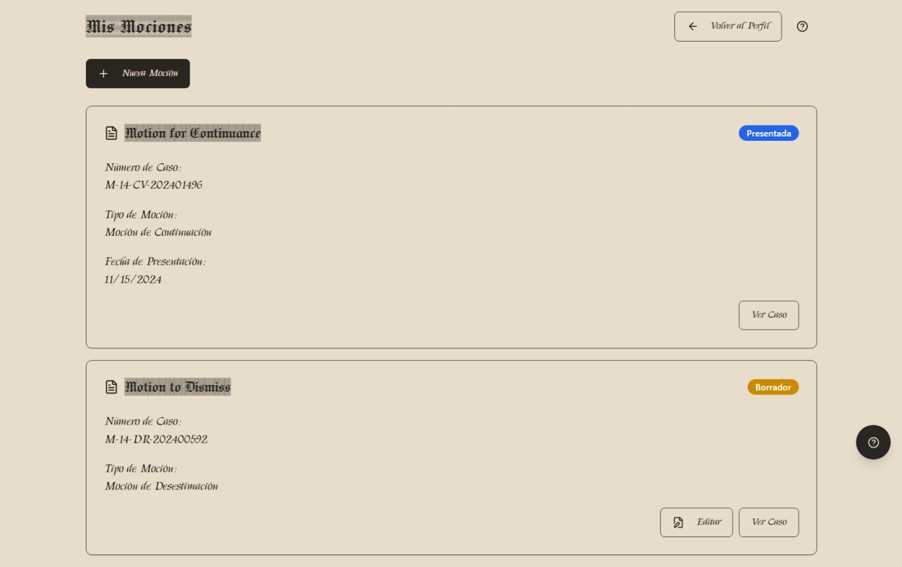 

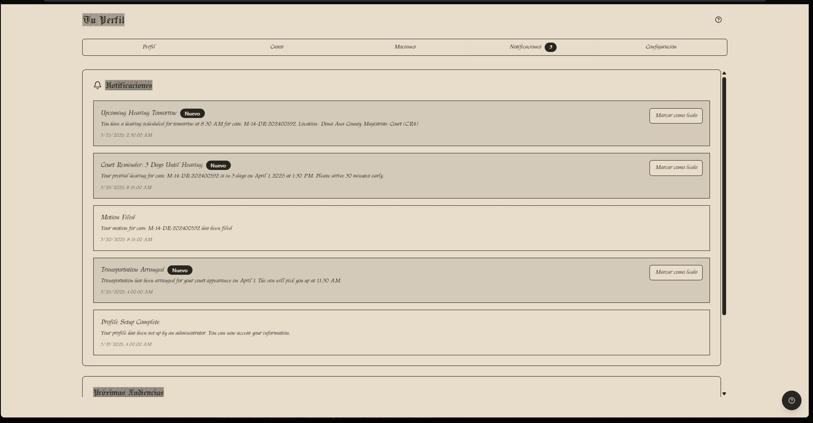 

6. Help

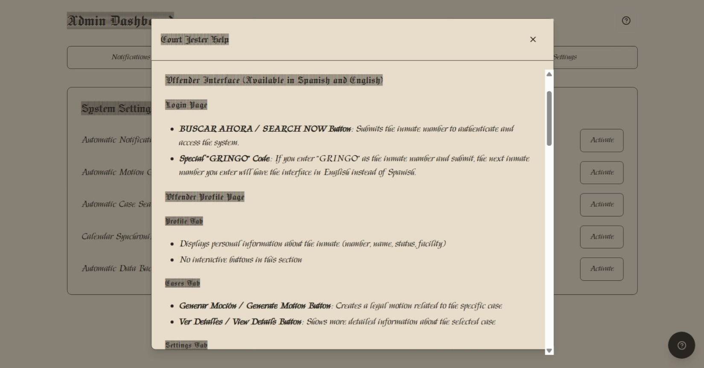

___

# Final Notes

This Developer Bible provides a rigorous, hierarchical breakdown of your project by page. Each module’s structure is clearly delineated, from types and interfaces, through API endpoints and CRUD operations, to UI components and styling. The provided industry-standard templates can be adapted for new endpoints and features. Use this document as a living guide for maintaining and extending the Court Jester project, ensuring consistency, clarity, and best practices throughout your development lifecycle.

Feel free to update sections as the project evolves, and refer back to this handbook for guidance on adding new features or troubleshooting existing modules.

___

_End of Developer Bible for Court Jester._