#


## Knowledge Documents

- stateArch.md
- srcArch.md
- serverArch.md
- componentsArch.md
- publicArch.md
- clientArch.md
- publicArch.md
- routesArch.md
- modelsArch.md
- scenesArch.md
- controllersArch.md


#### Context: analyze the included pdf and use the information to create a definitive design system for our MERN web app based on the concepts and terminology in the included image

## Task

Generate a comprehensive and fully featured design system using the markdown language and include tables, mermaid diagrams, hyper-designed text using headers, text effects, color, size, and so on

### Checklist: Use the source code in the files in your knowledge for the following

- Identify Design Elements: Cards, Drop Downs, Banners, Buttons, Avatar, Badges etc...

- Plan Core Components: Avatar, Badge, Banner, Button, Card, Carousel, Dropdown, Icon, Input Checkbox, Input Radio, Input Text, Input Switch, List, Loading Indicator, Modal, Tabs, Toast, Tooltip, Select, Textarea.

- Documentation: Design Language Vision, Design Principles, Tone of Voice, Terminology, Writing Guidelines, Brand Guidelines, Accessibility Guidelines, User Onboarding, Microcopy Guidelines.

**DO NOT GENERATE CODE THIS IS NOT A CODING TASK**

## Reference

Use the following as a reference for the type of content and style of your response:

###  Terminology:
- Component
- Component Library
- Design Language
- Governance
- Guidelines
- Pattern
- Pilot
- Token
- UI Kit
- Regional Requirements

###  Tooling:
- Design
- Design Editor
- Plugins
- Version Control
- Contribution Guidelines
- Development
- Component Catalog
- Documentation
- Code Style
- Unit Testing
- Accessibility Testing
- Semantic Versioning
- Release Strategy
- Commit Guidelines
- PR Templates
- Project Management
- Task Management
- Roadmap
- Milestones
- Ticketing
- Communications
- Community Meetings
- Communication Channel
- Open Hours
- FAQs
- Analytics
- Component Analytics
- Error Logging
- Tooling Analytics
- Service and Health Metrics

# Design System for MERN Web App
## Table of Contents
1. Identify Design Elements
2. Core Components
3. Documentation
4. Tooling
5. Project Management
6. Analytics
7. Mermaid Diagrams

## 1. Identify Design Elements
- Identify key design elements to be used across the application, ensuring consistency and reusability.

### Design Elements:
- Cards: Modular containers for displaying content.
- Drop Downs: Interactive elements for selecting options.
- Banners: Informational elements for notifications and alerts.
- Buttons: Interactive elements for triggering actions.
- Avatar: Visual representation of users.
- Badges: Indicators for status, counts, or notifications.
- Form Elements: Input fields, checkboxes, radio buttons, etc.

## 2. Core Components

Plan and define the core components to be included in the design system.

### Components:
Component | Description
----------|------------
Avatar | User profile image or icon.
Badge | Small count or status indicators.
Banner | Informational alert boxes.
Button | Clickable elements for actions.
Card | Content containers with varying layouts.
Carousel | Rotating banner or slideshow.
Dropdown | Select menu with options.
Icon | Small graphical elements.
Input | Form input elements (text, checkbox, radio).
List | Itemized lists with styling.
Loading Indicator | Visual indicator of loading state.
Modal | Popup dialogs for interactions.
Tabs | Tabbed navigation components.
Toast | Brief notification messages.
Tooltip | Hover-based informational boxes.
Select | Dropdown select menus.
Textarea | Multi-line text input fields.

## Documentation

Provide comprehensive documentation for the design system, ensuring all users understand the usage, principles, and guidelines.

### Design Language
- Vision: To create a consistent, scalable, and reusable set of UI components that enhance the user experience across all touchpoints.
- Design Principles: Simplicity, Consistency, Accessibility, Scalability.
- Tone of Voice: Professional, Clear, Concise.
### Writing Guidelines
- Terminology: Maintain consistent naming conventions across components and documentation.
- Brand Guidelines: Ensure all components align with the brand's visual identity and messaging.
- Accessibility Guidelines: Adhere to WCAG standards to make the application usable for all users.
- User Onboarding: Provide clear instructions and tutorials for new users.
- Microcopy Guidelines: Use concise, actionable, and user-friendly language.

## Tooling
Define the tools and processes for developing and maintaining the design system.

### Tools


Tool | Purpose
-----|--------
Design Editor | Tool for creating and editing design assets.
Plugins | Extensions for additional functionalities.
Version Control | Git for managing code versions and history.
Unit Testing | Ensuring component functionality through tests.
Accessibility Testing | Verifying accessibility compliance.
Semantic Versioning | Managing releases and version updates.
PR Templates | Standardized templates for pull requests.
Commit Guidelines | Consistent commit message conventions.
Project Management
Outline the processes and tools for managing the design system project effectively.

## Project Management

- Roadmap: Clear timeline and milestones for development.
- Milestones: Key progress markers.
- Ticketing: System for tracking tasks and issues.
- Communications: Regular updates and meetings.
- Community Meetings: Engage with users and stakeholders.
- FAQs: Common questions and their answers.

### Analytics

Implement analytics to measure the performance and usage of the design system.

Analytics Type | Description
---------------|------------
Component Analytics | Usage statistics and performance data.
Error Logging | Tracking and fixing errors in components.
Tooling Analytics | Performance metrics of development tools.
Service Metrics | Health and uptime of services.

### Mermaid Diagrams

Use mermaid diagrams to visually represent the structure and relationships within the design system.

Example Mermaid Diagram:

```mermaid
graph TD;
    A[Design System] --> B[Components];
    A --> C[Documentation];
    A --> D[Tooling];
    A --> E[Project Management];
    A --> F[Analytics];

    B --> G[Avatar];
    B --> H[Badge];
    B --> I[Banner];
    B --> J[Button];
    B --> K[Card];
    B --> L[Carousel];
    B --> M[Dropdown];
    B --> N[Icon];
    B --> O[Input];
    B --> P[List];
    B --> Q[Loading Indicator];
    B --> R[Modal];
    B --> S[Tabs];
    B --> T[Toast];
    B --> U[Tooltip];
    B --> V[Select];
    B --> W[Textarea];

    C --> X[Design Language];
    C --> Y[Writing Guidelines];
    C --> Z[Brand Guidelines];
    C --> AA[Accessibility Guidelines];

    D --> BB[Design Editor];
    D --> CC[Plugins];
    D --> DD[Version Control];
    D --> EE[Unit Testing];
    D --> FF[Accessibility Testing];
    D --> GG[Semantic Versioning];
    D --> HH[PR Templates];
    D --> II[Commit Guidelines];

    E --> JJ[Roadmap];
    E --> KK[Milestones];
    E --> LL[Ticketing];
    E --> MM[Communications];
    E --> NN[Community Meetings];
    E --> OO[FAQs];

    F --> PP[Component Analytics];
    F --> QQ[Error Logging];
    F --> RR[Tooling Analytics];
    F --> SS[Service Metrics];

```


# Implementation Checklist for Design System
### Initial Setup
 1. - [ ] Create a Repository: Set up a new repository for the design system.
 2. - [ ] Install Dependencies: Install necessary packages (e.g., React, Material-UI, etc.).
 3. - [ ] Set Up Folder Structure: Organize folders for components, styles, documentation, and tests.
### Identify Design Elements
 4. - [ ] Cards: Define reusable card components.
 5. - [ ] Drop Downs: Create dropdown menus with consistent styles.
 6. - [ ] Banners: Design banner components for notifications.
 7. - [ ] Buttons: Standardize button styles and variants.
 8. - [ ] Avatar: Develop avatar components for user profiles.
 9. - [ ] Badges: Implement badge components for statuses and notifications.
 10. - [ ] Form Elements: Standardize form input fields, checkboxes, and radio buttons.
### Core Components
4. - [ ] Plan and Develop Core Components
 11. - [ ] Avatar: Implement a reusable avatar component.
 12. - [ ] Badge: Develop badge components with various styles.
 13. - [ ] Banner: Create banner components for alerts and notifications.
 14. - [ ] Button: Design button components with multiple variants (e.g., primary, secondary).
 15. - [ ] Card: Implement card components for content display.
 16. - [ ] Carousel: Develop a carousel component for sliding banners.
 17. - [ ] Dropdown: Create dropdown components for selecting options.
 18. - [ ] Icon: Standardize icon components across the application.
 19. - [ ] Input: Develop input components (text, checkbox, radio).
 20. - [ ] List: Create styled list components.
 21. - [ ] Loading Indicator: Implement a loading indicator component.
 22. - [ ] Modal: Design modal components for dialogs.
 23. - [ ] Tabs: Develop tabbed navigation components.
 24. - [ ] Toast: Implement toast notification components.
 25. - [ ] Tooltip: Create tooltip components for additional information.
 26. - [ ] Select: Develop select menu components.
 27. - [ ] Textarea: Create textarea components for multi-line input.
### Documentation
6. - [ ] Develop Comprehensive Documentation
 28. - [ ] Design Language Vision: Document the design system's vision and goals.
 29. - [ ] Design Principles: Outline core design principles (simplicity, consistency, etc.).
 30. - [ ] Tone of Voice: Define the tone of voice for all written content.
 31. - [ ] Terminology: Maintain a glossary of terms used in the design system.
 32. - [ ] Writing Guidelines: Provide guidelines for writing UI text and documentation.
 33. - [ ] Brand Guidelines: Ensure components align with the brand’s visual identity.
 34. - [ ] Accessibility Guidelines: Document best practices for accessibility.
 35. - [ ] User Onboarding: Create onboarding documentation and tutorials.
 36. - [ ] Microcopy Guidelines: Define guidelines for concise and user-friendly microcopy.
### Tooling
8. - [ ] Set Up and Configure Tooling
 37. - [ ] Design Editor: Choose and configure a design editor (e.g., Figma, Sketch).
 38. - [ ] Plugins: Install necessary plugins for design tools.
 39. - [ ] Version Control: Set up Git for version control.
 40. - [ ] Unit Testing: Implement unit tests for components.
 41. - [ ] Accessibility Testing: Configure tools for accessibility testing.
 42. - [ ] Semantic Versioning: Adopt semantic versioning for releases.
 43. - [ ] PR Templates: Create pull request templates for consistent contributions.
 44. - [ ] Commit Guidelines: Establish commit message guidelines.
### Project Management
10. - [ ] Plan and Manage the Project
 45. - [ ] Roadmap: Develop a project roadmap with milestones.
 46. - [ ] Milestones: Define key milestones for the project.
 47. - [ ] Ticketing: Set up a ticketing system for tracking tasks and issues.
 48. - [ ] Communications: Establish regular communication channels (meetings, updates).
 49. - [ ] Community Meetings: Schedule community meetings for feedback and discussions.
 50. - [ ] FAQs: Compile frequently asked questions and answers.
### Analytics
12. - [ ] Implement Analytics and Monitoring
 51. - [ ] Component Analytics: Set up analytics to track component usage.
 52. - [ ] Error Logging: Implement error logging for components.
1. - [ ] Tooling Analytics: Monitor the performance of development tools.
1. - [ ] Service Metrics: Track service health and uptime metrics.
###  Mermaid Diagrams
1. - [ ] Create Visual Representations
1. - [ ] System Overview Diagram: Create a mermaid diagram for the system overview.
1. - [ ] Component Structure Diagram: Visualize the component structure.
1. - [ ] Project Workflow Diagram: Diagram the project workflow and processes.

#### Example Mermaid Diagram:


# Templates for Documentation Pages

## Component Documentation Template
### Table of Contents
1. Overview
2. Usage
3. Props
4. Examples
5. Styling
6. Accessibility
7. Best Practices


## 1. Overview
Provide a brief description of the component, its purpose, and where it fits in the design system.

#### Example:

> ### Button Component
>
> > ##### Overview
> > > - The Button component is a fundamental UI element used for triggering actions or events. It supports various styles and states to accommodate different use cases within the application.

---

## 2. Usage
Explain how to import and use the component within a project.

#### Example:

> ### Button Usage
> > To use the Button component, import it from the design system library and include it in your JSX.
> >
> >  ```jsx
> > import { Button } from 'your-design-system';
> >
> > const MyComponent = () => (
> >   <Button variant="primary" onClick={handleClick}>
> >     Click Me
> >   </Button>
> > );
> >  ```

---

## 3. Props
List and describe the props that the component accepts, including their types and default values.

#### Example:

> ### Button Props
> >
> > | Prop Name  | Type     | Default   | Description                                      |
|------------|----------|-----------|--------------------------------------------------|
| `variant`  | string   | 'default' | The style variant of the button (`primary`, `secondary`, `danger`). |
| `size`     | string   | 'medium'  | The size of the button (`small`, `medium`, `large`). |
| `disabled` | boolean  | `false`   | Whether the button is disabled.                  |
| `onClick`  | function | -         | Callback function to handle click events.        |

---

## 4. Examples
Provide example code snippets demonstrating common use cases of the component.

#### Example:
> ### Primary Button
> >```jsx
<Button variant="primary" onClick={handleClick}>
  Primary Button
</Button>
> >
> > ```
> >
> >  ### Secondary Button
> > > ```jsx
<Button variant="secondary" onClick={handleClick}>
  Secondary Button
</Button>
> > >
```
> > >
> > > ### Disabled Button
> > > > ```jsx
<Button variant="primary" disabled>
  Disabled Button
</Button>

> > > > ```

---

## 5. Styling
Explain how to customize the styling of the component, either through props or by overriding default styles.

#### Example:

> ### Button  Styling
> >
The Button component supports several style variants that can be applied via the `variant` prop. Additionally, custom styles can be applied by passing a `className` prop.
> >
> >  ### Using the `variant` prop
> > >```jsx
<Button variant="danger">
  Danger Button
</Button>
> > >```
> > >
> > >  ### Custom Styling
> > > > ```jsx
<Button className="my-custom-button">
  Custom Button
</Button>
> > > >
// CSS
.my-custom-button {
  background-color: purple;
  color: white;
}
> > > > ```

---

## 6. Accessibility
Provide guidelines and best practices for ensuring the component is accessible to all users.

#### Example:
>### Button Accessibility
>>To ensure the Button component is accessible:
>>
>>- Always provide a clear and descriptive `aria-label` if the button text does not convey its purpose.
>>- Avoid using only color to convey state (e.g., use icons or text in addition to color changes).
>>- Ensure the button has sufficient contrast against its background.
>>##### Example:
>>>```jsx
<Button aria-label="Close" variant="secondary">
  <CloseIcon />
</Button>
>>>```

---

## 7. Best Practices
Share tips and best practices for using the component effectively and consistently.

#### Example:
>### Button Best Practices
>>
>> - Use semantic HTML elements (e.g., `<button>`) for buttons to ensure proper behavior across browsers and assistive technologies.
>> - Group related buttons together for better user experience.
>> - Use descriptive text for button labels to improve readability and accessibility.
##### Example:
>>> ```jsx
<div className="button-group">
  <Button variant="primary" onClick={handleSave}>
    Save
  </Button>
  <Button variant="secondary" onClick={handleCancel}>
    Cancel
  </Button>
</div>
>>>```

---


