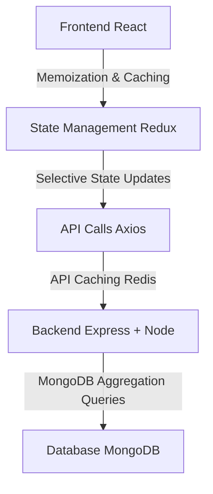

<div style="display: flex; justify-content: center; align-items: center;">


&nbsp;&nbsp;&nbsp;&nbsp;

# MERN Full Stack Web App

</div>

---

<div style="display: flex; justify-content: center; align-items: center">


> ##### **Project Synopsis: New Mexico Cannabis Retail Analytics**  
> The project involves a strategic rebuild of an app, focused on improving performance, scalability, and maintainability. Key changes include migrating to modern frameworks like Next.js and NestJS, optimizing state management with Recoil, and integrating Redis caching and serverless deployments for a more efficient, future-proof architecture.

</div>

## **Web App Summary**

### **MERN Full Stack Web App Developer:**

Your web application is a **MERN stack** project, leveraging **MongoDB**, **Express**, **React**, and **Node.js** to build a full-stack web app, with a special focus on retail analytics for the cannabis industry. Below is a technical breakdown of the architecture and requirements based on the provided documents:

### 1\. **Frontend (React + Redux + Material-UI)**

-   **React:** Core of the frontend, managing UI components, DOM manipulations, and interactions.
-   **Material-UI:** A design framework used to implement responsive, intuitive UI components.
-   **Redux:** Central state management library used for predictable state transitions across the app, ensuring consistent UI updates and user interactions.
-   **React-Router:** Manages navigation and URL synchronization between different views.
-   **Custom Components:** Custom-built components that encapsulate state and render UI efficiently based on state changes.

### 2\. **Backend (Node.js + Express)**

-   **Express:** A lightweight server framework, handles HTTP routing and request processing, including middleware for logging, authentication, and data parsing.
-   **RESTful APIs:** Provides data access and CRUD functionalities through clearly defined routes, such as GET, POST, PUT, DELETE.
-   **Middleware:** Used extensively for logging, error handling, JWT-based authentication, and parsing requests (JSON and form data).

### 3\. **Database Layer (MongoDB + Mongoose)**

-   **MongoDB:** NoSQL database used to store application data in a flexible schema, with high scalability.
-   **Mongoose ORM:** Simplifies interactions with MongoDB by defining schema-based models and ensuring data validation and integrity.

### 4\. **Authentication**

-   **JWT (JSON Web Tokens):** Authentication mechanism for securing API routes and managing user sessions. JWT tokens are signed on login and validated for secure access to protected routes.

### 5\. **Retail Analytics Features**

-   **Sales Data Visualization:** Implements Nivo for dynamic time-series charts to represent sales trends over time.
-   **Menu Comparison Engine:** Allows users to compare cannabis product offerings and pricing across different dispensaries.
-   **Market Share Analysis:** Maps (using Mapbox) and pie charts to show dispensary market share by zip code or region, utilizing geographic data for accurate visualizations.

### 6\. **Security and Scalability**

-   **Modular Architecture:** Follows ES6 module conventions for imports/exports to ensure maintainable, scalable code.
-   **JWT Authentication:** Secure authentication with token-based sessions that ensure only authenticated users can access sensitive routes.
-   **Middleware Usage:** Applies middleware for rate limiting, request validation, and protection against common web vulnerabilities like XSS and CSRF.

### 7\. **Data Handling and Aggregation**

-   **MongoDB Aggregation Framework:** Used for efficiently querying and transforming data, particularly for complex reports like sales and inventory analysis.
-   **Real-Time Data Updates:** Use of WebSocket connections to handle live updates in the sales dashboards for real-time insights.

### 8\. **Development and Deployment**

-   **Webpack:** Bundles the frontend assets and transpiles JSX/ES6+ code to browser-compatible JavaScript.
-   **ESLint:** Enforces code quality and consistency across the project.
-   **Docker:** Potential for containerization, ensuring consistent environments for deployment.

___

## Key Functional Modules:

1.  **Controllers Layer:**
    
    -   Handles logic for the routes, interacting with MongoDB through Mongoose models and defining business logic.
    -   Error handling middleware ensures smooth response flow.
    -   Supports CRUD operations for sales, inventory, and user authentication.
2.  **Routes Layer:**
    
    -   Implements Express routes for the API endpoints (e.g., `/api/products`, `/api/sales`, `/api/users`).
    -   Segregates public routes (open to all) and protected routes (JWT-secured).
3.  **State Management:**
    
    -   Redux is integrated to handle state across components, ensuring efficient synchronization between UI changes and backend data.
    -   The state architecture follows a clean pattern with action creators, reducers, and selectors, ensuring predictable state transitions.

### **Main Application Components:**

1.  **Dashboard UI:**
    
    -   Displays real-time retail analytics including sales data and product comparison.
    -   Utilizes Material-UI to maintain a sleek, consistent design.
2.  **Sales Analytics Module:**
    
    -   Nivo-based time series stacked line charts for sales trends.
    -   Supports filtering by date range, product type, and location.
3.  **Market Share Module:**
    
    -   GIS-based Mapbox integration to visualize market share by region.
    -   Pie charts display data aggregated by zip code.
4.  **Admin Panel:**
    
    -   Manages products, prices, and inventory through CRUD operations.

### **Deployment Requirements:**

-   **Node.js:** Preferably run within a Linux server, but Vagrant or Docker for managing local environments.
-   **MongoDB Atlas:** Cloud-hosted MongoDB for database.
-   **Frontend:** Built with Webpack, which is optimized for production with minification and chunking.
-   **Backend APIs:** Exposed over HTTPS with JWT-secured endpoints for client-server communication.

---

## Tech Stack Relevance and Suitability

#### MERN Stack Overview:

Your current application is built on the **MERN stack**, utilizing:

-   **MongoDB** for database management
-   **Express** as a backend framework
-   **React** for frontend components
-   **Node.js** for server-side JavaScript execution

This stack remains relevant and widely used in modern web development. Its strengths include:

1.  **Full-stack JavaScript:** Ensures consistency across the stack, enabling developers to work seamlessly between frontend and backend.
2.  **Scalability:** MongoDB is known for its flexibility with NoSQL schema design, making it a great choice for retail analytics where datasets can vary.
3.  **Vast ecosystem:** Node.js and React have large ecosystems with frequent updates, ensuring access to the latest tools, libraries, and best practices.

However, there are certain **improvements and modern alternatives** to consider based on the evolution of web technologies and the specific needs of your app:

| Current Tech | Alternatives | Reason to Consider |
| --- | --- | --- |
| **MongoDB** | **PostgreSQL** | PostgreSQL offers better ACID compliance, and advanced query capabilities, which may be beneficial for complex analytics queries. |
| **Express.js** | **NestJS** | NestJS offers better TypeScript integration, and a more modular architecture out of the box, suitable for large applications. |
| **React** | **Next.js** | Next.js provides server-side rendering and static generation, improving SEO and performance for dynamic content. |
| **Redux** | **Recoil / Zustand** | Newer state management libraries like Recoil or Zustand provide simpler APIs and better performance for smaller apps or specific use cases. |

### Performance Optimization Opportunities

Several parts of your application can be optimized for performance:

#### 1\. **Database Optimization**

-   **MongoDB Aggregation Queries:** The MongoDB aggregation framework can be leveraged more extensively to optimize complex queries like those used in sales reports, reducing the load on the Node.js server .
-   **Indexing:** Ensure proper indexing of frequently queried fields like `product_id`, `zip_code`, and `sales_data` to speed up data retrieval .

#### 2\. **State Management Optimization (Redux)**

-   **Avoiding Overfetching:** In the `salesSegment` and `marketShare` components, Redux can sometimes trigger unnecessary re-renders or data refetches. This can be optimized by:
    -   **Memoization:** Using `useMemo` and `useCallback` to avoid re-calculating or re-fetching data unnecessarily .
    -   **Selective State Updates:** Move towards more granular, component-level state management to reduce the number of global state changes that trigger re-renders.

#### 3\. **API Caching & Throttling**

-   **Caching Responses:** For APIs that return static data (e.g., product catalogs or competitive pricing), you could implement server-side caching (Redis) or HTTP caching to reduce load on the server .
-   **Rate Limiting:** To protect your API and optimize performance, implementing rate limiting middleware (such as `express-rate-limit`) can help prevent server overload during high-traffic periods.

### Code Misconfigurations and Issues

#### 1\. **Component Overloading**

-   The `MarketShare` component, along with its associated Nivo Pie Charts, is heavily overloaded with responsibilities, including fetching data, formatting it, and rendering complex visualizations. This violates the **Single Responsibility Principle** (SRP), making the component harder to test and maintain. Refactoring the component into smaller, more focused subcomponents would improve maintainability .

#### 2\. **Asynchronous Operations**

-   **Unoptimized API Calls:** In multiple places (e.g., `useGetSalesQuery` in `reports/index.jsx`), there are redundant API calls being made when switching between views. Implementing a centralized cache or intelligent re-fetching based on component lifecycle (i.e., only fetch when data is stale) would reduce network load and improve responsiveness .

#### 3\. **Concurrency Handling**

-   When dealing with asynchronous data fetching, using promises with chained `.then()` calls (instead of `async/await` syntax) increases the risk of mishandling errors or race conditions, particularly in areas with nested promises .

### Diagram of Suggested Optimizations

Here’s a high-level diagram suggesting some optimizations for better performance:



### Recommendations for Modernizing the Stack

If you were to modernize or rewrite the app, here are some additional **JavaScript-based stacks** to consider:

1.  **JAMstack (JavaScript, APIs, Markup)**:
    
    -   **Frontend:** Move to **Next.js** for better performance with static generation.
    -   **Backend:** Use **Netlify Functions** or **AWS Lambda** for serverless functions, reducing server management overhead.
    -   **Database:** Consider **FaunaDB** or **Supabase** for a more seamless integration with serverless and real-time data requirements.
2.  **TypeScript Integration**:
    
    -   Moving the entire project to **TypeScript** would improve type safety, especially in complex logic like competitive product analysis or sales data aggregation. NestJS pairs exceptionally well with TypeScript .
3.  **Serverless Stack (SST)**:
    
    -   **SST** is designed for full-stack serverless apps, allowing you to build using frameworks like React while deploying your backend as serverless functions.

### Conclusion

While the current **MERN stack** remains relevant and capable, evolving web standards and tools present opportunities for optimization and modernization. By adopting better state management, database indexing, and API caching strategies, you can significantly enhance performance and maintainability. Transitioning to **Next.js**, introducing **serverless functions**, and using newer state management libraries would allow for greater scalability and performance in future iterations of the app.

---

## Comprehensive Plan to Rebuild and Optimize the Web Application

This plan outlines a detailed approach for optimizing, modernizing, and rebuilding the current **MERN stack** application. The focus will be on ensuring that the latest practices and technologies are adopted, while addressing identified weaknesses from the original stack. It also proposes effective deployment strategies, leveraging modern tools such as **GitHub** and **VS Code**.

### Rebuild Overview:

The primary focus of the rebuild will center on:

-   **Enhancing state management** by adopting more modern libraries (such as **Recoil** or **Zustand**) over Redux for better performance and flexibility.
-   **Optimizing the database** with efficient queries and indexes.
-   **Improving deployment** with a serverless architecture (using **Vercel** or **AWS Lambda**) for scalable and cost-effective management.
-   **Enhancing performance** through better use of memoization, caching strategies, and a **Next.js** migration for the frontend.

### **Module-Level Optimization and Migration Plan**

#### 1\. **Frontend (React + Next.js Migration)**

-   **Current Structure**:
    
    -   The application uses **React** with **Redux** for state management and **Material-UI** for component styling.
    -   Extensive use of **Nivo** for charts (e.g., time-series for sales data) and **Mapbox** for geolocation.
-   **Optimization**:
    
    -   **Migrate to Next.js** for server-side rendering (SSR) and static site generation (SSG) to improve performance, SEO, and initial load times.
    -   **Replace Redux with Recoil** for simpler and more granular state management, reducing overfetching issues. Recoil has a more intuitive API and built-in concurrency handling that’s suited for complex applications like this one.
    -   **Improve API handling** by caching common API requests to avoid redundant calls using **SWR** (stale-while-revalidate) and **React Query** for better server-state synchronization.
    
    **Checklist**:
    
    -   [ ]  Replace `react-router-dom` with Next.js native routing.
    -   [ ]  Refactor state management from Redux to Recoil.
    -   [ ]  Implement SSR for dynamic product and market share pages.
    -   [ ]  Optimize Nivo charts by memoizing expensive operations.
    -   [ ]  Migrate and restructure React components to Next.js pages.

#### 2\. **Backend (Node.js + NestJS Migration)**

-   **Current Structure**:
    
    -   **Express** framework is used for routing and handling API requests.
    -   **MongoDB** for database operations, accessed via **Mongoose**.
-   **Optimization**:
    
    -   **Migrate to NestJS** for a more modular backend structure with built-in TypeScript support, which would improve scalability, modularity, and ease of testing.
    -   **Improve MongoDB queries** by using **aggregation pipelines** and ensuring proper indexing for high-performance analytics.
    -   **Add caching layer (Redis)** for frequently accessed data (e.g., popular products, market share data), which reduces load times on the backend.
    -   **Rate Limiting** to protect the API with middleware like `express-rate-limit` or **NestJS**'s own built-in guards.
    
    **Checklist**:
    
    -   [ ]  Migrate from Express to NestJS, implementing service modules for products, reports, and user management.
    -   [ ]  Refactor database calls to use MongoDB's aggregation pipelines and ensure indexing for high-frequency fields.
    -   [ ]  Add Redis caching for common API requests.
    -   [ ]  Implement JWT-based authentication in NestJS with role-based guards.

#### 3\. **Database Layer (MongoDB)**

-   **Current Structure**:
    
    -   The application uses **MongoDB** with **Mongoose** for schema definitions and data handling.
-   **Optimization**:
    
    -   Ensure proper **indexing** for frequent queries, especially in the **salesSegment** and **marketShare** modules to handle large datasets efficiently.
    -   Use **MongoDB Atlas** for automatic backups, scalability, and easy management.
    
    **Checklist**:
    
    -   [ ]  Implement proper indexing for collections such as `product_id`, `zip_code`, and `sales_data`.
    -   [ ]  Optimize MongoDB queries using aggregation pipelines.
    -   [ ]  Enable automatic scaling and backups on MongoDB Atlas.

#### 4\. **State Management (Redux to Recoil)**

-   **Current Structure**:
    
    -   Redux handles state, but overfetching and unnecessary renders are causing performance issues.
-   **Optimization**:
    
    -   Migrate to **Recoil**, which offers an easier API for managing complex state without the boilerplate of Redux.
    -   Implement **selector functions** for state dependencies to reduce redundant state updates and improve component re-render efficiency.
    
    **Checklist**:
    
    -   [ ]  Remove Redux and implement Recoil atoms and selectors.
    -   [ ]  Optimize components with `useMemo` and `useCallback` to prevent unnecessary re-renders.
    -   [ ]  Implement context-based state management where global state is not necessary.

### **Deployment and Build Optimization**

#### 1\. **Deployment Strategy**

-   **Current Deployment**:
    
    -   The application is built using Webpack and deployed manually to a server.
-   **Optimization**:
    
    -   **Move to Serverless** deployment on **Vercel** for frontend (Next.js) and **AWS Lambda** for backend (NestJS APIs), reducing infrastructure management overhead and costs.
    -   Set up **CI/CD pipelines with GitHub Actions** for automatic builds, tests, and deployments on every push.
    -   Utilize **Docker** for containerization, ensuring consistent environments for local development and production.
    
    **Checklist**:
    
    -   [ ]  Deploy frontend on Vercel using Next.js (serverless deployment).
    -   [ ]  Deploy backend API on AWS Lambda using Serverless Framework.
    -   [ ]  Set up CI/CD with GitHub Actions for automatic deployments and testing.
    -   [ ]  Implement Docker for containerization and use it in local development.

### **Improved DevOps and Code Quality**

#### 1\. **VS Code + GitHub Integration**

-   **Current Setup**:
    
    -   Basic setup without integrated DevOps and collaboration tools.
-   **Optimization**:
    
    -   **Integrate GitHub Projects** for effective sprint planning and tracking tasks with issues and pull requests.
    -   Use **VS Code Extensions** for better collaboration:
        -   **GitHub Copilot** for automated code suggestions.
        -   **Prettier** and **ESLint** for consistent code formatting and linting.
    -   Set up **branch protection rules** in GitHub to prevent direct commits to main branches without code reviews.
    
    **Checklist**:
    
    -   [ ]  Set up GitHub Projects for task management.
    -   [ ]  Install and configure Prettier, ESLint, and other relevant VS Code extensions.
    -   [ ]  Configure GitHub branch protection and review workflows.

### **Project Timeline**

| Task | Duration | Start Date | End Date |
| --- | --- | --- | --- |
| Next.js Frontend Migration | 2 weeks | Sept 26 | Oct 9 |
| NestJS Backend Migration | 3 weeks | Oct 10 | Oct 31 |
| Database Optimization (MongoDB) | 1 week | Nov 1 | Nov 7 |
| State Management Refactor (Recoil) | 1 week | Nov 8 | Nov 14 |
| Docker Integration | 3 days | Nov 15 | Nov 17 |
| CI/CD Setup with GitHub Actions | 2 days | Nov 18 | Nov 19 |
| Vercel + AWS Lambda Deployment | 4 days | Nov 20 | Nov 23 |

### **Todo List for Developers**

1.  **Frontend Migration**:
    
    -   [ ]  Set up Next.js project.
    -   [ ]  Migrate existing React components into Next.js pages.
    -   [ ]  Implement SSR and SSG.
2.  **Backend Refactor**:
    
    -   [ ]  Set up NestJS for backend.
    -   [ ]  Refactor Express routes into NestJS controllers.
3.  **State Management**:
    
    -   [ ]  Implement Recoil for state management.
    -   [ ]  Refactor existing Redux actions to Recoil atoms.
4.  **Database**:
    
    -   [ ]  Create MongoDB aggregation queries for sales data.
    -   [ ]  Ensure proper indexing in MongoDB.
5.  **CI/CD**:
    
    -   [ ]  Set up GitHub Actions workflow for automated deployments.
    -   [ ]  Configure Vercel for automatic frontend deployments.


---

## Directory Tree of the Rebuilt Application

Below is the new proposed directory structure of your application after applying all the optimizations and rebuild steps mentioned earlier. The structure reflects the migration to **Next.js**, **NestJS**, the introduction of **Recoil** for state management, and better organization of backend services with **Redis caching** and **MongoDB optimizations**.

```markdowm
my-app/
├── backend/
│   ├── src/
│   │   ├── app.module.ts
│   │   ├── controllers/
│   │   │   ├── products.controller.ts
│   │   │   ├── sales.controller.ts
│   │   │   └── users.controller.ts
│   │   ├── services/
│   │   │   ├── products.service.ts
│   │   │   ├── sales.service.ts
│   │   │   └── users.service.ts
│   │   ├── middlewares/
│   │   │   ├── auth.middleware.ts
│   │   │   └── rate-limiter.middleware.ts
│   │   ├── dto/
│   │   │   ├── product.dto.ts
│   │   │   ├── sales.dto.ts
│   │   │   └── user.dto.ts
│   │   ├── entities/
│   │   │   ├── product.entity.ts
│   │   │   └── user.entity.ts
│   │   ├── modules/
│   │   │   ├── products.module.ts
│   │   │   ├── sales.module.ts
│   │   │   └── users.module.ts
│   │   ├── database/
│   │   │   ├── database.module.ts
│   │   │   ├── mongoose.service.ts
│   │   │   └── redis.service.ts
│   └── package.json
├── frontend/
│   ├── pages/
│   │   ├── index.tsx
│   │   ├── products/
│   │   │   ├── [id].tsx
│   │   │   └── compare.tsx
│   │   ├── sales/
│   │   │   ├── index.tsx
│   │   │   └── trends.tsx
│   ├── components/
│   │   ├── Header.tsx
│   │   ├── Footer.tsx
│   │   ├── ProductCard.tsx
│   │   ├── SalesChart.tsx
│   ├── recoil/
│   │   ├── atoms/
│   │   │   ├── productAtom.ts
│   │   │   ├── salesAtom.ts
│   │   └── selectors/
│   │       ├── productSelector.ts
│   │       └── salesSelector.ts
│   ├── styles/
│   │   ├── globals.css
│   │   └── product.module.css
│   └── package.json
├── .dockerignore
├── Dockerfile
├── docker-compose.yml
├── tsconfig.json
└── README.md
```


### **Module Breakdown and Explanation of Changes**

#### **Backend Directory Structure**

-   **`/src/`**:
    -   **app.module.ts**: The main application module that imports all feature modules (e.g., products, sales, users). This follows the modular design encouraged by **NestJS**, making the backend code more maintainable and scalable.
        
    -   **controllers/**: The new **NestJS controllers** replace Express routes and handle incoming requests. For example:
        
        -   `products.controller.ts`: Handles product-related endpoints like `/products`, `/products/:id`, and comparison queries.
        -   `sales.controller.ts`: Handles endpoints like `/sales` and provides trend reports and data analysis.
        -   `users.controller.ts`: Manages user authentication, registration, and roles.
    -   **services/**: The business logic for each module is extracted into service files. For example:
        
        -   `products.service.ts`: Handles interactions with MongoDB through Mongoose for CRUD operations on products.
        -   `sales.service.ts`: Responsible for sales analytics using **MongoDB aggregation pipelines** and **Redis caching**.
    -   **middlewares/**: The middlewares directory contains important logic like:
        
        -   `auth.middleware.ts`: Handles JWT-based authentication.
        -   `rate-limiter.middleware.ts`: Implements rate limiting for protecting APIs from abuse using libraries like `express-rate-limit` or NestJS's equivalent.
    -   **dto/**: Data Transfer Objects (DTOs) are used to define the structure and validation rules for data coming into the APIs:
        
        -   `product.dto.ts`: Ensures that incoming product data (e.g., during creation) meets the expected schema.
        -   `sales.dto.ts`: Used for validating the input of sales analytics requests (e.g., date ranges, product filters).
    -   **entities/**: Contains the schema for MongoDB documents using **Mongoose models**:
        
        -   `product.entity.ts`: Defines the schema for the product document.
        -   `user.entity.ts`: Defines the schema for user management and authentication, using roles and permission levels.
    -   **modules/**: These are the NestJS feature modules, which logically group the application into separate concerns (products, sales, and users).
        
    -   **database/**:
        
        -   `mongoose.service.ts`: Handles the configuration of Mongoose, including the connection to **MongoDB Atlas**.
        -   `redis.service.ts`: Sets up the Redis caching layer to store frequently accessed API responses for improved performance.

#### **Frontend Directory Structure**

-   **`/pages/`**: Migrated to **Next.js** pages with the following new structure:
    
    -   `index.tsx`: The landing page.
    -   `products/`: A folder containing dynamic product-related pages:
        -   `[id].tsx`: The product detail page, taking advantage of **Next.js dynamic routing**.
        -   `compare.tsx`: A comparison page that compares prices and details across different products.
    -   `sales/`: A folder containing sales-related pages:
        -   `index.tsx`: The sales dashboard that provides overall sales data visualization.
        -   `trends.tsx`: A dedicated page for viewing sales trends over time.
-   **`/components/`**: The reusable UI components of the application:
    
    -   `ProductCard.tsx`: Displays product information (used in product listings and comparisons).
    -   `SalesChart.tsx`: Uses Nivo to display sales trends, and now optimized with **useMemo** for reducing expensive re-renders.
-   **`/recoil/`**: The new **state management layer**:
    
    -   `atoms/`: Contains the **Recoil atoms**, which store global state:
        -   `productAtom.ts`: Stores product-related state.
        -   `salesAtom.ts`: Stores sales data.
    -   `selectors/`: Contains **selectors** that derive state and handle asynchronous data fetching:
        -   `productSelector.ts`: Handles derived state for product details and comparison data.
        -   `salesSelector.ts`: Manages data fetching and transformations for sales analytics.
-   **`/styles/`**: Modular CSS for styling the application, adhering to **Next.js's CSS module conventions** for scoped styling.
    
### **Explanation of Changes per Module**

#### 1\. **Backend (NestJS)**:

-   **Improved Structure**: Migrating from Express to NestJS introduces a more modular and maintainable architecture, allowing the application to scale and improve developer productivity.
-   **Service Layer**: Splitting business logic into a dedicated service layer ensures the controller remains lightweight and easy to manage.
-   **Redis Caching**: Introducing Redis for caching frequently accessed API responses (e.g., popular product comparisons and sales data) reduces database load and improves response times.
-   **Rate Limiting and JWT**: Better API protection using rate limiting and role-based JWT authentication ensures security without significant overhead.

#### 2\. **Frontend (Next.js)**:

-   **SSR and SSG**: Migrating to Next.js allows server-side rendering and static generation for pages like product details and comparison, leading to faster page load times and better SEO performance.
-   **Dynamic Routing**: Next.js simplifies dynamic routing for products and sales reports, making the application easier to extend.
-   **State Management (Recoil)**: Replacing Redux with Recoil simplifies global state management, reducing the amount of boilerplate code and improving the application's responsiveness. Selectors and atoms provide granular control over state and data fetching.

#### 3\. **Database Layer (MongoDB)**:

-   **MongoDB Optimizations**: Adding **aggregation pipelines** and ensuring proper indexing speeds up complex sales and product queries.
-   **Automatic Scaling with MongoDB Atlas**: Utilizing MongoDB Atlas's built-in auto-scaling ensures the application can handle increased load without manual intervention.

#### 4\. **DevOps**:

-   **CI/CD**: Implementing CI/CD with GitHub Actions automates testing and deployment, reducing manual work and ensuring smooth production deployments.
-   **Docker**: Containerization with Docker ensures consistency across development, testing, and production environments.

### Conclusion and Next Steps

This directory structure and module refactoring provide a solid foundation for the app's rebuild. The use of **Next.js**, **NestJS**, and **Recoil** combined with **Redis caching** and optimized MongoDB queries ensures improved performance, scalability, and maintainability.


