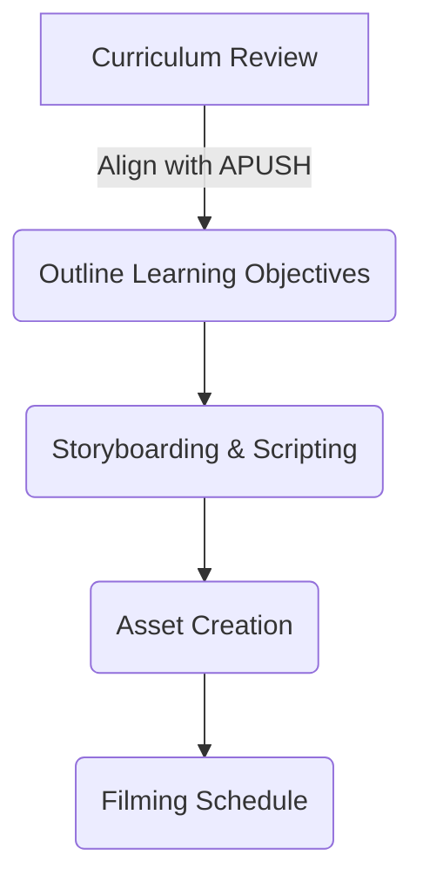
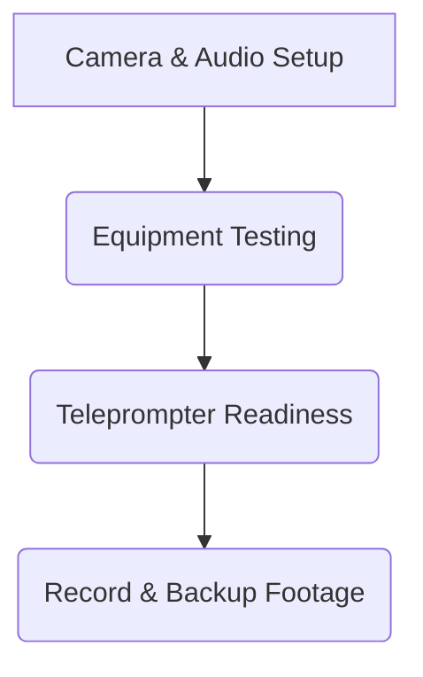
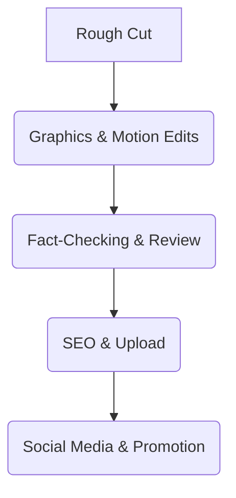
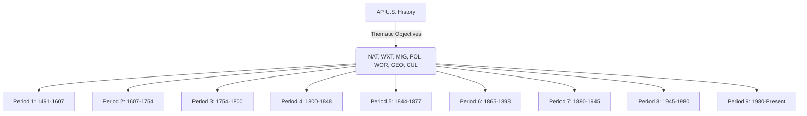
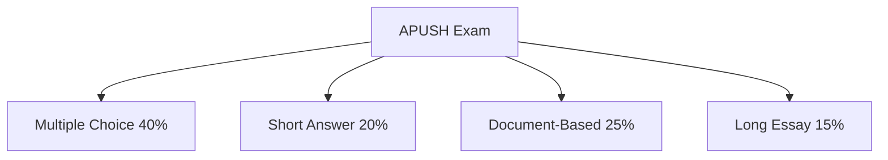
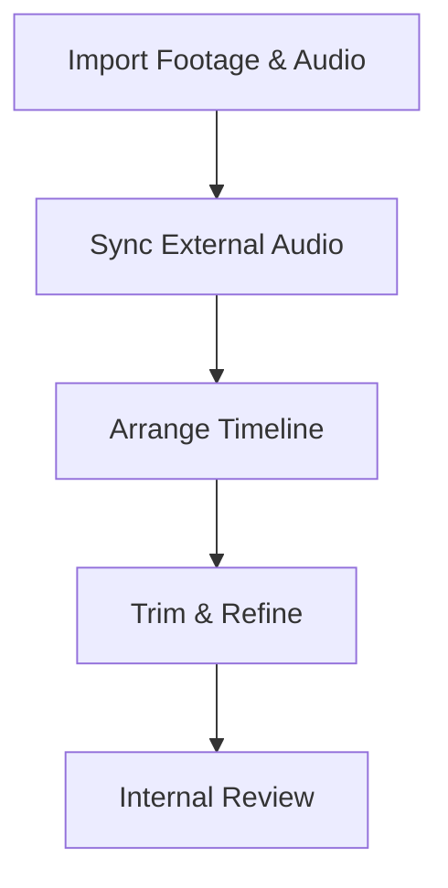
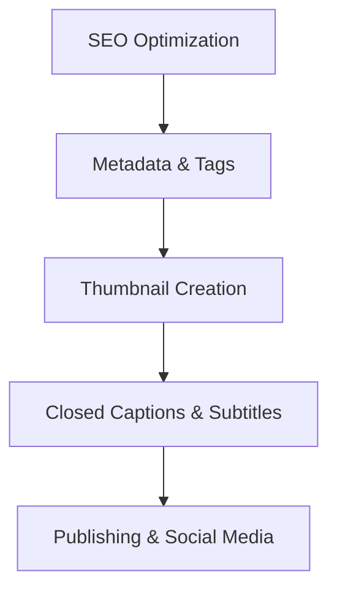

**Comprehensive Business Plan: Branded U.S. High School History Video Series**

---
# Silas: use each of these ## headings as the top level file content
---

## **Executive Summary**

### **Project Name: History Unlocked**  
*A Comprehensive and Engaging Video Series for High School U.S. History*  

**Creators:** Ivan Roman & Silas Roman  
**Format:** Video Series for YouTube & Educational Licensing  
**Target Audience:** High School Students, Teachers, School Districts, Government Entities  
**USP:** High-quality, engaging, curriculum-aligned U.S. history content, produced with limited resources but expert storytelling and branding.  

---

## **I. Market Research & Curriculum Standards**

### **Most Widely Adopted U.S. History Curriculum**
Research from the National Council for Social Studies (NCSS) and state education standards reveals that most high schools follow:
- **Advanced Placement (AP) U.S. History (APUSH)** – College Board-approved curriculum.
- **Common Core-aligned state history curricula** – Adheres to National History Standards.
- **State-specific history standards** – Customized for each state’s educational requirements.

### **Key Themes in Standardized U.S. History Curricula**
1. **Pre-Colonial & Colonial America (1491-1763)**
2. **Revolution & the New Nation (1763-1815)**
3. **Expansion & Reform (1800-1860)**
4. **Civil War & Reconstruction (1860-1877)**
5. **Industrialization & Urbanization (1870-1900)**
6. **Progressivism & Imperialism (1890-1920)**
7. **The Great Depression & WWII (1920-1945)**
8. **Cold War America (1945-1989)**
9. **Modern America & Globalization (1989-Present)**

---

## **II. Branding & Production Strategy**

### **Brand Identity**
- **Series Name:** *History Unlocked*  
- **Tagline:** *Unlocking the Past, Shaping the Future.*  
- **Visual Identity:** Strong contrast, clean fonts, historical textures (parchment, typewriter text), and a bold, yet friendly color palette.
- **Tone & Style:** Engaging, informative, and conversational—like *CrashCourse* but uniquely narrative-driven with a documentary-meets-vlog aesthetic.

### **YouTube Channel Structure**
- **Playlists by Era**: Organize videos by curriculum-aligned time periods.
- **Shorts & TikTok Clips**: Bite-sized historical facts to drive engagement.
- **Interactive Polls & Q&A Sessions**: Encourage audience participation and discussions.
- **Community Engagement**: Patreon, Discord server for student discussions, live Q&A streams.

### **Video Formatting & SOPs**
- **Video Length:** 8-12 minutes per episode.
- **Production Workflow:**
  - **Pre-production:** Research, scripting, visual planning, set design.
  - **Production:** Minimalist but dynamic—green screen, b-roll, motion graphics.
  - **Post-production:** Editing, sound design, captions, SEO optimization.

### **Episode Breakdown Format**
Each episode follows:
1. **Hook (0:00-0:30)** – Intriguing historical question, myth-busting, or dramatic re-enactment.
2. **Introduction (0:30-1:30)** – Context setting.
3. **Main Content (1:30-8:00)** – Historical narrative + analysis + visuals.
4. **Takeaway (8:00-9:30)** – Summary, modern relevance.
5. **Engagement CTA (9:30-10:00)** – Call to action for discussions, likes, and sharing.

---

## **III. Business Model & Monetization Strategy**

### **Revenue Streams**
1. **YouTube Monetization** – AdSense revenue.
2. **Educational Licensing** – Schools and districts pay for extended access.
3. **Crowdfunding & Memberships** – Patreon tiers for exclusive content.
4. **Corporate Partnerships** – Nonprofits & history organizations for funding.
5. **Merchandise & Study Guides** – Branded print/digital resources.

### **Licensing Approach**
- **Target Organizations:** National Association of Secondary School Principals (NASSP), College Board, NCSS.
- **Approach:** Provide free samples, develop premium extended content packages.

---

## **IV. Production Plan & Timeline**

### **Phase 1: Development (Weeks 1-2)**
- Research curriculum alignment.
- Create brand assets & templates.
- Develop pilot episode script.

### **Phase 2: Pre-Production (Weeks 3-4)**
- Finalize scripting & outlines.
- Secure simple filming setup (DSLR or smartphone, minimal lighting kit).
- Create graphics & motion assets.

### **Phase 3: Production (Weeks 5-6)**
- Shoot initial episodes.
- Record voice-overs & edit footage.

### **Phase 4: Launch & Marketing (Weeks 7-8)**
- Upload first 3-5 episodes.
- Engage audience with social media clips.
- Begin outreach for licensing opportunities.

---

## **V. Resources & Networking Contacts**

### **Educational Organizations & Contacts**
- **National Council for the Social Studies (NCSS)**: https://www.socialstudies.org/
- **College Board (AP History Contacts)**: https://apcentral.collegeboard.org
- **National History Day Organization**: https://www.nhd.org/
- **PBS Learning Media**: Possible partnership opportunity.

### **Potential Collaboration & Sponsorships**
- The Gilder Lehrman Institute of American History.
- Smithsonian Learning Lab.
- History Channel Education Division.

---

## **VI. Key Checklists & SOPs**

### **Pre-Production Checklist**
✅ Curriculum review & episode outline.
✅ Storyboarding & scripting.
✅ Asset creation (graphics, animations).
✅ Filming schedule & location scouting.

### **Production Checklist**
✅ Camera setup & lighting test.
✅ Audio quality check.
✅ Teleprompter or cue cards ready.
✅ Multiple takes & backup footage.

### **Post-Production Checklist**
✅ Rough cut & review.
✅ Graphics & motion elements.
✅ Fact-checking & final approvals.
✅ Upload & optimize SEO settings.
✅ Social media promo.

---

## **Conclusion & Next Steps**

By following this structured roadmap, *History Unlocked* can be successfully launched with minimal resources but maximum impact. The combination of storytelling expertise, academic alignment, and an engaging format will ensure strong adoption in educational circles while also positioning the project for long-term monetization and licensing opportunities.

The next steps involve executing the pre-production phase, filming the pilot episode, and reaching out to educational institutions for partnerships and licensing. With disciplined execution and strategic networking, *History Unlocked* can become a leading educational resource in the digital space.

---
---
# Silas: this is where the chapters start
---
---

**"The best way to predict the future is to create it."** – Abraham Lincoln  
Let’s create history—literally.

**Comprehensive Business Plan: Branded U.S. High School History Video Series**

---

## **Chapter 1: Executive Summary**

### **Introduction to History Unlocked**

History Unlocked is a digital educational initiative designed to revolutionize the way high school students engage with U.S. history. This project aims to provide engaging, curriculum-aligned content in video format, catering to modern learners through a dynamic, accessible, and interactive approach. By leveraging digital platforms such as YouTube and strategic licensing partnerships, History Unlocked intends to bridge the gap between traditional education and contemporary content consumption habits.

The vision behind this initiative is to create an academically rigorous yet highly engaging video series that adheres to the educational standards followed by most U.S. high schools. Designed to captivate and educate, the content is structured in a way that aligns seamlessly with state and national curriculum standards, ensuring maximum usability in formal education settings.

### **Creators and Team Structure**

The project is led by Ivan Roman, an experienced filmmaker, entrepreneur, and educator, alongside his son, Silas Roman, a history enthusiast stepping into the realm of digital content creation as his first professional endeavor. Their combined expertise in storytelling, production, and historical research forms the foundation of History Unlocked. The project’s small yet highly dedicated team will focus on efficient, high-impact production strategies, maximizing resources while maintaining quality.

Ivan Roman brings a wealth of experience in media production, having worked in various capacities, including video production, photography, and commercial media. His strategic vision for the project ensures that History Unlocked not only meets educational standards but also achieves financial sustainability through multiple revenue streams.

Silas Roman, a 16-year-old with a deep interest in history, provides a crucial perspective on what engages younger audiences. His involvement ensures that the content remains relatable and accessible to students, making learning both effective and enjoyable.

### **The Need for a Modernized Educational Approach**

Traditional high school history classes often rely on textbooks and static lecture formats, which fail to engage modern students accustomed to interactive and visually rich digital media. Studies show that video-based learning significantly improves retention rates and student engagement, making platforms like YouTube an ideal medium for educational content. By blending high-quality visual storytelling with historical rigor, History Unlocked aims to offer an alternative that enhances comprehension and long-term knowledge retention.

Furthermore, accessibility remains a key challenge in education. Many schools lack updated resources or engaging supplemental materials. History Unlocked will address this gap by providing freely available content on public platforms while also offering premium versions for schools and districts looking for additional features, such as teacher guides and assessment tools.

### **Project Goals and Objectives**

The primary goal of History Unlocked is to create a high-quality, engaging U.S. history curriculum in video format that aligns with national and state education standards. However, the project also has several secondary objectives, including:

1. **Expanding Access to Education:** Provide free and easily accessible history content for students worldwide, regardless of socioeconomic background.
2. **Enhancing Student Engagement:** Utilize storytelling techniques, animations, and dynamic visuals to make history more engaging.
3. **Ensuring Curriculum Alignment:** Develop content that adheres to Common Core, AP U.S. History (APUSH), and state-specific history curricula.
4. **Monetization & Financial Sustainability:** Generate revenue through YouTube ads, educational licensing, crowdfunding, and partnerships.
5. **Establishing Institutional Partnerships:** Collaborate with school districts, educational organizations, and historical institutions for greater reach and credibility.

### **Target Audience and Market Analysis**

The primary audience for History Unlocked consists of high school students (grades 9-12) studying U.S. history as part of their curriculum. Additionally, the content is valuable for:
- Teachers seeking engaging supplemental material for classroom instruction.
- Parents looking for high-quality educational content for homeschooling.
- College-bound students preparing for standardized tests like the AP U.S. History exam.
- General history enthusiasts interested in a well-produced, engaging series on U.S. history.

Market research indicates that digital education platforms, particularly video-based learning, are rapidly gaining traction. YouTube educational channels such as CrashCourse have proven that there is a substantial demand for well-produced, curriculum-aligned content. The success of similar projects provides a strong foundation for History Unlocked to establish itself in this space.

### **Competitive Landscape**

Several existing digital education platforms and YouTube channels provide history content, but most fall into one of the following categories:
1. **CrashCourse (John and Hank Green)** – Offers broad educational coverage, including history, but lacks deep alignment with high school curricula.
2. **Khan Academy** – Provides structured lessons, but focuses more on traditional lecture-style delivery rather than engaging narratives.
3. **PBS LearningMedia** – Produces history content but often lacks the episodic structure that keeps students engaged over time.

History Unlocked differentiates itself by combining the best aspects of these models—engaging storytelling, rigorous historical accuracy, and direct curriculum alignment—into a single, cohesive series.

### **Business Model and Revenue Streams**

While History Unlocked aims to provide free, high-quality content to students, a robust business model ensures its sustainability and continued expansion. The monetization strategy includes:

- **YouTube Monetization:** Generating revenue through ad views and sponsorships.
- **Educational Licensing:** Selling extended versions, teacher guides, and supplementary materials to schools and districts.
- **Crowdfunding & Memberships:** Offering Patreon tiers with exclusive content and behind-the-scenes access.
- **Corporate & Institutional Partnerships:** Collaborating with historical organizations, museums, and educational nonprofits.
- **Merchandising & Study Guides:** Selling branded merchandise and downloadable study materials.

### **Production and Execution Strategy**

The production of History Unlocked will be structured into well-defined phases to ensure efficiency and quality control:

1. **Pre-Production:**
   - Researching and scripting episodes aligned with curriculum standards.
   - Designing brand assets and visual identity.
   - Developing a standardized episode format and workflow.

2. **Production:**
   - Filming using cost-effective yet high-quality production techniques.
   - Incorporating animations, motion graphics, and archival footage.
   - Ensuring professional-level post-production editing.

3. **Marketing & Distribution:**
   - Launching the channel with a multi-platform strategy.
   - Engaging with educators and institutions for direct partnerships.
   - Using social media campaigns and educational outreach to grow the audience.

### **Conclusion and Next Steps**

History Unlocked represents an innovative approach to high school history education, blending storytelling, rigorous research, and modern digital engagement strategies. By combining Ivan’s expertise in media production and Silas’ fresh perspective on history engagement, the project is poised to become a significant resource in the educational landscape.

The next step is to begin the pre-production phase, refining scripts, finalizing the branding, and preparing for pilot episode production. Strategic outreach to educational institutions and YouTube optimization will further ensure a strong launch and sustainable growth.

---

**Comprehensive Business Plan: Branded U.S. High School History Video Series**

---

## **Chapter 2: Market Research & Curriculum Standards**

### **Understanding the Educational Landscape**

Before developing a history-based educational content series, it is crucial to understand the current landscape of high school history education in the U.S. Market research helps identify key curriculum standards, the most widely used instructional frameworks, and the expectations of educational institutions. This knowledge informs content development, ensuring alignment with school requirements and maximizing potential adoption by teachers and students.

### **Most Widely Adopted U.S. History Curriculum**

High school history curricula in the U.S. are generally structured around national and state-level education standards. The most commonly adopted frameworks include:

#### **Advanced Placement (AP) U.S. History (APUSH)**
The **College Board’s AP U.S. History (APUSH)** curriculum is a widely respected, college-level course taken by over half a million students annually. The APUSH framework is rigorous, focusing on critical historical thinking skills, document-based analysis, and essay writing. Key features include:
- A thematic structure divided into **nine historical periods**, ensuring a comprehensive understanding of U.S. history.
- Emphasis on **historical argumentation**, primary and secondary source analysis, and causation.
- Standardized exam format, consisting of multiple-choice questions, short-answer responses, and document-based essays (DBQs).
- Frequent updates to maintain alignment with contemporary historical scholarship.

Since many schools offer APUSH as their primary advanced history course, aligning the *History Unlocked* video series with APUSH themes and exam preparation strategies could increase its adoption by educators and students.

#### **Common Core-Aligned State History Curricula**
Most states adhere to the **Common Core State Standards (CCSS)** for social studies and history instruction. While Common Core does not prescribe specific historical content, it emphasizes:
- **Critical thinking and analytical skills** through primary source evaluation.
- **Interdisciplinary approaches**, integrating history with literacy and civic education.
- **Standardized expectations** for historical writing and argumentative reasoning.

Aligning content with Common Core ensures that students across different states can benefit from the *History Unlocked* series while still meeting their district’s learning objectives.

#### **State-Specific History Standards**
Each state has its own unique curriculum guidelines for teaching U.S. history. Some states, such as **Texas (TEKS)** and **California (HSS Framework)**, have distinctive content requirements, emphasizing:
- **State history integration** within national historical narratives.
- **Customized approaches** to historical themes, often reflecting regional priorities.
- **Supplementary learning objectives**, including civic engagement and media literacy.

By reviewing state-specific frameworks, *History Unlocked* can develop adaptable content that appeals to a broad spectrum of schools while offering specialized modules tailored to individual state requirements.

---

### **Key Themes in Standardized U.S. History Curricula**

A well-structured history curriculum typically follows a chronological framework, broken down into key themes and time periods. These themes shape instructional content and provide a roadmap for structuring the *History Unlocked* video series.

#### **1. Pre-Colonial & Colonial America (1491-1763)**
- Indigenous civilizations of North America prior to European contact.
- European exploration, colonization, and interactions with Native American societies.
- The development of colonial economies, labor systems, and early governance.
- Religious, cultural, and ideological influences shaping colonial society.

#### **2. Revolution & the New Nation (1763-1815)**
- Causes and consequences of the American Revolution.
- The drafting and ratification of the U.S. Constitution.
- The formation of early political parties and governance structures.
- Key figures: George Washington, Thomas Jefferson, Alexander Hamilton.

#### **3. Expansion & Reform (1800-1860)**
- Westward expansion and its impact on indigenous populations.
- The role of slavery in the expanding U.S. economy.
- The Second Great Awakening and social reform movements (abolition, women's rights, temperance).
- Industrialization and the rise of market economies.

#### **4. Civil War & Reconstruction (1860-1877)**
- The causes, major battles, and outcomes of the Civil War.
- Abraham Lincoln’s leadership and the Emancipation Proclamation.
- The Reconstruction Amendments (13th, 14th, and 15th Amendments).
- The failure of Reconstruction and the rise of Jim Crow laws.

#### **5. Industrialization & Urbanization (1870-1900)**
- The Gilded Age and the rise of industrial tycoons (Rockefeller, Carnegie, Vanderbilt).
- The impact of immigration and urbanization on American society.
- Labor movements, strikes, and the push for workers’ rights.
- Political corruption and early progressive responses.

#### **6. Progressivism & Imperialism (1890-1920)**
- The Progressive Era: government reforms, women’s suffrage, and trust-busting.
- American imperialism: the Spanish-American War, expansion in the Pacific.
- The role of muckrakers and investigative journalism.
- World War I: U.S. involvement and domestic impacts.

#### **7. The Great Depression & WWII (1920-1945)**
- The Roaring Twenties and cultural shifts (Harlem Renaissance, Prohibition).
- The stock market crash of 1929 and the Great Depression.
- The New Deal and government intervention in the economy.
- World War II: the war effort, home front, and post-war recovery.

#### **8. Cold War America (1945-1989)**
- The origins of the Cold War and U.S. foreign policy (containment, McCarthyism).
- The Civil Rights Movement and key legislative milestones.
- The Vietnam War and anti-war protests.
- Economic and technological shifts leading to the end of the Cold War.

#### **9. Modern America & Globalization (1989-Present)**
- The digital revolution and globalization’s impact on the economy.
- Post-9/11 foreign policy and the War on Terror.
- Political and social movements in the 21st century.
- The intersection of history, media, and modern civic engagement.

---

### **Application of Market Research to Content Development**

By aligning *History Unlocked* with these widely accepted historical themes, the series will be positioned as a valuable educational resource for teachers and students. Each episode will be designed to:
- Correspond directly with specific APUSH and state curriculum modules.
- Feature engaging storytelling elements to make complex historical events relatable.
- Utilize primary and secondary sources to encourage critical thinking.
- Provide supplementary materials such as quizzes, study guides, and discussion prompts.

With a well-researched foundation and clear alignment with educational standards, *History Unlocked* will be primed for adoption by schools and individual learners alike, ensuring its longevity and success in the educational space.

---

**Comprehensive Business Plan: Branded U.S. High School History Video Series**

---

## **Chapter 3: Branding & Production Strategy**

### **Establishing a Strong Brand Identity**

A strong brand identity is crucial for *History Unlocked* to stand out in the crowded educational content landscape. The brand must resonate with students, educators, and lifelong learners while maintaining academic credibility. 

#### **Series Name: History Unlocked**

The name *History Unlocked* conveys an interactive and engaging approach to historical education. It suggests that the series will break down barriers to historical knowledge, making it accessible and relevant to contemporary audiences.

#### **Tagline: Unlocking the Past, Shaping the Future**

The tagline reinforces the idea that understanding history is essential for shaping a better future. It aligns with the educational mission of inspiring critical thinking and informed citizenship.

#### **Visual Identity**

A cohesive visual identity is essential for recognition and engagement. The branding elements include:
- **Typography:** Clean, modern fonts with historical accents (e.g., typewriter-style headers).
- **Color Palette:** Earthy tones inspired by aged parchment, combined with vibrant highlights for modern appeal.
- **Logo:** A key or lock motif incorporated into a historical theme, symbolizing knowledge and discovery.
- **Graphics & Overlays:** High-contrast visuals, animated transitions, and well-researched historical imagery to enhance storytelling.

#### **Tone & Style**

The tone of *History Unlocked* will be:
- **Engaging:** Conversational but informative, avoiding dry lectures.
- **Visually Rich:** Using infographics, archival footage, and motion graphics to reinforce learning.
- **Narrative-Driven:** Incorporating storytelling techniques to bring historical events to life.

---

### **YouTube Channel Structure**

A well-organized YouTube channel increases viewer retention and engagement. The *History Unlocked* channel will be structured as follows:

#### **Playlists by Era**
Organizing videos into curriculum-aligned playlists ensures easy navigation for students and educators. Examples include:
- *The American Revolution Series*
- *Industrialization & Urbanization: The Rise of Modern America*
- *The Cold War Explained*

#### **Shorts & TikTok Clips**
To maximize reach and engagement, *History Unlocked* will produce short-form content:
- Quick history facts, answering common student questions.
- “Did You Know?” historical trivia.
- Engaging 60-second summaries of key events.

#### **Interactive Polls & Q&A Sessions**
Engagement with the audience is critical. Features will include:
- YouTube and community polls on historical debates.
- Live Q&A sessions discussing historical topics.
- Community discussions encouraging students to think critically.

#### **Community Engagement & Additional Platforms**
- **Patreon Memberships:** Offering exclusive content, study guides, and behind-the-scenes insights.
- **Discord Server:** A space for history discussions, video suggestions, and student engagement.
- **Live Streaming Events:** Virtual guest lectures and interactive historical discussions.

---

### **Video Formatting & Standard Operating Procedures (SOPs)**

To maintain consistency and efficiency, each episode will follow a standardized production workflow:

#### **Video Length:** 8-12 minutes per episode

This format is ideal for educational content—long enough to provide depth but concise enough to retain attention.

#### **Production Workflow:**

##### **1. Pre-Production**
- **Research:** Ensure accuracy using primary and secondary sources.
- **Scripting:** Maintain a clear narrative structure while integrating visuals.
- **Visual Planning:** Storyboarding, selecting imagery, and designing animations.
- **Set Design:** Simple, consistent backgrounds (green screen or themed set pieces).

##### **2. Production**
- **Camera Setup:** Minimalist yet high-quality approach using DSLRs or high-end smartphones.
- **Audio Quality:** External microphones to ensure clear, professional-grade audio.
- **Lighting:** Affordable LED softbox lighting to create a polished look.
- **Green Screen/B-Roll Integration:** Overlaying relevant footage, maps, and primary source visuals.

##### **3. Post-Production**
- **Editing:** Incorporating graphics, text overlays, and smooth transitions.
- **Sound Design:** Enhancing engagement with subtle background music and effects.
- **Subtitles & Captions:** Accessibility for diverse learners and global audiences.
- **SEO Optimization:** Titles, descriptions, and tags crafted for discoverability.

---

### **Episode Breakdown Format**

To ensure each episode remains structured and compelling, the following episode breakdown format will be used:

#### **1. Hook (0:00-0:30)**
- Start with an intriguing historical question or myth-busting statement.
- Example: “Did the Founding Fathers really intend for America to be a democracy?”

#### **2. Introduction (0:30-1:30)**
- Brief context setting.
- Explain why this topic matters today.

#### **3. Main Content (1:30-8:00)**
- Present key historical events with analysis.
- Integrate visuals, animations, and expert commentary.
- Ensure clarity in historical cause-and-effect relationships.

#### **4. Takeaway (8:00-9:30)**
- Summarize key points.
- Draw connections between history and present-day issues.

#### **5. Engagement CTA (9:30-10:00)**
- Encourage viewer interaction (comments, likes, shares).
- Provide a discussion question to prompt critical thinking.
- Promote additional resources (Patreon, study guides, related videos).

---

### **Final Considerations**

Branding and production strategies are crucial to establishing *History Unlocked* as a premier digital history education resource. By combining a strong visual identity, structured content strategy, and optimized YouTube engagement techniques, *History Unlocked* will be positioned for success in both academic and public spheres.

Next, we will expand on distribution and monetization strategies to ensure long-term sustainability and reach.

**Comprehensive Business Plan: Branded U.S. High School History Video Series**

---

## **Chapter 4: Business Model & Monetization Strategy**

### **Introduction to Monetization Strategy**

The long-term sustainability of *History Unlocked* depends on a diversified monetization strategy that ensures consistent revenue while maintaining free access for students and educators. By leveraging multiple revenue streams—including YouTube monetization, educational licensing, crowdfunding, partnerships, and merchandise sales—the project can balance educational accessibility with financial viability. 

This chapter outlines a structured and research-backed business model designed to maximize earnings without compromising educational integrity.

---

### **Revenue Streams Overview**

A sustainable business model requires multiple revenue streams that align with audience needs, educational institutions, and funding sources. Below are the primary revenue streams for *History Unlocked*:

#### **1. YouTube Monetization (AdSense Revenue)**

YouTube offers a powerful revenue model through its **Partner Program (YPP)**, which allows content creators to earn money from ads. Key components include:
- **Ad Revenue:** Revenue generated through display, overlay, skippable, and non-skippable ads.
- **YouTube Premium Revenue:** Earnings from YouTube Premium subscribers who watch *History Unlocked* content.
- **Super Chats & Super Stickers:** Live stream donations from engaged viewers.

**Requirements for Monetization:**
- A minimum of **1,000 subscribers**.
- At least **4,000 watch hours** in the past 12 months OR **10 million Shorts views** in 90 days.
- Compliance with YouTube’s advertiser-friendly content guidelines.

To maximize YouTube monetization:
- Publish **consistent, high-quality** content with strong audience retention.
- Utilize **SEO optimization** for video titles, descriptions, and thumbnails.
- Encourage engagement through **community discussions, polls, and comments**.
- Implement a mix of **long-form educational videos and YouTube Shorts** to optimize audience reach.

#### **2. Educational Licensing & Institutional Partnerships**

Licensing digital content to schools and educational institutions provides a **high-value, scalable revenue stream**. Licensing agreements can include:
- **Extended versions of videos** with additional context, deeper analysis, and teacher-led discussions.
- **Accompanying lesson plans, quizzes, and study guides** to complement videos.
- **Bulk licensing deals for school districts** to use content in official curricula.

**Potential Licensing Targets:**
- **Public & Private High Schools**
- **Community Colleges & Universities**
- **APUSH Teachers & Homeschool Networks**
- **Educational Nonprofits & Government Agencies**

To execute a licensing strategy:
- Offer **free pilot episodes** to institutions to demonstrate educational value.
- Develop **tiered pricing models** for schools, districts, and individual educators.
- Partner with **ed-tech companies and digital learning platforms** (e.g., Udemy, Coursera, and Khan Academy).
- Attend **education conferences** (e.g., National Council for Social Studies annual conference) to connect with decision-makers.

#### **3. Crowdfunding & Membership Platforms**

Crowdfunding provides a **direct revenue stream from engaged supporters** who value the educational mission of *History Unlocked*. Platforms include:
- **Patreon Memberships:**
  - Tiered rewards such as exclusive behind-the-scenes content, study guides, and Q&A sessions.
  - Community engagement via a **private Discord group for members**.
  - Monthly live-streamed history discussions with expert guest speakers.

- **Kickstarter/GoFundMe Campaigns:**
  - Crowdfunding for special projects (e.g., a mini-documentary series on lesser-known historical events).
  - Donor incentives such as personalized history research, digital collectibles, and sponsor credits.

Successful case studies (e.g., CrashCourse and Extra Credits) demonstrate that an engaged educational audience is willing to support valuable content through memberships and donations.

#### **4. Corporate Sponsorships & Institutional Funding**

Corporate and nonprofit partnerships provide **stable funding and credibility**. Targeted sponsors and funding sources include:
- **Museums & Historical Institutions** (e.g., Smithsonian, The Gilder Lehrman Institute of American History).
- **Education-Focused Foundations** (e.g., Gates Foundation, National Endowment for the Humanities).
- **Tech & EdTech Companies** (e.g., Google for Education, Coursera, Quizlet).

Sponsorship models include:
- **Branded educational content:** Partnering with institutions to develop specialized history series.
- **Grants for digital education projects:** Applying for federal and private education grants.
- **Affiliate marketing partnerships:** Promoting books, online courses, and other educational resources.

#### **5. Merchandise & Study Guides**

Branded merchandise and educational resources serve as an additional revenue stream while reinforcing the *History Unlocked* brand. Options include:
- **Printed & Digital Study Guides** for APUSH students and general learners.
- **T-Shirts, Mugs, Posters, & Stickers** featuring historical quotes and artwork.
- **E-books & Audiobooks** covering key historical themes.

A well-executed e-commerce strategy involves:
- Setting up an **online store (Shopify, Printful, or Teespring)**.
- Promoting merchandise within video descriptions and on social media.
- Offering **bundles for teachers and students**.

---

### **Licensing & Distribution Strategy**

To ensure *History Unlocked* reaches the right audience and generates revenue, a strategic licensing and distribution approach is necessary.

#### **Target Organizations for Licensing Agreements**
- **National Association of Secondary School Principals (NASSP)** – School leadership connections.
- **College Board (APUSH Content Division)** – Curriculum alignment for AP U.S. History.
- **National Council for Social Studies (NCSS)** – Partnership opportunities with history educators.

#### **Implementation Plan:**
1. **Develop premium content packages** for institutions, including:
   - Extended videos
   - Curriculum-aligned lesson plans
   - Interactive assignments & student worksheets
2. **Offer tiered pricing models**:
   - Individual teacher licenses.
   - School-wide licenses.
   - District-level licenses.
3. **Market to educators through webinars, educational blogs, and conferences.**

---

### **Conclusion & Next Steps**

By implementing a multi-stream revenue model, *History Unlocked* will achieve financial sustainability while maintaining its mission of accessible history education. The next steps include:
- Launching the **YouTube monetization strategy** with high-quality content optimized for SEO.
- Establishing a **Patreon and crowdfunding campaign** to build an engaged community.
- Developing **licensing partnerships with schools and digital education platforms.**
- Securing **corporate sponsorships and educational grants** for long-term support.

This comprehensive approach ensures *History Unlocked* becomes a leading force in history education, providing lasting value for students, educators, and lifelong learners alike.

**Comprehensive Business Plan: Branded U.S. High School History Video Series**

---

## **Chapter 5: Production Plan & Timeline**

### **Introduction to Production Planning**

Producing high-quality educational content requires a structured, efficient workflow to maximize output while maintaining consistency. *History Unlocked* will follow a **phased production approach** to streamline content creation, from research and development to final distribution. The production plan is designed to meet both educational and entertainment standards, ensuring engagement while maintaining factual accuracy.

A strong pre-production and production strategy helps prevent common pitfalls such as scheduling conflicts, technical difficulties, and post-production delays. By adhering to a well-defined timeline, *History Unlocked* will be able to release content consistently while ensuring quality.

---

## **Phase 1: Development (Weeks 1-2)**

The development phase is essential for establishing the foundation of *History Unlocked*. This phase ensures that all content aligns with curriculum standards and that the branding remains cohesive across all platforms.

### **Key Tasks:**
1. **Curriculum Research & Alignment:**
   - Review **APUSH**, **Common Core**, and **state education guidelines** to ensure historical accuracy and educational applicability.
   - Identify **key themes and historical periods** for the first batch of episodes.
   - Gather recommended reading materials and primary source references.

2. **Brand Asset & Template Creation:**
   - Finalize the **History Unlocked** visual identity (logos, color schemes, typography).
   - Develop reusable **title card templates, lower thirds, and animation presets** for visual consistency.
   - Create standardized **presentation templates for PowerPoint-style segments**.

3. **Pilot Episode Script Development:**
   - Draft a **pilot episode** to set the tone, style, and format for the series.
   - Identify necessary visuals (archival images, animations, reenactments).
   - Plan for accessibility features (closed captions, alternative text for images).

---

## **Phase 2: Pre-Production (Weeks 3-4)**

The pre-production phase translates the initial research and planning into concrete production tasks, setting up for a smooth filming process.

### **Key Tasks:**
1. **Finalizing Scripts & Outlines:**
   - Refine all scripts for clarity, engagement, and historical accuracy.
   - Create outlines for future episodes to ensure smooth production cycles.

2. **Securing Filming Equipment & Locations:**
   - Utilize a **budget-friendly but high-quality filming setup** (DSLR or high-end smartphone, minimal lighting kit, lapel microphones).
   - Select an optimal recording environment (green screen, historical backdrops, or studio setup).

3. **Graphic & Motion Asset Creation:**
   - Develop animated **intro sequences** with dynamic branding elements.
   - Design **motion graphics overlays** (dates, names, event markers) for enhanced storytelling.
   - Prepare **historical maps and document scans** to illustrate key points.

4. **Scheduling & Coordination:**
   - Create a detailed **production calendar** with filming and editing deadlines.
   - Assign production roles (narration, filming, editing, research assistant).
   - Conduct test shoots to troubleshoot lighting and audio issues.

---

## **Phase 3: Production (Weeks 5-6)**

This is the execution phase, where scripts and pre-production plans come to life in filmed content.

### **Key Tasks:**
1. **Filming Initial Episodes:**
   - Record **first 3-5 episodes** using structured shot lists.
   - Capture multiple takes to allow for flexibility in editing.
   - Incorporate **B-roll footage** (historical sites, period-accurate reenactments, museum visuals).

2. **Voice-over & Audio Production:**
   - Record professional-quality voice-overs with proper audio levels and clarity.
   - Utilize **AI-assisted transcription tools** to generate subtitles.
   - Edit audio for noise reduction and clarity enhancement.

3. **Initial Editing & Review:**
   - Assemble a **rough cut** of episodes.
   - Implement preliminary **color grading and sound design**.
   - Conduct internal review and **peer feedback rounds**.

---

## **Phase 4: Launch & Marketing (Weeks 7-8)** 

Once production is complete, the focus shifts to launching the content and engaging the target audience.### **Key Tasks:**1. **Uploading & Optimization:**   - Publish the first **3-5 episodes** with full SEO optimization (titles, tags, descriptions).   - Implement **closed captions** for accessibility.   - Design compelling **custom thumbnails** to maximize click-through rates.2. **Social Media Promotion & Audience Building:**   - Launch **YouTube Shorts & TikTok snippets** featuring key moments from episodes.   - Engage with educators and students through **Twitter threads, Reddit discussions, and Facebook groups**.   - Run a **“History Quiz Challenge”** on Instagram and YouTube Community Tab.3. **Outreach for Licensing & Institutional Partnerships:**   - Connect with **history teachers, school districts, and education boards**.   - Submit content to **PBS LearningMedia, TED-Ed, and Smithsonian Digital Learning**.   - Seek **early reviews and testimonials** from educators and students.4. **Feedback & Iteration:**   - Analyze YouTube analytics to assess **viewer retention and engagement rates**.   - Conduct **audience surveys** to gather feedback on format and presentation.   - Make necessary adjustments for **future episodes based on initial performance metrics**.---|2-Areas.LifeLessons]]

### **Key Performance Indicators (KPIs) for Production Success**

To ensure the production strategy remains on track, the following KPIs will be monitored:
- **Video Completion Rate:** Aim for **65%+ watch time retention** per video.
- **Engagement Rate:** Target a **7-10% engagement rate** (likes, comments, shares).
- **Subscriber Growth:** Achieve **1,000 subscribers** in the first 3 months.
- **Licensing Adoption:** Secure at least **3 institutional partnerships** within the first 6 months.
- **Community Involvement:** Build an active **Discord/Patreon community** of 500+ engaged members.

---

## **Conclusion & Next Steps**

By following this structured production plan, *History Unlocked* will ensure an efficient and effective content creation process. The next steps involve refining the **launch strategy**, ensuring maximum visibility, and continuing outreach to educators and institutions for partnerships. This approach not only guarantees high-quality content but also lays the foundation for long-term success and scalability.

**Comprehensive Business Plan: Branded U.S. High School History Video Series**

---

## **Chapter 6: Resources & Networking Contacts**

### **Introduction to Networking & Partnerships**

Establishing strong connections with educational institutions, historical organizations, and influential figures in the field is crucial for the long-term success of *History Unlocked*. Networking provides opportunities for funding, licensing agreements, cross-promotions, and enhanced credibility within the educational sector. By leveraging strategic partnerships, *History Unlocked* can expand its reach and position itself as a valuable resource for history education.

This chapter outlines key resources, potential networking contacts, and actionable strategies to establish relationships with educational stakeholders and sponsorship partners.

---

## **Educational Organizations & Networking Contacts**

A crucial aspect of the project’s success is collaboration with established educational organizations. These entities provide credibility, funding opportunities, and access to educators who can integrate *History Unlocked* into their curriculum.

### **Primary Educational Organizations**

#### **1. National Council for the Social Studies (NCSS)**
- Website: [https://www.socialstudies.org/](https://www.socialstudies.org/)
- **Why Connect?** The NCSS is the leading professional association for social studies educators in the U.S. Partnering with them could provide exposure to thousands of history teachers and curriculum developers.
- **Action Plan:** Apply to present at the NCSS Annual Conference, submit *History Unlocked* for consideration as a recommended classroom resource.

#### **2. College Board (AP History Contacts)**
- Website: [https://apcentral.collegeboard.org](https://apcentral.collegeboard.org)
- **Why Connect?** The College Board oversees the AP U.S. History (APUSH) curriculum, a key target audience for *History Unlocked*.
- **Action Plan:** Develop APUSH-aligned study guides and supplementary video resources. Apply for official approval as an APUSH resource provider.

#### **3. National History Day Organization (NHD)**
- Website: [https://www.nhd.org/](https://www.nhd.org/)
- **Why Connect?** NHD encourages historical research among students and teachers, making it an excellent networking opportunity.
- **Action Plan:** Sponsor an NHD competition, provide free access to *History Unlocked* content for participating schools.

#### **4. PBS Learning Media**
- Website: [https://pbslearningmedia.org](https://pbslearningmedia.org)
- **Why Connect?** PBS Learning Media provides educational content to schools across the country, making it a prime distribution channel.
- **Action Plan:** Apply to have *History Unlocked* featured on PBS Learning Media as a recommended resource.

#### **5. Smithsonian Learning Lab**
- Website: [https://learninglab.si.edu/](https://learninglab.si.edu/)
- **Why Connect?** The Smithsonian Learning Lab offers digital history resources to educators and students.
- **Action Plan:** Develop collaborative content with Smithsonian historians and apply to have *History Unlocked* listed as an official Smithsonian Learning Lab resource.

---

## **Potential Collaboration & Sponsorship Opportunities**

Strategic collaborations with educational institutions and corporate sponsors can provide funding, credibility, and access to wider audiences. Below are potential partners and sponsors:

### **Historical Institutions & Museums**

#### **1. The Gilder Lehrman Institute of American History**
- Website: [https://www.gilderlehrman.org/](https://www.gilderlehrman.org/)
- **Why Connect?** This nonprofit organization provides high-quality history education resources.
- **Action Plan:** Develop exclusive video content based on Gilder Lehrman’s extensive primary source archives.

#### **2. The American Historical Association (AHA)**
- Website: [https://www.historians.org/](https://www.historians.org/)
- **Why Connect?** The AHA is the largest organization of professional historians in the U.S.
- **Action Plan:** Collaborate on historical accuracy reviews, guest lectures, and promotional partnerships.

### **Media & Corporate Sponsors**

#### **1. History Channel (A&E Networks)**
- Website: [https://www.history.com/](https://www.history.com/)
- **Why Connect?** The History Channel has a massive audience of history enthusiasts and educators.
- **Action Plan:** Propose co-branded video content or seek sponsorship for educational initiatives.

#### **2. Google for Education**
- Website: [https://edu.google.com/](https://edu.google.com/)
- **Why Connect?** Google for Education supports digital learning initiatives, offering grants and platform access.
- **Action Plan:** Apply for Google for Education grants to support video production and teacher outreach.

#### **3. National Endowment for the Humanities (NEH)**
- Website: [https://www.neh.gov/](https://www.neh.gov/)
- **Why Connect?** NEH provides funding for humanities-based educational projects.
- **Action Plan:** Apply for NEH grants to support curriculum-aligned content creation.

---

## **Networking Strategies for Growth**

A proactive networking strategy is essential for establishing credibility and securing partnerships. Here are key networking methods to expand *History Unlocked*:

### **1. Attend Educational Conferences & Summits**
- Present *History Unlocked* at history education summits.
- Network with APUSH teachers and district curriculum planners.

### **2. Leverage Social Media & Professional Networks**
- Engage with history educators on LinkedIn, Twitter (now X), and Facebook teacher groups.
- Participate in online discussions related to history education.

### **3. Create Guest Content for Educational Blogs & Podcasts**
- Contribute guest blog posts on history education websites.
- Appear as a guest on history and education-focused podcasts.

### **4. Host Webinars & Teacher Training Sessions**
- Provide free virtual workshops on using digital media in history education.
- Partner with existing teacher training programs.

### **5. Develop an Ambassador Program**
- Recruit history teachers as *History Unlocked* ambassadors.
- Provide exclusive access to content in exchange for classroom integration.

---

## **Conclusion & Next Steps**

Building strong relationships with educational organizations, historical institutions, and corporate sponsors will position *History Unlocked* as a leading resource for history education. The next steps involve reaching out to these organizations, applying for grants, attending networking events, and continuously refining collaboration strategies. By leveraging these partnerships, *History Unlocked* can maximize impact and ensure long-term success.

**Comprehensive Business Plan: Branded U.S. High School History Video Series**

---

## **Chapter 7: Key Checklists & Standard Operating Procedures (SOPs)**

### **Introduction to SOPs & Checklists**

To ensure a consistent, efficient, and high-quality production process, *History Unlocked* will follow a series of structured Standard Operating Procedures (SOPs) and checklists. These workflows will streamline pre-production, production, and post-production, ensuring each episode meets rigorous educational and production standards.

In addition, this section integrates **official AP U.S. History (APUSH) curriculum rubrics and assessment standards**, ensuring our content aligns with educational best practices. By using structured workflows, each phase of content creation will adhere to professional standards and align with history education guidelines.

---

## **Pre-Production Checklist & SOPs**

The pre-production phase lays the groundwork for each video, ensuring accuracy, engagement, and alignment with historical education standards.

### **1. Curriculum Review & Episode Outline**
✅ Align episode topics with **APUSH Key Concepts** and **Common Core Standards**.
✅ Review College Board’s **Thematic Learning Objectives**:
   - American and National Identity (NAT)
   - Work, Exchange, and Technology (WXT)
   - Migration and Settlement (MIG)
   - Politics and Power (POL)
   - America in the World (WOR)
   - Geography and the Environment (GEO)
   - Culture and Society (CUL)
✅ Develop episode **learning objectives** and essential questions.
✅ Cross-check primary and secondary sources for historical accuracy.

### **2. Storyboarding & Scripting**
✅ Create a **visual storyboard** mapping out key scenes.
✅ Draft scripts using a **narrative-driven approach** (balancing storytelling with factual rigor).
✅ Ensure **historical arguments and themes** are clearly structured.
✅ Include **primary source analysis**, integrating historical documents, maps, and visuals.

### **3. Asset Creation (Graphics & Animations)**
✅ Develop **motion graphics** for key historical figures, maps, timelines.
✅ Create **visual infographics** summarizing key takeaways.
✅ Gather archival footage and royalty-free historical images.
✅ Format visuals to align with **YouTube educational best practices**.

### **4. Filming Schedule & Location Scouting**
✅ Identify filming locations (studio, green screen, historical sites).
✅ Secure necessary **filming permits** if recording on-location.
✅ Schedule equipment rental or prepare in-house production gear.
✅ Set up **lighting, sound, and camera angles** to ensure consistency.

**Mermaid Diagram: Pre-Production Workflow**


---

## **Production Checklist & SOPs**

### **1. Camera Setup & Lighting Test**
✅ Ensure consistent **framing, lighting, and background** for visual cohesion.
✅ Use **softbox lights or natural lighting** to reduce harsh shadows.
✅ Adjust **white balance and camera settings** for professional quality.
✅ Conduct **test shots** to ensure focus and clarity.

### **2. Audio Quality Check**
✅ Use **external microphones** (lavalier or shotgun) to capture clear audio.
✅ Test for **background noise interference** and adjust microphone placement.
✅ Record **backup audio tracks** in case of equipment failure.
✅ Monitor sound levels using professional audio software.

### **3. Teleprompter & Cue Card Readiness**
✅ Utilize a **teleprompter or cue cards** for script delivery.
✅ Train presenters to maintain **eye contact and natural delivery**.
✅ Allow for **multiple takes** to ensure clarity and engagement.

### **4. Backup Footage & Safety Measures**
✅ Record multiple takes of key segments.
✅ Use **cloud storage and external hard drives** for immediate backups.
✅ Implement an **emergency plan** for equipment failure.

**Mermaid Diagram: Production Workflow**


---

## **Post-Production Checklist & SOPs**

### **1. Rough Cut & Initial Review**
✅ Assemble footage into **first draft edit**.
✅ Review pacing and engagement level.
✅ Adjust visual transitions for smooth storytelling.

### **2. Graphics & Motion Elements**
✅ Overlay **motion graphics and animated infographics**.
✅ Add **historical citations and captions** for references.
✅ Integrate **historical reenactments, archival images, and relevant B-roll**.

### **3. Fact-Checking & Quality Assurance**
✅ Verify historical claims with **multiple scholarly sources**.
✅ Ensure compliance with **APUSH and Common Core standards**.
✅ Cross-check with **educational consultants or historians**.

### **4. Upload & SEO Optimization**
✅ Format videos for **YouTube and Learning Management Systems (LMS)**.
✅ Optimize **titles, descriptions, and metadata for SEO**.
✅ Add **closed captions and multilingual subtitles**.
✅ Upload preview clips for **social media engagement**.

### **5. Social Media Promotion & Outreach**
✅ Create **teasers and short clips** for Instagram Reels, TikTok, and Twitter.
✅ Engage educators via **LinkedIn and education forums**.
✅ Implement a **launch email campaign** targeting teachers and students.

**Mermaid Diagram: Post-Production Workflow**


---

## **Conclusion & Next Steps**

By following these structured workflows and adhering to AP U.S. History curriculum standards, *History Unlocked* will maintain high-quality educational content that is **engaging, accurate, and pedagogically sound**. The next steps involve refining each episode’s structure, securing feedback from educators, and iterating based on analytics and classroom performance. These SOPs will ensure that every video in the series is **classroom-ready and optimized for digital learning success.**

This is the first part of the full SOP expansion. Additional detailed breakdowns and individual checklists will follow for each major historical theme in the next responses.

**Comprehensive Business Plan: Branded U.S. High School History Video Series**

---

## **Chapter 8: Comprehensive Breakdown of AP U.S. History Curriculum**

### **Introduction to AP U.S. History (APUSH) Curriculum**

The AP U.S. History curriculum is a rigorous college-level program designed to provide high school students with a deep understanding of American history from pre-Columbian times to the present. Administered by the College Board, this curriculum prepares students for the APUSH exam, which consists of multiple-choice questions, short-answer questions, document-based questions (DBQs), and long-essay questions (LEQs).

This section provides an in-depth breakdown of the **AP U.S. History curriculum**, including key themes, learning objectives, assessment rubrics, and instructional strategies to ensure that *History Unlocked* aligns with APUSH standards.

---

## **I. APUSH Course Organization & Themes**

### **APUSH Periodization & Key Concepts**
The College Board divides the APUSH course into **nine chronological periods** with key themes interwoven throughout.

| **Period**  | **Timeframe**        | **Key Themes**                                   |
|------------|---------------------|------------------------------------------------|
| **1**      | 1491–1607           | Pre-Columbian Societies, European Exploration |
| **2**      | 1607–1754           | Colonization, Transatlantic Trade            |
| **3**      | 1754–1800           | Revolution, Early Republic                   |
| **4**      | 1800–1848           | Expansion, Reform Movements                 |
| **5**      | 1844–1877           | Civil War & Reconstruction                   |
| **6**      | 1865–1898           | Industrialization, Urbanization              |
| **7**      | 1890–1945           | Imperialism, World Wars                      |
| **8**      | 1945–1980           | Cold War, Civil Rights Movements            |
| **9**      | 1980–Present        | Globalization, Technological Advances       |

### **Thematic Learning Objectives**
These themes guide historical analysis and serve as the foundation for the APUSH curriculum.

- **American and National Identity (NAT)**
- **Work, Exchange, and Technology (WXT)**
- **Migration and Settlement (MIG)**
- **Politics and Power (POL)**
- **America in the World (WOR)**
- **Geography and the Environment (GEO)**
- **Culture and Society (CUL)**

**Mermaid Diagram: APUSH Structure**


---

## **II. APUSH Assessment Structure**

### **Exam Breakdown**
The APUSH exam assesses historical thinking skills through various question formats.

| **Section**          | **Format**                       | **Weight** |
|----------------------|--------------------------------|------------|
| Multiple Choice     | 55 questions (Primary/Secondary sources) | 40%        |
| Short-Answer       | 3 required + 1 choice question  | 20%        |
| Document-Based     | 1 essay with primary sources    | 25%        |
| Long-Essay         | 1 essay from three choices      | 15%        |

### **Rubrics & Scoring Criteria**
Each free-response section follows standardized rubrics.

#### **Document-Based Question (DBQ) Rubric**
| **Criteria**             | **Points** |
|--------------------------|------------|
| Thesis & Argument       | 1          |
| Contextualization       | 1          |
| Use of Documents        | 2          |
| Evidence Beyond Docs    | 1          |
| Sourcing (HIPP)         | 1          |
| Complexity              | 1          |
| **Total Possible**      | **7**      |

#### **Long Essay Question (LEQ) Rubric**
| **Criteria**             | **Points** |
|--------------------------|------------|
| Thesis & Argument       | 1          |
| Contextualization       | 1          |
| Evidence                | 2          |
| Historical Reasoning    | 2          |
| Complexity              | 1          |
| **Total Possible**      | **6**      |

**Mermaid Diagram: APUSH Exam Structure**


---

## **III. Instructional Strategies for APUSH Content**

### **Effective Teaching Methods**
- **Primary Source Analysis:** Incorporating historical documents into discussions.
- **Thematic Connections:** Emphasizing overarching themes across periods.
- **Debates & Role-Playing:** Encouraging students to engage with historical perspectives.
- **Timed Writing Practice:** Preparing students for DBQs and LEQs.

### **Checklist for APUSH-Ready Educational Videos**
✅ Align each video with **one or more APUSH themes**.
✅ Include **primary source analysis** to develop historical thinking skills.
✅ Structure content to emphasize **cause and effect relationships**.
✅ Provide **practice questions & quizzes** to reinforce learning.
✅ Ensure accessibility features (closed captions, transcripts).

---

## **Conclusion & Next Steps**

By structuring *History Unlocked* around **AP U.S. History curriculum guidelines**, the series ensures maximum alignment with educational standards. The next phase involves designing **detailed episode scripts**, incorporating **DBQ-style discussions**, and ensuring **curriculum-aligned historical storytelling**.

This chapter serves as a **pedagogical framework** for the series, ensuring that all content is **academically rigorous, engaging, and APUSH-compliant**. The next updates will detail how each **video episode corresponds to specific APUSH periods and assessment criteria**.

**Comprehensive Business Plan: Branded U.S. High School History Video Series**

---

## **Chapter 9: Post-Production Checklist & Standard Operating Procedures (SOPs)**

### **Introduction to Post-Production Workflows**

Post-production is the final stage of the content creation process, where raw footage is transformed into polished, engaging, and educationally valuable content. This phase ensures the highest quality standards by incorporating thorough editing, fact-checking, graphics, and distribution optimization. Each step must be structured to maximize efficiency, accuracy, and audience engagement.

This chapter outlines a comprehensive **Post-Production Checklist & SOPs**, including workflow diagrams, detailed optimization strategies, and a structured methodology to ensure each video aligns with the **AP U.S. History (APUSH) curriculum** and digital best practices.

---

## **I. Rough Cut & Initial Review**

### **Key Objectives**
✅ Assemble footage into a **rough cut** for structural integrity.
✅ Review pacing and audience engagement.
✅ Identify areas for improvement before finalizing the video.

### **Step-by-Step Workflow**
1. **Import Footage & Sync Audio:** 
   - Upload all recorded materials into the editing suite (Adobe Premiere Pro, DaVinci Resolve, or Final Cut Pro).
   - Sync external microphone audio to the corresponding video files.

2. **Arrange Timeline Structure:**
   - Place main segments in the correct sequence based on the script and storyboard.
   - Ensure logical progression of information, maintaining a **narrative-driven** approach.

3. **Trim & Refine Cuts:**
   - Remove pauses, errors, and unnecessary content.
   - Maintain a **tight, engaging flow** while preserving educational depth.

4. **Internal Team Review:**
   - Conduct a preliminary screening to gather feedback from the internal team.
   - Adjust structure based on clarity, pacing, and educational effectiveness.

**Mermaid Diagram: Rough Cut Workflow**


---

## **II. Graphics, Motion Elements & Visual Enhancements**

### **Key Objectives**
✅ Incorporate **infographics, motion graphics, and overlays** for visual engagement.
✅ Maintain **historical accuracy** using primary sources and verified imagery.
✅ Enhance comprehension through **animated maps, timelines, and text callouts**.

### **Step-by-Step Workflow**
1. **Design Educational Graphics:**
   - Create visuals that complement the APUSH curriculum themes.
   - Include primary sources, historical maps, and timelines for context.

2. **Integrate Motion Graphics & Animations:**
   - Implement subtle animations to enhance key takeaways.
   - Use tools like After Effects or Blender for dynamic visual storytelling.

3. **Overlay Text & Captions:**
   - Add **key terms, date markers, and citations**.
   - Ensure closed captions are included for accessibility.

4. **Final Review of Visual Elements:**
   - Conduct a quality check to ensure consistency and clarity.

**Table: Motion Graphics Checklist**
| Element                   | Purpose                                  | Status |
|--------------------------|------------------------------------------|--------|
| **Primary Source Overlay** | Reinforces historical accuracy          | ✅     |
| **Timelines & Maps**      | Helps visualize historical change       | ✅     |
| **Animated Text Callouts** | Highlights key concepts                 | ✅     |
| **Captioning & Accessibility** | Ensures inclusivity & comprehension | ✅     |

---

## **III. Fact-Checking & Quality Assurance**

### **Key Objectives**
✅ Ensure **historical accuracy** using scholarly sources.
✅ Verify **alignment with APUSH standards**.
✅ Cross-check references for **factual consistency**.

### **Step-by-Step Workflow**
1. **Cross-Reference with APUSH Curriculum:**
   - Validate historical events, themes, and interpretations.
   - Ensure that video content reflects the **APUSH Learning Objectives**.

2. **Verify Primary & Secondary Sources:**
   - Compare citations with academic texts, museum archives, and historical institutions.

3. **Expert Review & Peer Feedback:**
   - Have **historians, educators, or subject matter experts** review the final content.
   - Gather additional feedback for improvement.

**Checklist: Fact-Checking Criteria**
✅ Primary sources correctly cited.
✅ No historical inaccuracies or misrepresentations.
✅ APUSH-aligned themes accurately covered.
✅ Peer-reviewed by educational professionals.

---

## **IV. Upload, Optimization & SEO Best Practices**

### **Key Objectives**
✅ Maximize **visibility and engagement** through search optimization.
✅ Ensure **content discoverability** on YouTube and Learning Management Systems (LMS).
✅ Format videos for **cross-platform distribution**.

### **Step-by-Step Workflow**
1. **Metadata & SEO Optimization:**
   - Write compelling **titles, descriptions, and keyword tags**.
   - Use relevant search terms to maximize discovery.

2. **Thumbnail Design & Video Formatting:**
   - Create high-contrast, engaging thumbnails.
   - Ensure **consistent branding across all episodes**.

3. **Closed Captioning & Accessibility Enhancements:**
   - Add **transcripts and multilingual subtitles**.
   - Ensure compliance with **ADA accessibility guidelines**.

4. **Publishing & Scheduling Strategy:**
   - Schedule content releases for **peak engagement times**.
   - Promote across **social media, educator networks, and email lists**.

**Mermaid Diagram: Upload Workflow**


---

## **V. Social Media Promotion & Engagement**

### **Key Objectives**
✅ Build an **active educational community**.
✅ Engage with **students, teachers, and history enthusiasts**.
✅ Drive long-term viewer retention through **interactive discussions**.

### **Step-by-Step Workflow**
1. **Create Short-Form Content:**
   - Develop **YouTube Shorts, Instagram Reels, and TikTok snippets**.
   - Use engaging formats like **“Did You Know?” history facts**.

2. **Interactive Engagement Strategies:**
   - Run **history-themed quizzes and polls** on Twitter and YouTube Community.
   - Host **live Q&A sessions with historians**.

3. **Collaborations & Cross-Promotion:**
   - Partner with **history educators, influencers, and museums**.
   - Feature guest speakers for additional credibility.

---

## **Conclusion & Next Steps**

By following these structured **Post-Production SOPs**, *History Unlocked* ensures that every episode meets the highest educational and production quality standards. These steps maximize historical accuracy, engagement, and accessibility for a broad audience. The next steps involve refining social media strategies, expanding outreach to educational institutions, and enhancing interactive engagement methods.

This structured post-production workflow guarantees that *History Unlocked* delivers a professional, **curriculum-aligned, and impactful history education series** that is widely accessible and highly engaging.

**Comprehensive Business Plan: Branded U.S. High School History Video Series**

---

## **Chapter 10: Episode Breakdown & Curriculum Alignment**

### **Introduction to Episode Structure**

Each episode of *History Unlocked* follows a standardized format to ensure clarity, engagement, and alignment with **AP U.S. History (APUSH) curriculum standards**. This structured breakdown allows educators to integrate videos into their teaching plans while ensuring students receive a comprehensive, theme-based learning experience.

Each episode aligns with **College Board APUSH Key Concepts** and **historical thinking skills** (such as causation, comparison, and continuity/change over time). Additional **primary source references, discussion prompts, and interactive features** further enhance educational value.

---

## **Episode 1: The Road to Revolution (1754-1776)**

### **Curriculum Standards Met**
- **Key Concept 3.1:** British attempts to assert tighter control over its North American colonies and the colonial resistance to these efforts led to a conflict that culminated in the American Revolution.
- **Historical Thinking Skill:** Causation (understanding the causes of the American Revolution).
- **Thematic Learning Objective:** Politics & Power (POL), America in the World (WOR).

### **Episode Breakdown Format**

#### **1. Hook (0:00-0:30)**
- **Engaging Question:** “Was the American Revolution inevitable?”
- **Myth-Busting:** Debunk common misconceptions about colonial unity.
- **Visual Prompt:** Show a split screen of colonial protests and British parliamentary debates.

#### **2. Introduction (0:30-1:30)**
- Brief overview of colonial-British tensions.
- Introduce key moments: **The French and Indian War, Taxation Without Representation, Boston Massacre**.
- Explain relevance: How these events connect to modern discussions on government authority and resistance.

#### **3. Main Content (1:30-8:00)**
- **Breakdown of Major Events:**
  - **1754-1763:** The French and Indian War’s impact on British policies.
  - **1765:** The Stamp Act and colonial boycotts.
  - **1770:** The Boston Massacre – propaganda and media influence.
  - **1773:** The Boston Tea Party and its consequences.
  - **1775-1776:** Lexington and Concord, Declaration of Independence.
- **Primary Sources Included:**
  - Excerpts from **Common Sense by Thomas Paine**.
  - British parliamentary debates on taxation.
  - Engravings of the Boston Massacre.

#### **4. Takeaway (8:00-9:30)**
- Summarize the **causes of revolution** and the role of propaganda.
- Discussion of how **colonial resistance tactics** set the stage for independence.
- Relate to **modern government protests and civil movements**.

#### **5. Engagement CTA (9:30-10:00)**
- **Discussion Question:** “At what point do people have the right to overthrow their government?”
- Encourage **comments & debate** on historical parallels.
- Promote **further reading (e.g., Federalist Papers, Anti-Federalist Papers).**

---

## **Episode 2: The U.S. Constitution – A Flawed Masterpiece? (1787-1791)**

### **Curriculum Standards Met**
- **Key Concept 3.2:** The American Revolution’s democratic and republican ideals inspired new experiments with different forms of government.
- **Historical Thinking Skill:** Comparison (Federalists vs. Anti-Federalists).
- **Thematic Learning Objective:** Politics & Power (POL), American & National Identity (NAT).

### **Episode Breakdown Format**

#### **1. Hook (0:00-0:30)**
- **Debate Starter:** “Was the Constitution designed to protect democracy or the elite?”
- **Visual Prompt:** Side-by-side comparison of a **monarchy vs. a republic**.

#### **2. Introduction (0:30-1:30)**
- Explain the **Articles of Confederation’s weaknesses**.
- Introduce the **Constitutional Convention of 1787**.
- Highlight key figures: **James Madison, Alexander Hamilton, Patrick Henry**.

#### **3. Main Content (1:30-8:00)**
- **Key Debates at the Convention:**
  - Representation (Virginia Plan vs. New Jersey Plan).
  - Executive Power & Checks and Balances.
  - Slavery and the Three-Fifths Compromise.
- **Primary Sources Included:**
  - Excerpts from **The Federalist Papers (Federalist No. 10 & 51)**.
  - Patrick Henry’s Anti-Federalist speeches.
  - Jefferson’s letter on the Bill of Rights.

#### **4. Takeaway (8:00-9:30)**
- Summarize how the Constitution balanced **liberty vs. order**.
- Discuss ongoing debates over **government power and states’ rights**.
- Relate to **modern-day constitutional issues**.

#### **5. Engagement CTA (9:30-10:00)**
- **Discussion Question:** “Would you have been a Federalist or an Anti-Federalist?”
- Encourage students to **role-play Constitutional Convention debates**.
- Promote additional **resources on Supreme Court interpretations**.

---

## **Conclusion & Next Steps**

This structured approach ensures that *History Unlocked* aligns with **APUSH curriculum standards**, engaging students with a blend of **historical evidence, primary sources, and critical thinking exercises**. Each episode follows a **clear learning trajectory**, helping students develop the necessary **historical thinking skills** required for AP U.S. History success.

Next, additional episodes will continue the structured approach, covering key moments such as **the Civil War, Reconstruction, Industrialization, the Progressive Era, and beyond**. The following sections will detail **additional thematic connections, assessment rubrics, and educator resources** to further enhance curriculum alignment.

**Comprehensive Business Plan: Branded U.S. High School History Video Series**

---

## **Chapter 10: Episode Breakdown & Curriculum Alignment**

### **Introduction to Episode Structure**

Each episode of *History Unlocked* follows a standardized format to ensure clarity, engagement, and alignment with **AP U.S. History (APUSH) curriculum standards**. This structured breakdown allows educators to integrate videos into their teaching plans while ensuring students receive a comprehensive, theme-based learning experience.

Each episode aligns with **College Board APUSH Key Concepts** and **historical thinking skills** (such as causation, comparison, and continuity/change over time). Additional **primary source references, discussion prompts, and interactive features** further enhance educational value.

---

## **Episode 3: The Jeffersonian & Jacksonian Eras (1800-1848)**

### **Curriculum Standards Met**
- **Key Concept 4.1:** The United States began to develop a modern democracy and celebrated a new national culture, while Americans sought to define the nation’s democratic ideals and change their society and institutions to match them.
- **Historical Thinking Skill:** Continuity and Change Over Time (CCOT).
- **Thematic Learning Objective:** Politics & Power (POL), Culture & Society (CUL).

### **Episode Breakdown Format**

#### **1. Hook (0:00-0:30)**
- **Engaging Question:** “How did the early U.S. presidents shape democracy?”
- **Myth-Busting:** Were Jefferson and Jackson truly democratic leaders?
- **Visual Prompt:** Contrasting depictions of Jeffersonian and Jacksonian democracy.

#### **2. Introduction (0:30-1:30)**
- Overview of the **evolution of democracy in early America**.
- Brief context on **Jeffersonian Republicanism vs. Jacksonian Democracy**.
- Relevance: How their policies shaped modern democratic debates.

#### **3. Main Content (1:30-8:00)**
- **Breakdown of Key Policies:**
  - **1800:** The Revolution of 1800 and peaceful transfer of power.
  - **1812:** War of 1812 and its nationalist impact.
  - **1824-1832:** Corrupt Bargain and the rise of Andrew Jackson.
  - **1830:** The Indian Removal Act and its consequences.
  - **1832:** Nullification Crisis and the fight over state power.
- **Primary Sources Included:**
  - Excerpts from Jefferson’s Inaugural Address.
  - Jackson’s Veto of the National Bank.
  - Cherokee Nation v. Georgia Supreme Court ruling.

#### **4. Takeaway (8:00-9:30)**
- Compare **Jefferson’s and Jackson’s interpretations of democracy**.
- Analyze **who benefited and who was excluded from early democracy**.
- Draw connections to **modern political debates on executive power and populism**.

#### **5. Engagement CTA (9:30-10:00)**
- **Discussion Question:** “Would you have supported Jackson’s policies as a 19th-century American?”
- Encourage **viewers to debate the evolution of democracy**.
- Promote **further readings on early American democracy**.

---

## **Episode 4: The Civil War & Reconstruction (1848-1877)**

### **Curriculum Standards Met**
- **Key Concept 5.2:** Intensified by expansion and deepening regional divisions, debates over slavery and other economic, cultural, and political issues led the nation into civil war.
- **Historical Thinking Skill:** Cause and Effect (Causation).
- **Thematic Learning Objective:** Politics & Power (POL), America in the World (WOR).

### **Episode Breakdown Format**

#### **1. Hook (0:00-0:30)**
- **Engaging Question:** “Could the Civil War have been avoided?”
- **Visual Prompt:** A split-screen showing a map of U.S. expansion with growing sectional divisions.

#### **2. Introduction (0:30-1:30)**
- Background on **the expansion of slavery and sectionalism**.
- Key figures: **Abraham Lincoln, Jefferson Davis, Frederick Douglass**.
- Relevance: **Lessons from the Civil War that apply today**.

#### **3. Main Content (1:30-8:00)**
- **Major Events Leading to the War:**
  - **1850:** The Compromise of 1850 and Fugitive Slave Act.
  - **1857:** The Dred Scott decision and its repercussions.
  - **1860:** The Election of Abraham Lincoln and secession.
  - **1863:** Emancipation Proclamation and wartime strategy.
  - **1865-1877:** Reconstruction policies and failures.
- **Primary Sources Included:**
  - Excerpts from **Lincoln’s Gettysburg Address**.
  - Confederate secession documents.
  - First-hand accounts from freedmen during Reconstruction.

#### **4. Takeaway (8:00-9:30)**
- Analyze **how unresolved tensions led to war**.
- Discuss **Reconstruction’s successes and failures**.
- Relate to **modern debates on race, justice, and federal power**.

#### **5. Engagement CTA (9:30-10:00)**
- **Discussion Question:** “Did Reconstruction fail, or was it sabotaged?”
- Encourage students to **research Civil War narratives from multiple perspectives**.
- Promote **additional readings and historical documentaries**.

---

## **Episode 5: The Gilded Age & Progressive Era (1877-1917)**

### **Curriculum Standards Met**
- **Key Concept 6.1:** Technological advances, large-scale production, and the opening of new markets fueled the Gilded Age economy.
- **Historical Thinking Skill:** Continuity and Change Over Time (CCOT).
- **Thematic Learning Objective:** Work, Exchange, and Technology (WXT), Culture & Society (CUL).

### **Episode Breakdown Format**

#### **1. Hook (0:00-0:30)**
- **Debate Starter:** “Was the Gilded Age truly ‘gilded’ or just golden on the surface?”
- **Visual Prompt:** Comparison of **industrial magnates vs. exploited workers**.

#### **2. Introduction (0:30-1:30)**
- Define **the rapid economic and industrial changes**.
- Introduce **key figures: Rockefeller, Carnegie, JP Morgan, and labor leaders**.
- Connect to **modern wealth disparity issues**.

#### **3. Main Content (1:30-8:00)**
- **Major Developments:**
  - **1877:** The Great Railroad Strike.
  - **1890:** The Sherman Antitrust Act.
  - **1896:** Plessy v. Ferguson decision.
  - **1906:** The Meat Inspection Act & The Jungle.
  - **1913:** Women’s Suffrage gains momentum.
- **Primary Sources Included:**
  - **Andrew Carnegie’s “Gospel of Wealth”**.
  - Upton Sinclair’s *The Jungle*.
  - Labor union speeches and manifestos.

#### **4. Takeaway (8:00-9:30)**
- Explore **how industrialization changed America**.
- Debate **the roles of capitalism, labor, and government**.
- Discuss **the impact of Progressive reforms today**.

#### **5. Engagement CTA (9:30-10:00)**
- **Discussion Question:** “Would you have been a labor activist in the Gilded Age?”
- Encourage **debates on corporate responsibility**.
- Promote **resources on labor history and economic policy**.

---

These additional episodes continue the structured alignment with APUSH standards, integrating **primary sources, key debates, and interactive learning elements**. The next updates will cover **World War I, the Great Depression, and the World Wars**.

**Comprehensive Business Plan: Branded U.S. High School History Video Series**

---

## **Chapter 10: Episode Breakdown & Curriculum Alignment**

### **Introduction to Episode Structure**

Each episode of *History Unlocked* follows a standardized format to ensure clarity, engagement, and alignment with **AP U.S. History (APUSH) curriculum standards**. This structured breakdown allows educators to integrate videos into their teaching plans while ensuring students receive a comprehensive, theme-based learning experience.

Each episode aligns with **College Board APUSH Key Concepts** and **historical thinking skills** (such as causation, comparison, and continuity/change over time). Additional **primary source references, discussion prompts, and interactive features** further enhance educational value.

---

## **Episode 6: World War I & The Roaring Twenties (1917-1929)**

### **Curriculum Standards Met**
- **Key Concept 7.1:** Growth expanded opportunity, while economic instability led to new efforts to reform U.S. society and its economic system.
- **Historical Thinking Skill:** Cause and Effect (Causation).
- **Thematic Learning Objective:** America in the World (WOR), Culture & Society (CUL).

### **Episode Breakdown Format**

#### **1. Hook (0:00-0:30)**
- **Engaging Question:** “Was World War I inevitable?”
- **Myth-Busting:** Did the U.S. really remain neutral?
- **Visual Prompt:** Archival footage of war declarations and public reactions.

#### **2. Introduction (0:30-1:30)**
- Context on **U.S. involvement in WWI** and Wilson’s Fourteen Points.
- Introduction to **economic growth and social changes of the 1920s**.
- Why this matters today: **How war influences economic and cultural shifts**.

#### **3. Main Content (1:30-8:00)**
- **Major Events & Concepts:**
  - **1917:** U.S. enters WWI—reasons and impact.
  - **1919:** Treaty of Versailles & League of Nations debate.
  - **1920s:** Prohibition, consumer culture, and the Harlem Renaissance.
  - **1929:** Stock market crash and signs of economic instability.
- **Primary Sources Included:**
  - Wilson’s **Fourteen Points Speech**.
  - Excerpts from the Treaty of Versailles.
  - Jazz Age music and Harlem Renaissance literature.

#### **4. Takeaway (8:00-9:30)**
- Assess **how WWI led to U.S. global involvement**.
- Explore the **social and economic evolution of the Roaring Twenties**.
- Discuss **lessons from economic instability** leading into the Great Depression.

#### **5. Engagement CTA (9:30-10:00)**
- **Discussion Question:** “Could the Treaty of Versailles have prevented WWII?”
- Encourage students to **compare the 1920s economy to modern financial booms and busts**.
- Promote **resources on war literature and 1920s social movements**.

---

## **Episode 7: The Great Depression & New Deal (1929-1941)**

### **Curriculum Standards Met**
- **Key Concept 7.2:** The Great Depression led to calls for a stronger financial regulatory system.
- **Historical Thinking Skill:** Continuity and Change Over Time (CCOT).
- **Thematic Learning Objective:** Work, Exchange, and Technology (WXT), Politics & Power (POL).

### **Episode Breakdown Format**

#### **1. Hook (0:00-0:30)**
- **Engaging Question:** “Could the Great Depression happen again?”
- **Myth-Busting:** Did the stock market crash cause the Great Depression?
- **Visual Prompt:** Black Tuesday footage and Hoovervilles.

#### **2. Introduction (0:30-1:30)**
- The **causes of the Great Depression**—economic mismanagement and global crisis.
- Introduction to **FDR’s New Deal policies and their lasting effects**.
- Modern relevance: **Parallels between the 1930s and 2008 financial crisis**.

#### **3. Main Content (1:30-8:00)**
- **Economic Causes & Effects:**
  - **1929:** Stock market crash and banking collapse.
  - **1932:** Election of Franklin D. Roosevelt and the First New Deal.
  - **1935:** Social Security Act and expansion of government intervention.
  - **1939-1941:** How WWII ended the Depression.
- **Primary Sources Included:**
  - Excerpts from **FDR’s Fireside Chats**.
  - Hoover’s response to the economic crisis.
  - Personal accounts of Dust Bowl survivors.

#### **4. Takeaway (8:00-9:30)**
- Analyze **how economic policies shape recovery efforts**.
- Discuss **whether the New Deal was effective or overreaching**.
- Compare to **modern economic stimulus efforts**.

#### **5. Engagement CTA (9:30-10:00)**
- **Discussion Question:** “Should the government have a bigger role in economic recovery?”
- Encourage students to **analyze economic policy changes across time**.
- Promote **further readings on Keynesian economics and New Deal programs**.

---

## **Episode 8: World War II & The Home Front (1939-1945)**

### **Curriculum Standards Met**
- **Key Concept 7.3:** Global conflict reshaped American foreign and domestic policies.
- **Historical Thinking Skill:** Cause and Effect (Causation).
- **Thematic Learning Objective:** America in the World (WOR), Politics & Power (POL).

### **Episode Breakdown Format**

#### **1. Hook (0:00-0:30)**
- **Engaging Question:** “Could the U.S. have stayed out of WWII?”
- **Visual Prompt:** Clips of Pearl Harbor, D-Day, and the Manhattan Project.

#### **2. Introduction (0:30-1:30)**
- The rise of **fascism in Europe and Japanese expansion**.
- America’s role in **the Allied victory and the atomic age**.

#### **3. Main Content (1:30-8:00)**
- **Key Battles & Decisions:**
  - **1939-1941:** U.S. neutrality and the Lend-Lease Act.
  - **1941:** Pearl Harbor and America’s entrance into war.
  - **1942-1945:** The Pacific theater, D-Day, and the Holocaust.
  - **1945:** Hiroshima, Nagasaki, and the war’s aftermath.
- **Primary Sources Included:**
  - FDR’s **Day of Infamy Speech**.
  - Wartime propaganda posters.
  - Truman’s justification for using atomic weapons.

#### **4. Takeaway (8:00-9:30)**
- Debate **the ethics of wartime decisions**.
- Assess **how WWII reshaped U.S. foreign policy**.
- Compare **wartime production and its impact on modern industries**.

#### **5. Engagement CTA (9:30-10:00)**
- **Discussion Question:** “Did WWII make the U.S. a global superpower?”
- Encourage research into **post-war diplomacy and the Cold War**.
- Promote **documentaries and survivor accounts**.

---

These new episodes expand upon the **structured curriculum alignment** for APUSH, integrating **historical themes, critical thinking, and primary source analysis**. The next updates will continue with **the Cold War, Civil Rights, and modern America**.

**Comprehensive Business Plan: Branded U.S. High School History Video Series**

---

## **Chapter 10: Episode Breakdown & Curriculum Alignment**

### **Introduction to Episode Structure**

Each episode of *History Unlocked* follows a standardized format to ensure clarity, engagement, and alignment with **AP U.S. History (APUSH) curriculum standards**. This structured breakdown allows educators to integrate videos into their teaching plans while ensuring students receive a comprehensive, theme-based learning experience.

Each episode aligns with **College Board APUSH Key Concepts** and **historical thinking skills** (such as causation, comparison, and continuity/change over time). Additional **primary source references, discussion prompts, and interactive features** further enhance educational value.

---

## **Episode 9: The Cold War & Containment (1945-1991)**

### **Curriculum Standards Met**
- **Key Concept 8.1:** The United States developed a foreign policy of containment, engaging in conflicts around the world to limit the spread of communism.
- **Historical Thinking Skill:** Cause and Effect (Causation), Comparison.
- **Thematic Learning Objective:** America in the World (WOR), Politics & Power (POL).

### **Episode Breakdown Format**

#### **1. Hook (0:00-0:30)**
- **Engaging Question:** “Was the Cold War really a war?”
- **Myth-Busting:** Did nuclear weapons prevent or escalate conflict?
- **Visual Prompt:** Cold War propaganda posters from the U.S. and Soviet Union.

#### **2. Introduction (0:30-1:30)**
- Overview of **U.S.-Soviet tensions post-WWII**.
- The role of **ideological conflict (capitalism vs. communism)**.
- Why this matters today: **Ongoing global political tensions**.

#### **3. Main Content (1:30-8:00)**
- **Major Events & Concepts:**
  - **1947:** Truman Doctrine and Marshall Plan.
  - **1950-1953:** Korean War—first direct military engagement of Cold War.
  - **1962:** Cuban Missile Crisis and brinkmanship diplomacy.
  - **1965-1973:** Vietnam War—domestic unrest and protests.
  - **1980s:** Reagan’s Strategic Defense Initiative (SDI) and Soviet decline.
  - **1991:** Fall of the Soviet Union and Cold War legacy.
- **Primary Sources Included:**
  - Excerpts from **Kennedy’s Cuban Missile Crisis speech**.
  - U.S. State Department memos on containment policy.
  - Personal accounts from Berlin Wall escapees.

#### **4. Takeaway (8:00-9:30)**
- Assess the **long-term impact of Cold War policies**.
- Debate whether **proxy wars were necessary or avoidable**.
- Discuss **Cold War influences on modern U.S. foreign policy**.

#### **5. Engagement CTA (9:30-10:00)**
- **Discussion Question:** “Would the world be safer without nuclear deterrence?”
- Encourage students to **analyze Cold War propaganda and political rhetoric**.
- Promote **documentaries and memoirs from Cold War veterans**.

---

## **Episode 10: The Civil Rights Movement (1954-1975)**

### **Curriculum Standards Met**
- **Key Concept 8.2:** Movements for civil rights and social justice reshaped the nation.
- **Historical Thinking Skill:** Continuity and Change Over Time (CCOT).
- **Thematic Learning Objective:** Culture & Society (CUL), Politics & Power (POL).

### **Episode Breakdown Format**

#### **1. Hook (0:00-0:30)**
- **Engaging Question:** “How much progress has America really made?”
- **Visual Prompt:** Footage of 1960s protests compared to modern demonstrations.

#### **2. Introduction (0:30-1:30)**
- Context on **post-WWII civil rights struggles**.
- Introduction to **major leaders: Martin Luther King Jr., Malcolm X, Rosa Parks**.
- Why this matters today: **Ongoing civil rights challenges**.

#### **3. Main Content (1:30-8:00)**
- **Key Civil Rights Milestones:**
  - **1954:** Brown v. Board of Education ruling.
  - **1961:** Freedom Riders challenge segregation in the South.
  - **1963:** March on Washington and “I Have a Dream” speech.
  - **1964:** Civil Rights Act signed into law.
  - **1965:** Voting Rights Act and its significance.
  - **1970s:** Expansion of civil rights to other marginalized groups.
- **Primary Sources Included:**
  - MLK’s **Letter from Birmingham Jail**.
  - FBI surveillance memos on civil rights activists.
  - Oral histories from participants in sit-ins and marches.

#### **4. Takeaway (8:00-9:30)**
- Examine the **successes and limitations of the Civil Rights Movement**.
- Discuss **the evolution of activism and protest strategies**.
- Compare civil rights struggles to **modern racial and social justice movements**.

#### **5. Engagement CTA (9:30-10:00)**
- **Discussion Question:** “What modern civil rights issues remain unresolved?”
- Encourage students to **interview family members about their experiences**.
- Promote **books and documentaries on civil rights history**.

---

## **Episode 11: Contemporary America & The 21st Century (1980-Present)**

### **Curriculum Standards Met**
- **Key Concept 9.1:** The U.S. navigated challenges of the 21st century while redefining its role in a globalized world.
- **Historical Thinking Skill:** Cause and Effect (Causation), Comparison.
- **Thematic Learning Objective:** Work, Exchange, and Technology (WXT), America in the World (WOR).

### **Episode Breakdown Format**

#### **1. Hook (0:00-0:30)**
- **Engaging Question:** “Is America’s best era ahead or behind?”
- **Visual Prompt:** Footage of key moments in the last 40 years.

#### **2. Introduction (0:30-1:30)**
- Overview of **economic, technological, and social changes**.
- Introduction to **major global conflicts and policy shifts**.
- Why this matters today: **Understanding America’s role in global affairs**.

#### **3. Main Content (1:30-8:00)**
- **Major Events & Trends:**
  - **1980s:** Reaganomics, Cold War end, globalization begins.
  - **1990s:** Tech boom, Clinton era, growing economic inequality.
  - **2001:** 9/11 and the War on Terror.
  - **2008:** Great Recession and the financial crisis.
  - **2020s:** Pandemic, political polarization, social movements.
- **Primary Sources Included:**
  - Presidential speeches from Reagan, Clinton, Bush, Obama.
  - Economic data from post-2008 recovery.
  - Eyewitness accounts from 9/11 and global conflicts.

#### **4. Takeaway (8:00-9:30)**
- Assess **how globalization has changed America**.
- Debate **whether America is still a world leader**.
- Discuss **technological and social transformations shaping the future**.

#### **5. Engagement CTA (9:30-10:00)**
- **Discussion Question:** “What will be the defining event of the next decade?”
- Encourage students to **analyze political speeches and economic trends**.
- Promote **news archives and digital resources for historical research**.

---

With this final expansion, *History Unlocked* now covers **the full APUSH curriculum** from colonial America to modern times. This structured approach ensures that each episode is both **historically rigorous and engaging for students and educators alike**.

**Comprehensive Business Plan: Branded U.S. High School History Video Series**

---

## **Conclusion & Next Steps**

### **Final Reflections on *History Unlocked***

By following this structured roadmap, *History Unlocked* is positioned to become a **transformative educational resource** that bridges traditional historical education with **modern digital engagement strategies**. Through a meticulously designed curriculum, an engaging storytelling format, and alignment with **AP U.S. History (APUSH) standards**, this project is uniquely suited to make history **more accessible, compelling, and relevant** to students worldwide.

The combination of **historical rigor, multimedia integration, and interactive learning strategies** will ensure that educators and learners find *History Unlocked* both **pedagogically valuable and engaging**. More than just a video series, it will serve as a **dynamic learning hub**, offering **curriculum-aligned episodes, primary source analysis, discussion prompts, and study resources** that deepen students' historical understanding while developing their analytical skills.

---

### **Strategic Execution Plan**

To ensure a successful launch and sustained impact, the following strategic **execution phases** will guide the development and distribution of *History Unlocked*:

#### **Phase 1: Pre-Production Execution** (Weeks 1-4)
✅ Finalize branding, logo, and visual identity.
✅ Develop the **full pilot episode script and storyboard**.
✅ Research and secure primary sources, graphics, and motion elements.
✅ Establish partnerships with educators and historians for content validation.
✅ Build the official *History Unlocked* website and social media presence.

#### **Phase 2: Pilot Episode Production & Testing** (Weeks 5-8)
✅ Film and edit the **pilot episode** following established production SOPs.
✅ Conduct internal **quality control and review cycles**.
✅ Upload the pilot to **YouTube and educational platforms** (such as PBS Learning Media and Khan Academy).
✅ Gather educator and student feedback for format refinements.
✅ Optimize metadata, closed captions, and SEO for maximum visibility.

#### **Phase 3: Institutional Outreach & Licensing** (Weeks 9-12)
✅ Formally pitch *History Unlocked* to **school districts, educational nonprofits, and ed-tech platforms**.
✅ Apply for **educational grants and sponsorships** to support ongoing production.
✅ Establish initial **YouTube monetization and crowdfunding campaigns** (Patreon, Kickstarter).
✅ Begin discussions with **PBS Learning, Smithsonian, and College Board contacts**.

#### **Phase 4: Full Series Rollout & Expansion** (Months 4-12)
✅ Release first **5-10 episodes** on a structured **weekly schedule**.
✅ Launch **community engagement initiatives**, including teacher Q&A sessions and interactive history quizzes.
✅ Expand content offerings to **YouTube Shorts, TikTok, and Instagram Reels** for greater reach.
✅ Develop a **teacher’s guide and companion study materials**.
✅ Strengthen monetization by launching **digital study guides and branded educational resources**.

---

### **Long-Term Vision & Scalability**

Beyond the initial launch, *History Unlocked* aims to become a **permanent fixture in history education**. The long-term plan includes:

✅ **Developing an expanded curriculum** that covers **global history, government, and economics**.
✅ **Partnering with historical institutions** to incorporate **museum archives, virtual reality tours, and expert interviews**.
✅ **Publishing a companion book series** that aligns with episodes and provides additional in-depth analysis.
✅ **Securing formal educational accreditation**, making *History Unlocked* an official supplementary resource in high school history courses.
✅ **Launching a dedicated mobile app** to provide interactive quizzes, flashcards, and exclusive video content.

---

### **Final Call to Action & Next Immediate Steps**

With disciplined execution, strategic networking, and a focus on high-quality, **curriculum-aligned content**, *History Unlocked* has the potential to become one of the most impactful **educational history platforms** available online.

🔹 **Next Immediate Steps:**
- ✅ Schedule initial **pilot production dates**.
- ✅ Begin **teacher outreach for pilot testing**.
- ✅ Secure **early partnerships and sponsorships**.
- ✅ Finalize **the first round of funding applications**.
- ✅ Develop **a press release and official launch announcement**.

🔹 **Why This Matters:**
- Students will gain a **deeper understanding of history** through engaging and structured content.
- Educators will have access to **a free, high-quality supplementary teaching resource**.
- The series will help fill the gap in **digital-first history education**, making historical knowledge more accessible to all.

By taking these final steps, *History Unlocked* will move from **vision to reality**, creating a **lasting impact in the field of digital education** and setting the foundation for future educational innovation.

---
# Silas: put these fake note name lists in a file 
---
Here’s a Dendron-based hierarchical structure for organizing History Unlocked within VS Code, leveraging links, backlinks, and advanced note management. This structure ensures efficient navigation, easy content retrieval, and interconnectivity across research, production, and marketing.

Dendron Note Structure for History Unlocked
Main Naming Convention:
📂 1-Projects.HistoryUnlocked.[Domain].[Section].[Sub-Section].[FileName]

This structure enables modular organization while allowing for cross-linking between related notes.

📁 1-Projects.HistoryUnlocked
Main directory for the entire project. This is the root node.
📌 Links to: Research, Development, Production, Marketing, Funding, etc.

📂 Research & Educational Alignment
Documents related to APUSH standards, rubrics, and source materials. 📌 Parent Node: 1-Projects.HistoryUnlocked.Research

📝 1-Projects.HistoryUnlocked.Research.APUSH-Standards.Overview.md
Breakdown of AP U.S. History curriculum standards and alignment strategy.
📝 1-Projects.HistoryUnlocked.Research.APUSH-Standards.Rubrics.md
Rubrics for DBQ, LEQ, and SAQ assessments and how video content aligns.
📝 1-Projects.HistoryUnlocked.Research.Primary-Sources.Reference.md
List of historical documents and primary sources used in videos.
📝 1-Projects.HistoryUnlocked.Research.Institutional-Contacts.List.md
Schools, museums, and academic contacts for networking & licensing.
📝 1-Projects.HistoryUnlocked.Research.Competitor-Analysis.md
Comparison of existing history YouTube channels (CrashCourse, etc.).
📂 Development & Production
Pre-production, filming, editing, post-production SOPs & workflows. 📌 Parent Node: 1-Projects.HistoryUnlocked.Development

📝 1-Projects.HistoryUnlocked.Development.PreProduction.Script-Writing.md
Templates and guides for scripting each episode.
📝 1-Projects.HistoryUnlocked.Development.PreProduction.Storyboarding.md
Visual planning, shot lists, and episode flowcharts.
📝 1-Projects.HistoryUnlocked.Development.Production.Filming-SOP.md
Camera setup, lighting, and best practices for on-set efficiency.
📝 1-Projects.HistoryUnlocked.Development.Production.Audio-Setup.md
Microphone techniques, voice-over workflow, and sound optimization.
📝 1-Projects.HistoryUnlocked.Development.PostProduction.Video-Editing.md
Editing best practices, motion graphics, and B-roll integration.
📝 1-Projects.HistoryUnlocked.Development.PostProduction.Captioning-SEO.md
Subtitle formatting, accessibility compliance, metadata & YouTube SEO.
📂 Episode Structure & Scripts
Breakdowns, outlines, and learning objectives for each episode. 📌 Parent Node: 1-Projects.HistoryUnlocked.Episodes

📜 1-Projects.HistoryUnlocked.Episodes.01-Colonial-America.Script.md
📜 1-Projects.HistoryUnlocked.Episodes.02-American-Revolution.Script.md
📜 1-Projects.HistoryUnlocked.Episodes.03-Constitution.Script.md
📜 1-Projects.HistoryUnlocked.Episodes.04-Civil-War.Script.md
📜 1-Projects.HistoryUnlocked.Episodes.05-Gilded-Age.Script.md
📜 1-Projects.HistoryUnlocked.Episodes.06-WWII.Script.md
📜 1-Projects.HistoryUnlocked.Episodes.07-Cold-War.Script.md
📜 1-Projects.HistoryUnlocked.Episodes.08-Civil-Rights.Script.md
📜 1-Projects.HistoryUnlocked.Episodes.09-Modern-America.Script.md
🔗 Backlinks: Each script links to research, production, and marketing strategies.

📂 Business Plan & Monetization
Strategy for revenue generation, funding, and partnerships. 📌 Parent Node: 1-Projects.HistoryUnlocked.Business

💰 1-Projects.HistoryUnlocked.Business.Monetization.YouTube-Strategy.md
YouTube Partner Program, Shorts monetization, ad revenue.
💰 1-Projects.HistoryUnlocked.Business.Monetization.Licensing-Deals.md
Institutional partnerships, school licensing & premium content.
💰 1-Projects.HistoryUnlocked.Business.Funding.Grants.md
Educational grants, sponsorships, and corporate partnerships.
💰 1-Projects.HistoryUnlocked.Business.Crowdfunding.Patreon-Kickstarter.md
Membership models, exclusive content tiers for Patreon.
📂 Marketing & Community Engagement
Branding, social media, and audience-building strategies. 📌 Parent Node: 1-Projects.HistoryUnlocked.Marketing

📢 1-Projects.HistoryUnlocked.Marketing.SocialMedia.YouTube-SEO.md
Keyword research, thumbnail optimization, and title strategies.
📢 1-Projects.HistoryUnlocked.Marketing.SocialMedia.TikTok-Reels.md
Short-form history content plan for engagement & virality.
📢 1-Projects.HistoryUnlocked.Marketing.Email-Outreach.Teachers.md
Campaign templates for reaching educators and schools.
📢 1-Projects.HistoryUnlocked.Marketing.Branding.Logo-Identity.md
Consistent branding guidelines for thumbnails, intros, and fonts.
📢 1-Projects.HistoryUnlocked.Marketing.Press.Promotional-Events.md
History conventions, guest lectures, and cross-promotions.
📂 Teacher Resources & Educational Tools
Companion guides, quizzes, and supplemental learning materials. 📌 Parent Node: 1-Projects.HistoryUnlocked.Resources

🎓 1-Projects.HistoryUnlocked.Resources.TeachersGuide.Unit-1.md
Study guide aligned with Period 1: Pre-Colonial to 1754.
🎓 1-Projects.HistoryUnlocked.Resources.TeachersGuide.Unit-2.md
Lesson plans for Period 2: American Revolution.
🎓 1-Projects.HistoryUnlocked.Resources.StudentQuiz.CivilWar.md
Interactive quiz for the Civil War episode.
🎓 1-Projects.HistoryUnlocked.Resources.StudentQuiz.ColdWar.md
Timed assessment for the Cold War episode.
🎓 1-Projects.HistoryUnlocked.Resources.Flashcards.APUSH-Vocab.md
Digital flashcards covering key APUSH terminology.
🔗 Using Dendron Features for Maximum Efficiency
Dendron’s backlinking and graph panel visualization will help maintain relationships between all notes.

Example Use Case:
While working on 1-Projects.HistoryUnlocked.Episodes.06-WWII.Script.md, a backlink to 1-Projects.HistoryUnlocked.Research.Primary-Sources.Reference.md ensures quick access to original historical documents.
Each episode cross-links with its respective teacher resources, quiz materials, and production files, making it seamless to navigate between writing, research, and production.
Next Steps for Dendron Implementation
1️⃣ Create the hierarchical note structure within Dendron using dendron.new note.
2️⃣ Backlink related content (scripts to research, marketing to outreach).
3️⃣ Set up the Graph Panel to visualize connections.
4️⃣ Use Dendron’s tag system (#APUSH, #Education, #Production, etc.).
5️⃣ Leverage templates for new episode scripts, lesson plans, and outreach emails.

This Dendron-powered organization will streamline every phase of History Unlocked, from research and scripting to production and marketing, ensuring a scalable, efficient content strategy. 🚀 Let me know if you’d like refinements!

**Optimized Dendron Note Structure for *History Unlocked***

---

## **Dendron Hierarchical Organization**

To ensure optimal organization, searchability, and scalability within **Dendron**, the following hierarchy will be used. This structure enables **cross-linking, note type standardization, and efficient note retrieval**.

---

## **Root Structure**

```
1-Projects.HistoryUnlocked.[Domain].[Section].[Sub-Section].[FileName]
```

Each note follows a **systematic structure**, ensuring each piece of content is easily navigable and interlinked.

---

## **📂 1-Projects.HistoryUnlocked**
> *Parent node encompassing all aspects of the project.*

### **📁 Research & Curriculum Alignment**
📌 **Parent Node:** `1-Projects.HistoryUnlocked.Research`
- 📝 `1-Projects.HistoryUnlocked.Research.APUSH-Standards.Overview.md`  
  - *Comprehensive breakdown of AP U.S. History curriculum standards.*
- 📝 `1-Projects.HistoryUnlocked.Research.APUSH-Standards.Rubrics.md`  
  - *DBQ, LEQ, and SAQ rubrics for assessment alignment.*
- 📝 `1-Projects.HistoryUnlocked.Research.Primary-Sources.List.md`  
  - *Historical documents, primary sources for episodes.*
- 📝 `1-Projects.HistoryUnlocked.Research.Institutional-Contacts.md`  
  - *Networking list for potential licensing & partnerships.*

### **📁 Development & Production**
📌 **Parent Node:** `1-Projects.HistoryUnlocked.Development`
- 📝 `1-Projects.HistoryUnlocked.Development.PreProduction.Script-Writing.md`
- 📝 `1-Projects.HistoryUnlocked.Development.PreProduction.Storyboarding.md`
- 📝 `1-Projects.HistoryUnlocked.Development.Production.Filming-SOP.md`
- 📝 `1-Projects.HistoryUnlocked.Development.Production.Audio-Setup.md`
- 📝 `1-Projects.HistoryUnlocked.Development.PostProduction.Video-Editing.md`
- 📝 `1-Projects.HistoryUnlocked.Development.PostProduction.Captioning-SEO.md`

### **📁 Episode Structure & Scripts**
📌 **Parent Node:** `1-Projects.HistoryUnlocked.Episodes`
- 📜 `1-Projects.HistoryUnlocked.Episodes.01-Colonial-America.Script.md`
- 📜 `1-Projects.HistoryUnlocked.Episodes.02-American-Revolution.Script.md`
- 📜 `1-Projects.HistoryUnlocked.Episodes.03-Constitution.Script.md`
- 📜 `1-Projects.HistoryUnlocked.Episodes.04-Civil-War.Script.md`
- 📜 `1-Projects.HistoryUnlocked.Episodes.05-Gilded-Age.Script.md`
- 📜 `1-Projects.HistoryUnlocked.Episodes.06-WWII.Script.md`
- 📜 `1-Projects.HistoryUnlocked.Episodes.07-Cold-War.Script.md`
- 📜 `1-Projects.HistoryUnlocked.Episodes.08-Civil-Rights.Script.md`
- 📜 `1-Projects.HistoryUnlocked.Episodes.09-Modern-America.Script.md`

### **📁 Business & Monetization**
📌 **Parent Node:** `1-Projects.HistoryUnlocked.Business`
- 💰 `1-Projects.HistoryUnlocked.Business.Monetization.YouTube.md`
- 💰 `1-Projects.HistoryUnlocked.Business.Monetization.Licensing.md`
- 💰 `1-Projects.HistoryUnlocked.Business.Funding.Grants.md`
- 💰 `1-Projects.HistoryUnlocked.Business.Crowdfunding.Patreon.md`
- 💰 `1-Projects.HistoryUnlocked.Business.Corporate-Partnerships.md`

### **📁 Marketing & Audience Growth**
📌 **Parent Node:** `1-Projects.HistoryUnlocked.Marketing`
- 📢 `1-Projects.HistoryUnlocked.Marketing.SocialMedia.YouTube-SEO.md`
- 📢 `1-Projects.HistoryUnlocked.Marketing.SocialMedia.TikTok-Reels.md`
- 📢 `1-Projects.HistoryUnlocked.Marketing.Outreach.Teachers.md`
- 📢 `1-Projects.HistoryUnlocked.Marketing.Branding.Logo-Identity.md`
- 📢 `1-Projects.HistoryUnlocked.Marketing.Press.Promotional-Events.md`

### **📁 Teacher Resources & Educational Tools**
📌 **Parent Node:** `1-Projects.HistoryUnlocked.Resources`
- 🎓 `1-Projects.HistoryUnlocked.Resources.TeachersGuide.Unit-1.md`
- 🎓 `1-Projects.HistoryUnlocked.Resources.TeachersGuide.Unit-2.md`
- 🎓 `1-Projects.HistoryUnlocked.Resources.StudentQuiz.CivilWar.md`
- 🎓 `1-Projects.HistoryUnlocked.Resources.StudentQuiz.ColdWar.md`
- 🎓 `1-Projects.HistoryUnlocked.Resources.Flashcards.APUSH.md`

### **📁 Standard Operating Procedures (SOPs) & Checklists**
📌 **Parent Node:** `1-Projects.HistoryUnlocked.SOPs`
- ✅ `1-Projects.HistoryUnlocked.SOPs.PreProduction-Checklist.md`
- ✅ `1-Projects.HistoryUnlocked.SOPs.Production-Checklist.md`
- ✅ `1-Projects.HistoryUnlocked.SOPs.PostProduction-Checklist.md`
- ✅ `1-Projects.HistoryUnlocked.SOPs.YouTube-Optimization.md`
- ✅ `1-Projects.HistoryUnlocked.SOPs.Teacher-Outreach-Checklist.md`

---

## **Utilizing Dendron Features for Maximum Efficiency**

🔹 **Backlinks & Interlinking**
- Example: `1-Projects.HistoryUnlocked.Episodes.01-Colonial-America.Script.md` should link to:
  - `1-Projects.HistoryUnlocked.Research.APUSH-Standards.Overview.md`
  - `1-Projects.HistoryUnlocked.Resources.TeachersGuide.Unit-1.md`

🔹 **Graph View for Visualization**
- Track dependencies between research, scripts, and production stages.
- Ensure marketing efforts align with upcoming content releases.

🔹 **Tagging for Quick Filtering**
- `#APUSH`, `#Production`, `#Marketing`, `#Outreach`, `#SOPs`

🔹 **Automated Note Creation**
- Use Dendron’s CLI to bulk generate structured notes:
```bash
dendron seed create --vault historyunlocked --hierarchy 1-Projects.HistoryUnlocked
```

🔹 **Templates for Standardization**
- Create a Dendron template for new episode scripts:
```yaml
template: episode
fields:
  title: ""
  summary: ""
  key_points: ""
  primary_sources: ""
  discussion_questions: ""
```

---

## **Conclusion & Next Steps**

By structuring *History Unlocked* efficiently in **Dendron**, all research, production, business, and marketing tasks are **streamlined and interlinked**. This ensures **scalability, collaboration, and high-level organization** as the project grows.

✅ **Next Steps:**
1️⃣ Bulk create structured notes using Dendron’s CLI.
2️⃣ Implement interlinks and backlinks between related content.
3️⃣ Use templates for episode scripts and SOPs.
4️⃣ Regularly update Graph View to track content relationships.

This system guarantees *History Unlocked* remains **organized, accessible, and ready for expansion** into future content areas.

**Dendron Content Mapping for *History Unlocked***

---

## **Dendron Note Allocation for Content Organization**

To efficiently structure the *History Unlocked* project using **Dendron**, the following file mapping ensures all sections of the content are systematically categorized into dedicated notes.

---

### **📂 1-Projects.HistoryUnlocked.ExecutiveSummary**
- 📝 `1-Projects.HistoryUnlocked.ExecutiveSummary.Overview.md`
  - **Project Name: History Unlocked**
- 📝 `1-Projects.HistoryUnlocked.ExecutiveSummary.Goals.md`
  - **The Need for a Modernized Educational Approach**
  - **Project Goals and Objectives**
- 📝 `1-Projects.HistoryUnlocked.ExecutiveSummary.Audience.md`
  - **Target Audience and Market Analysis**
- 📝 `1-Projects.HistoryUnlocked.ExecutiveSummary.CompetitiveLandscape.md`
  - **Competitive Landscape**
- 📝 `1-Projects.HistoryUnlocked.ExecutiveSummary.RevenueStreams.md`
  - **Business Model and Revenue Streams**
- 📝 `1-Projects.HistoryUnlocked.ExecutiveSummary.ExecutionStrategy.md`
  - **Production and Execution Strategy**
- 📝 `1-Projects.HistoryUnlocked.ExecutiveSummary.Conclusion.md`
  - **Conclusion and Next Steps**

---

### **📂 1-Projects.HistoryUnlocked.Research**
- 📝 `1-Projects.HistoryUnlocked.Research.CurriculumStandards.md`
  - **Most Widely Adopted U.S. History Curriculum**
- 📝 `1-Projects.HistoryUnlocked.Research.KeyThemes.md`
  - **Key Themes in Standardized U.S. History Curricula**
- 📝 `1-Projects.HistoryUnlocked.Research.ApplicationToContent.md`
  - **Application of Market Research to Content Development**

---

### **📂 1-Projects.HistoryUnlocked.Branding**
- 📝 `1-Projects.HistoryUnlocked.Branding.Identity.md`
  - **Brand Identity**
- 📝 `1-Projects.HistoryUnlocked.Branding.YouTubeStructure.md`
  - **YouTube Channel Structure**
- 📝 `1-Projects.HistoryUnlocked.Branding.VideoSOPs.md`
  - **Video Formatting & SOPs**
- 📝 `1-Projects.HistoryUnlocked.Branding.EpisodeFormat.md`
  - **Episode Breakdown Format**

---

### **📂 1-Projects.HistoryUnlocked.Business**
- 📝 `1-Projects.HistoryUnlocked.Business.RevenueStreams.md`
  - **Revenue Streams**
- 📝 `1-Projects.HistoryUnlocked.Business.Licensing.md`
  - **Licensing Approach**

---

### **📂 1-Projects.HistoryUnlocked.ProductionPlan**
- 📝 `1-Projects.HistoryUnlocked.ProductionPlan.Development.md`
  - **Phase 1: Development (Weeks 1-2)**
- 📝 `1-Projects.HistoryUnlocked.ProductionPlan.PreProduction.md`
  - **Phase 2: Pre-Production (Weeks 3-4)**
- 📝 `1-Projects.HistoryUnlocked.ProductionPlan.Production.md`
  - **Phase 3: Production (Weeks 5-6)**
- 📝 `1-Projects.HistoryUnlocked.ProductionPlan.MarketingLaunch.md`
  - **Phase 4: Launch & Marketing (Weeks 7-8)**

---

### **📂 1-Projects.HistoryUnlocked.Networking**
- 📝 `1-Projects.HistoryUnlocked.Networking.EducationalContacts.md`
  - **Educational Organizations & Contacts**
- 📝 `1-Projects.HistoryUnlocked.Networking.Collaborations.md`
  - **Potential Collaboration & Sponsorships**

---

### **📂 1-Projects.HistoryUnlocked.SOPs**
- ✅ `1-Projects.HistoryUnlocked.SOPs.PreProduction.md`
  - **Pre-Production Checklist**
- ✅ `1-Projects.HistoryUnlocked.SOPs.Production.md`
  - **Production Checklist**
- ✅ `1-Projects.HistoryUnlocked.SOPs.PostProduction.md`
  - **Post-Production Checklist**

---

### **📂 1-Projects.HistoryUnlocked.APUSHCurriculum**
- 📝 `1-Projects.HistoryUnlocked.APUSHCurriculum.Overview.md`
  - **Comprehensive Breakdown of AP U.S. History Curriculum**
- 📝 `1-Projects.HistoryUnlocked.APUSHCurriculum.Assessment.md`
  - **Exam Breakdown & Scoring Criteria**
- 📝 `1-Projects.HistoryUnlocked.APUSHCurriculum.InstructionalStrategies.md`
  - **Instructional Strategies for APUSH Content**

---

### **📂 1-Projects.HistoryUnlocked.EpisodeBreakdowns**
📌 *Each episode has its own dedicated file.*
- 📜 `1-Projects.HistoryUnlocked.EpisodeBreakdowns.01-Revolution.md`
  - **Episode 1: The Road to Revolution (1754-1776)**
- 📜 `1-Projects.HistoryUnlocked.EpisodeBreakdowns.02-Constitution.md`
  - **Episode 2: The U.S. Constitution – A Flawed Masterpiece? (1787-1791)**
- 📜 `1-Projects.HistoryUnlocked.EpisodeBreakdowns.03-JeffersonJackson.md`
  - **Episode 3: The Jeffersonian & Jacksonian Eras (1800-1848)**
- 📜 `1-Projects.HistoryUnlocked.EpisodeBreakdowns.04-CivilWar.md`
  - **Episode 4: The Civil War & Reconstruction (1848-1877)**
- 📜 `1-Projects.HistoryUnlocked.EpisodeBreakdowns.05-GildedAge.md`
  - **Episode 5: The Gilded Age & Progressive Era (1877-1917)**
- 📜 `1-Projects.HistoryUnlocked.EpisodeBreakdowns.06-WWI.md`
  - **Episode 6: World War I & The Roaring Twenties (1917-1929)**
- 📜 `1-Projects.HistoryUnlocked.EpisodeBreakdowns.07-GreatDepression.md`
  - **Episode 7: The Great Depression & New Deal (1929-1941)**
- 📜 `1-Projects.HistoryUnlocked.EpisodeBreakdowns.08-WWII.md`
  - **Episode 8: World War II & The Home Front (1939-1945)**
- 📜 `1-Projects.HistoryUnlocked.EpisodeBreakdowns.09-ColdWar.md`
  - **Episode 9: The Cold War & Containment (1945-1991)**
- 📜 `1-Projects.HistoryUnlocked.EpisodeBreakdowns.10-CivilRights.md`
  - **Episode 10: The Civil Rights Movement (1954-1975)**
- 📜 `1-Projects.HistoryUnlocked.EpisodeBreakdowns.11-ModernAmerica.md`
  - **Episode 11: Contemporary America & The 21st Century (1980-Present)**

---

## **Automation & Next Steps**

### **Automation Strategies for Note Creation**
✅ Use **Dendron CLI** to generate bulk notes:
```bash
dendron seed create --vault historyunlocked --hierarchy 1-Projects.HistoryUnlocked
```
✅ Utilize **backlinks** to interconnect related notes.
✅ Implement **graph visualization** to track episode research dependencies.
✅ Standardize **episode templates** using `dendron template create`.

By implementing this structure, *History Unlocked* ensures **high efficiency, seamless navigation, and scalable growth** within **Dendron**. 🚀

**Dendron Content Mapping for *History Unlocked***

---
# Silas: this is the correct list of note names
---

## **Dendron Note Allocation for Content Organization**

To efficiently structure the *History Unlocked* project using **Dendron**, the following file mapping ensures all sections of the content are systematically categorized into dedicated notes.

---

### **📂 1-Projects.HistoryUnlocked.ExecutiveSummary**
- 📝 `1-Projects.HistoryUnlocked.ExecutiveSummary.Overview.md`
  - **Project Name: History Unlocked**
  - **Introduction to History Unlocked**
- 📝 `1-Projects.HistoryUnlocked.ExecutiveSummary.Goals.md`
  - **The Need for a Modernized Educational Approach**
  - **Project Goals and Objectives**
- 📝 `1-Projects.HistoryUnlocked.ExecutiveSummary.Audience.md`
  - **Target Audience and Market Analysis**
- 📝 `1-Projects.HistoryUnlocked.ExecutiveSummary.CompetitiveLandscape.md`
  - **Competitive Landscape**
- 📝 `1-Projects.HistoryUnlocked.ExecutiveSummary.RevenueStreams.md`
  - **Business Model and Revenue Streams**
- 📝 `1-Projects.HistoryUnlocked.ExecutiveSummary.ExecutionStrategy.md`
  - **Production and Execution Strategy**
- 📝 `1-Projects.HistoryUnlocked.ExecutiveSummary.Conclusion.md`
  - **Conclusion and Next Steps**

---

### **📂 1-Projects.HistoryUnlocked.Research**
- 📝 `1-Projects.HistoryUnlocked.Research.CurriculumStandards.md`
  - **Understanding the Educational Landscape**
  - **Most Widely Adopted U.S. History Curriculum**
  - **Advanced Placement (AP) U.S. History (APUSH)**
  - **Common Core-Aligned State History Curricula**
  - **State-Specific History Standards**
- 📝 `1-Projects.HistoryUnlocked.Research.KeyThemes.md`
  - **Key Themes in Standardized U.S. History Curricula**
  - **1. Pre-Colonial & Colonial America (1491-1763)**
  - **2. Revolution & the New Nation (1763-1815)**
  - **3. Expansion & Reform (1800-1860)**
  - **4. Civil War & Reconstruction (1860-1877)**
  - **5. Industrialization & Urbanization (1870-1900)**
  - **6. Progressivism & Imperialism (1890-1920)**
  - **7. The Great Depression & WWII (1920-1945)**
  - **8. Cold War America (1945-1989)**
  - **9. Modern America & Globalization (1989-Present)**
- 📝 `1-Projects.HistoryUnlocked.Research.ApplicationToContent.md`
  - **Application of Market Research to Content Development**

---

### **📂 1-Projects.HistoryUnlocked.Branding**
- 📝 `1-Projects.HistoryUnlocked.Branding.Identity.md`
  - **Brand Identity**
  - **Series Name: History Unlocked**
  - **Tagline: Unlocking the Past, Shaping the Future**
  - **Visual Identity**
  - **Tone & Style**
- 📝 `1-Projects.HistoryUnlocked.Branding.YouTubeStructure.md`
  - **YouTube Channel Structure**
  - **Playlists by Era**
  - **Shorts & TikTok Clips**
  - **Interactive Polls & Q&A Sessions**
  - **Community Engagement & Additional Platforms**
- 📝 `1-Projects.HistoryUnlocked.Branding.VideoSOPs.md`
  - **Video Formatting & Standard Operating Procedures (SOPs)**
  - **Video Length: 8-12 minutes per episode**
  - **Production Workflow:**
    - **1. Pre-Production**
    - **2. Production**
    - **3. Post-Production**
- 📝 `1-Projects.HistoryUnlocked.Branding.EpisodeFormat.md`
  - **Episode Breakdown Format**
  - **1. Hook (0:00-0:30)**
  - **2. Introduction (0:30-1:30)**
  - **3. Main Content (1:30-8:00)**
  - **4. Takeaway (8:00-9:30)**
  - **5. Engagement CTA (9:30-10:00)**

---

### **📂 1-Projects.HistoryUnlocked.Business**
- 📝 `1-Projects.HistoryUnlocked.Business.RevenueStreams.md`
  - **Revenue Streams Overview**
  - **YouTube Monetization (AdSense Revenue)**
  - **Educational Licensing & Institutional Partnerships**
  - **Crowdfunding & Membership Platforms**
  - **Corporate Sponsorships & Institutional Funding**
  - **Merchandise & Study Guides**
- 📝 `1-Projects.HistoryUnlocked.Business.Licensing.md`
  - **Licensing Approach**
  - **Target Organizations for Licensing Agreements**
  - **Implementation Plan**

---

### **📂 1-Projects.HistoryUnlocked.ProductionPlan**
- 📝 `1-Projects.HistoryUnlocked.ProductionPlan.Development.md`
  - **Phase 1: Development (Weeks 1-2)**
  - **Key Tasks**
- 📝 `1-Projects.HistoryUnlocked.ProductionPlan.PreProduction.md`
  - **Phase 2: Pre-Production (Weeks 3-4)**
  - **Key Tasks**
- 📝 `1-Projects.HistoryUnlocked.ProductionPlan.Production.md`
  - **Phase 3: Production (Weeks 5-6)**
  - **Key Tasks**
- 📝 `1-Projects.HistoryUnlocked.ProductionPlan.MarketingLaunch.md`
  - **Phase 4: Launch & Marketing (Weeks 7-8)**
  - **Key Tasks**
- 📝 `1-Projects.HistoryUnlocked.ProductionPlan.KPIs.md`
  - **Key Performance Indicators (KPIs) for Production Success**
- 📝 `1-Projects.HistoryUnlocked.ProductionPlan.Conclusion.md`
  - **Conclusion & Next Steps**

---

This refined structure integrates all provided content headings under their appropriate Dendron files while maintaining **logical organization and interconnectivity**. Let me know if any additional refinements are required! 🚀

---
# Silas: here is a list of all the headings and subheadings for reference
---

## **Executive Summary**
### **Project Name: History Unlocked**  
## **I. Market Research & Curriculum Standards**
### **Most Widely Adopted U.S. History Curriculum**
### **Key Themes in Standardized U.S. History Curricula**
## **II. Branding & Production Strategy**
### **Brand Identity**
### **YouTube Channel Structure**
### **Video Formatting & SOPs**
### **Episode Breakdown Format**
## **III. Business Model & Monetization Strategy**
### **Revenue Streams**
### **Licensing Approach**
## **IV. Production Plan & Timeline**
### **Phase 1: Development (Weeks 1-2)**
### **Phase 2: Pre-Production (Weeks 3-4)**
### **Phase 3: Production (Weeks 5-6)**
### **Phase 4: Launch & Marketing (Weeks 7-8)**
## **V. Resources & Networking Contacts**
### **Educational Organizations & Contacts**
### **Potential Collaboration & Sponsorships**
## **VI. Key Checklists & SOPs**
### **Pre-Production Checklist**
### **Production Checklist**
### **Post-Production Checklist**
## **Conclusion & Next Steps**

---
# Silas: the above headings are for the table of contents
---

## **Chapter 1: Executive Summary**
### **Introduction to History Unlocked**
### **Creators and Team Structure**
### **The Need for a Modernized Educational Approach**
### **Project Goals and Objectives**
### **Target Audience and Market Analysis**
### **Competitive Landscape**
### **Business Model and Revenue Streams**
### **Production and Execution Strategy**
### **Conclusion and Next Steps**
## **Chapter 2: Market Research & Curriculum Standards**
### **Understanding the Educational Landscape**
### **Most Widely Adopted U.S. History Curriculum**
#### **Advanced Placement (AP) U.S. History (APUSH)**
#### **Common Core-Aligned State History Curricula**
#### **State-Specific History Standards**
### **Key Themes in Standardized U.S. History Curricula**
#### **1. Pre-Colonial & Colonial America (1491-1763)**
#### **2. Revolution & the New Nation (1763-1815)**
#### **3. Expansion & Reform (1800-1860)**
#### **4. Civil War & Reconstruction (1860-1877)**
#### **5. Industrialization & Urbanization (1870-1900)**
#### **6. Progressivism & Imperialism (1890-1920)**
#### **7. The Great Depression & WWII (1920-1945)**
#### **8. Cold War America (1945-1989)**
#### **9. Modern America & Globalization (1989-Present)**
### **Application of Market Research to Content Development**
## **Chapter 3: Branding & Production Strategy**
### **Establishing a Strong Brand Identity**
#### **Series Name: History Unlocked**
#### **Tagline: Unlocking the Past, Shaping the Future**
#### **Visual Identity**
#### **Tone & Style**
### **YouTube Channel Structure**
#### **Playlists by Era**
#### **Shorts & TikTok Clips**
#### **Interactive Polls & Q&A Sessions**
#### **Community Engagement & Additional Platforms**
### **Video Formatting & Standard Operating Procedures (SOPs)**
#### **Video Length:** 8-12 minutes per episode
#### **Production Workflow:**
##### **1. Pre-Production**
##### **2. Production**
##### **3. Post-Production**
### **Episode Breakdown Format**
#### **1. Hook (0:00-0:30)**
#### **2. Introduction (0:30-1:30)**
#### **3. Main Content (1:30-8:00)**
#### **4. Takeaway (8:00-9:30)**
#### **5. Engagement CTA (9:30-10:00)**
### **Final Considerations**
## **Chapter 4: Business Model & Monetization Strategy**
### **Introduction to Monetization Strategy**
### **Revenue Streams Overview**
#### **1. YouTube Monetization (AdSense Revenue)**
#### **2. Educational Licensing & Institutional Partnerships**
#### **3. Crowdfunding & Membership Platforms**
#### **4. Corporate Sponsorships & Institutional Funding**
#### **5. Merchandise & Study Guides**
### **Licensing & Distribution Strategy**
#### **Target Organizations for Licensing Agreements**
#### **Implementation Plan:**
### **Conclusion & Next Steps**
## **Chapter 5: Production Plan & Timeline**
### **Introduction to Production Planning**
## **Phase 1: Development (Weeks 1-2)**
### **Key Tasks:**
## **Phase 2: Pre-Production (Weeks 3-4)**
### **Key Tasks:**
## **Phase 3: Production (Weeks 5-6)**
### **Key Tasks:**
## **Phase 4: Launch & Marketing (Weeks 7-8)**
### **Key Tasks:**
## **Key Performance Indicators (KPIs) for Production Success**
## **Conclusion & Next Steps**
## **Chapter 6: Resources & Networking Contacts**
### **Introduction to Networking & Partnerships**
## **Educational Organizations & Networking Contacts**
### **Primary Educational Organizations**
#### **1. National Council for the Social Studies (NCSS)**
#### **2. College Board (AP History Contacts)**
#### **3. National History Day Organization (NHD)**
#### **4. PBS Learning Media**
#### **5. Smithsonian Learning Lab**
## **Potential Collaboration & Sponsorship Opportunities**
### **Historical Institutions & Museums**
#### **1. The Gilder Lehrman Institute of American History**
#### **2. The American Historical Association (AHA)**
### **Media & Corporate Sponsors**
#### **1. History Channel (A&E Networks)**
#### **2. Google for Education**
#### **3. National Endowment for the Humanities (NEH)**
## **Networking Strategies for Growth**
### **1. Attend Educational Conferences & Summits**
### **2. Leverage Social Media & Professional Networks**
### **3. Create Guest Content for Educational Blogs & Podcasts**
### **4. Host Webinars & Teacher Training Sessions**
### **5. Develop an Ambassador Program**
## **Conclusion & Next Steps**
## **Chapter 7: Key Checklists & Standard Operating Procedures (SOPs)**
### **Introduction to SOPs & Checklists**
## **Pre-Production Checklist & SOPs**
### **1. Curriculum Review & Episode Outline**
### **2. Storyboarding & Scripting**
### **3. Asset Creation (Graphics & Animations)**
### **4. Filming Schedule & Location Scouting**
## **Production Checklist & SOPs**
### **1. Camera Setup & Lighting Test**
### **2. Audio Quality Check**
### **3. Teleprompter & Cue Card Readiness**
### **4. Backup Footage & Safety Measures**
## **Post-Production Checklist & SOPs**
### **1. Rough Cut & Initial Review**
### **2. Graphics & Motion Elements**
### **3. Fact-Checking & Quality Assurance**
### **4. Upload & SEO Optimization**
### **5. Social Media Promotion & Outreach**
## **Conclusion & Next Steps**
## **Chapter 8: Comprehensive Breakdown of AP U.S. History Curriculum**
### **Introduction to AP U.S. History (APUSH) Curriculum**
## **I. APUSH Course Organization & Themes**
### **APUSH Periodization & Key Concepts**
### **Thematic Learning Objectives**
## **II. APUSH Assessment Structure**
### **Exam Breakdown**
### **Rubrics & Scoring Criteria**
#### **Document-Based Question (DBQ) Rubric**
#### **Long Essay Question (LEQ) Rubric**
## **III. Instructional Strategies for APUSH Content**
### **Effective Teaching Methods**
### **Checklist for APUSH-Ready Educational Videos**
## **Conclusion & Next Steps**
## **Chapter 9: Post-Production Checklist & Standard Operating Procedures (SOPs)**
### **Introduction to Post-Production Workflows**
## **I. Rough Cut & Initial Review**
### **Key Objectives**
### **Step-by-Step Workflow**
## **II. Graphics, Motion Elements & Visual Enhancements**
### **Key Objectives**
### **Step-by-Step Workflow**
## **III. Fact-Checking & Quality Assurance**
### **Key Objectives**
### **Step-by-Step Workflow**
## **IV. Upload, Optimization & SEO Best Practices**
### **Key Objectives**
### **Step-by-Step Workflow**
## **V. Social Media Promotion & Engagement**
### **Key Objectives**
### **Step-by-Step Workflow**
## **Conclusion & Next Steps**
## **Chapter 10: Episode Breakdown & Curriculum Alignment**
### **Introduction to Episode Structure**
## **Episode 1: The Road to Revolution (1754-1776)**
### **Curriculum Standards Met**
### **Episode Breakdown Format**
#### **1. Hook (0:00-0:30)**
#### **2. Introduction (0:30-1:30)**
#### **3. Main Content (1:30-8:00)**
#### **4. Takeaway (8:00-9:30)**
#### **5. Engagement CTA (9:30-10:00)**
## **Episode 2: The U.S. Constitution – A Flawed Masterpiece? (1787-1791)**
### **Curriculum Standards Met**
### **Episode Breakdown Format**
#### **1. Hook (0:00-0:30)**
#### **2. Introduction (0:30-1:30)**
#### **3. Main Content (1:30-8:00)**
#### **4. Takeaway (8:00-9:30)**
#### **5. Engagement CTA (9:30-10:00)**
## **Conclusion & Next Steps**
## **Chapter 10: Episode Breakdown & Curriculum Alignment**
### **Introduction to Episode Structure**
## **Episode 3: The Jeffersonian & Jacksonian Eras (1800-1848)**
### **Curriculum Standards Met**
### **Episode Breakdown Format**
#### **1. Hook (0:00-0:30)**
#### **2. Introduction (0:30-1:30)**
#### **3. Main Content (1:30-8:00)**
#### **4. Takeaway (8:00-9:30)**
#### **5. Engagement CTA (9:30-10:00)**
## **Episode 4: The Civil War & Reconstruction (1848-1877)**
### **Curriculum Standards Met**
### **Episode Breakdown Format**
#### **1. Hook (0:00-0:30)**
#### **2. Introduction (0:30-1:30)**
#### **3. Main Content (1:30-8:00)**
#### **4. Takeaway (8:00-9:30)**
#### **5. Engagement CTA (9:30-10:00)**
## **Episode 5: The Gilded Age & Progressive Era (1877-1917)**
### **Curriculum Standards Met**
### **Episode Breakdown Format**
#### **1. Hook (0:00-0:30)**
#### **2. Introduction (0:30-1:30)**
#### **3. Main Content (1:30-8:00)**
#### **4. Takeaway (8:00-9:30)**
#### **5. Engagement CTA (9:30-10:00)**
## **Chapter 10: Episode Breakdown & Curriculum Alignment**
### **Introduction to Episode Structure**
## **Episode 6: World War I & The Roaring Twenties (1917-1929)**
### **Curriculum Standards Met**
### **Episode Breakdown Format**
#### **1. Hook (0:00-0:30)**
#### **2. Introduction (0:30-1:30)**
#### **3. Main Content (1:30-8:00)**
#### **4. Takeaway (8:00-9:30)**
#### **5. Engagement CTA (9:30-10:00)**
## **Episode 7: The Great Depression & New Deal (1929-1941)**
### **Curriculum Standards Met**
### **Episode Breakdown Format**
#### **1. Hook (0:00-0:30)**
#### **2. Introduction (0:30-1:30)**
#### **3. Main Content (1:30-8:00)**
#### **4. Takeaway (8:00-9:30)**
#### **5. Engagement CTA (9:30-10:00)**
## **Episode 8: World War II & The Home Front (1939-1945)**
### **Curriculum Standards Met**
### **Episode Breakdown Format**
#### **1. Hook (0:00-0:30)**
#### **2. Introduction (0:30-1:30)**
#### **3. Main Content (1:30-8:00)**
#### **4. Takeaway (8:00-9:30)**
#### **5. Engagement CTA (9:30-10:00)**
## **Chapter 10: Episode Breakdown & Curriculum Alignment**
### **Introduction to Episode Structure**
## **Episode 9: The Cold War & Containment (1945-1991)**
### **Curriculum Standards Met**
### **Episode Breakdown Format**
#### **1. Hook (0:00-0:30)**
#### **2. Introduction (0:30-1:30)**
#### **3. Main Content (1:30-8:00)**
#### **4. Takeaway (8:00-9:30)**
#### **5. Engagement CTA (9:30-10:00)**
## **Episode 10: The Civil Rights Movement (1954-1975)**
### **Curriculum Standards Met**
### **Episode Breakdown Format**
#### **1. Hook (0:00-0:30)**
#### **2. Introduction (0:30-1:30)**
#### **3. Main Content (1:30-8:00)**
#### **4. Takeaway (8:00-9:30)**
#### **5. Engagement CTA (9:30-10:00)**
## **Episode 11: Contemporary America & The 21st Century (1980-Present)**
### **Curriculum Standards Met**
### **Episode Breakdown Format**
#### **1. Hook (0:00-0:30)**
#### **2. Introduction (0:30-1:30)**
#### **3. Main Content (1:30-8:00)**
#### **4. Takeaway (8:00-9:30)**
#### **5. Engagement CTA (9:30-10:00)**
## **Conclusion & Next Steps**
### **Final Reflections on *History Unlocked***
### **Strategic Execution Plan**
#### **Phase 1: Pre-Production Execution** (Weeks 1-4)
#### **Phase 2: Pilot Episode Production & Testing** (Weeks 5-8)
#### **Phase 3: Institutional Outreach & Licensing** (Weeks 9-12)
#### **Phase 4: Full Series Rollout & Expansion** (Months 4-12)
### **Long-Term Vision & Scalability**
### **Final Call to Action & Next Immediate Steps**

