# Real Estate Web Design

>Below is a comprehensive plan for wireframing the individual reusable components from the shared, cards, and forms folders. The approach combines clear textual specifications with ASCII diagrams to establish standards for spacing, layout, functionality, and naming conventions. This plan is designed to ensure cohesiveness, ease of use, and a scalable design system.

---

## 1\. Shared Components Wireframes

    A. Top Navigation
     • Functionality:
      – Contains site logo (left), primary navigation links (center/right), search input, and user menu (avatar dropdown).
      – Links include “Home,” “Properties,” “Dashboard,” “Profile,” with a dropdown for options such as “Edit Profile,” “Logout,” and possibly “Account Settings.”
     • Standards:
      – Consistent horizontal spacing (e.g., 16px between items).
      – Fixed height (e.g., 64px) with responsive behavior.
      – Use of clear typography and hover states for links.
     • ASCII Diagram:
         ‾‾‾‾‾‾‾‾‾‾‾‾‾‾‾‾‾‾‾‾‾‾‾‾‾‾‾‾‾‾‾‾‾‾‾‾‾‾
        | Logo | Home | Properties | … | [Search] | [Avatar ▼] |
         ‾‾‾‾‾‾‾‾‾‾‾‾‾‾‾‾‾‾‾‾‾‾‾‾‾‾‾‾‾‾‾‾‾‾‾‾‾‾
     • Advanced Elements:
      – Dropdown menus for “Avatar” with options: “Edit Profile,” “Logout.”
      – Toast notifications can appear near the top right corner (overlapping navigation when triggered).

    B. Sidebars and Bottom Bar
     • Left Sidebar (Desktop)
      – Contains vertical list of navigation links: Dashboard, Properties, Contributions, Settings.
      – Standard spacing (e.g., 12px padding around items; 8px margin between items).
     • Right Sidebar
      – For contextual content like filters or related property details.
     • Bottom Bar (Mobile)
      – Replicates key navigation links as icons with labels.
     • ASCII Diagram for Left Sidebar:
         ‾‾‾‾‾‾‾‾‾‾‾‾‾‾‾‾‾‾‾‾‾‾‾‾‾‾‾‾‾‾‾
        | Dashboard       |
        | Properties      |
        | Contributions   |
        | Settings        |
         ‾‾‾‾‾‾‾‾‾‾‾‾‾‾‾‾‾‾‾‾
     • ASCII Diagram for Bottom Bar:
         ‾‾‾‾‾‾‾‾‾‾‾‾‾‾‾‾‾‾‾‾‾‾‾‾‾‾‾‾‾‾‾ 
        | [Home] [Props] [Contr] [Set] |
         ‾‾‾‾‾‾‾‾‾‾‾‾‾‾‾‾‾‾‾‾‾‾‾‾‾‾‾‾‾‾‾

    C. Footer
     • Contains site links (About, Contact, Terms) and social media icons.
     • Consistent bottom spacing and alignment with the overall grid.
     • ASCII Diagram:
         ‾‾‾‾‾‾‾‾‾‾‾‾‾‾‾‾‾‾‾‾‾‾‾‾‾‾‾‾‾‾‾‾‾‾‾‾‾‾  
        | About | Contact | Terms | ©2025 VESTA |
         ‾‾‾‾‾‾‾‾‾‾‾‾‾‾‾‾‾‾‾‾‾‾‾‾‾‾‾‾‾‾‾‾‾‾‾‾‾‾

    D. Social Share Buttons
     • Standard set of icon buttons (e.g., Twitter, Facebook, LinkedIn).
     • Spacing: 8px between buttons, use consistent icon sizes (e.g., 24px × 24px).
     • Usually placed in property detail pages or campaign sections.
     • ASCII Diagram:
         [TW] [FB] [LI] [IG]

---

## 2\. Cards Components Wireframes

    A. UserCard
     • Data Display:
      – Contributor’s avatar, name, role, contribution summary (e.g., “5 Contributions,” “20 Referrals”).
     • Layout:
      – A rectangular card with a header (avatar + name) and a details section.
      – Padding: 16px inside card; margin between cards: 12px.
     • Actions:
      – Clickable card that navigates to the contributor’s profile.
     • ASCII Diagram:
         ‾‾‾‾‾‾‾‾‾‾‾‾‾‾‾‾‾‾‾‾‾‾‾‾‾‾‾‾‾‾‾ 
        | [Avatar]  Name       |
        | Role                  |
        | 5 Contributions       |
        | 20 Referrals          |
         ‾‾‾‾‾‾‾‾‾‾‾‾‾‾‾‾‾‾‾‾‾‾‾‾‾‾‾‾‾
     • Advanced:
      – Hover effect with a subtle shadow.
      – Optional “Message” button or quick action icon.

    B. PropertyCard
     • Data Display:
      – Property image, title, location, price, funding status, key investment metrics (ROI, rental yield).
     • Layout:
      – Card with image at the top, followed by details below.
      – Consistent image aspect ratio (e.g., 16:9) with a caption area.
     • Actions:
      – Clickable card for detailed property view; “Invest Now” button on hover.
     • ASCII Diagram:
          ‾‾‾‾‾‾‾‾‾‾‾‾‾‾‾‾‾‾‾‾‾‾‾‾‾‾‾‾‾‾‾‾ 
         |         [Image]         |
         |———————––|
         | Title                   |
         | Location  | Price       |
         | ROI: 12%  | Funding: 85%|
         ‾‾‾‾‾‾‾‾‾‾‾‾‾‾‾‾‾‾‾‾‾‾‾‾‾‾‾‾‾‾‾‾‾
     • Advanced:
      – Badge for funding status; hover animations for “Invest Now.”

    C. ContributionsCard
     • Data Display:
      – Contribution amount, selected tier, date, status (pending, completed, refunded).
     • Layout:
      – A compact card with clearly delineated sections for financial data and status.
      – Standard padding (16px) with labels and values aligned in a grid.
     • Actions:
      – Click to expand details or trigger a refund action if applicable.
     • ASCII Diagram:
          ‾‾‾‾‾‾‾‾‾‾‾‾‾‾‾‾‾‾‾‾‾‾‾‾‾‾‾‾‾‾‾‾
         | Amount: $1,000         |
         | Tier: Legatus          |
         | Date: 2025-01-15       |
         | Status: Completed      |
         ‾‾‾‾‾‾‾‾‾‾‾‾‾‾‾‾‾‾‾‾‾‾‾‾‾‾‾‾‾‾‾‾‾
     • Advanced:
      – Include a small “Details” button; use color coding for status.

---

## 3\. Forms Components Wireframes

    A. UserForm
     • Data Input:
      – Fields for name, email, phone, address, profile picture URL, bio, and KYC status (if editable).
     • Layout:
      – A multi-field form with clear labels and consistent input spacing (e.g., 16px vertical gaps).
      – Group related fields (e.g., address fields grouped together).
     • Actions:
      – “Save,” “Cancel” buttons at the bottom, with primary (Save) highlighted.
     • Advanced:
      – Use a stepper component if the form is lengthy (e.g., “Basic Info” then “Contact Details” then “Security”).
      – Date picker for fields like birthdate if needed.
     • ASCII Diagram:
         ‾‾‾‾‾‾‾‾‾‾‾‾‾‾‾‾‾‾‾‾‾‾‾‾‾‾‾‾‾‾‾‾‾
        | Name:    []      |
        | Email:   []      |
        | Phone:   []      |
        | Address: []      |
        | City:    []      |
        | State:   []      |
        | ZIP:     [ _]      |
        |                           |
        | [Cancel]    [Save]        |
         ‾‾‾‾‾‾‾‾‾‾‾‾‾‾‾‾‾‾‾‾‾‾‾‾‾‾‾‾‾‾‾‾‾

    B. PropertyForm
     • Data Input:
      – Fields for title, description, location details, price, size, property type, investment data, and image uploads.
     • Layout:
      – Use multi-column grids where appropriate (e.g., two columns for price and size).
      – Clear labels and inline validations (error messages under each field).
     • Actions:
      – “Submit” button, with a preview option before final submission.
     • Advanced:
      – Drop-down menus for property type and investment tiers.
      – A calendar/date picker for fundingDeadline.
     • ASCII Diagram:
         ‾‾‾‾‾‾‾‾‾‾‾‾‾‾‾‾‾‾‾‾‾‾‾‾‾‾‾‾‾‾‾‾‾‾
        | Title:       []      |
        | Description: []      |
        | Location:    [ -------__]      |
        | Price:       []   Size: [__]|
        | Type: [Dropdown]              |
        | Funding Deadline: [Date Picker] |
        | [Cancel]         [Submit]       |
         ‾‾‾‾‾‾‾‾‾‾‾‾‾‾‾‾‾‾‾‾‾‾‾‾‾‾‾‾‾‾‾‾‾

    C. ContributionsForm
     • Data Input:
      – Fields for selecting a property, contribution amount, and tier selection.
     • Layout:
      – Inline radio buttons or dropdown for tier selection.
      – Amount input with currency formatting.
     • Actions:
      – “Contribute” button to submit the form, with inline validations and toast notifications for success/failure.
     • Advanced:
      – Stepper component if contributions involve multiple steps (e.g., “Select Property” → “Enter Amount” → “Confirm Payment”).
     • ASCII Diagram:
         ‾‾‾‾‾‾‾‾‾‾‾‾‾‾‾‾‾‾‾‾‾‾‾‾‾‾‾‾‾‾‾
        | Property: [Dropdown]      |
        | Amount:   [$ _]   |
        | Tier:     [Radio Buttons] |
        |                          |
        | [Cancel]    [Contribute]  |
         ‾‾‾‾‾‾‾‾‾‾‾‾‾‾‾‾‾‾‾‾‾‾‾‾‾‾‾‾‾‾‾

---

## Standards and Advanced Functionalities

- Spacing and Layout:
    - Define a baseline grid (e.g., 8px or 16px increments) that applies across all components.
    - Use consistent padding (e.g., 16px internal, 12px between components) and margin conventions.

- Navigation and Buttons:
    - Ensure all buttons (e.g., primary actions like “Save,” “Submit,” “Contribute”) have consistent styling, hover effects, and disabled states.
    - Standardize link names in navigation (e.g., “Home,” “Properties,” “Dashboard,” “Profile”) and place secondary options (e.g., “Edit Profile,” “Logout”) in dropdown menus under the user avatar.

- Advanced Functionalities:
    - Dropdown Menus: Used in TopNavigation for user actions and in PropertyForm for selecting property types.
    - Toast Notifications: Standardize position (top-right) and duration (3 to 5 seconds) for user feedback on actions (e.g., form submission, error messages).
    - Stepper Components: For multi-step forms like user registration or complex property submission processes.
    - Form Design: Inline error messages, clear labeling, and responsive input fields.
    - Calendars/Date Pickers: For fields such as funding deadlines or user birthdates, ensuring mobile-friendly interactions.

---

## Mapping from Atomic UI to Shared, Forms, and Cards to Pages

- Atomic UI (Button, Input, Card, etc.) is the base layer, which is composed into:
    - Shared components (e.g., TopNavigation, Sidebars, SocialShareButtons) that appear on all pages.
    - Reusable forms (e.g., UserForm, PropertyForm, ContributionsForm) used on registration, profile editing, property submission, and contribution pages.
    - Reusable cards (e.g., UserCard, PropertyCard, ContributionsCard) that display summarized data on landing pages, dashboards, and listings.

- Example Flow:
    - A contributor logs in and sees the TopNavigation (with Home, Dashboard, Profile links) and LeftSidebar.
    - On the Dashboard, a UserCard (built with UI Card, Avatar, and Button components) summarizes their profile; a ContributionsCard displays their funding history.
    - If the contributor clicks “Edit Profile,” the UserForm (composed of UI Input, Button, and possibly Modal components) is rendered on a dedicated Profile Edit page.
    - On a Property Detail page, the PropertyCard displays property details at the top, and below it, the ContributionsForm is available to submit a new contribution.
    - SocialShareButtons are integrated within the PropertyCard or as a floating component on the page, using UI Button and Icon elements.

---

## Justification

- Consistency:
    - By mapping atomic UI elements into shared, card, and form components, the application maintains a cohesive look and feel across all pages.
    - Defined spacing, padding, and typography standards ensure that components are visually aligned and accessible.

- Modularity:
    - Reusable components reduce redundancy and improve maintainability. Each component can be updated independently, ensuring scalability as the application evolves.

- Functionality and Usability:
    - Advanced features like dropdowns, steppers, toast notifications, and date pickers enhance the user experience by providing intuitive feedback and smooth interactions.
    - Clearly defined navigation, consistent button placements, and responsive design choices ensure that both desktop and mobile users receive an optimal experience.

- Standards:
    - Establishing naming conventions for navigation links (e.g., Home, Dashboard, Profile) and setting guidelines for where actions (e.g., Logout, Edit Profile) reside in the UI supports an intuitive user journey.
    - Detailed wireframes and ASCII diagrams serve as a design reference for developers and designers, ensuring alignment across the team.

This comprehensive wireframe and standards plan provides a clear blueprint for creating, organizing, and implementing the individual reusable components in the shared, cards, and forms folders—ensuring a robust, consistent, and user-friendly interface for the VESTA real estate crowdfunding platform.

---

## 1\. Global Standards & Design System

Below is a detailed, modern wireframe plan that integrates all the reusable components—shared elements, cards, and forms - into a set of clean, consistent page layouts. Each page’s wireframe is presented with annotated ASCII diagrams alongside standards for spacing, layout, typography, and functionality. These specifications help ensure a cohesive design system across the VESTA platform.

- Baseline Grid & Spacing:
    - Base unit: 8px increments (e.g., padding/margin: 8px, 16px, 24px, etc.).
    - Consistent gutter spacing between components: 16px between sections; 12px between individual cards or list items.

- Typography & Colors:
    - Headings use a clear sans-serif (e.g., 24–32px for H1, 18–22px for H2) with ample line-height.
    - Body text set at 16px with 1.5 line-height.
    - Use a consistent color palette for primary actions (brand blue), secondary (gray), and alerts (green/red for success/error).

- Buttons & Interactions:
    - Primary buttons: Filled with brand color, rounded corners (4–8px radius), padding (e.g., 12px 24px).
    - Secondary buttons: Outlined style with hover effects.
    - All interactive elements include clear hover/focus states, accessible keyboard navigation, and subtle shadows.

- Component Hierarchy:
    - Atomic UI (Buttons, Inputs, Avatars, Icons) compose shared components (navigation, sidebars, social share) that are then integrated with higher-level forms and cards.
    - Consistent margins/padding around cards and forms to ensure readability and visual hierarchy.

---
## 2\. Page Wireframes

### 1\.	Landing Page

**Description:**

The landing page serves as the first impression. It includes global navigation, a hero banner, featured PropertyCards, social share buttons for promotion, and a footer.

**Layout & Components:**

- Top Navigation (shared): Includes logo, navigation links (“Home,” “Properties,” “Dashboard,” “Profile”), a search field, and an avatar dropdown with “Edit Profile” and “Logout.”
- Hero Section: Prominent marketing message with a call-to-action button (“Start Investing”).
- Featured Properties: A grid of PropertyCards (each displaying image, title, location, price, ROI, funding status).
- SocialShareButtons: Positioned below the hero or integrated within the property grid.
- Footer (shared): Links (About, Contact, Terms, ©2025 VESTA).

**ASCII Diagram:**
   ‾‾‾‾‾‾‾‾‾‾‾‾‾‾‾‾‾‾‾‾‾‾‾‾‾‾‾‾‾‾‾ 
  | Top Navigation               | ← Uses shared TopNavigation (height ~64px, 16px padding)
  |——————————|
  |        HERO BANNER           | ← Full-width hero with tagline & CTA button centered
  |   “Fractional Real Estate”   |
  |       [Start Investing]      |
  |——————————|
  |  Property Grid:              |
  |  [PropertyCard] [PropertyCard]  ← 3–4 cards per row (margin: 12px, padding: 16px)
  |  [PropertyCard] [PropertyCard]  ← Cards use image (16:9), title, price, ROI, funding
  |——————————|
  | SocialShareButtons           | ← Row of icons, 24px size, 8px gap
  |——————————|
  | Footer                       | ← Centered links, consistent spacing
   ‾‾‾‾‾‾‾‾‾‾‾‾‾‾‾‾‾‾‾‾‾‾‾‾‾‾‾‾‾‾‾‾‾

**Standards:**
- Use a full-width grid layout with a max-width container (e.g., 1200px) centered on the page.
- Consistent horizontal padding (e.g., 16–24px) on all sections.

### 2\.	Dashboard Page

**Description:**

The dashboard provides an overview for contributors, including their UserCard, ContributionsCards, and navigation sidebars.

**Layout & Components:**
- Top Navigation (shared) remains at the top.
- Left Sidebar (shared) on desktop or BottomBar on mobile: Contains links such as Dashboard, Properties, Contributions, Settings.

**Main Content:**
- UserCard: Displaying contributor summary at the top (avatar, name, statistics).
- A grid/list of ContributionsCards summarizing recent contributions.
- Footer (shared) at the bottom.

**ASCII Diagram:**
            
    ‾‾‾‾‾‾‾‾‾‾‾‾‾‾‾‾‾‾‾‾‾‾‾‾‾‾‾‾‾‾‾‾‾‾‾‾‾‾‾‾‾‾‾
  | Top Navigation (shared)                      |
  |–––––––––––––––––––––––|
  | Left Sidebar   |  Main Content             | ← Two-column layout
  | (Vertical nav, |  [UserCard]               |  Left: fixed width (e.g., 250px)
  | Dashboard,     |  ———————–  |  Right: fluid (remaining width)
  | Properties,    |  [ContributionsCard]      |
  | Contributions) |  [ContributionsCard]      |
  |                |  [ContributionsCard]      |
  |–––––––––––––––––––––––|
  | Footer                                       |
   ‾‾‾‾‾‾‾‾‾‾‾‾‾‾‾‾‾‾‾‾‾‾‾‾‾‾‾‾‾‾‾‾‾‾‾‾‾‾‾‾

**Standards**:
- Sidebar width fixed at 250px, main content with 16px padding.
- Consistent vertical spacing (24px) between UserCard and each ContributionsCard.
- Responsive behavior: Sidebar collapses into a BottomBar on mobile (icons only).

### 3\.	Property Listing Page

**Description:**

A page dedicated to listing properties with filters, sorting options, and a grid of PropertyCards.

**Layout & Components:**
- Top Navigation (shared) remains fixed.
- Left Sidebar/Filters (shared): May include property type filters, price range sliders, ROI selectors.

**Main Content:**
- Grid layout of PropertyCards, similar to the Landing Page but with filtering controls above.
- Footer (shared) remains at the bottom.

**ASCII Diagram:**
   ‾‾‾‾‾‾‾‾‾‾‾‾‾‾‾‾‾‾‾‾‾‾‾‾‾‾‾‾‾‾‾‾‾‾‾‾‾‾‾‾‾‾ 
  | Top Navigation (shared)                      |
  |–––––––––––––––––––––––|
  | Left Sidebar / Filters   | Property Grid     | ← Sidebar for filters (250px width)
  | (Filter controls, sort)  | [PropertyCard]    |  Grid: rows of 3–4 cards with 12px margin
  |                          | [PropertyCard]    |
  |                          | [PropertyCard]    |
  |–––––––––––––––––––––––|
  | Footer                                       |
   ‾‾‾‾‾‾‾‾‾‾‾‾‾‾‾‾‾‾‾‾‾‾‾‾‾‾‾‾‾‾‾‾‾‾‾‾‾‾‾‾

**Standards:**
- Filters area: Consistent padding of 16px, with clear separation between each filter control.
- Grid: Uniform card spacing (12px margin) and a responsive layout that shifts from 4 columns on desktop to 1–2 columns on mobile.

### 4\.	Property Detail Page

**Description:**

A detailed view of a single property, including extended PropertyCard details, a ContributionsForm for new funding, and additional context in a RightSidebar.

**Layout & Components:**
- Top Navigation (shared) remains at the top.

**Main Content:**
- Upper section: A large PropertyCard or dedicated property detail component with an image carousel, full description, key metrics, and a “Invest Now” button.
- Below: ContributionsForm for submitting new contributions.
- Right Sidebar (shared): Provides additional filters, related properties, or funding progress analytics.
- Footer (shared) remains at the bottom.

**ASCII Diagram:**
   ‾‾‾‾‾‾‾‾‾‾‾‾‾‾‾‾‾‾‾‾‾‾‾‾‾‾‾‾‾‾‾‾‾‾‾‾‾‾‾‾‾‾‾‾‾‾‾‾‾‾‾‾‾‾‾‾‾‾‾‾‾‾
  | Top Navigation (shared)                      |
  |–––––––––––––––––––––––|
  | Main Content                | Right Sidebar  | ← Two-column layout (Main: 70%, Sidebar: 30%)
  |  ‾‾‾‾‾‾‾‾‾‾‾‾‾‾‾‾‾‾‾‾‾‾‾‾‾‾‾‾‾‾‾ -------_   | [Related Info] |
  | | Property Detail      |    | [Funding Stats]|
  | | [Image Carousel]     |    |                |
  | | Title, Location,     |    |                |
  | | Price, ROI, etc.     |    |                |
  | | [Invest Now Button]  |    |                |
  |  ————————   |                |
  |  ‾‾‾‾‾‾‾‾‾‾‾‾‾‾‾‾‾‾‾‾‾‾‾‾‾‾‾‾‾‾‾ -------_   |                |
  | | ContributionsForm    |    |                |
  | | [Fields, Contribute] |    |                |
  |  ————————   |                |
  |–––––––––––––––––––––––|
  | Footer                                       |
   ‾‾‾‾‾‾‾‾‾‾‾‾‾‾‾‾‾‾‾‾‾‾‾‾‾‾‾‾‾‾‾‾‾‾‾‾‾‾‾‾

**Standards:**
- Image carousel: Maintain a 16:9 aspect ratio.
- “Invest Now” button: Prominent, with primary color and hover state.
- Right Sidebar: Use a consistent card style with a light background and subtle shadow.

### 5\.	User Profile Page

**Description:**
A dedicated profile page for a contributor, combining profile details, editing capabilities, and a summary of past contributions via cards.

**Layout & Components:**
- Top Navigation (shared) remains fixed.
- Left Sidebar (or BottomBar on mobile) for profile navigation (e.g., “Overview,” “Edit Profile,” “Contributions”).

**Main Content:**
- Upper section: A UserCard summarizing contributor info.
- Below: UserForm (if in edit mode) or a static display of profile details.
- A grid or list of ContributionsCards showing contribution history.
- Footer (shared) remains at the bottom.

**ASCII Diagram:**
   ‾‾‾‾‾‾‾‾‾‾‾‾‾‾‾‾‾‾‾‾‾‾‾‾‾‾‾‾‾‾‾‾‾‾‾‾‾‾‾‾‾‾‾‾‾‾‾‾‾‾‾‾‾‾‾‾‾‾‾‾‾‾ ------- -------
  | Top Navigation (shared)                      |
  |–––––––––––––––––––––––|
  | Sidebar (Profile Nav)   | Main Content     | ← Sidebar width 250px
  | (Overview, Edit,       |  [UserCard]      |  UserCard at top (16px padding)
  |  Contributions)         |  ––––––––|
  |                         |  [UserForm or    |
  |                         |   Profile Details]|
  |                         |  ––––––––|
  |                         |  [ContributionsCard] (List below)
  |–––––––––––––––––––––––|
  | Footer                                       |
   ‾‾‾‾‾‾‾‾‾‾‾‾‾‾‾‾‾‾‾‾‾‾‾‾‾‾‾‾‾‾‾‾‾‾‾‾‾‾‾‾

**Standards:**
- Use clear section dividers and headings.
- Buttons for “Edit Profile” appear near the UserCard and in the navigation menu.
- Consistent card margins and grid spacing for contributions history.

### 6\.	Contributions Page

**Description:**

A page that lists all contributions made by a contributor, including filtering options and detailed ContributionsCards.

**Layout & Components:**
- Top Navigation (shared) at the top.
- Left Sidebar (or mobile BottomBar) for navigation/filtering.

**Main Content:**
- A vertical list or grid of ContributionsCards with clear labels (amount, tier, date, status).
- Footer (shared) remains at the bottom.

ASCII Diagram:
   ‾‾‾‾‾‾‾‾‾‾‾‾‾‾‾‾‾‾‾‾‾‾‾‾‾‾‾‾‾‾‾‾‾‾‾‾‾‾‾‾‾‾‾‾‾‾‾‾‾‾‾‾‾‾‾‾‾‾‾‾‾‾ ------- -------
  | Top Navigation (shared)                      |
  |–––––––––––––––––––––––|
  | Sidebar / Filters         | Contributions List| ← Sidebar for filters (fixed width)
  | (Date range, status)      |  [ContributionsCard] |
  |                           |  [ContributionsCard] |
  |                           |  [ContributionsCard] |
  |–––––––––––––––––––––––|
  | Footer                                       |
   ‾‾‾‾‾‾‾‾‾‾‾‾‾‾‾‾‾‾‾‾‾‾‾‾‾‾‾‾‾‾‾‾‾‾‾‾‾‾‾‾

**Standards:**
- Ensure vertical spacing of 16–24px between cards.
- Provide clear filtering options with consistent styling.

### 7\.	Admin/Property Creation Page

**Description:**

A dedicated page for realtors or administrators to create or update property listings using the PropertyForm.

**Layout & Components:**
- Top Navigation (shared) at the top.
- Sidebar (shared): Admin navigation options (e.g., “Dashboard,” “Create Property,” “Manage Listings”).

**Main Content:**
- A PropertyForm integrated into a full-width panel, possibly with a preview section that renders a PropertyCard preview in real time.
- Footer (shared) remains at the bottom.

ASCII Diagram:
   ‾‾‾‾‾‾‾‾‾‾‾‾‾‾‾‾‾‾‾‾‾‾‾‾‾‾‾‾‾‾‾‾‾‾‾‾‾‾‾‾‾‾‾‾‾‾‾‾‾‾‾‾‾‾‾‾‾‾‾‾‾‾ ------- -------
  | Top Navigation (shared)                      |
  |–––––––––––––––––––––––|
  | Admin Sidebar     | Property Form Panel    | ← Sidebar (fixed width, 250px)
  | (Options)         |  ‾‾‾‾‾‾‾‾‾‾‾‾‾‾‾‾‾‾‾‾‾‾‾‾‾‾‾‾‾‾‾_  |  Form includes fields and a live preview area
  |                   | | PropertyForm       | |
  |                   |  ––––––––––  |
  |                   | [Preview: PropertyCard]|
  |–––––––––––––––––––––––|
  | Footer                                       |
   ‾‾‾‾‾‾‾‾‾‾‾‾‾‾‾‾‾‾‾‾‾‾‾‾‾‾‾‾‾‾‾‾‾‾‾‾‾‾‾‾

**Standards:**
 – Use a two-column layout with clear separation between form inputs and preview.
 – Consistent button styling for “Submit,” “Preview,” and “Cancel.”

---
## Higher Fidelity Wireframes
 
##### Detailed wireframes showcasing:
- Spacing and alignment based on an 8px or 16px grid system.
- Typography and component hierarchy, ensuring modern, minimalist, and professional UI.
- Responsiveness, adapting for desktop and mobile layouts.

### Top Navigation Wireframe

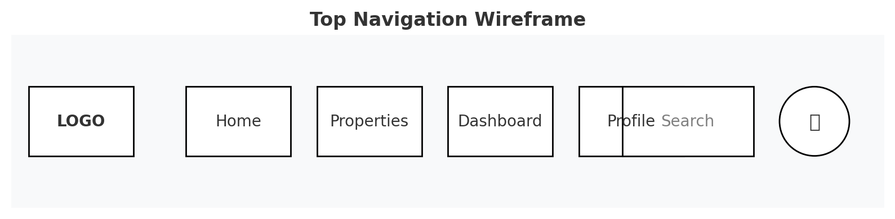

### Left Sidebar (Desktop)

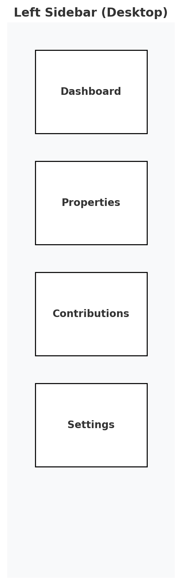

### Bottom Navigation (Mobile)

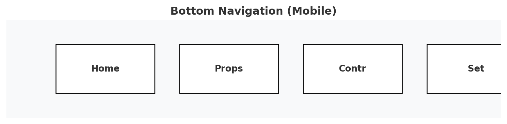

### Footer

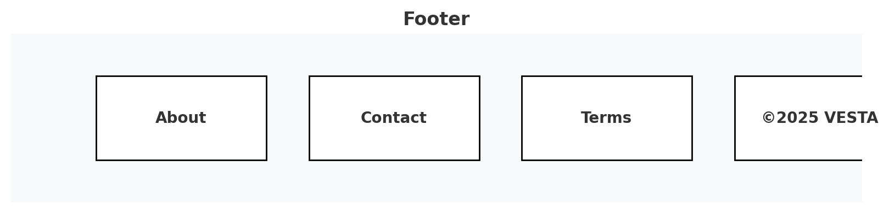

### Social Share Buttons

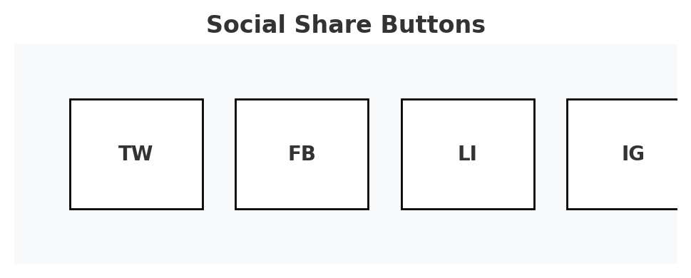

### User Card

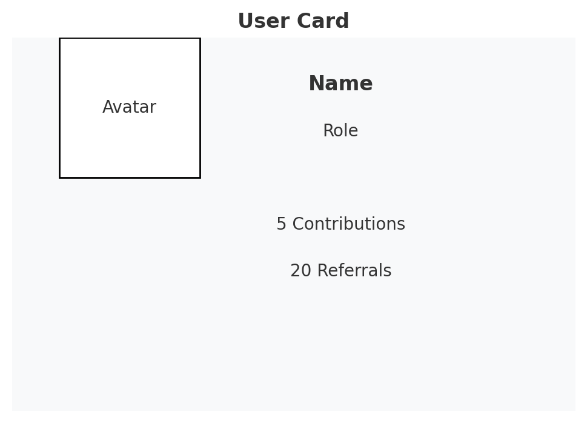

### Property Card

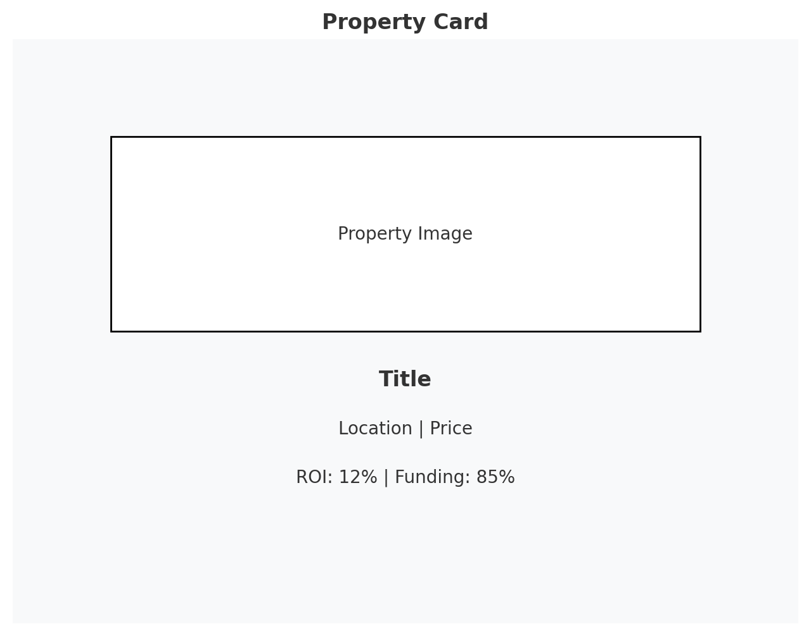

### Contributions Card

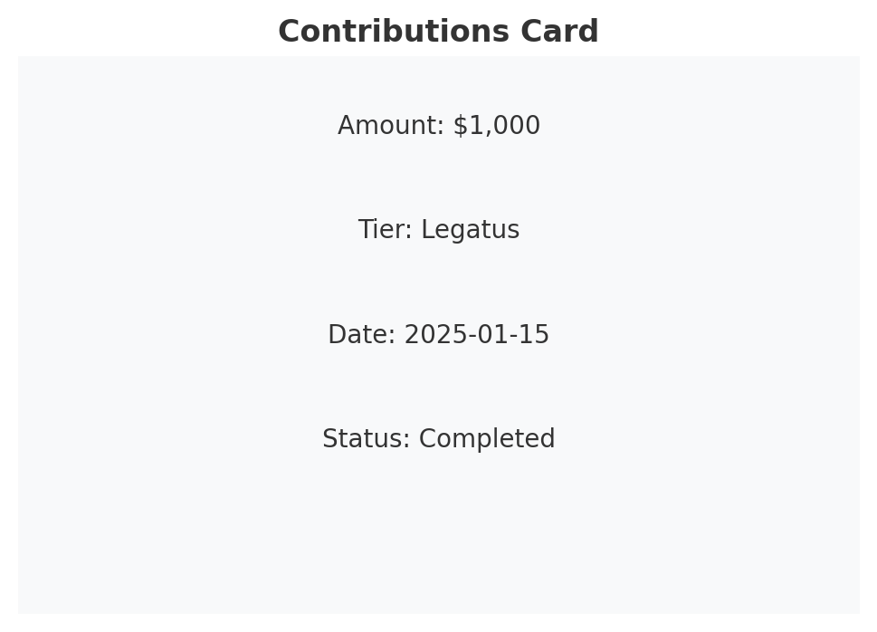

### User Form

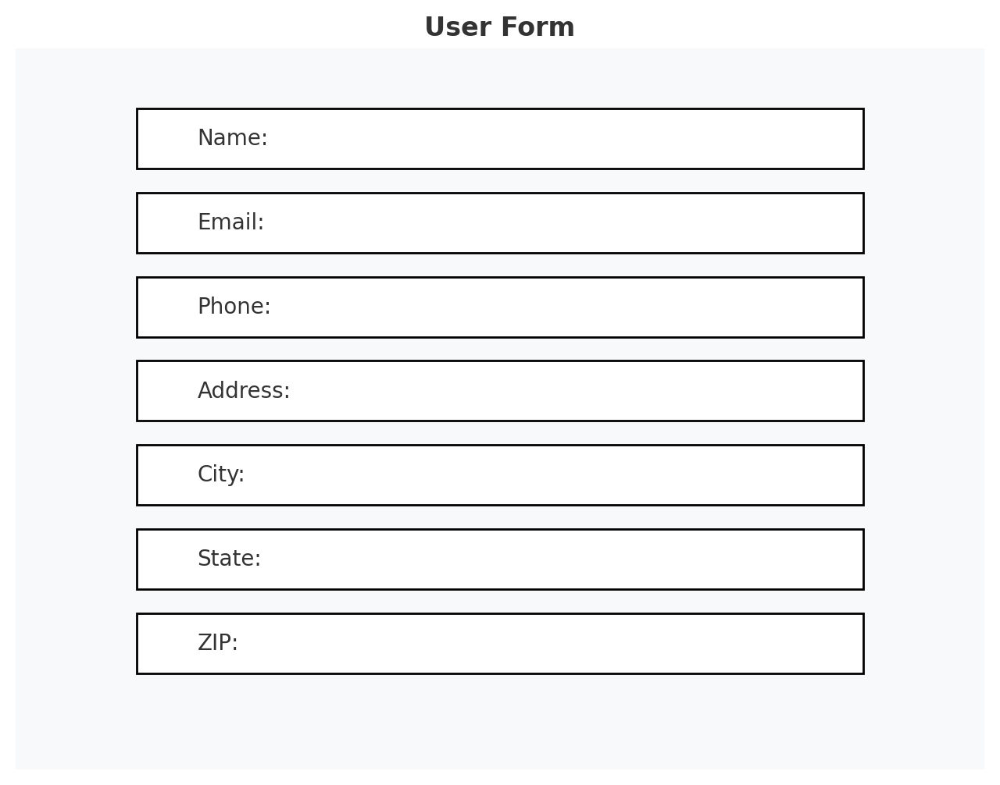

### Property Form

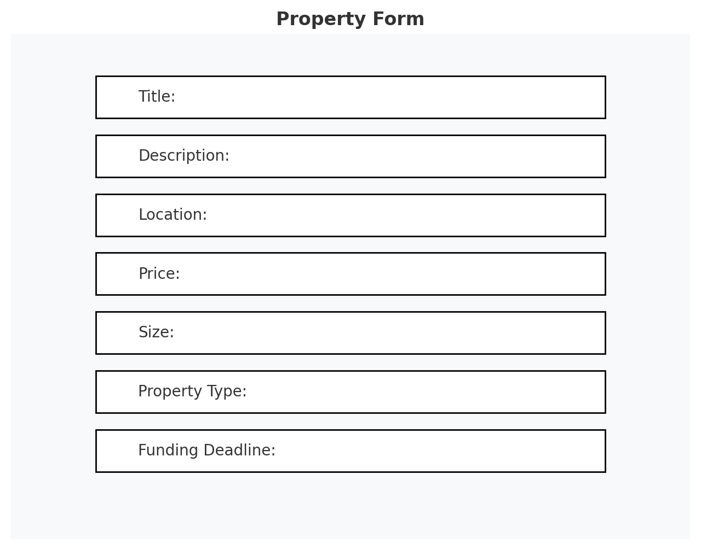

### Contributions Form

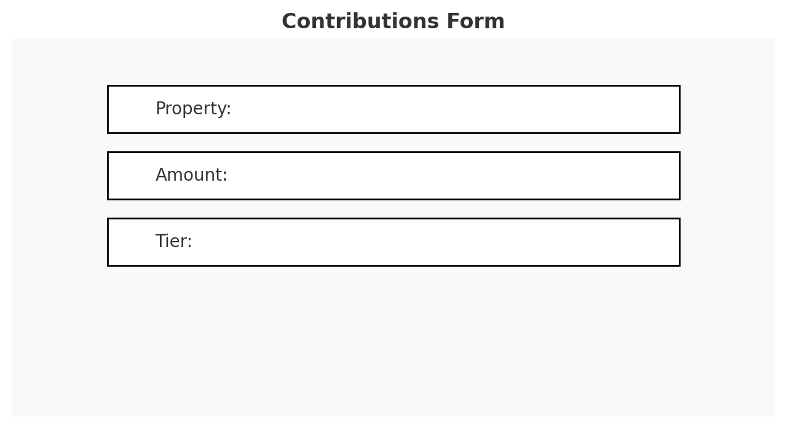

### Landing Page

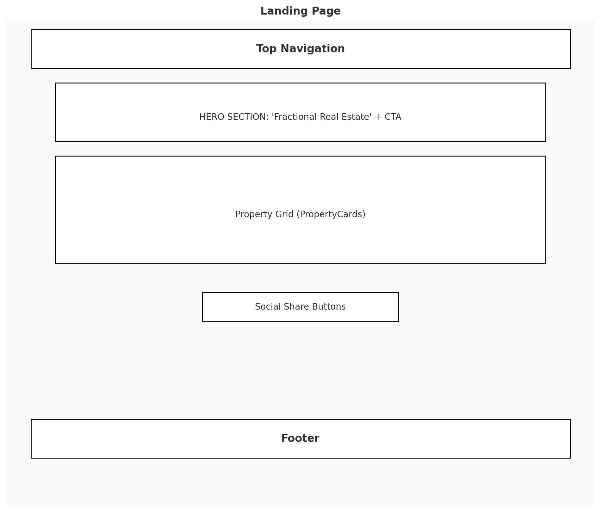

### Dashboard Page


### Property Listing Page

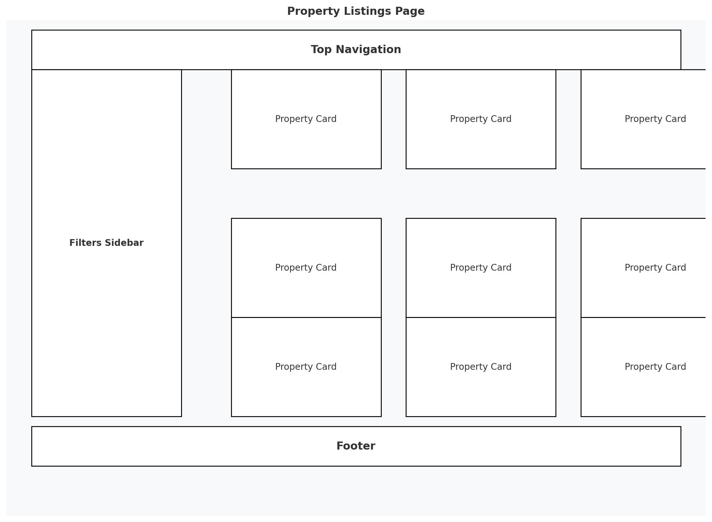

### Property Detail Page

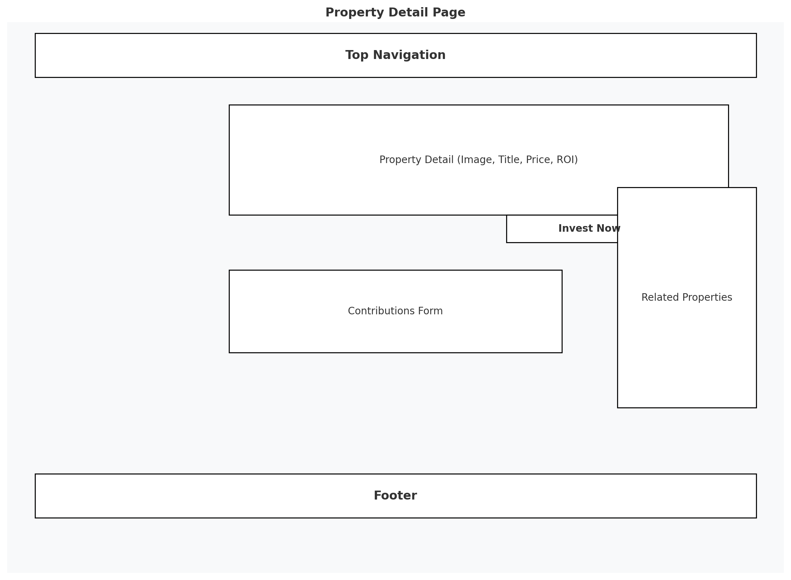

### User Profile Page

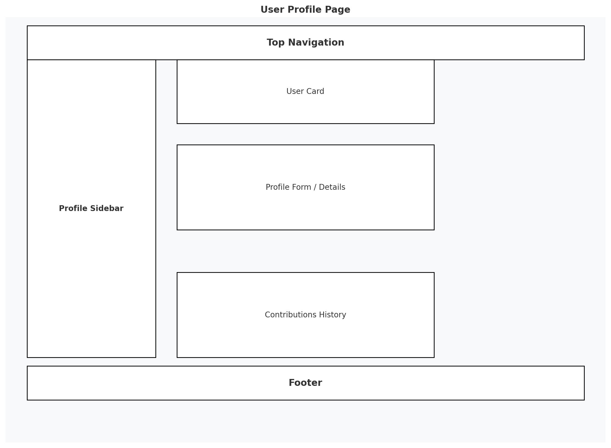

### Contributions Page

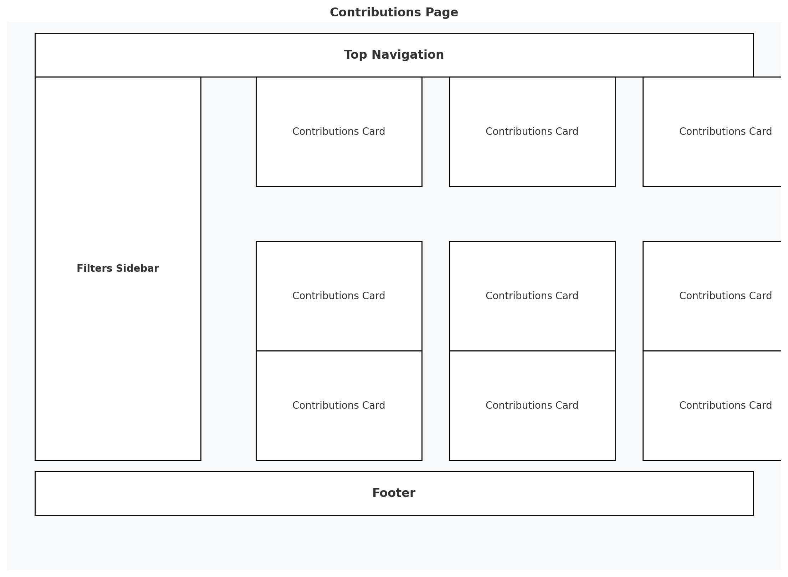

### Admin Property Creation Page

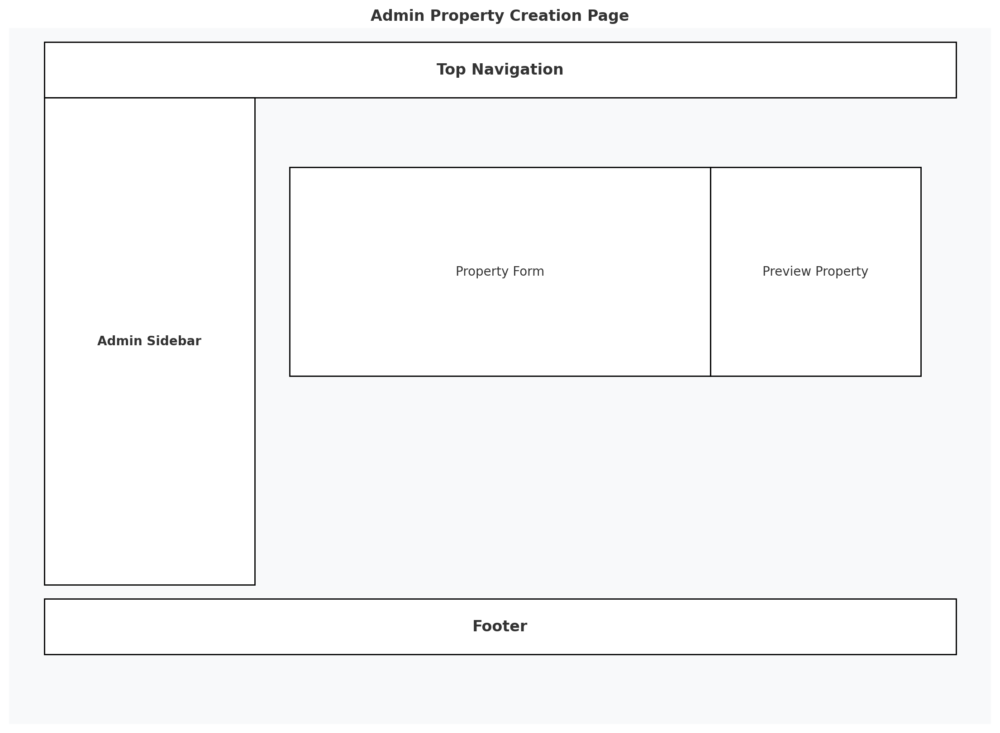

---
## Final Justification

- Consistency & Clarity:
    - The wireframes define clear component boundaries and use a uniform grid and spacing system. This ensures that each page is both visually appealing and functionally intuitive.

- Responsiveness & Accessibility:
    - Layouts adapt to screen size changes (e.g., left sidebar transforms to bottom bar on mobile) while maintaining consistent margins and padding.
    - Interactive elements (buttons, links, dropdowns) include accessible hover and focus states.

- Scalability & Maintainability:
    - The mapping from atomic UI components through shared composites, to forms and cards ensures a modular design that can easily incorporate new features or adjustments.
    - Clear naming conventions (for navigation links, form actions, and component states) reduce ambiguity and ease future development.

- Enhanced User Experience:
    - Advanced functionalities such as dropdown menus, toast notifications, steppers, and date pickers are integrated where needed, providing intuitive user interactions without overwhelming the interface.
    - Standards for button placement, link labeling, and navigation structure ensure a seamless flow throughout the application.

This detailed wireframe plan serves as a design reference for developers and designers, establishing a modern, clean, and cohesive user interface for the VESTA platform. It guides the creation of individual components and their assembly into full pages, ensuring a robust, scalable, and user-friendly experience.

---

# React.js Wireframes

```jsx
import React from "react";
import { FaHome, FaBuilding, FaUser, FaCog } from "react-icons/fa";

export const TopNavigation = () => {
  return (
    <nav className="flex items-center justify-between p-4 bg-gray-900 text-white shadow-md">
      <div className="flex items-center gap-4">
        <FaHome className="text-xl" />
        <a href="/" className="font-semibold text-lg">VESTA</a>
      </div>
      <div className="flex items-center gap-4">
        <input type="text" placeholder="Search..." className="border p-2 rounded-md bg-gray-800 text-white placeholder-gray-400" />
         (e.currentTarget.src = '/default-avatar.png')} />
      </div>
    </nav>
  );
};

export const Sidebar = () => {
  return (
    <aside className="w-64 h-full bg-gray-800 text-white p-4">
      <nav className="flex flex-col gap-4">
        <a href="/dashboard" className="flex items-center gap-2"><FaHome /> Dashboard</a>
        <a href="/properties" className="flex items-center gap-2"><FaBuilding /> Properties</a>
        <a href="/profile" className="flex items-center gap-2"><FaUser /> Profile</a>
        <a href="/settings" className="flex items-center gap-2"><FaCog /> Settings</a>
      </nav>
    </aside>
  );
};

export const BottomNavigation = () => {
  return (
    <nav className="fixed bottom-0 left-0 w-full bg-gray-900 text-white shadow-md flex justify-around p-3">
      <a href="/dashboard" className="text-xl"><FaHome /></a>
      <a href="/properties" className="text-xl"><FaBuilding /></a>
      <a href="/profile" className="text-xl"><FaUser /></a>
      <a href="/settings" className="text-xl"><FaCog /></a>
    </nav>
  );
};

export const Footer = () => {
  return (
    <footer className="text-center p-4 bg-gray-800 text-gray-400 text-sm">
      © 2025 VESTA | <a href="/about" className="text-gray-300">About</a> | <a href="/contact" className="text-gray-300">Contact</a> | <a href="/terms" className="text-gray-300">Terms</a>
    </footer>
  );
};

export const SocialShareButtons = () => {
  return (
    <div className="flex gap-2">
      <button className="bg-blue-600 text-white px-4 py-2 rounded">Twitter</button>
      <button className="bg-blue-800 text-white px-4 py-2 rounded">Facebook</button>
      <button className="bg-blue-500 text-white px-4 py-2 rounded">LinkedIn</button>
    </div>
  );
};

export default { TopNavigation, Sidebar, BottomNavigation, Footer, SocialShareButtons };

```

### Landing Page

```jsx
import React, { useState } from "react";
import { 
  FaHome, FaBuilding, FaUser, FaCog, FaSearch, FaUserCircle, FaChevronDown, FaBell, 
  FaTwitter, FaFacebook, FaLinkedin, FaInstagram 
} from "react-icons/fa";

const placeholderproperties = [
  {
    image: "https://placehold.co/600x400",
    title: "Luxury Apartment",
    location: "New York, NY",
    price: "$500,000",
    roi: "12%",
    funding: "85%",
  },
  {
    image: "https://placehold.co/600x400",
    title: "Modern Condo",
    location: "Los Angeles, CA",
    price: "$750,000",
    roi: "10%",
    funding: "60%",
  },
  {
    image: "https://placehold.co/600x400",
    title: "Suburban House",
    location: "Austin, TX",
    price: "$300,000",
    roi: "8%",
    funding: "90%",
  },
];

const PropertyCard = ({ image, title, location, price, roi, funding }) => {
  return (
    <div className="bg-gray-800 text-white p-4 rounded shadow-md w-72 cursor-pointer hover:shadow-lg transition-shadow">
      
      <div className="mt-4">
        <h2 className="text-lg font-semibold">{title}</h2>
        <p className="text-gray-400">{location}</p>
        <div className="flex justify-between mt-2">
          <p className="text-green-400">ROI: {roi}</p>
          <p className="text-blue-400">Funding: {funding}</p>
        </div>
        <p className="mt-2 font-semibold">Price: {price}</p>
      </div>
      <button className="mt-4 w-full bg-blue-600 text-white py-2 rounded hover:bg-blue-700 transition">
        Invest Now
      </button>
    </div>
  );
};

const LandingPage = () => {
  const [showDropdown, setShowDropdown] = useState(false);
  const [showTooltip, setShowTooltip] = useState(false);

  return (
    <div className="min-h-screen flex flex-col">
      <nav className="flex items-center justify-between p-4 bg-gray-900 text-white shadow-md h-16">
        <div className="flex items-center gap-4">
          <FaHome className="text-xl" />
          <a href="/" className="font-semibold text-lg">VESTA</a>
          <a href="/home" className="hover:text-gray-400">Home</a>
          <a href="/properties" className="hover:text-gray-400">Properties</a>
          <a href="/dashboard" className="hover:text-gray-400">Dashboard</a>
          <a href="/profile" className="hover:text-gray-400">Profile</a>
        </div>
        <div className="flex items-center gap-4 relative">
          <input
            type="text"
            placeholder="Search..."
            className="border p-2 rounded-md bg-gray-800 text-white placeholder-gray-400"
          />
          <div
            className="relative"
            onMouseEnter={() => setShowTooltip(true)}
            onMouseLeave={() => setShowTooltip(false)}
          >
            <FaBell className="text-xl cursor-pointer" />
            {showTooltip && (
              <div className="absolute top-full mt-1 p-2 bg-gray-700 text-white text-sm rounded shadow-md">
                You have new notifications
              </div>
            )}
          </div>
          <div className="relative">
            <button
              onClick={() => setShowDropdown(!showDropdown)}
              className="flex items-center gap-2"
            >
              <FaUserCircle className="text-2xl" />
              <FaChevronDown className="text-sm" />
            </button>
            {showDropdown && (
              <div className="absolute right-0 mt-2 w-48 bg-gray-800 text-white rounded shadow-md overflow-hidden">
                <a href="/profile" className="block px-4 py-2 hover:bg-gray-700">Edit Profile</a>
                <a href="/settings" className="block px-4 py-2 hover:bg-gray-700">Settings</a>
                <a href="/logout" className="block px-4 py-2 hover:bg-gray-700">Logout</a>
              </div>
            )}
          </div>
        </div>
      </nav>

      <section className="bg-gray-900 text-white text-center py-20">
        <h1 className="text-4xl font-bold">Fractional Real Estate Investment</h1>
        <p className="mt-4 text-lg">Invest in high-value properties with ease.</p>
        <button className="mt-6 bg-blue-600 text-white py-3 px-6 rounded-lg hover:bg-blue-700 transition">
          Start Investing
        </button>
      </section>

      <section className="max-w-6xl mx-auto px-6 py-12">
        <h2 className="text-2xl font-semibold mb-6">Featured Properties</h2>
        <div className="grid grid-cols-1 sm:grid-cols-2 md:grid-cols-3 gap-6">
          {placeholderproperties.map((property, index) => (
            <PropertyCard key={index} {...property} />
          ))}
        </div>
      </section>

      <section className="text-center py-8">
        <h2 className="text-xl font-semibold mb-4">Share with your network</h2>
        <div className="flex gap-2 justify-center items-center">
          <button className="bg-blue-600 text-white p-2 rounded flex items-center justify-center w-10 h-10">
            <FaTwitter className="text-xl" />
          </button>
          <button className="bg-blue-800 text-white p-2 rounded flex items-center justify-center w-10 h-10">
            <FaFacebook className="text-xl" />
          </button>
          <button className="bg-blue-500 text-white p-2 rounded flex items-center justify-center w-10 h-10">
            <FaLinkedin className="text-xl" />
          </button>
          <button className="bg-pink-500 text-white p-2 rounded flex items-center justify-center w-10 h-10">
            <FaInstagram className="text-xl" />
          </button>
        </div>
      </section>

      <footer className="text-center p-4 bg-gray-800 text-gray-400 text-sm mt-8">
        © 2025 VESTA | 
        <a href="/about" className="text-gray-300 mx-2">About</a> | 
        <a href="/contact" className="text-gray-300 mx-2">Contact</a> | 
        <a href="/terms" className="text-gray-300 mx-2">Terms</a>
      </footer>
    </div>
  );
};

export default LandingPage;

```

### Dashboard

```jsx
import React, { useState, useEffect } from "react";
import {
  FaHome,
  FaBuilding,
  FaUser,
  FaCog,
  FaChevronDown,
  FaBell,
  FaBars,
  FaUserCircle,
  FaHandsHelping,
  FaUserFriends,
} from "react-icons/fa";

const contributionsData = [
  { amount: "$1,000", tier: "Legatus", date: "2025-01-15", status: "Completed" },
  { amount: "$500", tier: "Centurion", date: "2025-01-10", status: "Pending" },
  { amount: "$250", tier: "Praetorian", date: "2025-01-05", status: "Completed" },
];

const statusColors = {
  Pending: "text-yellow-400",
  Completed: "text-green-400",
  Refunded: "text-red-400",
};
export const Sidebar = () => {
  const [isMobile, setIsMobile] = useState(false);
  const [isCollapsed, setIsCollapsed] = useState(false);

  useEffect(() => {
    const handleResize = () => {
      setIsMobile(window.innerWidth <= 768);
    };

    handleResize();
    window.addEventListener("resize", handleResize);
    return () => window.removeEventListener("resize", handleResize);
  }, []);

  if (isMobile) {
    return (
      <nav className="fixed bottom-0 left-0 w-full bg-gray-900 text-white shadow-md flex justify-around p-3">
        <a href="/home" className="text-xl"><FaHome /></a>
        <a href="/properties" className="text-xl"><FaBuilding /></a>
        <a href="/contributions" className="text-xl"><FaUser /></a>
        <a href="/settings" className="text-xl"><FaCog /></a>
      </nav>
    );
  }

  return (
    <aside className={`bg-gray-800 text-white h-screen p-4 transition-all ${isCollapsed ? 'w-16' : 'w-64'}`}>
      <button 
        onClick={() => setIsCollapsed(!isCollapsed)}
        className="text-white mb-4 ml-2 focus:outline-none"
      >
        <FaBars className="text-2xl" />
      </button>
      <nav className="flex flex-col gap-6 ml-3">
        <a href="/dashboard" className="flex items-center gap-2"><FaHome /> {!isCollapsed && "Dashboard"}</a>
        <a href="/properties" className="flex items-center gap-2"><FaBuilding /> {!isCollapsed && "Properties"}</a>
        <a href="/contributions" className="flex items-center gap-2"><FaUser /> {!isCollapsed && "Contributions"}</a>
        <a href="/settings" className="flex items-center gap-2"><FaCog /> {!isCollapsed && "Settings"}</a>
      </nav>
    </aside>
  );
};

export const TopNavigation = () => {
  const [showDropdown, setShowDropdown] = useState(false);
  const [showTooltip, setShowTooltip] = useState(false);

  return (
    <nav className="flex items-center justify-between p-4 bg-gray-900 text-white shadow-md h-16">
      <div className="flex items-center gap-4">
        <FaHome className="text-xl" />
        <a href="/" className="font-semibold text-lg">VESTA</a>
        <a href="/home" className="hover:text-gray-400">Home</a>
        <a href="/properties" className="hover:text-gray-400">Properties</a>
        <a href="/dashboard" className="hover:text-gray-400">Dashboard</a>
        <a href="/profile" className="hover:text-gray-400">Profile</a>
      </div>
      <div className="flex items-center gap-4 relative">
        <input
          type="text"
          placeholder="Search..."
          className="border p-2 rounded-md bg-gray-800 text-white placeholder-gray-400"
        />
        <div
          className="relative"
          onMouseEnter={() => setShowTooltip(true)}
          onMouseLeave={() => setShowTooltip(false)}
        >
          <FaBell className="text-xl cursor-pointer" />
          {showTooltip && (
            <div className="absolute top-full mt-1 p-2 bg-gray-700 text-white text-sm rounded shadow-md">
              You have new notifications
            </div>
          )}
        </div>
        <div className="relative">
          <button onClick={() => setShowDropdown(!showDropdown)} className="flex items-center gap-2">
            <FaUserCircle className="text-2xl" />
            <FaChevronDown className="text-sm" />
          </button>
          {showDropdown && (
            <div className="absolute right-0 mt-2 w-48 bg-gray-800 text-white rounded shadow-md overflow-hidden">
              <a href="/profile" className="block px-4 py-2 hover:bg-gray-700">Edit Profile</a>
              <a href="/settings" className="block px-4 py-2 hover:bg-gray-700">Settings</a>
              <a href="/logout" className="block px-4 py-2 hover:bg-gray-700">Logout</a>
            </div>
          )}
        </div>
      </div>
    </nav>
  );
};

export const UserCard = ({ name, role, contributions, referrals }) => {
  return (
    <div className="bg-gray-800 text-white p-4 rounded shadow-md w-64 cursor-pointer hover:shadow-lg transition-shadow">
      <div className="flex items-center gap-4">
        <FaUserCircle className="text-4xl" />
        <div>
          <h2 className="text-lg font-semibold">{name}</h2>
          <p className="text-gray-400">{role}</p>
        </div>
      </div>
      <div className="mt-4">
        <p className="flex items-center gap-2">
          <FaHandsHelping /> {contributions} Contributions
        </p>
        <p className="flex items-center gap-2">
          <FaUserFriends /> {referrals} Referrals
        </p>
      </div>
    </div>
  );
};

export const ContributionsCard = ({ amount, tier, date, status }) => {
  return (
    <div className="bg-gray-800 text-white p-4 rounded shadow-md w-64 cursor-pointer hover:shadow-lg transition-shadow">
      <div className="grid grid-cols-2 gap-2">
        <p className="font-semibold">Amount:</p>
        <p>{amount}</p>
        <p className="font-semibold">Tier:</p>
        <p>{tier}</p>
        <p className="font-semibold">Date:</p>
        <p>{date}</p>
        <p className="font-semibold">Status:</p>
        <p className={statusColors[status]}>{status}</p>
      </div>
      <button className="mt-4 w-full bg-blue-600 text-white py-2 rounded hover:bg-blue-700 transition">
        Details
      </button>
    </div>
  );
};

export const Footer = () => {
  const [isMobile, setIsMobile] = useState(window.innerWidth <= 768);

   const handleResize = () => {
   setIsMobile(window.innerWidth <= 768);
   };

   window.addEventListener("resize", handleResize);

  if (isMobile) {
    return ( 
      <footer className="fixed bottom-10 text-center p-4 bg-gray-800 text-gray-400 text-sm w-full">
      © 2025 VESTA | 
      <a href="/about" className="text-gray-300 mx-2">About</a> | 
      <a href="/contact" className="text-gray-300 mx-2">Contact</a> | 
      <a href="/terms" className="text-gray-300 mx-2">Terms</a>
    </footer>
  );
}
  
  return (
    <footer className="fixed bottom-0 text-center p-4 bg-gray-800 text-gray-400 text-sm w-full">
      © 2025 VESTA | 
      <a href="/about" className="text-gray-300 mx-2">About</a> | 
      <a href="/contact" className="text-gray-300 mx-2">Contact</a> | 
      <a href="/terms" className="text-gray-300 mx-2">Terms</a>
    </footer>
  );
};

const Dashboard = () => {
  return (
    <div className="flex flex-col h-screen">
      {/* Top Navigation */}
      <TopNavigation />

      <div className="flex flex-1 overflow-hidden">
        {/* Sidebar / Bottom Navigation */}
        <Sidebar />

        {/* Main Content */}
        <main className="flex-1 p-4 overflow-y-auto bg-gray-900 text-white">
          <div className="max-w-5xl mx-auto">
            {/* User Card */}
            <div className="mb-6">
              <UserCard 
                name="John Doe" 
                role="Contributor" 
                contributions={5} 
                referrals={20} 
              />
            </div>

            {/* Contributions Grid */}
            <div className="grid grid-cols-1 md:grid-cols-2 lg:grid-cols-3 gap-6">
              {contributionsData.map((contribution, index) => (
                <ContributionsCard key={index} {...contribution} />
              ))}
            </div>
          </div>
        </main>
      </div>

      {/* Footer */}
      <Footer />
    </div>
  );
};

export default Dashboard;

```

### Property Listing Page

```jsx
import React, { useState, useEffect } from "react";
import { 
  FaBars, FaHome, FaBuilding, FaUser, FaCog, FaSearch, FaUserCircle, FaChevronDown, FaBell, 
  FaTwitter, FaFacebook, FaLinkedin, FaInstagram 
} from "react-icons/fa";

const properties = [
  {
    image: "https://placehold.co/600x400",
    title: "Luxury Apartment",
    location: "New York, NY",
    price: "$500,000",
    roi: "12%",
    funding: "85%",
  },
  {
    image: "https://placehold.co/600x400",
    title: "Modern Condo",
    location: "Los Angeles, CA",
    price: "$750,000",
    roi: "10%",
    funding: "90%",
  },
  {
    image: "https://placehold.co/600x400",
    title: "Beachfront Villa",
    location: "Miami, FL",
    price: "$1,200,000",
    roi: "15%",
    funding: "70%",
  },
  {
    image: "https://placehold.co/600x400",
    title: "Penthouse Suite",
    location: "Chicago, IL",
    price: "$850,000",
    roi: "11%",
    funding: "88%",
  },
];

export const TopNavigation = () => {
  const [showDropdown, setShowDropdown] = useState(false);
  const [showTooltip, setShowTooltip] = useState(false);

  return (
    <nav className="flex items-center justify-between p-4 bg-gray-900 text-white shadow-md h-16">
      <div className="flex items-center gap-4">
        <FaHome className="text-xl" />
        <a href="/" className="font-semibold text-lg">VESTA</a>
        <a href="/home" className="hover:text-gray-400">Home</a>
        <a href="/properties" className="hover:text-gray-400">Properties</a>
        <a href="/dashboard" className="hover:text-gray-400">Dashboard</a>
        <a href="/profile" className="hover:text-gray-400">Profile</a>
      </div>
      <div className="flex items-center gap-4 relative">
        <input type="text" placeholder="Search..." className="border p-2 rounded-md bg-gray-800 text-white placeholder-gray-400" />
        <div className="relative" onMouseEnter={() => setShowTooltip(true)} onMouseLeave={() => setShowTooltip(false)}>
          <FaBell className="text-xl cursor-pointer" />
          {showTooltip && (
            <div className="absolute top-full mt-1 p-2 bg-gray-700 text-white text-sm rounded shadow-md">You have new notifications</div>
          )}
        </div>
        <div className="relative">
          <button onClick={() => setShowDropdown(!showDropdown)} className="flex items-center gap-2">
            <FaUserCircle className="text-2xl" />
            <FaChevronDown className="text-sm" />
          </button>
          {showDropdown && (
            <div className="absolute right-0 mt-2 w-48 bg-gray-800 text-white rounded shadow-md overflow-hidden">
              <a href="/profile" className="block px-4 py-2 hover:bg-gray-700">Edit Profile</a>
              <a href="/settings" className="block px-4 py-2 hover:bg-gray-700">Settings</a>
              <a href="/logout" className="block px-4 py-2 hover:bg-gray-700">Logout</a>
            </div>
          )}
        </div>
      </div>
    </nav>
  );
};

export const Sidebar = () => {
  const [isMobile, setIsMobile] = useState(window.innerWidth <= 768);
  const [isCollapsed, setIsCollapsed] = useState(false);

  const handleResize = () => {
    setIsMobile(window.innerWidth <= 768);
  };

  window.addEventListener("resize", handleResize);

  if (isMobile) {
    return (
      <nav className="fixed bottom-0 left-0 w-full bg-gray-900 text-white shadow-md flex justify-around p-3">
        <a href="/home" className="text-xl"><FaHome /></a>
        <a href="/properties" className="text-xl"><FaBuilding /></a>
        <a href="/contributions" className="text-xl"><FaUser /></a>
        <a href="/settings" className="text-xl"><FaCog /></a>
      </nav>
    );
  }

  return (
    <aside className={`bg-gray-800 text-white h-screen p-4 transition-all ${isCollapsed ? 'w-16' : 'w-64'}`}>
      <button 
        onClick={() => setIsCollapsed(!isCollapsed)}
        className="text-white mb-4 ml-2 focus:outline-none"
      >
        <FaBars className="text-2xl" />
      </button>
      <nav className="flex flex-col gap-6 ml-3">
        <a href="/dashboard" className="flex items-center gap-2"><FaHome /> {!isCollapsed && "Dashboard"}</a>
        <a href="/properties" className="flex items-center gap-2"><FaBuilding /> {!isCollapsed && "Properties"}</a>
        <a href="/contributions" className="flex items-center gap-2"><FaUser /> {!isCollapsed && "Contributions"}</a>
        <a href="/settings" className="flex items-center gap-2"><FaCog /> {!isCollapsed && "Settings"}</a>
      </nav>
    </aside>
  );
};

export const Footer = () => {
  const [isMobile, setIsMobile] = useState(window.innerWidth <= 768);

   const handleResize = () => {
   setIsMobile(window.innerWidth <= 768);
   };

   window.addEventListener("resize", handleResize);

  if (isMobile) {
    return ( 
      <footer className="fixed bottom-10 text-center p-4 bg-gray-800 text-gray-400 text-sm w-full">
      © 2025 VESTA | 
      <a href="/about" className="text-gray-300 mx-2">About</a> | 
      <a href="/contact" className="text-gray-300 mx-2">Contact</a> | 
      <a href="/terms" className="text-gray-300 mx-2">Terms</a>
    </footer>
  );
}
  
  return (
    <footer className="fixed bottom-0 text-center p-4 bg-gray-800 text-gray-400 text-sm w-full">
      © 2025 VESTA | 
      <a href="/about" className="text-gray-300 mx-2">About</a> | 
      <a href="/contact" className="text-gray-300 mx-2">Contact</a> | 
      <a href="/terms" className="text-gray-300 mx-2">Terms</a>
    </footer>
  );
};

export const PropertyCard = ({ image, title, location, price, roi, funding }) => {
  return (
    <div className="bg-gray-800 text-white p-4 rounded shadow-md w-72 cursor-pointer hover:shadow-lg transition-shadow">
      
      <div className="mt-4">
        <h2 className="text-lg font-semibold">{title}</h2>
        <p className="text-gray-400">{location}</p>
        <div className="flex justify-between mt-2">
          <p className="text-green-400">ROI: {roi}</p>
          <p className="text-blue-400">Funding: {funding}</p>
        </div>
        <p className="mt-2 font-semibold">Price: {price}</p>
      </div>
      <button className="mt-4 w-full bg-blue-600 text-white py-2 rounded hover:bg-blue-700 transition">Invest Now</button>
    </div>
  );
};


const PropertyListingPage = () => {
  const [filter, setFilter] = useState("");

  return (
    <div className="flex flex-col min-h-screen">
      <TopNavigation />
      <div className="flex flex-1">
        <Sidebar />
        <main className="flex-1 p-6">
          <h1 className="text-2xl font-semibold mb-4">Property Listings</h1>
          <div className="flex justify-between mb-4">
            <input
              type="text"
              placeholder="Search properties..."
              className="border p-2 rounded-md w-1/3"
              value={filter}
              onChange={(e) => setFilter(e.target.value)}
            />
          </div>
          <div className="grid grid-cols-1 sm:grid-cols-2 md:grid-cols-3 lg:grid-cols-4 gap-4">
            {properties
              .filter((property) =>
                property.title.toLowerCase().includes(filter.toLowerCase())
              )
              .map((property, index) => (
                <PropertyCard key={index} {...property} />
              ))}
          </div>
        </main>
      </div>
     <Footer />
    </div>
  );
};

export default PropertyListingPage;

```

### Property Detail Page

```jsx
import React from "react";
import React, { useState, useEffect } from "react";
import { 
  FaBars, FaHome, FaBuilding, FaUser, FaCog, FaSearch, FaUserCircle, FaChevronDown, FaBell, 
  FaTwitter, FaFacebook, FaLinkedin, FaInstagram 
} from "react-icons/fa";


const propertyDetail = {
  images: ["https://placehold.co/800x500", "https://placehold.co/800x500"],
  title: "Luxury Apartment",
  location: "New York, NY",
  price: "$500,000",
  roi: "12%",
  funding: "85%",
  description: "A luxury apartment with modern amenities and high ROI potential. Located in the heart of New York, this property offers an excellent investment opportunity."
};

const placeholderProperties = [
  "Luxury Apartment",
  "Downtown Condo",
  "Suburban House",
  "Lakefront Villa",
  "Penthouse Suite",
];

const contributionTiers = [
  "Basic",
  "Silver",
  "Gold",
  "Platinum",
  "Investor Plus",
];

export const ContributionsForm = () => {
  const [formData, setFormData] = useState({
    property: "",
    amount: "",
    tier: "",
  });

  const handleChange = (e) => {
    setFormData({ ...formData, [e.target.name]: e.target.value });
  };

  const handleSubmit = (e) => {
    e.preventDefault();
    console.log("Contribution Submitted", formData);
  };

  return (
    <form onSubmit={handleSubmit} className="bg-gray-800 text-white p-6 rounded shadow-md w-96">
      <h2 className="text-lg font-semibold mb-4">Contribute to a Property</h2>
      <label>Property</label>
      <select name="property" value={formData.property} onChange={handleChange} className="p-2 rounded bg-gray-700 w-full">
        <option value="">Select a Property</option>
        {placeholderProperties.map((property) => (
          <option key={property} value={property}>{property}</option>
        ))}
      </select>
      <label className="mt-4">Contribution Amount (USD)</label>
      <input type="number" name="amount" placeholder="$1000" value={formData.amount} onChange={handleChange} className="p-2 rounded bg-gray-700 w-full" />
      <label className="mt-4">Select Tier</label>
      <div className="flex flex-col gap-2">
        {contributionTiers.map((tier) => (
          <label key={tier} className="flex items-center gap-2">
            <input type="radio" name="tier" value={tier} checked={formData.tier === tier} onChange={handleChange} />
            {tier}
          </label>
        ))}
      </div>
      <div className="flex justify-between mt-6">
        <button type="button" className="bg-red-600 py-2 px-4 rounded hover:bg-red-700">Cancel</button>
        <button type="submit" className="bg-blue-600 py-2 px-4 rounded hover:bg-blue-700">Contribute</button>
      </div>
    </form>
  );
};

export const TopNavigation = () => {
  const [showDropdown, setShowDropdown] = useState(false);
  const [showTooltip, setShowTooltip] = useState(false);

  return (
    <nav className="flex items-center justify-between p-4 bg-gray-900 text-white shadow-md h-16">
      <div className="flex items-center gap-4">
        <FaHome className="text-xl" />
        <a href="/" className="font-semibold text-lg">VESTA</a>
        <a href="/home" className="hover:text-gray-400">Home</a>
        <a href="/properties" className="hover:text-gray-400">Properties</a>
        <a href="/dashboard" className="hover:text-gray-400">Dashboard</a>
        <a href="/profile" className="hover:text-gray-400">Profile</a>
      </div>
      <div className="flex items-center gap-4 relative">
        <input type="text" placeholder="Search..." className="border p-2 rounded-md bg-gray-800 text-white placeholder-gray-400" />
        <div className="relative" onMouseEnter={() => setShowTooltip(true)} onMouseLeave={() => setShowTooltip(false)}>
          <FaBell className="text-xl cursor-pointer" />
          {showTooltip && (
            <div className="absolute top-full mt-1 p-2 bg-gray-700 text-white text-sm rounded shadow-md">You have new notifications</div>
          )}
        </div>
        <div className="relative">
          <button onClick={() => setShowDropdown(!showDropdown)} className="flex items-center gap-2">
            <FaUserCircle className="text-2xl" />
            <FaChevronDown className="text-sm" />
          </button>
          {showDropdown && (
            <div className="absolute right-0 mt-2 w-48 bg-gray-800 text-white rounded shadow-md overflow-hidden">
              <a href="/profile" className="block px-4 py-2 hover:bg-gray-700">Edit Profile</a>
              <a href="/settings" className="block px-4 py-2 hover:bg-gray-700">Settings</a>
              <a href="/logout" className="block px-4 py-2 hover:bg-gray-700">Logout</a>
            </div>
          )}
        </div>
      </div>
    </nav>
  );
};

export const Sidebar = () => {
  const [isMobile, setIsMobile] = useState(window.innerWidth <= 768);
  const [isCollapsed, setIsCollapsed] = useState(false);

  const handleResize = () => {
    setIsMobile(window.innerWidth <= 768);
  };

  window.addEventListener("resize", handleResize);

  if (isMobile) {
    return (
      <nav className="fixed bottom-0 left-0 w-full bg-gray-900 text-white shadow-md flex justify-around p-3">
        <a href="/home" className="text-xl"><FaHome /></a>
        <a href="/properties" className="text-xl"><FaBuilding /></a>
        <a href="/contributions" className="text-xl"><FaUser /></a>
        <a href="/settings" className="text-xl"><FaCog /></a>
      </nav>
    );
  }

  return (
    <aside className={`bg-gray-800 text-white h-screen p-4 transition-all ${isCollapsed ? 'w-16' : 'w-64'}`}>
      <button 
        onClick={() => setIsCollapsed(!isCollapsed)}
        className="text-white mb-4 ml-2 focus:outline-none"
      >
        <FaBars className="text-2xl" />
      </button>
      <nav className="flex flex-col gap-6 ml-3">
        <a href="/dashboard" className="flex items-center gap-2"><FaHome /> {!isCollapsed && "Dashboard"}</a>
        <a href="/properties" className="flex items-center gap-2"><FaBuilding /> {!isCollapsed && "Properties"}</a>
        <a href="/contributions" className="flex items-center gap-2"><FaUser /> {!isCollapsed && "Contributions"}</a>
        <a href="/settings" className="flex items-center gap-2"><FaCog /> {!isCollapsed && "Settings"}</a>
      </nav>
    </aside>
  );
};

export const Footer = () => {
  const [isMobile, setIsMobile] = useState(window.innerWidth <= 768);

   const handleResize = () => {
   setIsMobile(window.innerWidth <= 768);
   };

   window.addEventListener("resize", handleResize);

  if (isMobile) {
    return ( 
      <footer className="fixed bottom-10 text-center p-4 bg-gray-800 text-gray-400 text-sm w-full">
      © 2025 VESTA | 
      <a href="/about" className="text-gray-300 mx-2">About</a> | 
      <a href="/contact" className="text-gray-300 mx-2">Contact</a> | 
      <a href="/terms" className="text-gray-300 mx-2">Terms</a>
    </footer>
  );
}
  
  return (
    <footer className="fixed bottom-0 text-center p-4 bg-gray-800 text-gray-400 text-sm w-full">
      © 2025 VESTA | 
      <a href="/about" className="text-gray-300 mx-2">About</a> | 
      <a href="/contact" className="text-gray-300 mx-2">Contact</a> | 
      <a href="/terms" className="text-gray-300 mx-2">Terms</a>
    </footer>
  );
};

const PropertyDetailPage = () => {
  return (
    <div className="flex flex-col min-h-screen">
      <TopNavigation />
      <div className="flex flex-1">
        <Sidebar />
        <main className="flex-1 pr-6">
          <div className="bg-gray-800 text-white p-6 rounded-lg shadow-md">
            
            <h1 className="text-3xl font-bold">{propertyDetail.title}</h1>
            <p className="text-gray-400">{propertyDetail.location}</p>
            <p className="text-xl font-semibold mt-2">Price: {propertyDetail.price}</p>
            <p className="text-green-400">ROI: {propertyDetail.roi}</p>
            <p className="text-blue-400">Funding: {propertyDetail.funding}</p>
            <p className="mt-4 text-gray-300">{propertyDetail.description}</p>
            <button className="mt-6 w-full bg-blue-600 text-white py-3 rounded-lg hover:bg-blue-700 transition">Invest Now</button>
          </div>
         </main>
      </div>
      <Footer />
    </div>
  );
};

export default PropertyDetailPage;

```

### User Profile Page

```jsx

```

### Contributions Page

```jsx

```

### Admin Property Creation Page

```jsx

```

