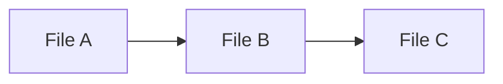

# Code Templates

## Directory Tree

Below is an example of a project structure and some code templates that meet your requirements. In this example, we’re building a blog using Next.js 15 with the app router. The CRUD operations are implemented as server actions in the lib/actions folder, while the API routes in the app/api folders simply call those actions.

```plaintext
my-blog/
├── app/
│   ├── api/
│   │   ├── posts/
│   │   │   └── route.ts         // Handles GET & POST requests for posts
│   │   └── posts/
│   │       └── [id]/
│   │           └── route.ts     // Handles PUT & DELETE for a specific post
│   ├── layout.tsx             // Root layout (includes Clerk provider)
│   ├── page.tsx               // Home page: renders blog list & form
│   └── clerk-provider.tsx     // (Optional) Custom Clerk provider wrapper
├── lib/
│   ├── actions/
│   │   └── posts.ts           // Server actions for CRUD operations
│   └── db/
│       └── mongoose.ts        // Mongoose connection logic
├── models/
│   └── Post.ts                // Mongoose model for blog posts
├── utils/
│   └── postSchema.ts          // Zod schema for validating post data
├── components/
│   ├── PostList.tsx           // Client component to display posts
│   └── PostForm.tsx           // Client component for post submission
├── styles/
│   └── globals.css            // Tailwind CSS imports & global styles
├── .eslintrc.js
├── .prettierrc
├── next.config.js
├── package.json
├── tsconfig.json
└── tailwind.config.js
```

## Templates

1. Mongoose Connection

- File: lib/db/mongoose.ts
  - This file establishes a connection to MongoDB using Mongoose.

```typescript
import mongoose from 'mongoose';

if (!global.mongoose) {
  global.mongoose = { conn: null, promise: null };
}

const MONGODB_URI = process.env.MONGODB_URI || '';

if (!MONGODB_URI) {
  throw new Error('Please define the MONGODB_URI environment variable');
}

export async function connectToDatabase() {
  if (global.mongoose.conn) {
    return global.mongoose.conn;
  }
  if (!global.mongoose.promise) {
    global.mongoose.promise = mongoose.connect(MONGODB_URI).then((mongoose) => mongoose);
  }
  global.mongoose.conn = await global.mongoose.promise;
  return global.mongoose.conn;
}

```

2. Mongoose Model for Post

- File: models/Post.ts

```typescript
import mongoose, { Schema, Document } from 'mongoose';

export interface IPost extends Document {
  title: string;
  content: string;
  createdAt: Date;
  updatedAt: Date;
}

const PostSchema: Schema = new Schema(
  {
    title: { type: String, required: true },
    content: { type: String, required: true },
  },
  { timestamps: true }
);

export default mongoose.models.Post || mongoose.model<IPost>('Post', PostSchema);

```

3. Zod Schema for Post Validation

- File: utils/postSchema.ts

```typescript
import { z } from 'zod';

export const postSchema = z.object({
  title: z.string().min(1, { message: 'Title is required' }),
  content: z.string().min(1, { message: 'Content is required' }),
});

```

4. Server Actions for CRUD Operations

- File: lib/actions/posts.ts

```typescript
import Post from '@/models/Post';
import { postSchema } from '@/utils/postSchema';
import { connectToDatabase } from '@/lib/db/mongoose';

// Ensure database connection before performing any action
async function init() {
  await connectToDatabase();
}

// Create a new post
export async function createPost(data: unknown) {
  await init();
  const parsed = postSchema.parse(data);
  const post = new Post(parsed);
  return await post.save();
}

// Retrieve all posts
export async function getPosts() {
  await init();
  return await Post.find();
}

// Update an existing post
export async function updatePost(id: string, data: unknown) {
  await init();
  const parsed = postSchema.partial().parse(data);
  return await Post.findByIdAndUpdate(id, parsed, { new: true });
}

// Delete a post
export async function deletePost(id: string) {
  await init();
  return await Post.findByIdAndDelete(id);
}

```

5. API Routes

- File: app/api/posts/route.ts
  - a. Posts Collection Route (GET & POST)

```typescript
import { NextResponse } from 'next/server';
import { createPost, getPosts } from '@/lib/actions/posts';

export async function GET() {
  try {
    const posts = await getPosts();
    return NextResponse.json(posts);
  } catch (error) {
    return NextResponse.error();
  }
}

export async function POST(request: Request) {
  try {
    const data = await request.json();
    const post = await createPost(data);
    return NextResponse.json(post);
  } catch (error) {
    return NextResponse.error();
  }
}

```

- File: app/api/posts/[id]/route.ts
  - b. Single Post Route (PUT & DELETE)

```typescript
import { NextResponse } from 'next/server';
import { updatePost, deletePost } from '@/lib/actions/posts';

export async function PUT(
  request: Request,
  { params }: { params: { id: string } }
) {
  try {
    const data = await request.json();
    const post = await updatePost(params.id, data);
    return NextResponse.json(post);
  } catch (error) {
    return NextResponse.error();
  }
}

export async function DELETE(
  request: Request,
  { params }: { params: { id: string } }
) {
  try {
    await deletePost(params.id);
    return NextResponse.json({ message: 'Post deleted' });
  } catch (error) {
    return NextResponse.error();
  }
}

```

6. Root Layout with Clerk Provider

- File: app/layout.tsx

```tsx
import '../styles/globals.css';
import { ClerkProvider } from '@clerk/nextjs';

export default function RootLayout({ children }: { children: React.ReactNode }) {
  return (
    <html lang="en">
      <body>
        <ClerkProvider>{children}</ClerkProvider>
      </body>
    </html>
  );
}

```

7. Home Page

- File: app/page.tsx

```tsx
import PostList from '@/components/PostList';
import PostForm from '@/components/PostForm';

export default function Home() {
  return (
    <div className="container mx-auto p-4 space-y-6">
      <h1 className="text-2xl font-bold">My Blog</h1>
      <PostForm />
      <PostList />
    </div>
  );
}

```

8. Client Components

- File: components/PostForm.tsx
  - a. PostForm Component

```tsx
'use client';
import { useState } from 'react';

export default function PostForm() {
  const [title, setTitle] = useState('');
  const [content, setContent] = useState('');

  async function handleSubmit(e: React.FormEvent) {
    e.preventDefault();
    await fetch('/api/posts', {
      method: 'POST',
      headers: { 'Content-Type': 'application/json' },
      body: JSON.stringify({ title, content }),
    });
    setTitle('');
    setContent('');
  }

  return (
    <form onSubmit={handleSubmit} className="space-y-4">
      <input
        type="text"
        placeholder="Title"
        value={title}
        onChange={(e) => setTitle(e.target.value)}
        className="border p-2 w-full"
      />
      <textarea
        placeholder="Content"
        value={content}
        onChange={(e) => setContent(e.target.value)}
        className="border p-2 w-full"
      />
      <button type="submit" className="bg-blue-500 text-white px-4 py-2">
        Create Post
      </button>
    </form>
  );
}

```

- File: components/PostList.tsx
  - b. PostList Component

```tsx
'use client';
import useSWR from 'swr';

const fetcher = (url: string) => fetch(url).then((res) => res.json());

export default function PostList() {
  const { data, error } = useSWR('/api/posts', fetcher);

  if (error) return <div>Error loading posts.</div>;
  if (!data) return <div>Loading...</div>;

  return (
    <ul className="space-y-4">
      {data.map((post: any) => (
        <li key={post._id} className="border p-4 rounded">
          <h2 className="font-bold text-lg">{post.title}</h2>
          <p>{post.content}</p>
        </li>
      ))}
    </ul>
  );
}

```

9. Configuration Files

- File: next.config.js
  - next.config.js

```javascript
/** @type {import('next').NextConfig} */
const nextConfig = {
  experimental: {
    appDir: true,
  },
  reactStrictMode: true,
};

module.exports = nextConfig;

```

- File: tsconfig.json
  - tsconfig.json

```json
{
  "compilerOptions": {
    "target": "es5",
    "lib": ["dom", "dom.iterable", "esnext"],
    "allowJs": true,
    "skipLibCheck": true,
    "strict": true,
    "forceConsistentCasingInFileNames": true,
    "noEmit": true,
    "esModuleInterop": true,
    "module": "esnext",
    "moduleResolution": "node",
    "resolveJsonModule": true,
    "isolatedModules": true,
    "jsx": "preserve",
    "incremental": true
  },
  "include": ["next-env.d.ts", "**/*.ts", "**/*.tsx"],
  "exclude": ["node_modules"]
}

```

- File: tailwind.config.js
  - tailwind.config.js

```javascript
/** @type {import('tailwindcss').Config} */
module.exports = {
  content: [
    "./app/**/*.{js,ts,jsx,tsx}",
    "./components/**/*.{js,ts,jsx,tsx}"
  ],
  theme: {
    extend: {},
  },
  plugins: [],
};

```

- File: .eslintrc.js
  - .eslintrc.js

```javascript
module.exports = {
  root: true,
  parser: '@typescript-eslint/parser',
  plugins: ['@typescript-eslint', 'react'],
  extends: [
    'eslint:recommended',
    'plugin:@typescript-eslint/recommended',
    'plugin:react/recommended',
    'next/core-web-vitals'
  ],
  rules: {
    // Customize your ESLint rules here
  },
};

```

- File: .prettierrc
  - .prettierrc

```json
{
  "semi": true,
  "singleQuote": true,
  "printWidth": 80,
  "tabWidth": 2,
  "trailingComma": "es5"
}

```

## Final Notes

#### Server Actions: 

The CRUD operations are encapsulated as functions in lib/actions/posts.ts. This ensures that your API routes remain thin controllers that simply call these actions.

#### API Routes: 

In the app router, the collection-level route (/api/posts/route.ts) handles GET and POST while the dynamic route (/api/posts/[id]/route.ts) manages updates and deletions.

#### Tech Stack Integration: 

This setup includes Next.js (with the new app directory), React, TypeScript, Tailwind CSS, and integrates with Clerk for authentication. Mongoose, Zod, ESLint, and Prettier ensure that your data layer, validation, and code quality are all maintained.

# Tech Stack Overview

## Next.js 15 (App Router):

Utilizes the new app directory paradigm, enabling both server and client components. This approach streamlines page routing, allows for built-in server actions, and simplifies data fetching by decoupling logic from presentation.

## React 19 & TypeScript 5:

Leverages modern React features (such as hooks and suspense) alongside TypeScript for static type checking. This combination improves code reliability and developer productivity by catching errors early and enabling enhanced IDE support.

## Tailwind CSS 4 & ShadCN 2:

Tailwind CSS provides utility-first styling, ensuring rapid UI development with responsive and consistent design. ShadCN components can be layered on top to further refine and standardize UI elements.

## MongoDB with Mongoose:

Mongoose serves as an Object Data Modeling (ODM) library that makes it easier to interact with MongoDB, defining schemas and models that enforce data consistency.

## Zod:

Acts as a runtime schema validation library, ensuring that incoming data conforms to expected shapes and preventing runtime errors through robust validation.

## ESLint & Prettier:

These tools maintain code quality and style consistency. ESLint catches potential errors and enforces best practices, while Prettier auto-formats code to a standardized style, making collaboration smoother.

## Clerk:

Provides authentication out of the box, handling user sign-up, sign-in, and session management. By wrapping the application with Clerk’s provider, user context is seamlessly integrated throughout the app.

## File Structure Breakdown

The project is organized into logical directories that separate concerns and facilitate scalability:

```plaintext
my-blog/
├── app/
│   ├── api/
│   │   ├── posts/
│   │   │   └── route.ts         // Collection-level API for GET (list posts) & POST (create post)
│   │   └── posts/
│   │       └── [id]/
│   │           └── route.ts     // Item-level API for PUT (update post) & DELETE (remove post)
│   ├── layout.tsx             // Root layout: wraps the app (e.g., with ClerkProvider for auth)
│   ├── page.tsx               // Home page: displays the blog, includes list and form components
│   └── clerk-provider.tsx     // Optional: custom wrapper for Clerk configurations
├── lib/
│   ├── actions/
│   │   └── posts.ts           // Server-side actions for CRUD operations; core business logic
│   └── db/
│       └── mongoose.ts        // MongoDB connection logic using Mongoose (connection pooling, etc.)
├── models/
│   └── Post.ts                // Mongoose model that defines the schema for blog posts
├── utils/
│   └── postSchema.ts          // Zod schema for validating incoming post data
├── components/
│   ├── PostList.tsx           // Client component: renders list of posts using SWR for data fetching
│   └── PostForm.tsx           // Client component: form for creating new posts
├── styles/
│   └── globals.css            // Global CSS imports and Tailwind base styles
├── .eslintrc.js             // ESLint configuration to enforce code quality
├── .prettierrc              // Prettier configuration for consistent code formatting
├── next.config.js           // Next.js configuration (e.g., enabling the experimental app directory)
├── package.json             // Project dependencies and scripts
├── tsconfig.json            // TypeScript configuration settings
└── tailwind.config.js       // Tailwind CSS configuration (defines content paths, theme extensions, etc.)

```

## Key Directories & Files

- app Directory:
Contains both page components and API routes. The API routes are implemented as thin controllers that simply call server actions.

- lib/actions/posts.ts:
Holds the core CRUD operations as server actions. This module connects to the database, validates data using Zod, and interacts with the Post model.

- lib/db/mongoose.ts:
Manages MongoDB connections. It ensures a single connection instance is reused across server actions to optimize performance and reliability.

- models/Post.ts:
Defines the Mongoose schema and model for blog posts, ensuring data integrity and providing built-in methods for database operations.

- utils/postSchema.ts:
Implements a Zod schema for validating post data. This validation layer helps catch errors early by ensuring the data meets defined constraints.

- components (PostList & PostForm):
These client components handle user interactions. PostList uses SWR for fetching and caching post data, while PostForm submits new posts through a fetch request to the API.

- Configuration Files:
Files like .eslintrc.js, .prettierrc, and tailwind.config.js establish coding standards and styling guidelines, which streamline collaboration and maintain consistency across the project.

## Development Workflow

1. Setting Up the Environment

- Install Dependencies:
Run npm install (or yarn install) to install the necessary packages defined in package.json, including Next.js, React, TypeScript, Tailwind CSS, Mongoose, Zod, Clerk, ESLint, and Prettier.

- Environment Variables:
Ensure you have environment variables set (e.g., MONGODB_URI for your MongoDB connection and any Clerk-specific keys).

2. Server Actions & API Routes

- CRUD Operations:
The server actions in lib/actions/posts.ts handle all database interactions. They ensure a connection is established (using connectToDatabase), validate input data with Zod, and then execute the desired database operation (create, read, update, delete).

- Thin Controllers:
API routes in the app/api/posts/route.ts and app/api/posts/[id]/route.ts files act as lightweight controllers. They receive HTTP requests, delegate logic to the corresponding server action, and then return a response via Next.js’s NextResponse.

3. Client-Side Development

- User Interface Components:
Client components like PostForm.tsx and PostList.tsx are responsible for the user interface.

- PostForm: Captures user input and sends a POST request to create a new post.

- PostList: Fetches posts using SWR, providing a smooth data revalidation and caching experience.

- Styling:
Tailwind CSS is used for styling, offering utility classes that make UI development quick and responsive. Global styles are maintained in styles/globals.css.

4. Authentication

- Clerk Integration:
The root layout (app/layout.tsx) wraps the application with the ClerkProvider, ensuring that authentication context is available throughout the app. This simplifies protected routes and user-specific functionalities.

5. Code Quality & Consistency

- ESLint & Prettier:
Developers are encouraged to run ESLint and Prettier as part of the development process to enforce coding standards and ensure a uniform code style. This minimizes bugs and keeps the codebase maintainable.

6. Development & Deployment

- Local Development:
Run the Next.js development server (usually with npm run dev or yarn dev) to work on the application in a hot-reloading environment.

  - The modular design allows you to develop, test, and iterate on individual components or server actions without affecting the entire system.

- Version Control & CI/CD:
Use Git for version control. The modular file structure facilitates code reviews and incremental changes. A CI/CD pipeline can run linting, tests, and deployments (for instance, on Vercel) to ensure quality before pushing to production.

- Testing:
With TypeScript and ESLint in place, many potential errors are caught early. Developers can add additional testing frameworks (like Jest) to write unit and integration tests for critical server actions and components.

## Summary

This stack marries modern web development technologies to create a scalable, maintainable, and developer-friendly blog application. The separation of concerns—from server actions in the lib folder to thin API controllers, robust model definitions, and responsive client components—ensures that each layer of the application can evolve independently. Coupled with rigorous code quality tools (ESLint, Prettier) and a comprehensive development workflow, this structure not only accelerates development but also enhances long-term maintainability and scalability.

By following this setup, developers can focus on implementing new features and refining user experience while relying on a solid foundation that manages data consistency, performance, and security.

# Project Studio Part 1

## High-Level Concept

Imagine an interactive “Project Studio” where users build their project blueprint step by step. The application acts as a centralized hub where you:

- Define Your Stack: Select core technologies (Next.js 15, React 19, TypeScript 5, Tailwind 4, ShadCN 2, MongoDB with Mongoose, Zod, ESLint, Prettier, and Clerk).

- Manage Configurations: Store and edit configuration files (e.g., package.json, .eslintrc.js, .prettierrc, tailwind.config.js) with an integrated code editor.

- Catalog Boilerplate & Templates: Organize and preview boilerplate code snippets and file templates.

- Visualize Directory Trees: Design your project’s file structure using an intuitive drag‐and‐drop interface.

- Link Documentation: Access relevant docs and learning resources directly from the app.

- Curate UI Components: Browse and select prebuilt ShadCN UI components to jumpstart your UI design.

## Architecture & Core Components

### Frontend

1. Framework & UI Library:

Built using Next.js 15 (with the app router) and React 19, the app leverages TypeScript 5 for type safety. The UI itself uses Tailwind CSS 4 for styling and ShadCN 2 components for a modern, accessible look.

- Interactive Modules:

  - Stack Builder: A guided wizard that helps you select technologies and preconfigured options.

  - Configuration Editor: An integrated code editor (think CodeMirror or Monaco) for modifying configuration files.

  - Directory Tree Planner: A visual, drag-and-drop tree builder to plan your folder structure.

  - Template & Boilerplate Catalog: A searchable library where you can store and preview boilerplate code.

  - Documentation Hub: A section that aggregates links and summaries for Next.js, React, Tailwind, etc.

  - UI Component Selector: A curated interface for browsing and picking ShadCN UI components.

### Backend

1. API & Server Actions:

The app uses Next.js API routes (and server actions where needed) to handle saving configurations, templates, and user customizations.

- Database:
MongoDB (accessed via Mongoose) serves as the persistent storage for user projects, templates, and configurations.

- Authentication:
Integrated Clerk authentication secures user sessions and ensures personalized workspaces.

### Detailed File Structure (Conceptual)

While the app itself is a tool for planning other projects, you can organize its internal codebase similarly to the blog example:

```plaintext
project-studio/
├── app/
│   ├── dashboard/                // Main dashboard with all modules
│   │   ├── page.tsx             // Overview of user projects and status
│   │   └── components/          // Dashboard-specific components (e.g., navigation)
│   ├── stack-builder/           // Guided wizard to select and configure stack
│   │   ├── page.tsx             // Wizard UI to define the stack
│   │   └── components/          // Steps, progress bars, and interactive forms
│   ├── config-editor/           // Integrated editor for config files
│   │   └── page.tsx             // Code editor interface using Monaco/CodeMirror
│   ├── directory-planner/       // Visual drag-and-drop tree builder for file structures
│   │   └── page.tsx             // Tree visualization and editing components
│   ├── template-catalog/        // Library of boilerplate and file templates
│   │   └── page.tsx             // Browse, search, and preview templates
│   ├── docs-hub/                // Aggregated documentation links and summaries
│   │   └── page.tsx             // Curated resources for each stack element
│   ├── ui-components/           // Catalog of ShadCN UI components
│   │   └── page.tsx             // Preview and selection interface
│   ├── layout.tsx               // Global layout (includes ClerkProvider, theme providers)
│   └── global.css              // Global styles (including Tailwind directives)
├── lib/
│   ├── actions/                 // Server actions for CRUD operations (e.g., saving a project blueprint)
│   └── db/                      // MongoDB connection logic using Mongoose
├── models/                      // Data models (e.g., Project, Template)
├── utils/                       // Helper functions and validation (e.g., Zod schemas)
├── .eslintrc.js                 // ESLint configuration
├── .prettierrc                  // Prettier configuration
├── next.config.js               // Next.js configuration
├── package.json                 // App dependencies and scripts
├── tsconfig.json                // TypeScript configuration
└── tailwind.config.js           // Tailwind CSS configuration

```

>Note: Although the internal structure is modular, the app’s primary goal is to help you build and export configuration files and blueprints for other projects.

##  Development Workflow

### A. User Onboarding & Project Setup

1. Dashboard:


The dashboard provides an overview of existing projects and a call-to-action to create a new project blueprint.

2. Guided Stack Definition:

Through a wizard interface, users select core technologies and preconfigured options (e.g., Next.js for SSR, TypeScript strict mode, Tailwind configuration presets).

3. Default templates are provided based on best practices for the stack.

### Configuring and Generating Artifacts

1. Configuration Editor:

Users can edit or generate essential configuration files like package.json, .eslintrc.js, and tailwind.config.js.

2. A live preview/editor allows code modifications with syntax highlighting and linting feedback.

### Template & Boilerplate Catalog:

1. A searchable library lets users browse available boilerplate code.

Users can save their custom snippets or reuse provided ones.

2. Directory Tree Planning:

A visual, drag-and-drop interface enables users to map out the file structure.

The tool generates a hierarchical view that can be exported as a JSON or plain text blueprint.

### UI Component Selection:

1. A catalog of ShadCN UI components is available for preview.

Users can “pin” or add components to their project specification, complete with usage examples and links to docs.

### Finalizing and Exporting

1. Project Blueprint:

Once all elements are configured, users can export a complete project blueprint that includes configuration files, directory structure, and code templates.

2. Integration with VCS/CI:

The tool can offer integration options (e.g., exporting to a Git repository or generating CI/CD configuration snippets).

3. Iterative Updates:

Users can revisit and update their project definitions as requirements evolve. Versioning and history of blueprints help track changes.

###  Collaboration & Learning

1. Contextual Help & Documentation:

Each section includes tooltips, inline documentation, and links to external resources (e.g., official Next.js or Tailwind docs) to educate junior developers.

2. Template Sharing:

Users can share their templates or blueprints with peers, fostering a collaborative learning environment.

### Optimizing for Junior Developers

1. Intuitive UI:

The design should be minimalistic and guided—using clear language, step-by-step instructions, and visual cues to reduce complexity.

2. Prebuilt Defaults:

Offer well-documented defaults and “best practice” presets for each configuration file and stack component.

3. Inline Documentation & Tooltips:

Provide contextual help and real-time documentation links so users understand why a particular setting is important.

4. Visual Feedback:

Use interactive diagrams (like the directory tree planner) to give immediate visual feedback on configuration changes.

5. Incremental Complexity:

Allow users to start with a simple blueprint and progressively unlock more advanced customization options as they become comfortable.

## Final Thoughts

By combining a modular architecture with an intuitive, guided workflow, this web app not only serves as a powerful project scaffolding tool but also as an educational platform. It demystifies the process of setting up a modern full-stack project by offering an integrated environment where junior developers can learn, experiment, and ultimately build production-ready blueprints tailored to the cutting-edge stack you described.

# Project Studio Part 2

## 1. Overall Flow

### User Provides the Codebase

The user either chooses the current project, uploads a .zip file of their Next.js project, or supplies a GitHub URL.

- Your Next.js app stores this code in a temporary folder on the server (or references it directly via GitHub’s API).

### Server-side Analysis

A server action or an API route scans the codebase to extract structural information.

- The app uses an AST parser (TypeScript compiler API, Babel, or a similar tool) to analyze files, track imports/exports, identify components, or discover data model definitions (e.g., Mongoose schemas, Prisma models, TypeORM entities).

### Graph Generation

The extracted data is transformed into a graph or structured data representing the code relationships.

- For codebase visualization, you might produce a dependency graph or a container diagram.

- For data modeling, you might produce an entity relationship diagram (ERD) or UML class diagram.

### Rendering the Diagrams

On the frontend, you visualize the generated graph data.

- Libraries like Mermaid, D3.js, react-flow, or vis.js can render nodes and edges in an interactive way.

- Alternatively, you can generate static SVG diagrams on the server (using something like Mermaid CLI) and serve them to the client.

### Interactive Exploration

The user can expand/collapse sections of the diagram, click on a node to see the associated code, or switch between “container-level” and “module-level” views.

## 2. Parsing and Building a Dependency Graph

Below are some strategies for extracting the structure of a Next.js project:

### File System Walk

Recursively walk the project directory (using Node’s fs module or a library like glob).

- Collect file paths, ignoring node_modules and other irrelevant folders.

### AST Parsing

Use TypeScript or Babel to parse each .ts, .tsx, .js, or .jsx file.

- Extract the import statements to build a dependency graph. For instance:

```ts
import { something } from "@/components/foo";
```

>might create an edge from currentFile.tsx → components/foo.tsx.

### Identifying Next.js-Specific Artifacts

If you want to highlight pages, layouts, server actions, etc., look for special files (page.tsx, layout.tsx, route.ts, etc.).

If you want to show environment usage or API endpoints, parse those from app/api/* routes or recognized patterns in server actions.

### Graph Data Structure

Store each file/module as a node in a directed graph.

- Edges represent import statements or references.

- Attach metadata like “this file exports a React component,” “this file is a Next.js page,” or “this file contains a server action.”

### Grouping / Containers

If you want to create container diagrams (like a “Frontend Container,” “Backend Container,” “Runtime Container” in your example images), define a custom grouping logic. For example:

- “Frontend Container” = all files in app/* or pages/*.

- “Backend Container” = all custom server code or Next.js API routes.

- “Runtime Container” = a Docker-based or Node-based environment running the code.

## 3. Extracting a Data Model

If you need a separate data model diagram (like an ERD), you’ll parse your model definitions:

### Mongoose

Scan for mongoose.model('ModelName', new Schema({...})).

- Extract fields, types, and references (ref: 'OtherModel') to form relationships.

- Build a small data structure that says, for example, User has fields { name: String, age: Number }, references Project.

### Prisma

Look for schema.prisma or prisma directory.

- Parse model definitions (e.g., model User { id Int @id name String ... }) to build an ERD.

- Identify relation fields for relationships between models.

### TypeORM / Other ORMs

Look for decorators like @Entity(), @Column(), @ManyToOne(), etc.

- Extract the class name, fields, and relationships to build a UML or ERD.

### Graph Data

Each “table” or “model” becomes a node in the diagram.

- Foreign key references or relationships become edges.

- Additional metadata (column type, constraints) can be stored as node attributes.

## 4. Visualizing the Graph

Once you have a JSON data structure describing the code graph or the data model, you can render it:

### Mermaid

Generate Mermaid syntax (like a flowchart or class diagram).

- Use a React-based Mermaid component or run Mermaid on the server to produce SVG.

Example snippet:



### React Flow / D3

For a more interactive approach, create a React component that uses a library like react-flow or d3.

- Render each file/model as a node, edges as lines, and implement zoom, pan, or click handlers to show more info.

### Interactive Features

- Click to expand: show nested modules or sub-dependencies.

- Hover: highlight inbound/outbound connections.

- Show code snippet: when a node is clicked, fetch the relevant lines of code from your server.

- Filter: let users filter out certain directories or file types to reduce noise.

## 5. Tying It All Together in Next.js

Below is a conceptual breakdown of how your Next.js app might be organized:

```plaintext
my-visualizer-app/
app/
upload/route.ts       -> Accepts codebase uploads
analyze/route.ts      -> Kicks off the server-side AST parsing
diagrams/
[projectId]/page.tsx -> Renders the diagrams for a specific project
layout.tsx
page.tsx
lib/
parse-project.ts       -> Contains logic for walking the filesystem
parse-ast.ts           -> Contains logic for building the dependency graph
parse-models.ts        -> Contains logic for extracting data models
generate-mermaid.ts    -> Optional: convert graph data to Mermaid syntax
components/
GraphViewer.tsx        -> A React component to display the codebase graph
ERDViewer.tsx          -> A React component to display the data model diagram
...

```

## Key Steps in Next.js

### Uploading/Fetching the Code

Provide a UI to either upload a .zip or paste a GitHub repo URL.

- If you fetch from GitHub, you can use the GitHub API or a library like simple-git to clone the repo.

### Server Action or Route for Analysis

Once the code is available, call a server action (Next.js 13) or an API route to run the analysis scripts.

- Return a JSON response containing the graph structure for both the code dependencies and the data model.

### Client-Side Rendering

On the /diagrams/[projectId] page, fetch the analysis JSON (or use the server component to do so).

- Render <GraphViewer data={codeGraph} /> for the code dependency diagram.

- Render <ERDViewer data={modelGraph} /> for the data model.

- Provide UI controls for zoom, pan, filter, etc.

## 6. Implementation Details & Tips

1. Performance: Parsing a large codebase can be CPU-intensive. Consider queueing or background jobs if the codebase is very large.

2. Security: Never execute untrusted code. Stick to AST parsing. If you must run code, sandbox it.

3. Scalability: For repeated or large analyses, store intermediate results (like the AST or final graph JSON) in a database so you don’t have to re-parse every time.

4. Custom Visualization: The example images show layered container diagrams or expanded UML. You can replicate these with either:

- A layered approach in D3 or react-flow.

- Generating multiple Mermaid diagrams (e.g., one for containers, one for each submodule).

5. Linking to Code: If you want each diagram node to link to the actual lines of code, store file paths and line numbers in the graph. Then provide a small code viewer that highlights the relevant lines.

## 7. Summary

To create a Next.js “codebase visualizer” that resembles the diagrams in your images:

- Gather the code via upload or GitHub clone.

- Parse the project folder with AST tools to build a dependency graph and a data model graph.

- Generate a visual representation of these graphs—either via Mermaid, D3, react-flow, or another visualization library.

- Render everything in a Next.js page, giving users interactive ways to explore, expand, and link each diagram node back to the code.

This architecture provides a robust way to analyze any Next.js (or Node.js/TypeScript) project, offering both a high-level “container” or “module” overview and a deeper, schema-level data model diagram.

# Project Studio Overview

## Features

1. Stack Builder: A guided wizard for selecting core technologies and preconfigured options.

2. Configuration Editor: An integrated code editor (using CodeMirror or Monaco) to edit essential files like package.json, .eslintrc.js, .prettierrc, and tailwind.config.js.

3. Boilerplate & Template Catalog: A searchable library for storing and previewing code snippets and file templates.

4. Directory Tree Planner: An interactive, drag‑and‑drop interface to design and export the project’s file structure.

5. Documentation Hub: A curated section linking to Next.js, React, Tailwind, and other docs.

6. UI Component Selector: A catalog for browsing and selecting prebuilt ShadCN UI components.

7. Codebase Visualization & Data Model Diagram: 

- Functionality to ingest a Next.js project (via ZIP upload or GitHub URL), parse its AST to generate an interactive dependency graph (or container diagram) and extract model definitions (e.g., Mongoose schemas) to produce an ERD/UML diagram. Nodes in these diagrams should be clickable—displaying relevant code or metadata—and support zoom/pan and filtering.

## Structure

The backend will use Next.js API routes and server actions (located in a modular lib folder) for all CRUD operations, with persistent storage in MongoDB and user-specific workspaces secured by Clerk authentication. The app should follow the conceptual file structure outlined below:

```plaintext
project-studio/
├── app/
│   ├── dashboard/                // Main dashboard with project overview and navigation
│   ├── stack-builder/           // Wizard UI for defining the tech stack
│   ├── config-editor/           // Code editor for configuration files
│   ├── directory-planner/       // Drag-and-drop interface for directory tree design
│   ├── template-catalog/        // Boilerplate/template catalog UI
│   ├── docs-hub/                // Documentation links and resources
│   ├── ui-components/           // ShadCN UI component selector
│   ├── diagrams/
│   │   └── [projectId]/page.tsx  // Page to display codebase and data model diagrams
│   ├── layout.tsx                // Global layout (includes ClerkProvider, theme providers)
│   └── global.css                // Global styles (with Tailwind directives)
├── lib/
│   ├── actions/                 // Server actions for saving projects, templates, etc.
│   └── db/                      // MongoDB connection logic using Mongoose
├── models/                      // Data models (e.g., Project, Template)
├── utils/                       // Helper functions, Zod schemas, etc.
├── .eslintrc.js
├── .prettierrc
├── next.config.js
├── package.json
├── tsconfig.json
└── tailwind.config.js

```

## UX

When the user uploads or provides a GitHub URL for a Next.js project, the app should:

1. Store (or clone) the project code.

2. Run a server-side analysis that:

3. Walks the file system and uses an AST parser (via the TypeScript compiler API or Babel) to extract import/export relationships, Next.js–specific files (pages, layouts, server actions), and any model definitions (e.g., Mongoose schemas).

4. Transforms this information into a JSON structure representing a dependency graph and a separate data model graph.

5. On the client side, render interactive diagrams using a library such as react-flow, D3.js, or Mermaid (with zoom, pan, expand/collapse, and click-to-view–code features).

# Prompt

Build a Vercel-optimized Next.js 15 app called "Project Studio" with the following features and functionality, using React 19, TypeScript 5, Tailwind CSS 4, and ShadCN UI 2. Use MongoDB (via Mongoose), Zod, ESLint, Prettier, and integrate Clerk for authentication.

The app should provide an interactive platform where junior developers can build their project blueprint step by step:

1. **Stack Builder:**  
   - A guided wizard for selecting core technologies and configuration options (Next.js, React, TypeScript, Tailwind, ShadCN UI, MongoDB/Mongoose, Zod, ESLint, Prettier, Clerk).
  
2. **Configuration Editor:**  
   - An integrated code editor (using CodeMirror or Monaco) for creating and editing configuration files such as package.json, .eslintrc.js, .prettierrc, and tailwind.config.js.  
   - Provide live syntax highlighting and linting feedback.

3. **Boilerplate & Template Catalog:**  
   - A searchable library for organizing, previewing, and saving boilerplate code snippets and file templates.

4. **Directory Tree Planner:**  
   - An intuitive, drag-and-drop interface to design the project’s file structure.  
   - Allow exporting the structure as JSON or plain text.

5. **Documentation Hub:**  
   - A section that aggregates relevant documentation and learning resources for Next.js, React, Tailwind CSS, and more.

6. **UI Component Selector:**  
   - A curated interface to browse and select prebuilt ShadCN UI components with usage examples and documentation links.

7. **Codebase Visualization & Data Model Diagram:**  
   - On the server, analyze the provided project by:
     - Recursively scanning the project folder (ignoring node_modules) to build a dependency graph using AST parsing (with the TypeScript compiler API or Babel).  
     - Identifying Next.js–specific artifacts (pages, layouts, server actions) and model definitions (e.g., Mongoose schemas) to generate a data model diagram (ERD/UML).
   - Transform the extracted data into JSON graph structures.
   - Render interactive diagrams on the frontend using libraries like react-flow, D3.js, or Mermaid.  
     - Diagrams should support zoom, pan, expand/collapse nodes, and clicking on a node to view the corresponding code snippet.
   - Provide functionality for users to upload a ZIP file or enter a GitHub repo URL of an existing Next.js project.  

8. **Backend & API:**  
   - Implement Next.js API routes and server actions (located in a modular lib folder) to handle project uploads, AST parsing, diagram generation, and saving user customizations.  

9. **Overall Architecture & File Structure:**  
    - Organize the project into modules: dashboard, stack-builder, config-editor, directory-planner, template-catalog, docs-hub, ui-components, and diagrams, following a modular file structure.  

Please generate all necessary Next.js files (pages, components, API routes, server actions, and configuration files) to create a polished, production-ready "Project Studio" app. Ensure the code follows best practices with TypeScript, ESLint, and Prettier, and that the UI is modern and intuitive for junior developers.

# Project Studio Description

Project Studio is an interactive web app that empowers developers—especially juniors—to build a complete project blueprint from scratch. With this tool, users can:

- **Define Their Tech Stack:** Select core technologies (Next.js 15, React 19, TypeScript 5, Tailwind CSS 4, ShadCN UI 2, MongoDB with Mongoose, Zod, ESLint, Prettier, and Clerk).
- **Manage Configurations:** Create and edit configuration files like `package.json`, `.eslintrc.js`, `.prettierrc`, and `tailwind.config.js` using an integrated code editor.
- **Catalog Boilerplate & Templates:** Organize and preview reusable code snippets and file templates.
- **Visualize Directory Trees:** Design the project’s file structure with a drag-and-drop interface.
- **Access Documentation:** Link to curated documentation and learning resources.
- **Select UI Components:** Browse and pick prebuilt ShadCN UI components to jumpstart your UI design.
- **Codebase Visualization & Data Modeling:** Ingest an existing Next.js project (via ZIP upload or GitHub URL), analyze its structure with AST parsing, and render interactive dependency graphs and data model diagrams (ERD/UML).

## Features

- **Interactive Stack Builder:** A guided wizard to define and customize your tech stack.
- **Integrated Code Editor:** For live editing of configuration files.
- **Directory Planner & Template Catalog:** Visual and searchable interfaces.
- **Dynamic Diagrams:** Generate and interact with codebase visualizations and data model diagrams using libraries like react-flow or Mermaid.
- **API & Server Actions:** Robust backend endpoints to handle uploads, parsing, and saving configurations.

## Architecture Overview

Project Studio is built as a modular Next.js 15 application leveraging the App Router and React 19 with TypeScript 5. The design is split between a modern, interactive frontend and a robust backend that processes and analyzes project blueprints.

### High-Level Components

- **Frontend:**
  - **Dashboard:** Overview of user projects and status.
  - **Stack Builder:** A wizard interface to select and configure the tech stack.
  - **Configuration Editor:** Integrated code editor (e.g., using Monaco or CodeMirror) for modifying configuration files.
  - **Directory Tree Planner:** A drag-and-drop UI for planning the project file structure.
  - **Template Catalog:** Browse and preview boilerplate code and file templates.
  - **Docs Hub & UI Component Selector:** Curated sections for documentation links and ShadCN UI component previews.
  - **Diagrams Page:** Visualizes codebase structure (dependency graph) and data models (ERD/UML) from an uploaded or cloned project.

- **Backend:**
  - **API Routes & Server Actions:** Handle file uploads, AST parsing, diagram generation, and saving configurations.
  - **Database Layer:** For persistent storage of projects, templates, and user settings.

### Data Flow

1. **User Onboarding & Project Setup:**  
   - Users create a new project blueprint.
2. **Project Ingestion & Analysis:**  
   - Server-side actions parse the project (file system walk, AST parsing) to extract dependency graphs and data models.
     - Additionally, users upload a ZIP or provide a GitHub URL.
3. **Visualization & Interaction:**  
   - The client renders interactive diagrams using react-flow, D3.js, or Mermaid.
   - Users can explore the graphs, view code snippets, and refine their blueprints.
4. **Saving & Exporting:**  
   - Configurations, templates, and analysis results are stored for persistence and future updates.

This modular design ensures scalability, ease of maintenance, and an intuitive experience for junior developers.

# Functional Requirements

This document outlines the key functional requirements for the Project Studio app.

## User Workspace
- **Personalized Workspace:**
  - The user has a dedicated dashboard showing their projects and history.

## Tech Stack Definition
- **Stack Builder Wizard:**
  - Step-by-step guided process to select core technologies (Next.js, React, TypeScript, Tailwind, ShadCN, MongoDB, etc.).
  - Preconfigured defaults based on best practices.
- **Configuration Editor:**
  - Integrated code editor for editing configuration files with syntax highlighting and linting.
  
## Template & Boilerplate Management
- **Catalog & Search:**
  - A searchable library to store, preview, and manage boilerplate code snippets and file templates.
- **Versioning & Sharing:**
  - Allow users to update and share their templates with peers.

## Directory Tree Planning
- **Interactive UI:**
  - Drag-and-drop interface to design the file structure.
  - Option to export the structure as JSON or text.
- **Real-Time Feedback:**
  - Visual cues for folder hierarchy and file relationships.

## Documentation & UI Component Selection
- **Documentation Hub:**
  - Aggregated links and summaries for key technologies.
- **UI Component Selector:**
  - Browse and preview ShadCN UI components with examples and documentation links.

## Codebase Visualization & Data Modeling
- **Project Ingestion:**
  - Users can choose the current project, upload a ZIP file, or provide a GitHub repo URL for an existing project.
- **AST Parsing & Analysis:**
  - Recursively scan the project to build a dependency graph (using TypeScript/Babel AST).
  - Identify Next.js–specific files (pages, layouts, server actions) and data models (Mongoose schemas, etc.).
- **Graph Generation & Rendering:**
  - Convert the analysis into interactive diagrams (dependency graph and ERD/UML) using libraries like react-flow or Mermaid.
  - Support zoom, pan, expand/collapse, and node selection to view code snippets.

## API & Backend Functionality
- **File Upload & GitHub Integration:**
  - API endpoint for receiving ZIP uploads or cloning from GitHub.
- **Server Actions:**
  - Endpoints to trigger AST parsing, diagram generation, and saving configurations.
- **Persistent Storage:**
  - Used for storing user projects, templates, and configuration data.

## Performance & Security
- **Efficient Parsing:**
  - Handle large projects with background processing or job queuing if needed.
- **Sandboxing & Validation:**
  - Ensure that uploaded code is parsed safely (do not execute untrusted code).
  
# Design Decisions & User Experience

This document details the design decisions and UI/UX flow for Project Studio.

## Overall Vision

Project Studio is designed as a “Project Blueprint Builder” where junior developers can learn and experiment with project configuration while generating production-ready artifacts. The focus is on clarity, ease-of-use, and interactive visualizations.

## User Interface

- **Modern & Minimalistic:**  
  Use Tailwind CSS and ShadCN UI components to create a clean, accessible interface.
- **Guided Workflow:**  
  Implement a multi-step wizard for the Stack Builder. Each step features clear instructions, tooltips, and default configurations.
- **Interactive Visuals:**  
  - **Directory Planner:**  
    Drag-and-drop tree editor with real-time updates and export options.
  - **Diagrams:**  
    Use react-flow or Mermaid to display interactive dependency graphs and ERD/UML diagrams.
  - **Code Viewer:**  
    Clicking on a node in a diagram opens a modal or sidebar with the corresponding file or code snippet.

## Navigation & Layout

- **Dashboard:**  
  The landing page after login shows a summary of user projects, with calls to action for creating new blueprints.
- **Global Layout:**  
  A consistent header and sidebar with navigation links to the Stack Builder, Config Editor, Directory Planner, Template Catalog, Docs Hub, UI Component Selector, and Diagrams page.
- **Responsive Design:**  
  The app must work on various screen sizes, ensuring usability on tablets and desktops.

## Technical Decisions

- **Next.js 15 & App Router:**  
  Leverage file-based routing and server components for efficient rendering.
- **TypeScript & ESLint/Prettier:**  
  Ensure type safety and code consistency.
- **AST Parsing:**  
  Use the TypeScript compiler API or Babel to safely extract the project structure and model definitions.
- **Visualization Libraries:**  
  - **Interactive Graphs:**  
    Use react-flow or D3.js for dependency graphs.
  - **Static Diagrams:**  
    Optionally generate Mermaid syntax for quick static SVG diagrams.
- **Backend:**  
  API routes handle uploads and analysis, stores user data and configurations.

## User Flow

1. **Onboarding:**  
   - User is greeted with a dashboard overview.
2. **Stack Builder:**  
   - User selects core technologies and configures project defaults.
3. **Configuration Editor & Template Catalog:**  
   - User customizes configuration files and browses boilerplate templates.
4. **Directory Planning:**  
   - User designs the file structure with an interactive tree editor.
5. **Project Ingestion & Visualization:**  
   - User uploads a ZIP or enters a GitHub URL.
   - Server processes the codebase and returns JSON for diagrams.
   - User explores interactive dependency and data model diagrams.
6. **Export & Integration:**  
   - User exports the complete blueprint for integration with VCS/CI pipelines.

# API Documentation

This document outlines the main API endpoints and server actions for Project Studio.

## Endpoints

### 1. **Upload Project**
- **URL:** `/api/upload`
- **Method:** `POST`
- **Description:**  
  Accepts a ZIP file or GitHub repo URL of a Next.js project.
- **Request Body:**  
  - `file` (if uploading a ZIP) – FormData file upload.
  - `githubUrl` (if providing a URL) – JSON string.
- **Response:**  
  - `projectId` – A unique identifier for the uploaded/parsed project.

### 2. **Analyze Project**
- **URL:** `/api/analyze`
- **Method:** `POST`
- **Description:**  
  Triggers AST parsing and diagram generation for the provided project.
- **Request Body:**  
  - `projectId` – The unique project identifier.
- **Response:**  
  - JSON structure containing:
    - `dependencyGraph` – Data representing file dependencies and Next.js–specific artifacts.
    - `dataModelGraph` – Data representing the data model (ERD/UML) extracted from model definitions.

### 3. **Save/Update Configuration**
- **URL:** `/api/config`
- **Method:** `POST` or `PUT`
- **Description:**  
  Saves or updates configuration files and user customizations.
- **Request Body:**  
  - `projectId` – The unique project identifier.
  - `configFiles` – An object containing file names and content (e.g., package.json, .eslintrc.js).
- **Response:**  
  - Success status and updated configuration details.

### 4. **Fetch Project Blueprint**
- **URL:** `/api/project/[projectId]`
- **Method:** `GET`
- **Description:**  
  Retrieves all saved data (configuration files, diagram data, directory tree) for the specified project.
- **Response:**  
  - A JSON object containing project blueprint data.

## Error Handling

- API responses include proper HTTP status codes.
- Errors are logged and returned with descriptive messages for troubleshooting.

This API design provides the backbone for file uploads, AST parsing, diagram generation, configuration management, and retrieval of project blueprints.
